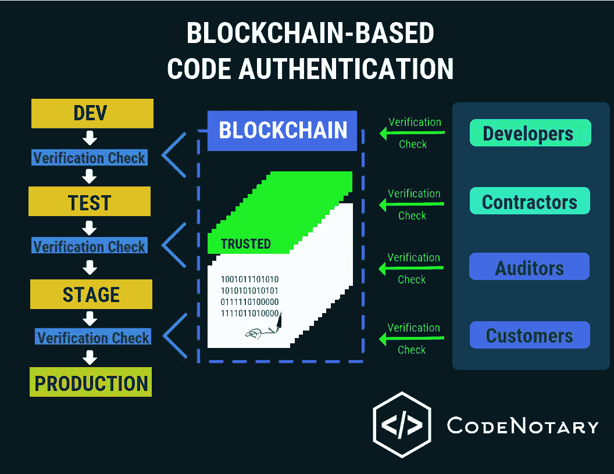
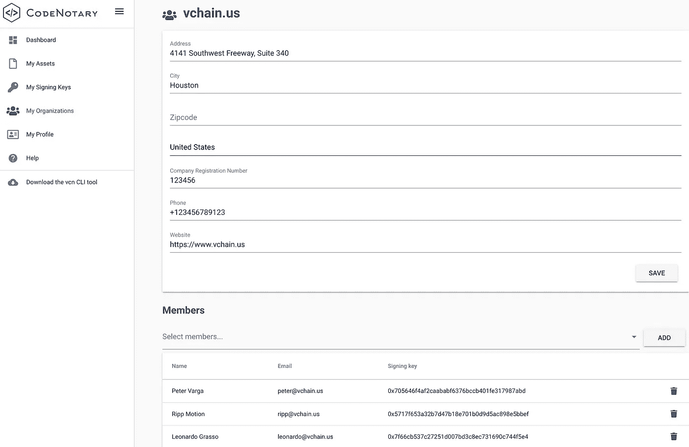

# 利用区块链保证贵公司部署的 DevOps 资产的可信度

> 原文：<https://levelup.gitconnected.com/guarantee-trust-of-your-companys-deployed-devops-assets-with-blockchain-c63dde4e2c23>



在 DevOps 中，团队可以为了不同的目的不断地被重新安排和排序，形成组或者改变他们的成员状态的能力是重要的。直到最近，code 公证人严格地提供容器和所有其他由个人签名的现有代码/数字资产的简单可视化和验证。现在，企业可以通过区块链的不变性来保证其所有已部署或正在开发的 DevOps 资产的可信度。

# code 公证人中的组织是什么？

组织实际上是属于其授权成员的一组公钥的别名。每个成员都有自己唯一的公钥，然后连接到组织。

正如个人代码签署者必须通过 KYC(了解您的客户)认证流程一样，组织也必须通过类似的认证，以证明他们是他们所说的人。

# 组织如何在公证中工作

组织名称是根据建立组织的注册用户的电子邮件域创建的。(在命令行中，组织名称称为“组织 ID”)。创建完成后，区块链将存储新组织的 ID，并从那时起对与该 ID 相关联的所有已签名数字资产实现 100%透明验证。

任何企业用户(即拥有企业许可证的用户)都可以为其公司创建组织。创建组织后，作为新组织一部分的任何用户都可以开始签署该组织名下的资产。成为指定的组织管理员，可以直接从其控制面板添加新用户，如下所示:



# 根据组织验证数字资产

根据特定组织的名称验证数字资产的签名会扩展到全球范围。从注册组织内部到外部，任何地方的用户都可以根据特定组织的名称来验证数字资产的签名。这样，当数字资产表明它是由 Oracle 等公司签名时，Oracle 以外的用户可以放心地知道 Oracle 确实对他们想要使用的数字资产进行了签名。

让我们看一个例子。

假设 user@org.com 是 org.com 的[的成员，user@org.com 使用他的公钥(已经与该组织相关联)来签署资产。](http://org.com)

用户可以使用以下命令根据组织验证资产:

```
vcn verify <file> --org=<organization name>
```

人们还可以通过命令`vcn verify --key`使用 user@org.com 的公钥来验证资产的完整性。或者，by 用户可以通过使用组织的名称，即其域名【org.com】来验证资产，命令为:

```
vcn verify <file> --org=<organization name>
```

将公钥分组在一起并将它们连接到一个域的好处是巨大的。例如，您是否愿意记住一长串由字母数字组成的随机字符，如下所示:

```
0xc002195f0df2d6ce62eb17a2189b6e2e46db6a19
```

…或者更简单的比如 [vchain.us](http://vchain.us/) ？

# 验证一组签名者(密钥)

组织和用户也能够对签名者团体或组织进行内部验证，例如像 opvizor.com、、[、](http://amazon.com)这样的几个供应商。当几个承包商需要在资产被允许在雇佣组织内部使用之前或在将资产移交给另一个承包商之前签署该资产时，这尤其有用。(将来，管理员将能够通过电子邮件邀请新用户加入他们的组织。)

获得免费试用帐户，亲自试用 code 公证人。

[**开始免费试用**](https://dashboard.codenotary.io/auth/signup?utm_source=medium&utm_medium=post&utm_campaign=guarantee-trust-of-your-companys-deployed-devops-assets-with-blockchain)