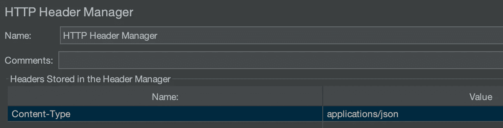

# GUI 和非 GUI Jmeter 负载测试

> 原文：<https://levelup.gitconnected.com/gui-and-non-gui-jmeter-load-testing-49c00c49d736>

*“测试员不喜欢摔东西；他们喜欢驱散事物运转正常的错觉。”* **—康德、巴赫、佩提和弦**

首先，让我们先简单介绍一下工具 **Jmeter。**它是一个 Apache 测试工具，用于分析和测量应用程序、软件服务和产品的性能。它是完全用 Java 开发的开源软件，可以用来测试 web 和 FTP 应用程序。基本上，你可以把你的产品扭曲成任何你喜欢的形状。这是一款完美的工具，可用于获取您需要的数据，以便**继续或**暂停产品。

在本文中，我将向您展示如何进行测试，以及在您正在测试的 API 很繁重或者请求数量非常多的情况下应该做些什么。

我猜在开始写博客之前，你已经安装了这个工具。如果没有，你可以浏览这些步骤，否则只需向下滚动一点点，然后继续写博客。以下步骤针对 **mac 用户**。对于 windows 来说，可能会稍有不同。你可以在 youtube 上查看任何安装视频。

# 安装和打开 Jmeter 的步骤

步骤 1:检查是否安装了 **java** 。在终端上写下以下命令。如果没有安装，首先安装它，然后从这里继续。

> java 版本

第二步:从链接下载**Jmeter**:[https://jmeter.apache.org/download_jmeter.cgi](https://jmeter.apache.org/download_jmeter.cgi)
记得从**二进制文件**下载最新版本，不要从**源码**下载，因为这里少了一个 *jar* 文件。下载 zip 文件。

第三步:解压文件并移动到你存放工具的地方

第四步:打开终端。进入解压后的 apache-jmeter 文件夹中的 bin 文件夹。

> cd<location of="" the="" folder=""></location>

现在编写下面的命令，Jmeter 将开始运行。

> sh jmeter.sh

# 继续 Jmeter 的工作

现在让我们从我们的第一个测试计划开始(您可以使用任何您想要的命名约定)。

第一步:首先创建一个**线程组**。

> 右击测试计划->添加->线程(用户)->线程组

*   **线程数:**表示执行测试脚本的虚拟用户总数。
*   **上升周期(秒):**表示 JMeter 达到最大线程数需要多长时间。例如，如果有 10 个用户，加速时间为 5 秒，JMeter 将花费 5 秒启动所有 10 个线程，每秒增加 2 个线程。
*   **循环计数:**是脚本运行的次数。如果循环计数为 2，线程数为 10，脚本将执行 20 次。如果循环计数设置为“永久”，新线程将继续创建，直到测试终止。
*   **每次迭代都有相同的用户:**如果你想在线程组迭代之间保留 cookies 和缓存，那么选择这个选项，否则不要选择。
*   **延迟线程创建直到需要:**如果勾选此选项，则在创建线程数据之前执行上升延迟和启动延迟。如果未选择此选项，则在运行测试之前，会创建线程所需的所有数据。

步骤 2:现在，添加一个 **HTTP 请求**。

> 右击线程组->添加->采样器-> HTTP 请求

第三步:填充 **HTTP 请求**。我将用“[https://medium . com/total-brainstorm/get-to-know-fastapi-7fb 4791 D3 e 50](https://medium.com/total-brainstorming/getting-to-know-fastapi-7fb4791d3e50)”作为例子。

—对于您想要提出的请求类型，有许多选项。
—在**路径**部分
添加路径——如果有任何参数或请求体，您可以在下面添加。
—如果您想添加参数和主体数据，那么您必须添加参数和路径，如下例所示(这显然只是一个例子。不会使用参数或请求体访问 API😅).

第四步:有一些 HTTP 管理器，比如 **Header** 或者 **Cookie Manager** 。如果有任何标题，您可以添加它们，如图所示。

> 右键单击线程组->添加->配置元素-> HTTP 头管理器。

第五步:最后，有许多**监听器**可以帮助你检查你点击的请求。

我将向您展示我最常用的两种。你可以和其他人一起玩，但是不要担心你不会太需要他们。第一个是**聚合图**。这个监听器以表格和图表的形式给出所有的值。

*   **#样本:**样本总数。
*   **平均:**平均时间。
*   Min: 这是请求完成的最小时间。
*   **Max** :这是请求完成的最长时间。
*   **错误%**错误请求数/请求总数。
*   **吞吐量:**吞吐量是服务器每秒接收的请求。
*   **每秒接收的千字节数:**这定义了客户端每秒接收的千字节数。
*   **每秒发送的千字节数:**这定义了每秒发送给服务器的千字节数。
*   **90%行:**表示 90%的请求在以下时间内完成。
*   **95%线:**表示 95%的请求在以下时间内完成。
*   **99%行:**表示 99%的请求在以下时间内完成。

要显示图表，请选中您想要的图表的复选框，然后单击显示图表。

第二个是**查看结果树。**这个给你每个请求的**成功/失败**以及**响应头/数据**。在我们点击一个请求后，我们将会看到更多。

# 测试测试计划

既然现在我们已经设置了测试计划，我们将继续从测试开始，并在监听器中检查结果。

首先，我们来看一下**聚合图**。请记住，这些值以毫秒为单位。因此， **99%** 的请求在 0.85 秒内完成。现在，如果有人想知道代码是否需要优化，他们可以检查这些结果并做出决定。

下一个是**视图结果树**，在这里您可以检查每个请求的响应体和响应头。当你有一些**失败的请求**并且你想知道原因时，这很有帮助。

现在，我们将通过输入错误的 URL 生成一些**错误**结果。在开始之前，先把前面的结果清除掉( **⌘+E** )。

显然，误差%将是 **100%**

这会给你一些类似 ***没找到*** 的基本理由。您还可以检查您的请求是否在一段时间后开始出错，或者一些请求是否在此期间出错。您还可以检查每个请求的延迟或大小。

# 接下来是负载测试

所以，当你在终端上启动 Jmeter 的时候，你一定看到过**不使用 GUI 模式进行负载测试**的语句。我有亲身经历，这句话非常正确。
Jmeter 的**堆内存**是有限的，所以当你在 GUI 模式下进行负载测试时，它不能保存你的 API，并开始给出**错误结果**，这显然是你不想要的。这也会使应用程序停止一段时间，因此您可以重新启动它或等待它再次开始工作。
此外，GUI 和非 GUI 模式下显示的**请求完成时间**有时会有显著差异(这可能是由于一些开销或其他原因)。

所以，现在让我们从**非 GUI** 模式开始。别担心，你以上所做的一切都不会白费。

步骤 1:保存**测试计划**。如果你没有问题，那么把它保存在**箱**里，在那里有一个新的文件夹。只是让事情变得简单一点。我已经**在 bin 文件夹中保存了**测试计划为“*/Test/Test _ Plan”*。确保您保存的是整个测试计划，而不仅仅是其中的一个元素。如果不确定，就点击

> 文件->将测试计划另存为

第二步:到终端打开一个新的标签页( **⌘+T )** 。再次进入**文件夹**文件夹。记住在新的选项卡/窗口中这样做，这样就不会关闭 Jmeter **GUI** 模式。

步骤 3:键入以下命令。根据需要更改文件名。

> sh jmeter.sh -n -t 测试/测试 _ 计划. jmx -l 测试/测试 _ 计划. jtl

**-n:** 指定在非 GUI 模式下运行
**-t:** 包含测试计划
**的 JMX 文件名-l:** 记录结果的 JTL(JMeter 文本日志)文件名。基本上，你的听众。
**-j:**JMeter 运行日志文件的名称

它给出了一个简短的总结报告。现在检查文件夹中的一个***Test _ plan . jtl***文件已经被创建

第四步:让我们回到 **GUI** 。
-打开 Jmeter GUI 模式(告诉你不要关闭它)。
-打开任何一个监听器
-确保你已经移除了任何其他仍然存在的结果。
-点击浏览并选择文件。

给你，你所有的结果。**这不存储响应数据/头。**

第五步:现在，如果你想改变一些值。比如，现在你想要 100 个线程或者你想稍微改变一下你的 HTTP 请求，你可以很容易地在 GUI 模式下用**改变**的值并保存它。进入非 GUI 模式的终端，再次发出命令。
*改* ***。jtl*** *文件名在开始下一个测试之前或者删除前一个否则结果将附加到前一个上。*

确保无论何时对繁重的 API 进行负载测试，或者即使 API 很轻，但是请求数量很高，非 GUI 模式也是首选。

希望这篇文章能帮助你从 Jmeter 入手，做好各种基础测试。玩得开心。