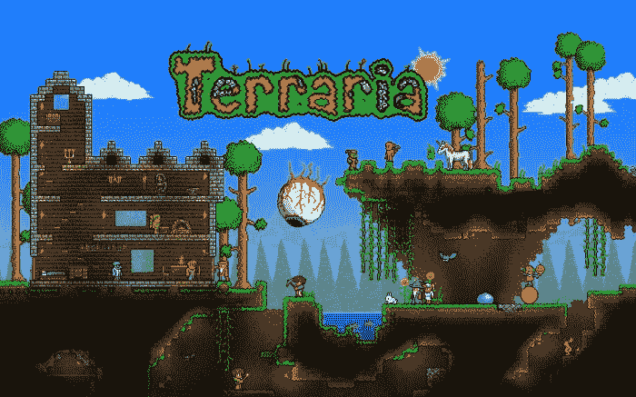
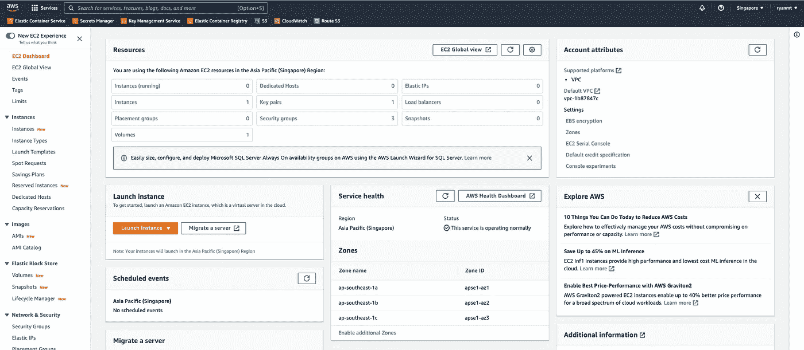
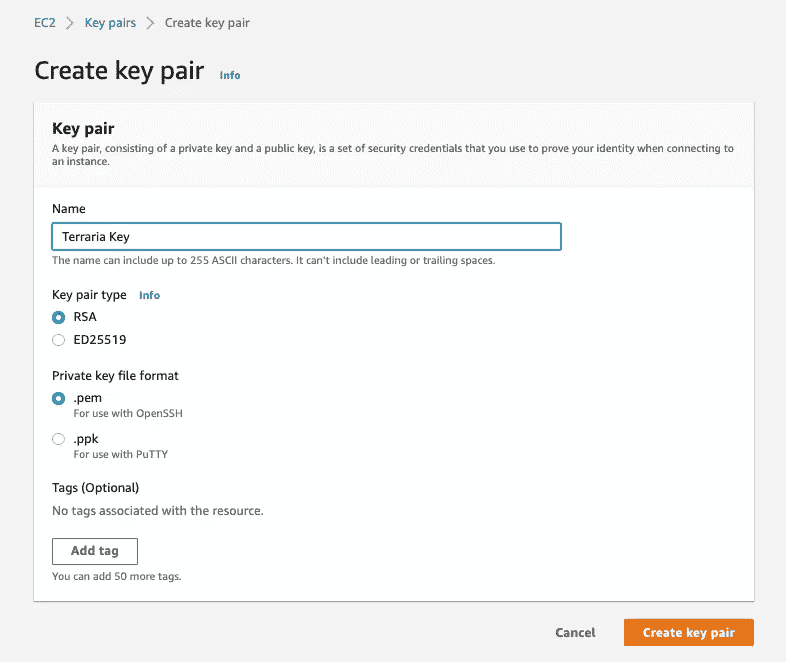
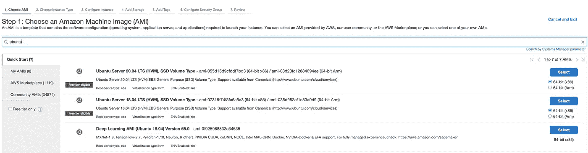
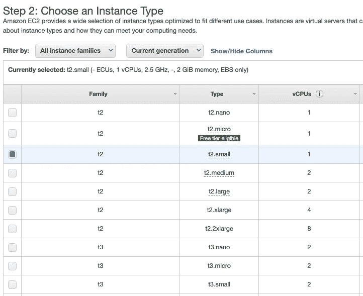
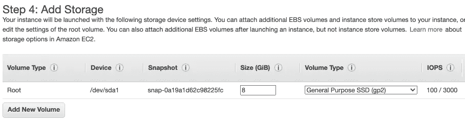
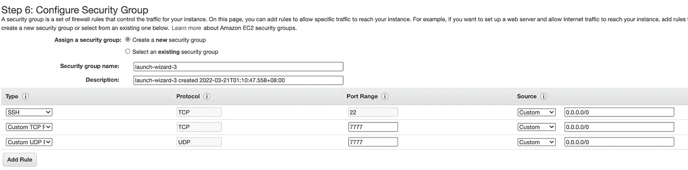
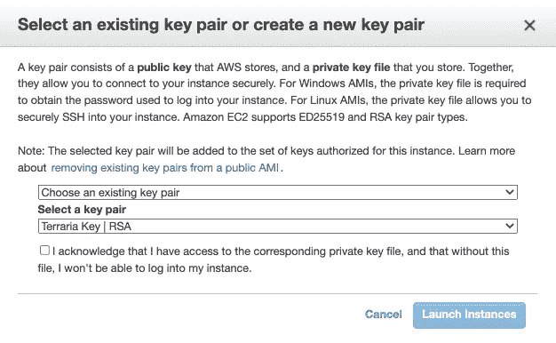
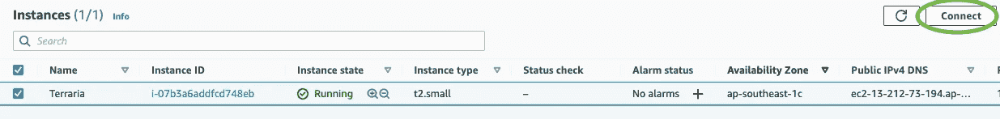
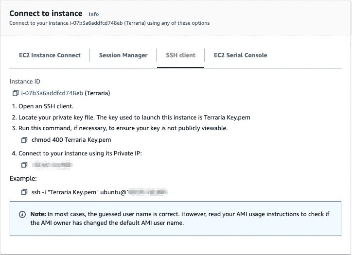

# 在 AWS 上托管专用的 Terraria 服务器

> 原文：<https://levelup.gitconnected.com/guide-building-a-terraria-server-on-aws-eaebd6d556a5>

了解如何创建和部署您自己的 Terraria 服务器



## 介绍

我最近迷上了 Terraria，像许多其他人一样，这个游戏让我深深地被它的广阔世界所吸引。有这么多的进展内容和在你的想象中构建任何东西的自由，难怪这个游戏如此令人上瘾。

Terraria 本质上是一款多人游戏，和朋友一起玩的最好方式之一就是建立一个专用的托管服务器。虽然有许多第三方服务提供这种服务，但在我们这边稍加努力，我们可以以较低的成本托管一个 Terraria 服务器。同时学习基本的网络和 Linux 命令！

## 定价

在本指南中，我们将使用 AWS 按需 EC2 实例。我目前正在运行一个 t2.small 实例，成本为 0.023 美元/小时。假设我们在一个月的每一天每天工作 8 小时，这将使账单总计为 5.52 美元。

此外，对于按需 EC2 实例，您只需根据服务器的使用情况来支付费用。如果你在外面生活，负担不起这么多的游戏，账单可能会比这少。

注意:价格因地区而异，此价格由美国东部地区决定。你可以点击查看费用[。](https://aws.amazon.com/ec2/pricing/on-demand/)

我们开始吧！

**创建 AWS 账户**

首先，你必须在这里创建一个 AWS 账户[，并在账单>下设置支付方式。](https://aws.amazon.com)

## 创建服务器

1.  在搜索栏中搜索 EC2。这应该会将您带到 EC2 仪表板。在浏览器的右上角选择离您最近的地区。我的设置是新加坡。



EC2 仪表板

2.选择密钥对并创建一个 RSA 和类型的密钥对。pem 格式。这创建了一个 SSH 密钥对，允许我们稍后通过 SSH 连接到 EC2 实例。

创建密钥对将启动私钥的下载。您可以为 Terraria 创建一个文件夹，并将私钥存储在那里。



创建 SSH 密钥对

3.现在我们准备创建一个 EC2 实例。从 EC2 仪表板中，选择启动实例，然后选择 Ubuntu Server 20.04LTS (64 位 x86)。



4.请随意试验实例大小。然而，我发现 t2.small 足以和几个朋友一起运行一个大世界。



5.对于存储，我选择了默认的 8GB。



6.安全组使您能够控制可以到达 EC2 实例的流量。Terraria 服务器运行在端口 7777 上，因此我们必须将该端口暴露给 TCP 和 UDP 连接。

安全组还能够基于 ip 限制流量。对于我的设置，我的实例允许来自任何 ip 地址(0.0.0.0/0)的流量，所以任何人都可以在我的服务器上玩。但是，如果您想要增加安全性，您可以将流量只限制到您的 ip。如果您的 ip 地址是 127.0.0.0，只需在所有类型的流量(SSH、UDP 和 TCP)的源列添加 127.0.0.0/32。



7.最后选择启动按钮。当要求选择一个 SSH 密钥对来与您的 EC2 实例相关联时，只需选择您之前创建的密钥对，然后单击 Launch Instances。您的服务器应该在几分钟内启动！



## 下载 Terraria

现在我们有了一个正在运行的服务器，下一步是下载 Terraria 服务器和 TShock。TShock 是一个管理 Terraria 服务器和社区的工具箱。

1.  创建一个名为 Terraria 的文件夹。

2.去 Terraria [网站](https://terraria.org/)。在页脚，选择 PC 专用服务器。这应该会触发到一个名为 terraria-server-xxxx 的 zip 文件的下载。最后 4 位数字表示 terraria 的版本。

解压缩文件，并将名为 Linux 的文件夹转移到您的 Terraria 文件夹中。

3.跳到 TShock git [仓库](https://github.com/Pryaxis/TShock/releases)并下载一个与步骤 2 中的 Terraria 服务器版本相对应的版本。我的 terraria 版本是 1.4.3.6，所以下载了[t shock 4 . 5 . 17 _ Terraria _ 1 . 4 . 3 . 6 . zip](https://github.com/Pryaxis/TShock/releases/download/v4.5.17/TShock4.5.17_Terraria_1.4.3.6.zip)。

解压缩文件，并将所有内容放入 Terraria 文件夹。

## 在服务器上安装 Terraria

注意:我们必须在这里运行 linux 命令。如果您使用的是 Windows PC，您可以使用本[指南](https://www.windowscentral.com/how-install-wsl2-windows-10)使用 Windows 子系统 for linux (WSL)运行 Linux 命令。

1.  首先，我们必须连接到我们之前构建的 EC2 实例。在操控板上选择实例，然后单击连接。AWS 将提供连接到您的服务器实例的命令列表。



2.确保您的 Terraria 文件夹中有 SSH 私钥。打开终端，进入你的 Terraria 文件夹，运行提供的命令。这里的 ip 地址是指 ec2 实例的公共地址(ipv4 DNS)。

```
# Terminal 1cd ~/Desktop/Terraria# give read access only
chmod 400 Terraria\ Key.pem# connect to server via SSH
ssh -i "Terraria Key.pem" ubuntu@<public address>
```



3.在终端上创建一个新的选项卡，并运行下面的 Linux 命令。这会将您的 Terraria 文件从本地计算机传输到远程 EC2 实例。

```
# Terminal 2# copy files over to the EC2 instance
# use the same public address from step 2
scp -r ~/Desktop/Terraria ubuntu[@](mailto:ubuntu@ec2-18-141-161-114.ap-southeast-1.compute.amazonaws.com)<public address>:~/
```

4.在终端 1 中，运行命令`ls`。您应该在根目录中看到文件 Terraria。

5.接下来，你必须在 ubuntu 上安装 Mono 包。这篇[文章](https://linuxize.com/post/how-to-install-mono-on-ubuntu-20-04/)详细解释了如何在终端上这样做。

6.您终于可以运行 Terraria 服务器了。转到 TShock 文件夹并启动服务器！

```
# Terminal 1cd ~/Terraria/TShock4.5.17_Terraria_1.4.3.6#Start up your server!
sudo mono TerrariaServer.exe
```

## 从远程服务器播放 Terraria

在你的 Terraria 游戏中，选择多人游戏>通过 IP 加入。插入 EC2 实例的外部 IP 地址，现在您已经准备好探索广阔的 Terraria 了！

## 结论

对于那些以前没有 AWS 或网络经验的人来说，实现一个服务器可能是令人生畏的。希望这个指南已经帮助你托管了一个 Terraria 服务器，这样你就可以和你的朋友们一起探索洞穴和对抗粘液或僵尸了！