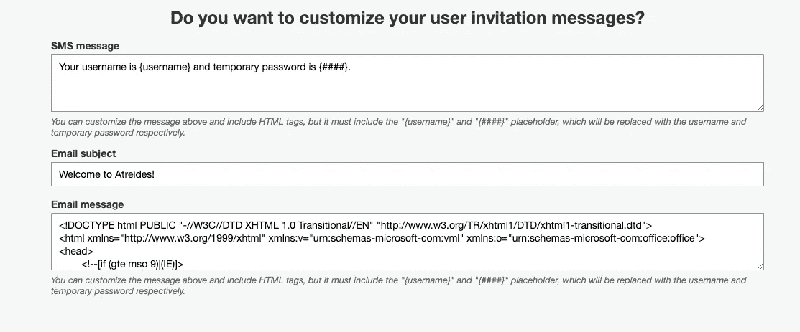

# 使用 AWS Amplify、Cognito 和 Material-UI 与 Typescript 进行反应的软令牌身份验证

> 原文：<https://levelup.gitconnected.com/guide-soft-token-authentication-with-aws-amplify-cognito-and-material-ui-react-with-typescript-31094f96968b>


照片由[克莱门特·H](https://unsplash.com/@clemhlrdt?utm_source=medium&utm_medium=referral)在 [Unsplash](https://unsplash.com?utm_source=medium&utm_medium=referral) 上拍摄

我们在创业时有一个需求，要构建一个 Web 应用程序来与我们的核心数据科学服务进行交互。我使用 React (JS)和 AWS Amplify 启动了这个 web 应用程序的第一个版本，这样我们就可以在几周内为用户提供一个版本。

第一个版本已经足够了，但随着功能需求的增长，我意识到我们需要构建一个更专业的认证层，与应用程序的其余部分保持一致。此外，随着代码库的增长，我意识到我在运行时花费了过多的时间来调试代码。经过一些阅读和与其他开发人员的讨论，我得出结论，我必须首先迁移到 TypeScript。

一旦 TypeScript 迁移完成，我开始尝试使用 AWS Amplify Authenticator 组件，却发现它充满了陷阱，使用了继承(违反了 [React 指南](https://reactjs.org/docs/composition-vs-inheritance.html))并利用了我完全避免的类组件。

此外，我觉得坚持使用单一的 UI 库更好，因为我已经使用了 Material-UI，所以我开始想我应该构建自己的身份验证组件，这样我就可以完全控制流程。

要求:

*   必须通过 Cognito 发送的包含用户名和临时密码的电子邮件邀请用户登录
*   他们将能够在他们的移动设备上使用他们选择的身份验证应用程序的用户名、密码和 TOTP 进行登录。
*   首次登录时，必须提示用户更改密码并提供昵称
*   在设置他们的第一个密码时，他们将被重定向到使用 QR 码设置多因素身份验证
*   用户必须能够通过点击按钮退出

# 邀请电子邮件

幸运的是，Cognito CLI 和 GUI 允许您设置邀请用户的设置。在 CLI 中运行 Amplify Auth Update(或在首次尝试时添加)后，邀请电子邮件文本会升级。如果您喜欢使用 GUI，只需登录 AWS >转到您的用户池>单击消息定制，然后向下滚动到此处:



这是显而易见的，但是你可以在这里复制粘贴一些 HTML，生成一个更丰富更好的邀请邮件。

# 认证包装

如果你不熟悉[提升状态的概念](https://reactjs.org/docs/lifting-state-up.html)或者没有读过《反应中的思考，我强烈建议你这么做，因为这将极大地提高你使用反应的能力。

在这些文章的基础上，我创建了一个身份验证包装器，作为所有身份验证工作流阶段的父组件。它将使用 React 16.8 中引入的`UseState()`钩子来存储两个关键状态值。

我决定存储的两个值是:

*   用户
*   授权阶段

这些状态将利用回调函数来设置，回调函数将作为道具传递给每个子组件。回调函数被用来代替使用`UseReducer()`钩子，因为认证组件只有一层深度，所以简单的回调来控制兄弟之间的状态被认为是足够的。

下面是我的身份验证包装器的要点:

# 签到

以下是登录组件的要点:

让我们分离出一些干扰，并关注这里的关键元素:

signInStatus 和 User 作为道具传递给登录组件:

```
signInStatus: (stage: string) => void;    
user: (user: any) => void;
```

然后在 handlechallenge 函数中访问它们，并将其设置为将用户和 signInStatus 返回给 AuthWrapper，以便在登录工作流的条件呈现中使用。

```
else if (user.challengeName === 'SMS_MFA' ||                user.challengeName === 'MFA_SETUP' ||                user.challengeName === undefined) 
{
props.user(user);
props.signInStatus('TOTPSetup');
}
```

如果你熟悉 react，那么上面的内容可能很简单，你还没有学到多少。

然后对每个 sign in 阶段重复这个过程，将状态传递回包装器和 route app.tsx 组件。基于身份验证阶段，应用程序有条件地呈现相关组件。

# 首次登录

当用户首次尝试登录时，他们必须重置密码，然后设置 MFA。我们将集中讨论外交部的设立。这是要点。

让我们详细介绍一下，因为我还没有看到关于如何使用 Cognito/React 实现这一点的详细指南。

我们必须做的第一件事是使用 UseEffect 钩子在页面加载时触发二维码的生成。这行代码实现了这一点:

```
useEffect(() => {generateQRCode();}, []);
```

generateQRCode 函数定义如下:

```
const generateQRCode = (): void => {
const username = props.user.username;        Auth.setupTOTP(props.user).then(code => {            const generatedQrCode = 'otpauth://totp/AWSCognito:' + username + '?secret=' + code + '&issuer=Atreides';            setQrCode(generatedQrCode);        
});    
};
```

这里发生了什么？

首先，我们将传入的用户作为 props，并在其 JSON 结构中访问用户名。

其次，我们使用 cogn ITO auth . setup topp 方法并传入这个用户。这将返回我们创建 QRCode 图像所需的代码。

第三，我们使用这个响应为我们的 TOTP 设置创建 QR 码。

最后，使用 setQRCode 将 QRCode 信息存储在应用程序状态中。

下一步是用户拿出他们的手机和他们最喜欢的令牌应用程序，扫描他们在屏幕上看到的代码。一旦他们这样做，计时器将启动，他们将能够输入他们看到的代码。一旦他们输入代码并提交以下功能将

```
const verifyTOTPCode = (): void => {        Auth.verifyTotpToken(props.user, totpCode)            .then(() => {                Auth.setPreferredMFA(props.user, 'TOTP').then(() => {                    props.signInStatus('SignedIn');                    Auth.enableSMS(props.user);                });            })            .catch(
```

这里显示了一个重要的问题，请注意这一行:

```
Auth.enableSMS(props.user);
```

我意识到，除非启用 smsMFA，否则工作流将无法工作，因为 Cognito 的登录质询方法不会返回 MFA 质询。这是 Cognito 的一个问题，所以我的解决方法是在设置过程中触发设置。这似乎是可行的，因为用户没有设置手机号码，所以不会发送短信。

就是这样！我试图把重点放在重要的关键点上，如果你需要进一步的信息或帮助，请在下面评论。

如果你觉得这很有帮助，请在下面评论。如果您有任何改进或建议，也请评论。我总是乐于学习！

[](https://skilled.dev) [## 编写面试问题

### 一个完整的平台，在这里我会教你找到下一份工作所需的一切，以及…

技术开发](https://skilled.dev)