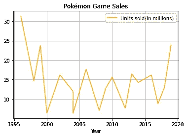
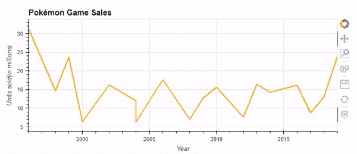
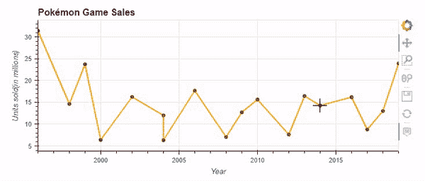
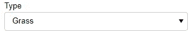
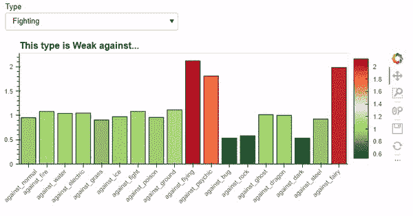
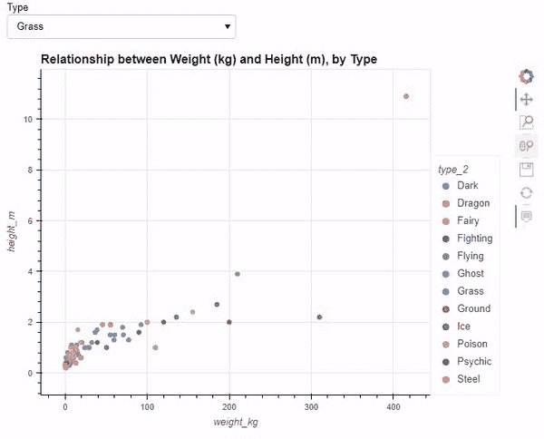
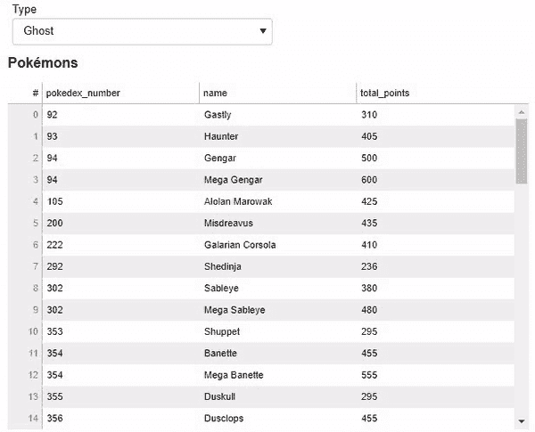
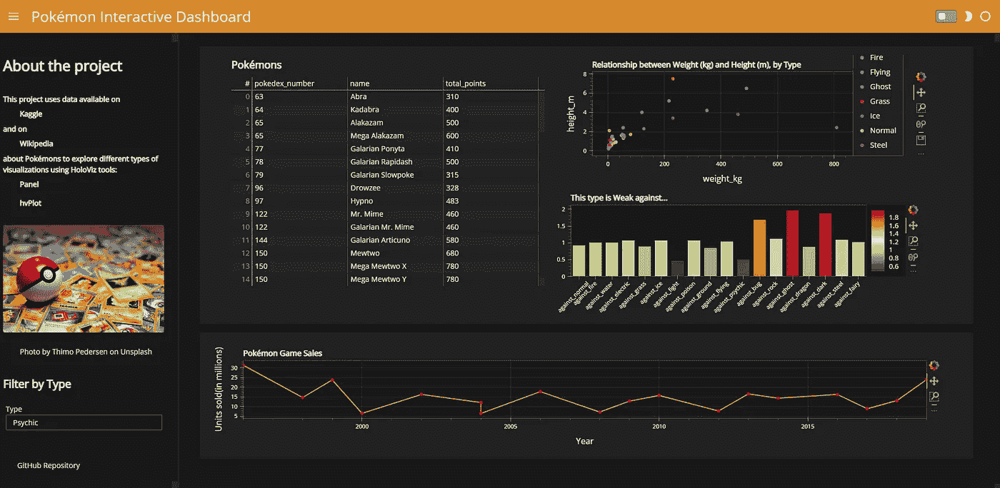

# 使用 Python 创建交互式可视化指南

> 原文：<https://levelup.gitconnected.com/guide-to-creating-interactive-visualizations-in-python-78f79ffc7d61>

## 使用 HoloViz 工具创建和部署交互式仪表板

艾萨克·史密斯在 [Unsplash](https://unsplash.com?utm_source=medium&utm_medium=referral) 上拍摄的照片

数据可视化是数据科学和数据分析项目中最重要的步骤之一，因为它对于探索和理解数据以及有效地共享结果都很有用。

在 Python 中，创建可视化效果最常见的库是 [Matplotlib](https://matplotlib.org/) 和 [Seaborn](https://seaborn.pydata.org/) ，但是有很多不同的工具可以创建可视化效果。

在本指南中，我们将探索 [HoloViz](https://holoviz.org/) 工具，更准确地说，我们将看看 [Panel](https://panel.holoviz.org/) 和 [hvPlot](https://hvplot.holoviz.org/) ，它们是开源库，可用于创建交互式图表和仪表板。我们还将看到使用 Jupyter 笔记本来部署和共享我们的仪表板是多么容易。

因为学习很有趣，所以在这个项目中，我们将使用神奇宝贝的数据！具体来说，我们将使用 [Kaggle](https://www.kaggle.com/datasets/mariotormo/complete-pokemon-dataset-updated-090420) 和 [Wikipedia](https://en.wikipedia.org/wiki/Pok%C3%A9mon_(video_game_series)#Reception) 上关于不同神奇宝贝的可用数据，以及关于神奇宝贝游戏销售的数据。

*注:除特别注明外，所有图片均为作者所有。*

# 概观

在本项目中，我们将:

*   使用 hvPlot 和 Pandas 创建一个简单的交互式情节
*   使用 Panel 创建小部件来过滤数据，使用 hvPlot 来可视化这些数据，从而创建更高级的可视化效果
*   创建显示表格数据、项目信息以及不同交互式图表的仪表板
*   了解如何在 Heroku 上部署仪表板来共享我们的项目

你可以在 [GitHub](https://github.com/pcmaldonado/PokemonDashboard) 上访问完整的代码，探索最终的仪表盘，并与 [Heroku](https://pokeviz.herokuapp.com/) 上的可视化交互。

# 熊猫和 hvPlot 的快速可视化

如果您使用 Pandas，您可以使用`[pandas.DataFrame.plot](https://pandas.pydata.org/docs/reference/api/pandas.DataFrame.plot.html)`创建绘图，默认情况下使用 Matplotlib 后端。

例如，我们可以创建以下线图来直观显示神奇宝贝游戏随时间的销售情况:

熊猫使用 matplotlib 作为后端绘图

通过安装 hvPlot，您可以通过更改默认后端来创建交互式熊猫图:`pd.options.plotting.backend = 'holoviews'`

然后，通过应用与之前相同的代码，我们获得:

如上所示，在图像的右侧，有了这个新的地块，我们有了一个与我们的地块进行交互的不同方式的列表。我们可以放大到某个位置，移动到特定区域，或者只是悬停在数据点上以获取更多信息。

此外，使用 hvPlot 逻辑，我们可以创建和组合不同的图，并在它们之间添加`*`。我们还可以通过使用`hover_cols`参数来添加没有显示的信息:

通过仅使用 pandas 和 hvPlot，我们已经用几行代码创建了一个交互式可视化！

# 数据管道和小部件

现在我们可以看到如何合并面板来创建更高级的图表。

为了创建图表，我们可以过滤特定子集的数据，我们可以使用 Panel [widgets](https://panel.holoviz.org/user_guide/Widgets.html) 。有许多不同的小部件可以探索，比如复选框、滑块和文本输入。

在这里，我们将使用“Select”小部件过滤我们的数据，然后为了使我们的数据与我们当前的“type”选择保持同步，我们将创建一个数据管道:

这会产生以下选择器:

现在，通过使用这个“数据管道”作为我们的数据来创建新的情节，我们将能够过滤我们的情节，以特定类型的神奇宝贝。

例如，我们可以创建一个条形图来显示特定类型的弱点:

在这里，我们创建了一个条形图，显示每个特定类型的平均损害。然后我们可以用小部件选择任何类型，只显示这种类型的弱点。

如您所见，我们可以使用 Matplotlib 的色彩映射表，并选择一个特定的列来应用我们的颜色渐变。例如，在这里通过选择在“伤害”上应用我们的渐变，我们可以清楚地用红色看到所选类型最容易受到伤害的类型。

同样，我们可以创建其他类型的图，例如代表不同类型的身高和体重关系的散点图:

在这里，我们可以看到体重和身高之间的关系，以及不同类型之间的差异。像以前一样，我们仍然可以悬停以查看更多细节，以及缩放到特定区域。

最后，为了创建一个交互式数据框，以便稍后添加到我们的仪表板中，我们应用了与前面相同的结构:

# 创建仪表板

最后，我们可以创建一个结合不同类型图表的仪表板。

为此，我们可以使用面板[模板](https://panel.holoviz.org/user_guide/Templates.html)。我们可以定制不同的现成模板，但我们也可以创建自己的模板。

不管我们选择什么，所有这些模板都让我们能够轻松区分页面的四个主要区域:

*   标题，
*   侧边栏，
*   主要区域，以及
*   模式区域(弹出窗口)

然后在这些区域中，我们可以使用 Markdown 格式添加文本，我们可以使用行和列进一步划分我们的部分，根据我们选择的模板，我们有不同的选项来定制我们的布局。

在这些行和列中，我们可以添加以前的图。在这里，我们将使用一个快速列表模板，我们将指定一个默认主题“黑暗主题”。然后我们添加我们的标题，带有一些文本和图像的侧栏，带有我们的情节的主要部分，最后，我们指定一些参数来调整颜色。

`.servable()`方法服务于仪表板，因此它可以被部署。请注意，我们还可以使用`.show()`在另一个窗口中本地查看我们的仪表板。

最终结果如下所示:

Heroku 上提供的“神奇宝贝互动仪表盘”图片

# 在 Heroku 部署我们的仪表板

现在大部分工作已经完成了！

如果你现在想分享你未来的项目，Panel 有一个[服务器部署指南](https://panel.holoviz.org/user_guide/Server_Deployment.html)。在本指南中，您可以看到如何部署到 Heroku，它有一个免费的部署层。

创建或登录 Heroku 帐户后，您需要创建一个新的应用程序，然后进行部署，您需要:

*   Jupyter 笔记本包含您的仪表板或图表(在您希望部署的内容上使用`.servable()`)以及所使用的底层数据
*   指定 Heroku 执行什么命令的 Procfile
*   requirements.txt 包含您使用的库以及用于转换 Jupyter 笔记本代码的`nbconvert`
*   包含您使用的 Python 版本的 runtitme.txt

仅此而已！

# 结论

数据可视化是数据科学和数据分析过程中非常重要的一部分。因此，处理数据的人必须能够创建有影响力的可视化效果。

在本文中，我们看到了如何使用 HoloViz 工具创建交互式图表和仪表板，更准确地说，我们看到了如何:

*   使用 hvPlot 作为熊猫图的后端
*   创建一个小部件和一个数据管道来过滤图表，并与图表进一步交互
*   创建一个仪表板，结合我们的图，并添加一些有用的信息
*   看了看如何在 Heroku 上部署我们的仪表板

*Kaggle 上可用的数据是在*[*CC-BY-SA 4.0*](https://creativecommons.org/licenses/by-sa/4.0/)*许可下提供的。维基百科的数据可以在*[*CC BY-SA 3.0*](https://creativecommons.org/licenses/by-sa/3.0/)*许可下获得。*

[**成为会员**](https://medium.com/@pcmaldonado/membership) **阅读介质上的每一个故事。你的会员费直接支持我和你看的其他作家。你也可以在媒体上看到所有的故事。**

 [## 通过我的推荐链接加入 Medium—Paula mal donado

### 作为一个媒体会员，你的会员费的一部分会给你阅读的作家，你可以完全接触到每一个故事…

medium.com](https://medium.com/@pcmaldonado/membership)