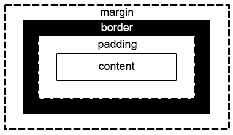

# CSS 盒子模型指南

> 原文：<https://levelup.gitconnected.com/guide-to-css-box-model-e1cd6eddcd4f>

## 理解它的指南

在我的上一篇文章中，我简要解释了 CSS 的五个概念。我没有深究每个概念，我只是用几句话解释了一下，并展示了你可以从哪里了解到它们。现在，我将更详细地解释每一个。先说 CSS 盒子模型。



箱式模型概念。找到了[这里](https://www.khanacademy.org/computing/computer-programming/html-css/css-layout-properties/pt/css-box-model)。

我说过，**网页设计中的每个元素都是一个矩形框。CSS 盒子模型就是这个矩形盒子，它包裹着你页面上的每一个元素。它包括:边距、边框、填充、宽度、高度和实际内容。**

# 显示

在学习这些盒子模型属性之前，了解元素如何在页面上显示是很重要的。这由 CSS `display`属性决定。最常见的值有`block`、`inline`、`inline-block`和`none`。

`block`元素总是从新的一行开始，并占据页面的任何可用宽度。`inline`元素不从新行开始，也就是说，它们在同一行上排列，因此，它们的宽度正好是它们的内容所需要的。`inline-block`元素结合了这两个特征，它们的行为类似于`block`元素，但是它们将显示在同一行中。最后，`none`元素不会显示在页面中。

了解元素是如何显示的很重要，因为一些盒子模型属性受显示属性类型的影响，我将在下面解释。

# 宽度和高度

元素的这些属性取决于其显示值。对于`inline`元素，不能设置这些属性。宽度和高度由其内容决定。`block`元素的默认宽度为`100%`，使用所有可用的水平空间，其高度内容的默认高度为。要修改这些属性，请使用`width`和`height` CSS 属性，如下所示:

```
p {
  width: 100%;
  height: 100%;
}
```

有趣的是，元素的内容使用这些值，而不是整个元素。元素的总宽度可以计算为:

```
margin-right + border-right + padding-right + width + padding-left + border-left + margin-left
```

元素的总高度可以计算如下:

```
margin-top + border-top + padding-top + height + padding-bottom + border-bottom + margin-bottom
```

# 边距和填充

属性允许我们在元素周围创建空间，在边界之外。它可用于提供元素之间的间距，并帮助更好地定位元素。`padding`属性类似于`margin`属性，用于在元素周围创建空间，但在边框内部。

对于块和内联块元素，边距和填充完全正常。在中，内联元素受到的影响略有不同:垂直边距(`top`和`bottom)`不被接受，垂直边距`padding`工作正常，但可能会融入其他元素。

您可以像这样使用这些属性:

```
p {
  margin-top: 5px;
  margin-right: 10px;
  margin-bottom: 15px;
  margin-left: 20px;
}h1 {
  padding-top: 5px;
  padding-right: 10px;
  padding-bottom: 15px;
  padding-left: 20px;
}
```

或者，您可以缩短代码，仅在一个属性中指定所有属性。顺时针定义它们(即顶部、右侧、底部和左侧)。像这样:

```
p {
  margin: 5px 10px 15px 20px;
}h1 {
  padding: 5px 10px 15px 20px;
}
```

两种代码完全一样。你不需要把四个边都加起来，你可以定义一个到四个，它会自己调整。

# 边界

边框位于填充和边距之间。CSS `border`属性允许你指定元素边框的`width`、`style`、`color`。这三个值可以分解成`border-width`、`border-style`和`border-color`属性。最常见的样式值有`solid`、`double`、`dashed`、`dotted`和`none`，但还有很多其他的。

你可以这样使用`border`:

```
p {
  border: 5px solid red;
}
```

或者像这样:(工作原理和上面完全一样)

```
p {
  border-style: solid;
  border-width: 5px;
  border-color: red;
}
```

# 结论

这些是 CSS 盒子模型的属性以及如何设置它们。了解以上所有属性的工作原理是非常重要的，因为它们可以帮助你建立一个更加优雅和专业的网站。