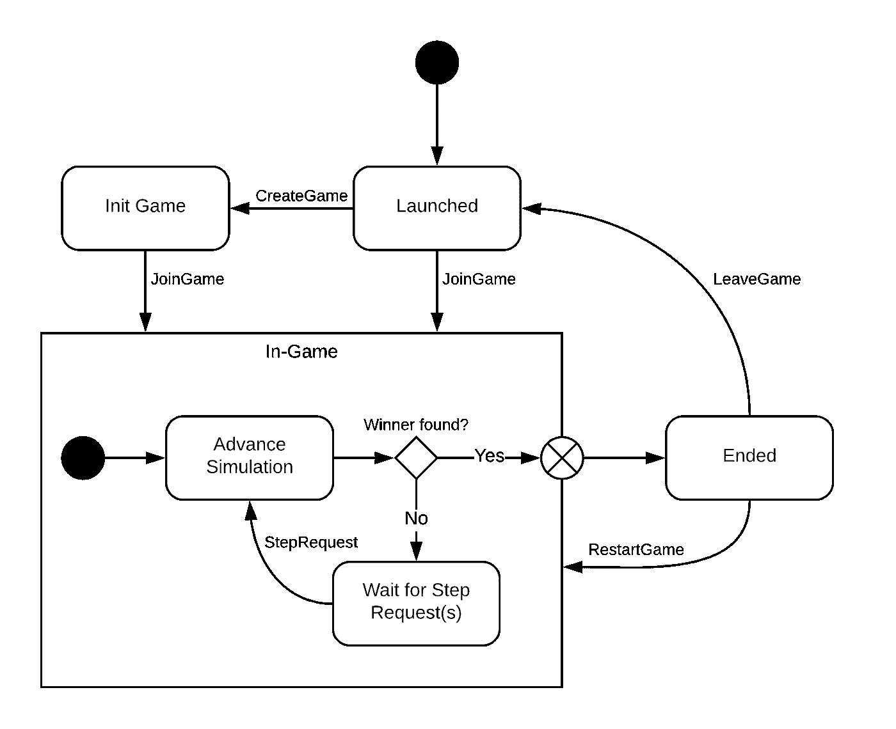
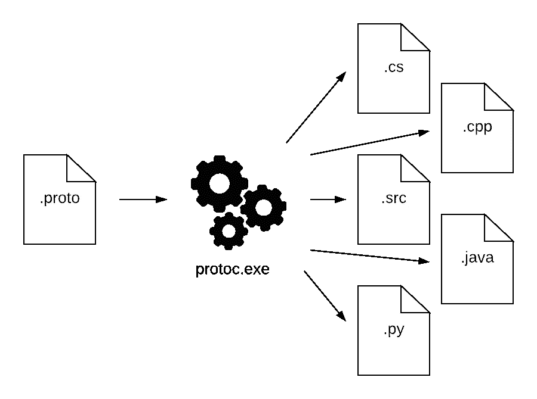

# 星际争霸 2 原型 API 指南

> 原文：<https://levelup.gitconnected.com/guide-to-starcraft-ii-proto-api-264811da8a50>


暴雪娱乐公司的官方作品

这篇文章将带你经历为星际争霸 2 客户端编写你自己的 API 的最初步骤。这是**根本不需要的**，社区 API 存在于大多数流行语言中。然而，这篇文章对基本的 SC2 API 包装器的工作原理提供了一些见解。

客户端公开了一个请求-响应风格的 API，该 API 接受 *protobuf* 消息。我为不熟悉这种格式的读者写了一篇关于 *protobuf* 的文章，但它本质上只是一种二进制数据交换格式。

# 启动客户端

[下载星际争霸 2 客户端](https://starcraft2.com/)如果你还没有安装的话——它是免费的(自 2017 年 11 月 14 日起),不需要完整版。我们将使用默认的游戏客户端，但在一个特殊的模式下启动它。这种模式没有任何游戏内菜单。

星际争霸 2 客户端在更新时会创建一个新的文件夹(这大概主要是为了支持旧版本的游戏回放)——因此你可能会发现你的电脑上有多个客户端文件夹。导航到版本号最高的版本，并使用 *localhost* 和所需的端口启动它。

**Windows:** *在 Windows 上我们还需要指定工作目录是\Support 还是\Support64。否则将导致“iccuc52.dll”不存在的错误。*

```
cd 'C:\Program Files (x84)\StarCraft II\'
start /D .\Support .\Versions\Base{version}\SC2.exe -listen 127.0.0.1 -port 8168
```

**Linux:**

```
cd 'StarCraft II\Versions\Base{version}\'
SC2_x64 -listen 127.0.0.1 -port 8168 -headlessNoRender
```

**苹果操作系统:**

```
cd '/Applications/StarCraft II/Versions/Base{version}/'
open SC2.app --args -listen 127.0.0.1 -port 8168
```

如果工作正常，它将启动带有**黑屏**和图标星际争霸 2 鼠标的客户端——这是期望的行为。一切都好。

客户端还支持几个可选参数，在同时运行多个客户端时会派上用场；

*   -displaymode {1/0} *… 1 为全屏，0 为窗口模式*
*   -windowwidth {int} *…以像素为单位的窗口宽度*
*   -windowheight {int} *…以像素为单位的窗口高度*
*   -windowx {int} *…以像素为单位的窗口水平位置*
*   -windowy {int} *…以像素为单位的窗口垂直位置*

# 连接到客户端

星际争霸 2 客户端会在你启动应用时指定的端口上打开一个网络套接字。在启动多个实例时，请记住使用可用端口，并为每个客户端提供一个唯一的端口。在我们的例子中，API 的绝对 URI 读数为:

```
ws://127.0.0.1:8168/sc2api
```

您可以使用自己选择的语言连接到这个套接字，并开始操作客户端。API 期待一个[请求](https://github.com/Blizzard/s2client-proto/blob/01ab351e21c786648e4c6693d4aad023a176d45c/s2clientprotocol/sc2api.proto#L84)消息，并将使用一个[响应](https://github.com/Blizzard/s2client-proto/blob/01ab351e21c786648e4c6693d4aad023a176d45c/s2clientprotocol/sc2api.proto#L121)消息进行响应。这些消息是简单的字节数组，可以使用星际争霸 2 的官方 protobuf 模式来解释。

为了确认连接，无需处理 protobuf，可以将字节数组 *{66，0}* 发送给客户端。这对应于*请求{ Quit = RequestQuit() }* 的二进制形式，在接收时将使应用程序关闭。下面是实现这一点的 C#代码片段。

```
using System;
using System.Diagnostics;
using System.Net.WebSockets;
using System.Threading;namespace AdequateSource {
  class StarCraftConnectionExample {
    public void LaunchClient() {
      // Default folder path for Windows
      string folderPath = @"C:\Program Files (x86)\StarCraft II";
      var pInfo = new ProcessStartInfo {
        // Location of correct AI client
        FileName = $ "{folderPath}\\Versions\\Base60321\\SC2.exe",
        // Displaymode 0 = windowed mode
        Arguments = @"-listen 127.0.0.1 -port 8168 -displaymode 0",
        // Give working directory to prevent missing icuin52.dll
        WorkingDirectory = $ "{folderPath}\\Support"
      };
      Process.Start(pInfo);
    }public ClientWebSocket ConnectToClient() {  
      // URI = ws://{ipaddress}:{port}/sc2api
      var uri = new Uri("ws://127.0.0.1:8168/sc2api");
      var ws = new ClientWebSocket();
      ws.ConnectAsync(uri, CancellationToken.None).Wait();
      return ws;
    }public void SendQuit(ClientWebSocket ws) {
      // Binary representation of a Quit-Command
      var message = new byte[] {66,0};
      // Send command to StarCraft II Client
      ws.SendAsync(new ArraySegment < byte > (),
      WebSocketMessageType.Binary,
        true,
        CancellationToken.None
      );
    }
  }
}
```

# 客户端控制流

在深入研究特定的请求/响应消息之前，理解客户机可能处于的不同状态是有益的。



星际争霸 2 客户端的简化状态图。由[充足资源](https://adequatesource.com/)绘制的图表

客户端开始于*启动*状态，这允许你创建一个游戏或者加入一个现有的游戏。这相当于在游戏的普通版本中创建或加入多人游戏大厅。

加入游戏将导致客户端状态机转换到*游戏内模式*，这是主要模式。星际争霸 2 通过小的逻辑步骤来计算一切，这些被称为*模拟步骤*。

默认情况下，客户端将等待所有连接的代理发送一个[步骤请求](https://github.com/Blizzard/s2client-proto/blob/01ab351e21c786648e4c6693d4aad023a176d45c/s2clientprotocol/sc2api.proto#L391)，然后再进一步推进游戏。在这个待定状态下，你的代理应该请求游戏信息，计算期望的动作，并向客户提交单位订单。一旦你的代理通过发送一个步骤请求来指示游戏已经准备好，游戏将继续进行。这基本上一直持续到找到赢家。

游戏也可以在实时模式下进行，这意味着客户端会自动推进模拟。它将以“更快”的游戏速度运行，相当于每秒 22.5 个模拟步骤。

找到获胜者后，客户端将转换到*结束的*状态，这对应于正常游戏后显示的统计屏幕。从这里你需要重启游戏(多人游戏不支持)或者离开。

# 生成 Protobuf 文件

protobuf 消息文件使用[协议](https://developers.google.com/protocol-buffers/docs/downloads)生成。它接受协议缓冲区模式文件，并生成带有必要数据模型的源文件。



协议缓冲文件生成。图由[充足的资源](https://adequatesource.com/)

有很多方法可以获得 protocol，但是我发现最简单的方法是安装 protocol，至少在 NET Core universe 中，是通过 nuget 包。对于其他语言[请参考此处。](https://developers.google.com/protocol-buffers/docs/downloads)

```
dotnet new console
dotnet add package Google.Protobuf.Tools --version 3.13.0
```

*这将把一个预编译的版本放在 Windows 的这个位置:*

```
%userprofile%\.nuget\packages\google.protobuf.tools\{version}\tools
```

*…这里是 Linux 和 Mac OS:*

```
~/.nuget/packages/google.protobuf.tools/{version}/tools
```

[下载星际争霸 2 原型文件](https://github.com/Blizzard/s2client-proto)并用 protocol 编译它们。如果使用 [C++](https://developers.google.com/protocol-buffers/docs/cpptutorial) 、 [Java](https://developers.google.com/protocol-buffers/docs/javatutorial) 和 [Python](https://developers.google.com/protocol-buffers/docs/javatutorial) 就会生成你需要的文件。

```
protoc -I={path} --cpp_output={dir} {path}\s2clientprotocol\sc2api.proto
```

## 升级到 Proto3 (C#、Dart、Go 要求)

星际争霸 2 API 是用 proto2 写的，C#，Dart，Go 都不支持。为了使用这些语言，我们必须首先将 proto 文件升级到 proto3。

*   将可选的关键字从所有。默认情况下，proto3 中的 proto 文件作为字段是可选的。
*   添加一个索引 0 选项，如果没有的话，添加到。原型文件。这些永远不会被使用——但它是 *proto3* 中的一个要求。重要的是你要创造一个新值，并且不要改变现有值的索引。
*   从 *syntax = "proto2"* 更新为 *syntax = "proto3 "。*

这些变化将 proto 模式升级到 proto3，允许我们使用*协议*将其编译成 C#、Dart 或 Go。

# 结论

这应该能让你越过为星际争霸 2 编写自己的 API 的最大障碍。或者，您可以选择许多预制的 SC2 API 包装器中的一个——例如 NydusNetwork。网络核心

[](https://adequatesource.com/nydusnetwork/) [## [adq_src]纽约网络

### 本文假设您正在使用。NET 核心，并打算使用 NydusNetwork。我尝试过…

adequatesource.com](https://adequatesource.com/nydusnetwork/) 

*感谢* [*提莫*](https://github.com/tewalds) *对 Linux 的修正。*

*原载于 2020 年 8 月 20 日 https://adequatesource.com**的* [*。*](https://adequatesource.com/s2client-proto/)