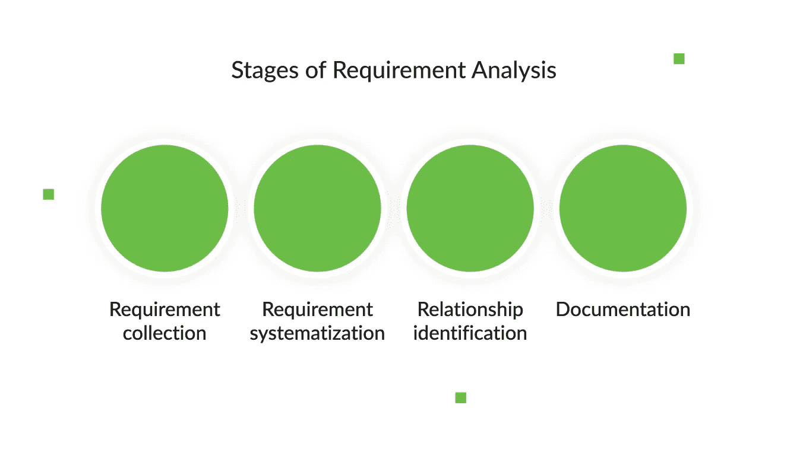
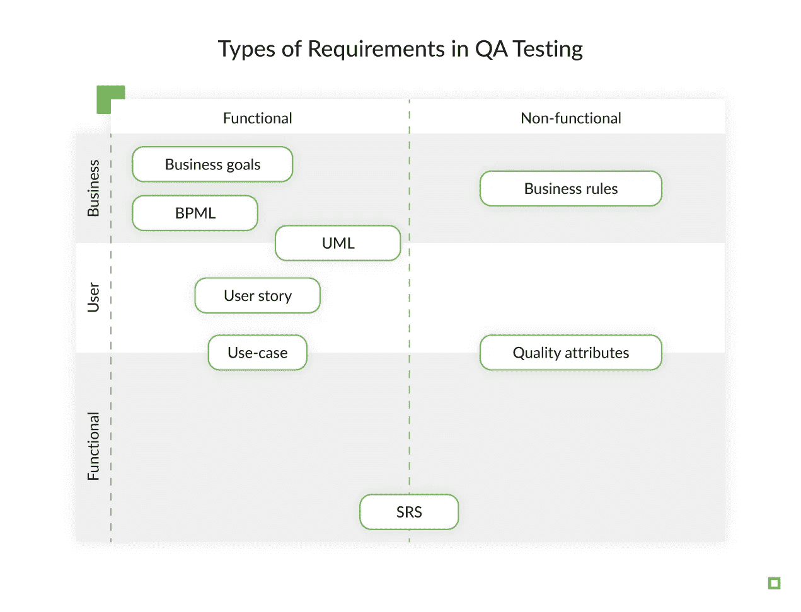
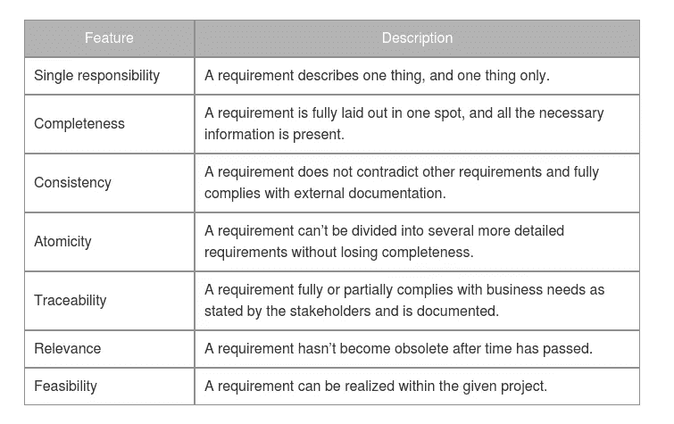
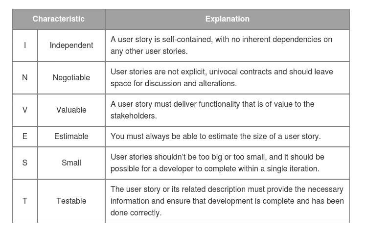
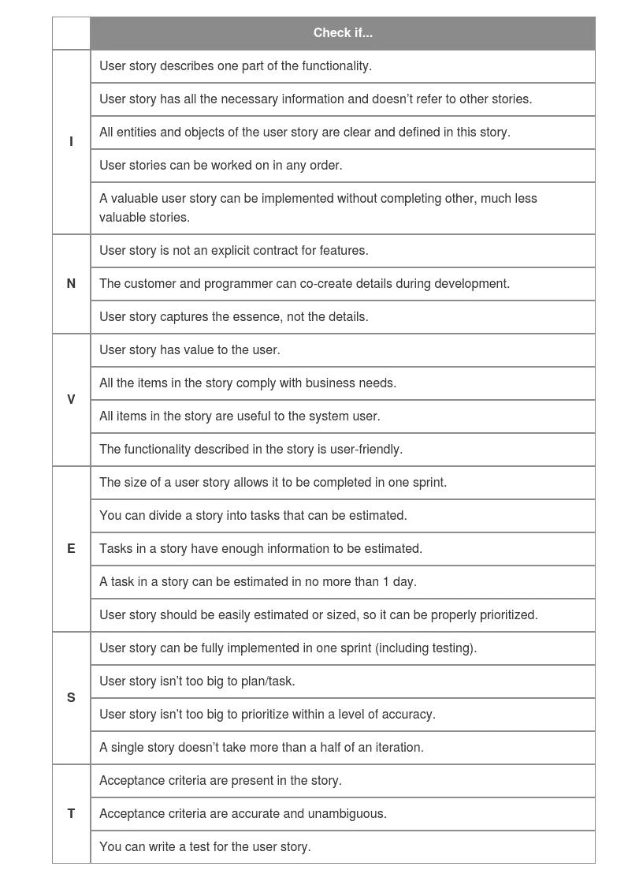
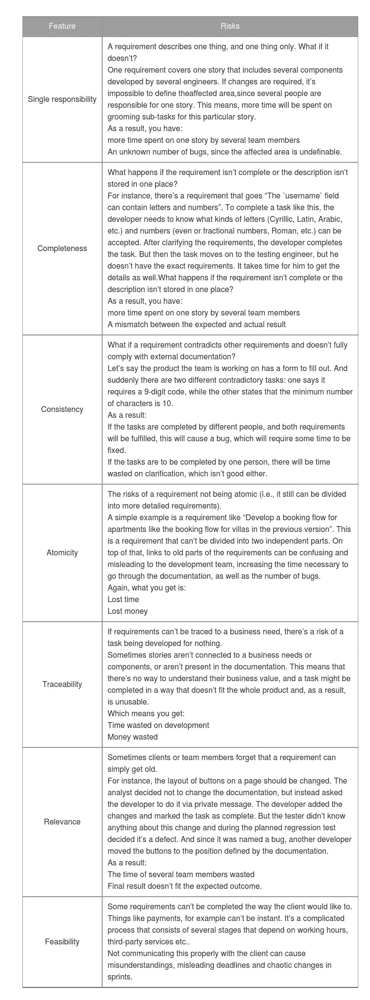
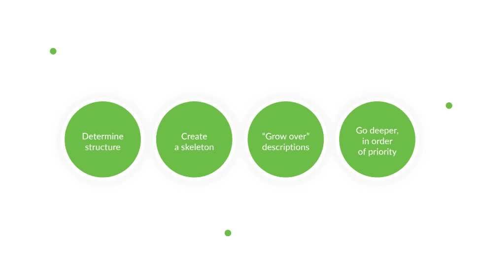

# 测试要求指南:主要标准、特征和风险

> 原文：<https://levelup.gitconnected.com/guide-to-testing-requirements-main-criteria-features-and-risks-379c5a72a657>

每天，我们 QA 工程师所做的就是测试——API、用户界面、跨浏览器兼容性、业务逻辑等等。要知道一个产品是否按照预期的方式工作，我们需要知道需求。但可悲的事实是，一个普通工程师的生活是由开发和测试工作组成的，这些工作都有糟糕的需求制定——如果有的话。这样，软件质量保证中的工程师被迫使用不完整的、旧的或者——老实说——糟糕的文档。这种情况最糟糕的是每个人都在谈论测试需求，但是没有人真正谈论如何去做。作为这些工程师中的一员，我决定分享我对需求的看法，如何测试它们，如何知道它们是好的，以及如果它们是坏的该怎么办。

# 需求的定义

让我们从基础开始。预计[网络开发公司](https://djangostars.com/services/web-development/?utm_source=levelup.gitconnected.com&utm_medium=medium&utm_campaign=testing%20requirements&utm_content=web%20development%20companies)将从客户那里获得详细的、结构化的产品开发需求。但是如果我们不总是得到好的产品需求，也许每个人都不清楚他们实际上是什么。产品需求的基本定义是一组描述产品或系统特性和实现的陈述。QA 过程中的需求分析反过来也是软件开发过程的一部分，包括:

# 需求类型

绝对准确地说，在 QA 测试过程中有几种类型的需求。我们可以按级别(功能、用户、业务)和属性(功能、非功能)对它们进行分类。

我不会详细介绍这些类型，因为你要么已经了解它们，要么需要的话可以谷歌一下。因此，让我们来谈谈还没有人试图正确描述和解决的需求类型——糟糕的需求。显然，客户在吃午餐时通过视频通话、吉拉的评论、Slack 消息或团队成员之一的手写笔记列出的需求就是其中的一部分。

# 需求的特征

但是等等——这是不是意味着一个关于吉拉的故事或者一篇关于 Confluence 的长篇文章会自动使需求变得坚实和写得好？是的，只要他们表现出某些特征。我的[软件开发团队](https://djangostars.com/company/team/?utm_source=levelup.gitconnected.com&utm_medium=medium&utm_campaign=testing%20requirements&utm_content=software%20development%20team)和我使用下面的列表，因为在我看来，它不仅对于软件质量测试是完美的，而且对于任何类型的客户-供应商组合的任何项目都是完美的。

正如我所说的，这只是一个可以应用于不同项目的通用列表。但是如果我们以敏捷团队为例，用户故事是敏捷团队中最受欢迎的需求类型。在这种情况下，需求质量可以很容易地用 INVEST 来描述，INVEST 是一个简单易记的缩写:

# 测试 QA 需求:我如何知道它们是合理的？

QA 工程师的主要工作是在整个开发过程中确保质量。因此，公平地说，需求开发是工作中非常重要的一部分，因为我们都知道 bug 的成本与发现它所花费的时间是如何相关的。避免这种额外费用的一个好方法是在代码完成之前通过测试需求来提前发现 bug。

这似乎是显而易见的，但是如何测试需求呢？尽管许多专家甚至列出了应该检查的特征，但答案从未被恰当地表达出来。

在我职业生涯的初期，这是一个非常困难的主题，我读到或听到的一切都非常模糊。这就是为什么，随着时间的推移，我创建了一种检查表，允许我查看用户故事是否是一个好故事(即，适合开发)或者需要进一步的分析和阐述。

您可能还喜欢:

 [## 为什么您需要 QA 以及它如何能节省您的资金

### 所以，我们应该首先决定我们在谈论什么:我们不是在谈论 QA 工程师如何做他们的工作。我们是…

djangostars.com](https://djangostars.com/blog/why-you-need-qa/?utm_source=levelup.gitconnected.com&utm_medium=medium&utm_campaign=testing%20requirements&utm_content=you%20may%20also%20like)  [## 如何成功地为开发团队设定任务

### 有句谚语说“去我不知道的地方，拿我不知道的东西”，通常，最讽刺的是，这…

djangostars.com](https://djangostars.com/blog/successfully-set-tasks-development-team/?utm_source=levelup.gitconnected.com&utm_medium=medium&utm_campaign=testing%20requirements&utm_content=you%20may%20also%20like) 

# 糟糕的需求会带来风险

如果你对以上所有问题的回答都是肯定的，那么恭喜你！你对自己有一些准确的要求。但是，如果您已经测试了需求，而结果却远非完美，该怎么办呢？作为一名 QA 工程师，你的任务是使软件质量保证过程尽可能顺利地进行。

下一步是向产品负责人(客户、团队和每个参与需求开发的人)展示坏需求的风险，并解释如何创建易于使用的好需求，并帮助开发人员创建功能良好的产品。

# 如何处理不好的需求

理想情况下，这些应该可以帮助你获得更好的产品开发需求，并使 QA 过程更加容易和透明。但是，可悲的是，这并不总是发生。那你会怎么做？当 QAs 拥有大量非结构化文档页面、不同版本的任务、大量关于吉拉的评论以及分散在一堆电子邮件中的问题时，他们应该怎么做？

一些工程师开发了他们自己的质量保证方法。这里有一个我自己开发和使用的简单算法。基本上，你只需要把所有东西拆开，然后按照它应该的样子组装起来。

1.  **确定结构。**
    记下组件和功能列表。使用您的工程技能来定义连接、它们之间的依赖关系以及它们的层次结构。问问你自己，你想用每个组件或特性实现什么目标，以及如何实现。
2.  **创建骨架。**
    它可以是一个 UML 图，也可以是一个包含所有附件、连接和链接的页面图。你应该得到一个透明的结构，每个人都可以遵循。
3.  **“成长”描述。**
    使用你的骨骼添加一些肌肉——实体和功能描述。
4.  **深入，按优先顺序。**
    按照优先顺序，给你的文档添加必要的特征。(显然，相关性比可追溯性具有更高的优先级。)

当所有的信息都组织良好时，其中的漏洞就更容易被发现。这个算法应该让你看到有什么信息存在，需要添加什么来完成拼图。

正如我所说的，产品需求通常是每个相关人员的痛点。要做出一个好的产品，它所有的需求和功能都应该被很好的沟通。每个人都应该完全理解他们努力的目标，并对其价值保持一致。

可悲的是，事情并不总是这样。缺乏(或不充分)需求的最糟糕的事情是没有一种方法可以解决问题。开发人员用不同的方式处理它，有些则不然。这就是为什么我决定分享我的经验，帮助你渡过难关。我希望这篇文章能帮助您识别问题，并找到获得您应得的需求或至少处理您现有的一般需求的方法。

**这篇关于** [**测试要求**](https://djangostars.com/blog/testing-qa-requirements/?utm_source=levelup.gitconnected.com&utm_medium=medium&utm_campaign=testing%20requirements&utm_content=originally%20posted) **的文章最初发布于** [**Django Stars 博客**](https://djangostars.com/blog/?utm_source=levelup.gitconnected.com&utm_medium=medium&utm_campaign=testing%20requirements&utm_content=django%20stars%20blog) **。**

