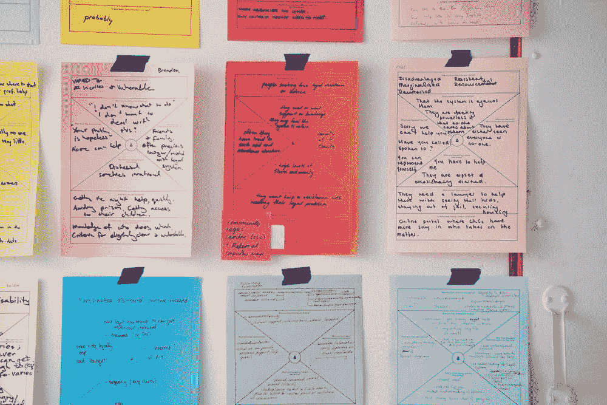
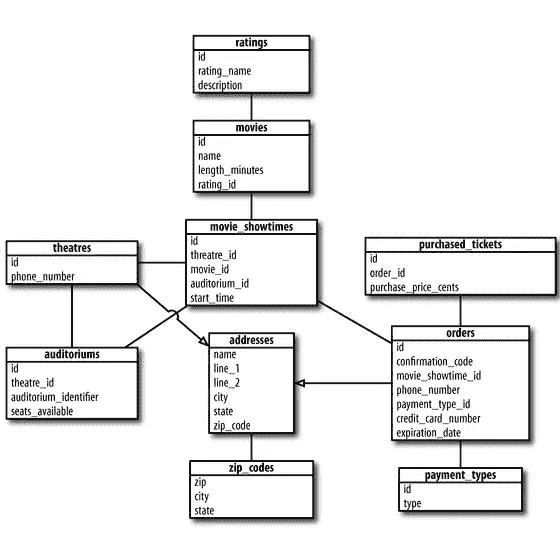
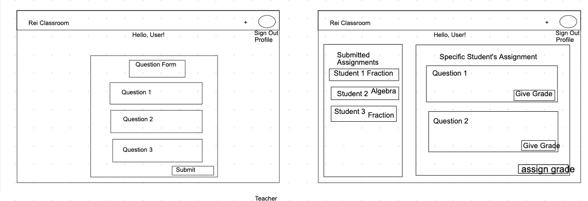

# 新编码项目指南

> 原文：<https://levelup.gitconnected.com/guidelines-for-a-new-coding-project-7ec063bace78>

Jo Szczepanska 摄

在开始任何编码项目之前，计划是必不可少的。但是你到底在计划什么呢？很多！规划阶段本身可能是一项艰巨而乏味的任务，在此过程中，您可能会忍不住开始编码和规划。我不会责怪你，我最初也有这种想法。

在我的编码训练营的最后阶段，我和我的同伴被指派创建一个 solo 项目。但是在我们正式开始编码之前，我们必须花三天时间来研究我们的项目想法和指导方针。起初，我认为三天的计划时间太长了。

但在项目结束时，我回想了一下，意识到这是一个完美的时间框架，因为我能够准确地计划出我的项目将如何运行以及它在视觉上看起来如何。这是唯一可能的，因为我得到了一套关于如何在计划阶段高效工作的指导方针。

# 领域建模

处理一个新项目的第一步是规划数据模型和模式。你的项目运作需要什么样的模型？此外，您希望每个模型包含哪些属性或数据？如果你有一个用户模型，你想从那个用户那里得到什么具体信息(名字、电子邮件、传记、图片)？

一旦你设计出了你需要的模型，下一步就是确定这些模型之间的关系。你需要两个模型之间的连接模型吗？有两种方法可以接近这个阶段，要么使用应用程序，要么手绘模型和它们之间的关系。

丹·Chak 写的

# 用户故事

第二部分包括一个用户应该能够在应用程序中做什么的故事。一些例子包括，作为一个用户，我希望能够登录/注销，看到我的个人资料，能够评论帖子，能够与其他用户聊天。通过彻底思考用户能够在你的应用中实现什么，你可以确定在应用中实现它所必需的技术、库、API 和方法。

# 线框化

第三部分是给你的项目画线框。我假设你可能不知道线框是什么(我在编码训练营的时候肯定不知道)。本质上，线框就像你的应用的蓝图。它描述了应用程序的一个或多个页面的外观。在这个阶段，你可以想象每个页面将会有什么功能以及如何导航。线框在显示不同页面之间的路径方面起着至关重要的作用。

有了线框，也有两种方式去做。我使用了一个叫做网络白板(AWW)的网络应用程序来绘制我的页面，我的一些同事使用了 Adobe Xd。我的其他同学也决定手绘出他们的页面。有了线框，不要太专注于让它看起来漂亮。如前所述，这只是你的应用程序应该是什么样子的蓝图。

我的线框样本

# 最小可行项目

当你着手一个新项目时，你可能会面临截止日期。记住这一点，如果你有一个期限要满足，不要在计划阶段发疯。你的应用可以拥有无限的功能。即使遵循了项目指南，并且已经处于编码过程中，您也会对想要实现的特性有新的想法。它发生了。但是不要转移话题，突然实现所有的事情！这是最小可行产品(MVP)背后的一个关键前提，即你可以生产一个实际的产品，你可以提供最少的可用功能。

在计划阶段，确定你希望你的应用在截止日期前具备哪些特性。最好有一个功能较少的全功能应用，而不是功能较多的半功能应用。我不是说实现尽可能少的功能，而是保持现实的目标。看起来令人畏惧但如果时间允许仍然可以完成的功能被认为是拉伸功能。它们仍然可以实现，但是应该留到最后。

# 结论

规划阶段是开发任何新项目的重要组成部分。它消除了编码过程中的许多压力和顾虑。一旦蓝图和计划制定好了，重点就转移到简单的编码上了。如何将应用程序编码成成果？计划阶段当然不会考虑到你可能遇到的所有挑战，但它肯定会限制它们。

 [## AWW 应用|用于实时视觉协作的在线白板

### 面向商业和教育的协作式在线白板。更有效率——有你的想法、草图和…

awwapp.com](https://awwapp.com/#)