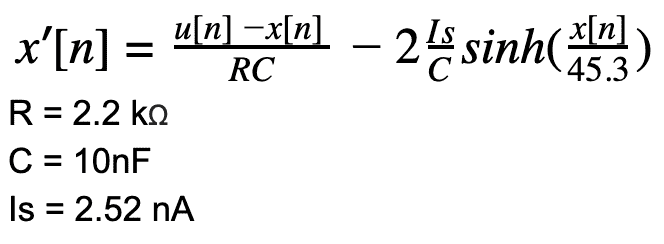
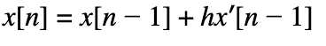

# 用数值方法模拟吉他失真

> 原文：<https://levelup.gitconnected.com/guitar-distortion-simulation-using-numerical-methods-39584785e8b2>

我们将学习如何使用数值方法有效地模拟吉他失真电路。如果你对失真的基础知识不熟悉，去基础知识的帖子上读一读吧。

传统的吉他效果是一个模拟电路，而失真也不例外。
最简单的失真剪辑，并使用两个反向并联二极管“平滑”其边缘。
一种叫做基尔霍夫定律的东西被用来从这个电路中导出一个常微分方程。

摘自《吉他失真模拟的数值方法》( David T. Yeh，Jonathan S. Abel，Andrei Vladimirescu 和 Julius O. Smith。)

考虑在模拟失真效果中广泛使用的简单二极管削波电路的 ODE。

数值积分帮助我们求解这种形式的方程，将输入和输出改变为 *u* 和 *x* 因此我们将得到下面的方程:

二极管箝位二极管

最简单的数值积分方法是**正向欧拉**，每个样本只需要简单的计算。
它只是沿着曲线的切线前进。

正向欧拉

为了得到下一个值，我们做了一个涉及
前一个值的计算。

# 履行

向前欧拉的简单 Python 移植；

*u* 是输入， *f* 是我们也单独实现的电路功能。

# 结果

现在，如果我们在削波正弦波上运行它，我们将得到以下结果。
源代码:[https://github.com/alexjilkin/numerical-distortion](https://github.com/alexjilkin/numerical-distortion)

削波正弦波与有限元近似

蓝色图形是一个限幅在 4.5 100 赫兹的正弦波。

红色的图形是用我们的电路 ODE 向前运行欧拉的结果。

当使用这个干净的吉他样本作为输入时。

当我们通过函数运行它的时候，我们得到了这个漂亮的变形。