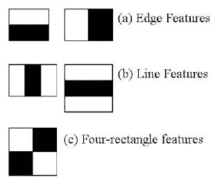
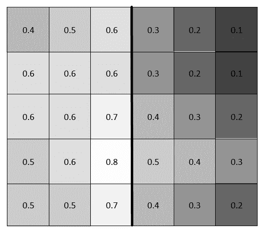

# 类哈尔特征:黑白视

> 原文：<https://levelup.gitconnected.com/haar-like-features-seeing-in-black-and-white-1a240caaf1e3>

## 计算机视觉导论，第二部分

图片来源:[SoulPageIT.com](https://soulpageit.com/computer-vision-and-the-future-of-work/)

在[的上一篇文章](/pixels-arrays-and-images-ef3f03638fe7)中，我们讨论了理解计算机视觉所需的基础知识。这是如此重要，我将提供一个非常简短的回顾。如果你还没有，我强烈推荐你阅读这篇文章，因为它有很多图片来帮助你形象化这个过程。

# 计算机是如何“看见”的？

他们没有！电脑只和数字打交道！存储图像时，它会经历以下过程:

1.  图像分为三个通道:红色、绿色和蓝色。这些通道对应于组成**白光**的三种颜色，以及单个**像素**中的三个颜色通道。
2.  这些通道是具有与图像分辨率相同尺寸的阵列(例如，1920x1080 像素图像将形成 3 个具有 1920 列和 1080 行的阵列)。
3.  阵列的每个单元对应于单个像素的红色、绿色和蓝色通道。
4.  存储在单元中的值表示该像素中颜色通道的亮度。这些值的范围是 0(无光)到 255(最亮)。因此，如果一个像素是完全黑色的，它在相应通道上的值将是{红色:0，绿色:0，蓝色:0}。相反，如果像素是白色的，它们在数组中存储的值将是{R: 255，G: 255，B: 255}。

简而言之，图像被存储为每个像素的*通道*的**亮度**应该如何的指令。

说完这些，让我们继续讨论本质问题！

# 维奥拉-琼斯算法

> 问:电脑能看到电羊吗？
> 
> 答:如果你给我一万张贴标签的电羊图片，当然可以。

Viola-Jones 算法是由 Paul Viola 和 Michael Jones 在 2001 年开发的。它最好被描述为一种在人脸上训练的物体检测算法。这意味着，即使它是为面部检测算法而设计的，如果经过重新训练，它的功能可以扩展到任何对象。

现在，计算机视觉的世界在过去 20 年里已经取得了很大的进步，深度学习神经网络和带有预训练神经网络的转移学习慢慢成为新的标准。尽管如此，Viola-Jones 算法仍然是一个强大的工具，被许多人使用。这一点，加上其创造性的设计，使其成为理解计算机视觉基础的完美之选。

那么，它是如何工作的呢？

## 引擎盖下的一瞥

Viola-Jones 算法首先将图像转换为灰度。这使得数学更容易，尤其是当你考虑 Haar-like 特性的本质时。Haar-like 特征是可缩放的矩形框架，用于比较像素之间的关系；特别是一个对另一个有多黑暗。参见下面的例子。

图片来源:[OpenCV.org](https://docs.opencv.org/master/d2/d99/tutorial_js_face_detection.html)

Haar-like 特征有三种基本类型:边缘特征、线特征和四矩形特征。白条表示包含图像中更靠近光源的部分的像素，因此在灰度图像上“更白”。黑条是相反的。这些像素的图像特征距离光源较远(如背景)，或者被另一个对象遮挡(如眉毛在眼睛下方投下轻微阴影)。与之前类似，这些特征在灰度图像中会显得“更黑”。黑白像素之间的这种比较是我们将图像转换为灰度的最重要原因。

现在，自从算法创建以来，已经开发了更多类似 Haar 的功能，但早在 2001 年，这三个是 Viola 和 Jones 所依赖的。我们来讨论一下这些特性。

**重要提示**:记住类似 Haar 的特性是*可扩展的。*对于边缘特征，可以是 1x2、100x200 甚至 400x50 像素。没关系！它们唯一不能的维度是 1x1 像素。所以在我们继续的时候，请记住这一点。

**边缘特征**:这些帧检测边缘(足够简单)。说到人脸检测，想想额头和眼睛/眉毛。前额是一个暴露的平面。这让它能反射更多的光，所以往往“更轻”。眉毛一般颜色较深。该算法会将前额的较浅阴影和向较深眉毛的过渡读取为“边缘”边界。

**线条特征**:这些检测？你猜对了！台词。图案可以是白-黑-白，或黑-白-黑(像奥利奥)。回到我们的面部检测的例子，考虑一个鼻子。从鼻梁延伸到鼻尖的鼻尖虽然不像额头那么平，但仍然是反光的，也是面部最靠近可能位于拍摄对象前方的光源的点，因此自然会更亮，更突出。鼻孔周围的区域通常弯曲远离光线，使它们变得更暗。该模式将作为线要素被拾取。线条特征被利用的另一个有趣方式是眼球追踪技术。想想看:一个**深色**虹膜夹在你眼睛两边的**白色**空间之间。相当聪明！

**四矩形特征**:这有利于寻找图像中的对角线和高光。这在微观尺度上用得最好。根据光线的不同，它可以分辨出下巴、下巴、皱纹等的边缘..这些特征通常在一般的人脸检测中并不重要，因为它们太多了，而且每个人的脸上有太多的变化，这将导致算法太慢，可能只能检测某些人的脸。换句话说，太专业化了。

让我们看看下面的图片，以了解这一切是如何结合在一起的。

图片来源:[SemanticScholar.org](https://www.semanticscholar.org/paper/A-comparative-study-between-LBP-and-Haar-like-for-Kadir-Kamaruddin/3ec98dabbcf440db746d4baf6550e44e12c5ee76)

如您所见，该算法将从前额到眉毛、眼睛到脸颊、上唇到嘴以及下颚到下巴的过渡分类为边缘特征。当光线从顶部反射时，鼻子遵循黑-白-黑的模式。此处的高亮显示创建了一条线，因此它被归类为线要素。

应该做一些记录。首先，这只是算法*如何能够*对脸部的这些部分进行分类的一个例子。视情况(拍摄对象是否戴墨镜)、灯光(光源从不同角度来)、尺度(埃菲尔铁塔前的合影；其中面部特征是更大图像的很小一部分)，算法可以对它们进行不同的分类。

还应该注意的是，上面的图像，除了被转换成灰度，对比度也提高了。很多！这不是过程中发生的转变。相反，它会在图像上查找类似于以下内容的特征:

图片来源:[Spritle.com](https://www.spritle.com/blogs/2019/11/21/face-detection-using-opencv-machin-learning-ml/)

现在，Haar-like 特征是由特定区域的黑白像素的特定模式定义的。所以你可能想知道:算法是如何在灰度图像上做出这些决定的？这是一个很好的问题！答案很简单:门槛。该算法被教导，在类似 Haar 的特征中，如果亮区域和暗区域的平均值之间的差异在某个阈值内，则将它们视为黑和白。让我们看一个例子:

所以请记住，图像只是一个有三个通道的数组。存储在数组中的值只是代表该通道上像素亮度的数字。在上图中，我们有一个尺寸为 6x5 像素的边缘特征框架。出于“训练”的目的，我们对这些值进行了缩放，因此它们不是 0 到 255，而是 0 到 1，其中 0 是黑色，1 是白色。

(注意:我看到过 0 代表白色，1 代表黑色的解释，但是为了保持一致，我们坚持上面的解释)

现在，假设我们有一个 0.25 的阈值。我们取较亮一侧的平均值(0.58667)，减去较暗一侧的平均值(0.28)。两者相差 0.30667。这大于我们的阈值，因此，算法将该段视为黑白，并将其归类为边缘特征！请记住，差值为 0 表示两边的阴影大致相同。

# 将这一切结合在一起

请看下图:

图片来源:【MathWorks.com 

Viola-Jones 算法将图像转换为灰度，并从左到右在图像上滑动一帧，慢慢向下移动。它搜索被称为 Haar-like 特征的特定模式，并且直到在该帧中找到人脸的所有相关特征(眼睛、鼻子、嘴等)时才对人脸进行分类。).几年前，如果像眼睛这样的特征缺失，算法就会很难检测到面部。然而，现在情况不同了。

尽管 Haar-like 特征意味着黑色和白色，但如果较暗和较亮区域的平均值之间的差异在指定的阈值内，Viola-Jones 算法能够将图像区域解释为黑色和白色。

一个重要的讨论话题是，在一个小到 24x24 像素的图像中，有超过 180，000 个特征需要计算。大量的计算会耗尽你的设备的处理能力。那么，我们是如何在数码相机和智能手机上实现实时人脸检测的呢？输入高达 1080p！这个问题的答案在于一个叫做积分图像的小技巧。[来看看](/the-integral-image-4df3df5dce35)！