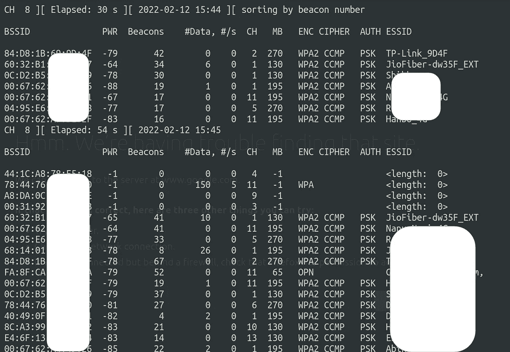
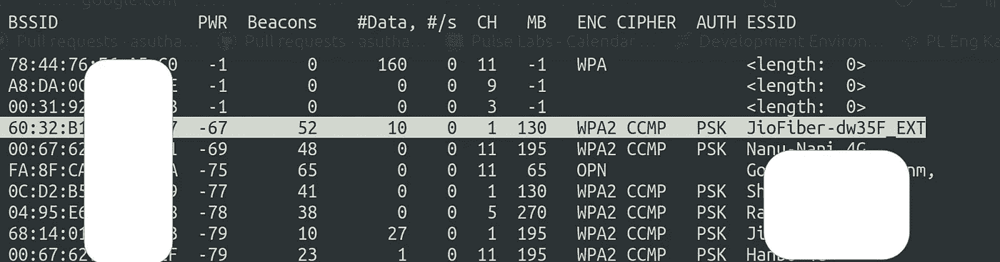
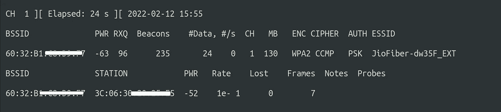
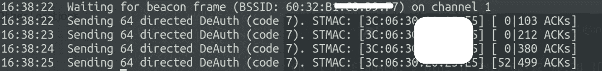
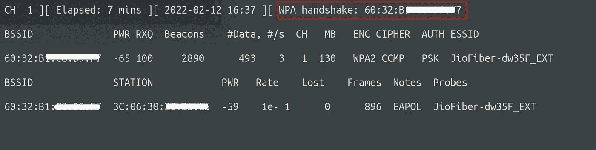
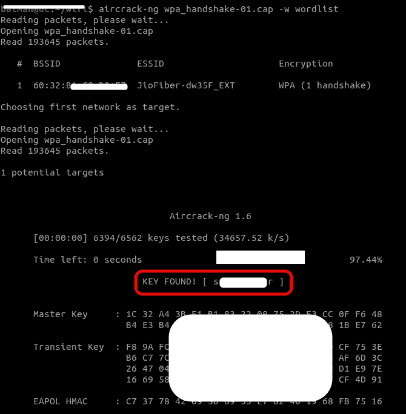

# 使用暴力攻击破解 WiFi 路由器密码

> 原文：<https://levelup.gitconnected.com/hack-wifi-passwords-33914949e382>

> 几乎所有现代 wifi 路由器都使用 WPA2 加密。WEP 连接或支持 WPS 的网络更容易被侵入，因为它们的设计存在缺陷。WPA/WPA2 加密解决了所有这些缺陷，但还是有办法进入 WPA2 保护的网络。唯一已知的破解 WPA2 加密网络的实用方法是通过单词表/字典攻击。


# 更改 MAC 地址

开始之前，您可能需要更改您的 MAC 地址。这是一个可选步骤。如果想更改 MAC 地址，可以按照本链接[**https://go-RR rave . medium . com/how-to-change-MAC-address-120 ffce 66965**](https://go-rrrave.medium.com/how-to-change-mac-address-120ffce66965)**中提到的步骤操作。**

# 破解 WPA2

使用暴力破解 WPA2 主要包括两个部分:

*   捕捉握手
*   在捕获的握手上运行暴力

## 捕获网络握手

要在网络中发送数据包，数据包应该有一个源 MAC 地址和一个目的 MAC 地址。设备将只接收以目的 MAC 作为其地址的数据。稍后我们将利用这一规则来执行去授权攻击。

数据包实际上是通过空中发送的，所以如果我们在路由器的范围内，我们将能够捕获这些数据包，因此将无线接口更改为`monitor`模式。默认情况下应该处于`managed`模式。要进入`monitor`模式，运行以下命令:

*注意:要检查您的无线网络接口名称，请运行* `*iwconfig*` *。对我来说是* `*wlan1*` *。(大多数现代网络适配器支持监控模式。如果您的适配器不支持显示器模式，您可以购买支持该模式的外部适配器)*

```
$ ifconfig wlan1 down
$ airmon-ng check kill
$ airmon-ng start wlan1
```

第一个命令`ifconfig wlan1 down`将关闭无线适配器。`airmon-ng check kill`将终止任何进程干扰。你将失去你的互联网连接，但没关系。进一步的步骤不需要它。`airmon-ng start wlan1`会将`wlan1`界面设置为监控模式。您可以使用`iwconfig`来验证您的适配器是否处于监控模式。记下这个适配器名称。对我来说是`wlan1mon`。

我们将使用`airodump-ng`进行数据包嗅探。

```
$ airodump-ng wlan1mon
```

我们将看到类似这样的输出。



“空气卸载”的输出`wlan1mon'`

`ESSID`是网络的名称。`BSSID`是目标网络的 MAC 地址。`PWR`是网络的力量。`Beacons`是网络广播的表示其存在的帧。`#Data`是发送的有用数据包的数量。`CH`是网络工作的频道号。`MB`是网络支持的速度。



接下来，我将在突出显示的网络上运行`airodump-ng`。假设这是我的目标网络。

```
airodump-ng --bssid 60:32:B1:XX:XX:XX --channel 1 --write wpa_handshake wlan1mon
```

这将把探测到的数据存储在一个名为`wpa_handshake`的文件中。我们指定了我们想要执行攻击的网络的`bssid`和由`channel`参数指定的通道号。输出将如下所示:



“airodump-ng—bssid 60:32:B1:XX:XX:XX—通道 1 —写入 wpa_client wlan1mon”的输出

您将会看到生成了一个`wpa_handshake-01.cap`文件，其中包含了与网络之间传输的所有数据。站中指定的 MAC 地址是连接到 WiFi 网络的设备的 MAC 地址。

现在我们需要等待某个客户端连接，然后`airodump-ng`会给我们捕捉到的握手。

我们还可以执行取消身份验证攻击，强制客户端从 wifi 网络断开连接，当我们停止攻击时，客户端将尝试连接到网络，我们可以捕获握手数据包。

要在客户端上执行解除身份验证攻击，请打开另一个终端并键入以下命令，其中`-a`指定网络的 bssid，而`-c`是我们要解除身份验证的设备的 MAC 地址。

```
$ aireplay-ng --deauth 4 -a 60:32:B1:XX:XX:XX -c 3C:06:30:XX:XX:XX
```



“空中播放-ng-deauth 4-a 60:32:B1:XX:XX:XX-c 3C:06:30:XX:XX:XX”的输出

在此之后，客户端将断开连接并再次进行身份验证，我们将在 airodump-ng 终端中看到以下指示。在`Elapsed`时间旁边会有文字`WPA handshake`。



现在我们已经捕获了握手，您可以通过按 Ctrl+C 来停止它。

要让 wifi 接口回到管理模式，请键入以下命令

```
$ airmon-ng stop wlan1mon
```

首先，祝贺你捕捉到了握手。花点时间庆祝一下。我们已经走了一半了。

## 对捕获的握手进行暴力攻击

捕获的握手将允许我们验证`password`是否有效。因此，我们将使用暴力攻击来尝试根据捕获的数据包检查随机字符串。

我们需要一个词汇表。你可以搜索并下载一个潜在的 wpa2 密码列表，或者使用`crunch`命令生成一个你自己的单词列表。

我将使用`crunch`命令创建一个单词表。

```
$ crunch 6 8 qwertyuiopasdfghjklzxcvbnm -o wordlist
```

其语法是`$ crunch [min] [max] [chars] -o [outputfile name] -t [possible pattern]`。

这将生成一个名为`wordlist`的文件，包含上述字符的所有可能组合。您还可以为单词列表指定一种模式，例如，如果您知道密码以`a`开头，那么您的命令将类似于`crunch 7 7 qwertyuiopasdfghjklzxcvbnm -o wordlist -t a@@@@@@`

最后，我们使用下面的命令根据捕获的握手测试单词列表中的单词。

```
$ aircrack-ng wpa_handshake-01.cap -w wordlist
```

如果幸运的话，密码在列表中，我们会看到类似这样的输出。密码在`KEY FOUND`文本旁边的括号中。



' air crack-ng wpa _ handshake-01 . cap-w word list '的输出

恭喜你得到了密码！唯一已知的破解 WPA2 加密网络的实用方法是通过单词表/字典攻击。然而，有一些社会工程的方法可以得到密码，我将在我接下来的博客中描述。

*由此得出的一个重要结论是，对包含特殊字符、数字和字母的长密码进行字典攻击是非常困难的。*

> 这里邀请您探索我们的博客平台[](https://www.thegeekyminds.com/)**。一个让您了解软件开发和技术领域最新发展的一站式平台。我们在 [**的极客头脑**](https://www.thegeekyminds.com/) 旨在写一些你实际上可以用来提高工作效率和充实你的职业生活的内容。**
> 
> **邀请您在[**https://thegeekyminds.com**](https://thegeekyminds.com/)通过我们的平台。并订阅我们的时事通讯，以便在我们每次发布新帖子时收到电子邮件。我们承诺不会向您的收件箱发送垃圾邮件。点击下面的按钮订阅我们的时事通讯**

**[](https://forms.wix.com/4444cf13-7653-460d-9b32-f2e4e65544d1:c2184260-1ab5-4c6a-a37d-53de0778afa0)**