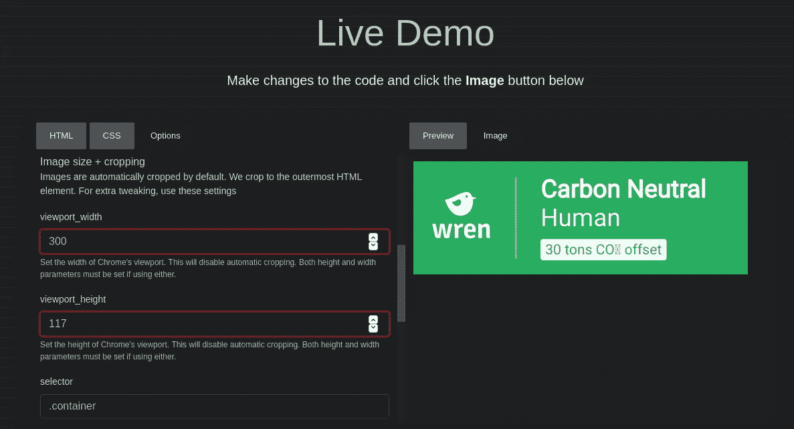

# 使用 AWS Lambda 和 Golang 将 iframe 徽章植入自动更新的 Github 个人资料图像

> 原文：<https://levelup.gitconnected.com/hacking-iframe-badges-into-auto-updating-github-profile-images-with-aws-lambda-and-golang-d6fbf78d6f6d>

# 我终于得到了一个我引以为豪的互联网徽章，但我却无法将它嵌入到我的 Github 个人资料中！

[Wren.co](https://www.wren.co/join/ZackProser?utm_campaign=share&utm_medium=profile_referral_link)是一家初创公司，通过资助气候基金投资组合的恢复性项目，让你、你的朋友和家人能够抵消你的碳足迹。Wren.co[的团队正在做非常重要的工作，你应该支持他们，无论是抵消你自己的足迹，如果你负担得起，还是把任介绍给你的朋友和同事。](https://www.wren.co/)

他们不仅要解决与气候相关的损害，还要解决围绕应对气候变化建立社会共识和合作的相关问题，允许你[赠送鹪鹩](https://www.wren.co/gifts)，抵消他人的足迹[，创建并加入团队](https://www.wren.co/teams)，以及[在友好排行榜上竞争](https://www.wren.co/leaderboard)。


# SVG 徽章很容易包含在任何地方——除了 Github

最近， [Wren 发布了一个功能](https://www.notion.so/Wren-Badge-a1141624a25d4a35a05723496036a8db)，允许你展示一个光滑的徽章，根据你的贡献显示你的整体气候影响。

它看起来像这样，虽然你可以从几个风格中选择。请注意，碳补偿的吨数是实时更新的:


我的第一个想法是，我想通过最近推出的 Github 个人自述功能将这个徽章放在我的 [Github 个人资料](https://github.com/zackproser)上。此功能允许您编辑特殊存储库中的 README.md 文件，该文件将内嵌到您的 Github 配置文件中，因此您可以对其进行一些个性化设置:


这是 Github 给了它的用户更多的控制来设计他们自己的个人资料，只要你在 [Markdown](https://en.wikipedia.org/wiki/Markdown) 中渲染东西。在我的例子中，包含我的徽章、关于我的兴趣的简短简介和指向我的其他内容的链接的表格的图像右侧的块都在 Markdown 中呈现，它位于这个特殊的 repo 中。

# 降价既快又容易，但有限制性

Github 针对 profile READMEs 的 markdown 解析器只允许呈现特定的 HTML 元素，这是有充分的安全理由的(一个主要的问题是有人可能会在 HTML 中注入恶意的脚本，这样任何访问 profile 的人都容易受到脚本攻击)。

但是，这也必然会限制您可以在个人资料自述文件中呈现和显示的内容。[Wren.co](https://www.wren.co/join/ZackProser?utm_campaign=share&utm_medium=profile_referral_link)发布了作为 iframes 实现的徽章的第一次迭代，你可以快速嵌入到你控制的任何站点来呈现你的徽章，你甚至可以通过几个参数在某种程度上修改样式:

```
<iframe src="[http://wren.co/badge/simple/mims](http://wren.co/badge/simple/mims)" style="width: 300px; height: 128px; border: 0" />
```

不幸的是，iframes 是 Github 的 markdown 解析器的禁忌元素之一，但我仍然希望显示我的徽章并定期更新，而不必自己手动完成。所以，我写了一个快捷的应用程序来帮我做这件事。

# 这难道不是过分和不必要的吗？

Wren.co 不会更新他们的徽章以支持稍后返回图像吗？肯定，是的，也许。但这仍然是使用 AWS 无服务器技术的良好实践。

# 我们正在建造的东西

虽然我决定对我的 Wren.co 徽章使用这种方法，但是您可以使用这里概述的相同技术和代码对任何其他只作为 iframe 提供的徽章做同样的事情。这个解决方案的代码也可以在 https://github.com/zackproser/wren-badge-rotator 的[找到。](https://github.com/zackproser/wren-badge-rotator)


在本演练中，我将分享我的问题解决方法以及设置系统的所有代码，该系统将:

1.  每月自动获取我最新的 iframe 徽章
2.  将其转换为静态图像
3.  通过 Pull 请求将其发布到我的 Github 个人资料上

如果你想跳到这个应用的代码，你可以在 https://github.com/zackproser/wren-badge-rotator[找到它。](https://github.com/zackproser/wren-badge-rotator)

# 问题陈述

我知道我希望我的徽章显示在我的 Github 个人资料 README 上，我不能在我的 markdown 中直接使用 iframe，因为 Github 会在呈现我的个人资料之前对它进行清理。

我可以对我自己的徽章进行截图，然后将其作为本地图像添加到我的特殊个人资料 README repo 中，并通过本地图像 href 引用它，如下所示:

```

```

然后我可以把图片包装在一个链接里，或者是我的鹪鹩推荐链接或者是我的鹪鹩简介。这最初是可行的，但因为我订阅了 Wren 的月度补偿，并且因为我偶尔会进行一次性补偿或为他人购买补偿，所以我知道我的统计数据将会定期变化，也就是说，假设 Wren 徽章支持实时更新？

# 侦察

我通读了[鹪鹩徽章公告](https://www.notion.so/Wren-Badge-a1141624a25d4a35a05723496036a8db)，并检查了建议的 iframes 所指向的 URL。我找到了一个类似这样的 HTML 页面:


所以—底层 HTML 页面本身呈现一个填充视口宽度的徽章。值得注意的是，我尝试添加了。png”添加到 URL 的末尾，看看服务器是否会返回一个我可以直接链接到的图像，但是目前还不支持该功能。相反，它返回了一个应用程序错误，告诉我 Wren 正在使用 Heroku:)

# 弄清楚徽章是如何工作的

我还能够实时确认徽章统计数据的更新。我从查看我目前的徽章开始，然后去雷恩做[1 吨碳的一次性抵消](https://www.wren.co/offset-anything)，然后刷新我的徽章，它立即通过将我的总吨抵消计数增加 1 来反映这一点。


您可以传递一些 URL 参数来控制徽章的呈现，例如 Wren 用户的“用户名”和徽章本身的“样式”“{simple，logo}”。请参见[徽章功能公告](https://www.notion.so/Wren-Badge-a1141624a25d4a35a05723496036a8db)了解更多信息。

还值得注意的是，页面的 CSS 是与页面本身一起编写的，而不是来自一个单独的脚本。


# 在开发工具中修改全角徽章

仍然在 Firefox 开发工具中，我修补了 HTML 和 CSS，直到我得到了一些看起来像中等大小徽章的东西。


我发现徽章本身是一个标签，包裹着一个 SVG(鹪鹩鸟标志)和一些其他元素。有一个容器元素——通过向它添加一个宽度:25%的规则，我能够按照我想要的方式调整徽章的大小。更多的实验表明，我还应该将 HTML 元素的宽度限制为 300 像素，高度限制为 117 像素。

在这一点上，我想为我的徽章抓取这个 HTML 页面，但是有一个障碍，徽章会自然地填充视口的宽度，所以我不能只抓取页面并原样使用它。在获取它之后，需要进行一些修改和翻译。

# 修改 HTML 页面，并处理剩余的 CSS 问题

通过 Dev tools 直接在 wren badge 页面上修改 CSS 对于找出要做的更改非常有用，但是我怎样才能永久地应用我的 CSS 更改来设计我的徽章呢？

如果我想让我的 CSS 修改永久化，我需要拥有自己徽章的 HTML。换句话说，我需要抓取我的徽章，动态地重写 CSS 规则，将它放在我控制的 URL 中的某个地方，然后对那个徽章进行快照**,以获得我想要的最终输出。**

# 查找 HTML 页面 snappshotter

我开始思考各种快照解决方案。想到了[木偶师](https://github.com/puppeteer/puppeteer/)，但最终我只是想要一个 API，所以在尝试了他们的免费演示后，我决定用[https://htmlcsstoimage.com/](https://htmlcsstoimage.com)说服我他们的 API 工作良好。


我现在还注意到另一个问题，即使我修改了我的徽章 HTML 页面的 CSS 版本，任何查看该页面的内容都会看到一个绿色的小徽章在白色页面的海洋中游泳。


[HCTI API](https://hcti.io/) 允许你指定他们在生成快照时使用的视口。这可以解决我的裁剪问题，但仍有一个遗留的 CSS 问题:鹪鹩徽章应用了温和的“边界半径”规则，使它们的角变圆，所以如果你拍摄一个完美的正方形截图，它们会在圆角周围显示一些白色背景像素。

这可能看起来没什么大不了的，但是我和其他许多人都是在黑暗模式下运行 Github 的，所以在黑色背景下这看起来会很恶心(对我的 Github 简介自述文件的快速测试证实了这一点)。


我决定我修改后的徽章页面也将去掉边框半径，这样我就可以在白色或黑色背景上显示我完美的方形截屏徽章，而不会在角落周围出现任何多余的像素。



最后，HCTI 还让我传递一个 CSS 选择器，他们将在截屏页面时使用该选择器来检索该元素。我想要一个完美的裁剪徽章，所以我可以提供”。容器”选择器，测试证实，它工作得非常好——只有我更新的方形徽章本身被提取为图像。

# 仔细考虑端到端自动化的要求

在这一点上，很明显我需要采取一些步骤来使这个工作按照我想要的方式进行。现在，我们可以回顾一下带有更多内容的相同系统流程图:


1.  我需要一些东西来启动这个过程，每个月一次，因为我的徽章所代表的统计数据至少会更新那么频繁。
2.  我需要直接捕获徽章页面的原始 HTML，因为它是我的用户名。
3.  接下来，我需要对 CSS 本身进行一些修改，但是我希望整个 HTML 页面结构保持不变。
4.  我需要在运行时重写 HTML 和 CSS。
5.  然后，我需要在本地的某个地方编写我的徽章的 HTML 页面的修改版本，包含我调整的 CSS 规则。
6.  接下来，我需要立即在一个公共 URL 上发布这个修改过的 HTML 页面，这样我就可以将它提供给 HCTI API 进行抓取。
7.  然后，我将调用 HCTI API，给他们我修改过的页面的 URL，以及前面提到的“viewport_width”、“viewport_height”和“css_selector”参数。
8.  这个 API 调用将导致来自 HCTI 的响应，其中包含我的徽章图像的完美快照版本的 URL，以及我最新的碳补偿统计数据。
9.  然后，我需要从这个 URL 读取图像，并将其保存在本地或远程的某个地方，以备后用。
10.  然后，我需要在运行时克隆我的特殊 Github 配置文件库。
11.  然后，我需要用这个新更新的徽章图像覆盖我的 README.md 文件当前链接到的现有“img/wren-badge.png”。
12.  然后，我需要以编程方式将这些更改提交并推送到我的远程 repo，使用我的用户名和 [Github 个人访问令牌](https://docs.github.com/en/github/authenticating-to-github/creating-a-personal-access-token)利用 HTTP basic auth。
13.  最后，我可以用我的令牌调用 Github API 来打开一个 Pull 请求，这样我就可以在合并我的更新徽章之前检查一切看起来都很好。

我最后写的 [Golang lambda 函数](https://github.com/zackproser/wren-badge-rotator)能够在大约 6 秒内完成所有这些。


# 解决方案成形了

我在 [AWS lambda](https://aws.amazon.com/lambda/) 上登陆了一个 [Golang](https://golang.org/) 运行时，因为我可以设置一个 [CloudWatch](https://aws.amazon.com/cloudwatch/) alert 来触发我的 lambda 每月一次。

我没有从头开始，而是利用 [AWS 无服务器应用程序模型(SAM)](https://aws.amazon.com/serverless/sam/) 快速搭建一个 lambda 函数，连接到 [API 网关](https://aws.amazon.com/api-gateway/)实例、 [Xray](https://aws.amazon.com/xray/) 跟踪和 [CloudWatch 日志](https://docs.aws.amazon.com/AmazonCloudWatch/latest/logs/WhatIsCloudWatchLogs.html)。

# 利用云计算实现快速、轻松的部署

一旦我有了默认的无服务器 API 模板和我想要的 Lambda，我就修改了 Cloudformation 模板，删除了不必要的 API 网关及其端点，代之以 CloudWatch 事件触发器，该触发器配置了 cron 调度，在每月的第二天运行。

我这样做是因为这个系统不需要外部 API 调用，它只需要每月运行一次。

Cloudformation 可以轻松地快速拆除和恢复整个堆栈，并使其他想要自己部署应用程序的人能够在自己的帐户中快速启动并运行它。这是我最终的云层模板的样子。

请注意，此模板描述了运行此应用程序所需的每个 AWS 资源及其关系:

```
AWSTemplateFormatVersion: '2010-09-09'
Transform: AWS::Serverless-2016-10-31
Description: >
  wren-badge-rotatorResources:
  WrenBadgeImageResizeBucket:
    Type: AWS::S3::Bucket
  # Attach a bucket policy that allows all objects uploaded to it to be read by anonymous principals (such as the HCTI API's screenshotting / scraping bots)
  WrenBadgeImageResizeBucketAllowPublicReadPolicy:
    Type: AWS::S3::BucketPolicy
    Properties:
      Bucket: !Ref WrenBadgeImageResizeBucket
      PolicyDocument:
        Version: "2012-10-17"
        Statement:
          - Effect: Allow
            Action:
              - "s3:GetObject"
            Resource:
              - !Join
                - ''
                - - 'arn:aws:s3:::'
                  - !Ref WrenBadgeImageResizeBucket
                  - /*
            Principal: "*"WrenBadgeRotatorFunction:
    Type: AWS::Serverless::Function # More info about Function Resource: [https://github.com/awslabs/serverless-application-model/blob/master/versions/2016-10-31.md#awsserverlessfunction](https://github.com/awslabs/serverless-application-model/blob/master/versions/2016-10-31.md#awsserverlessfunction)
    Properties:
      CodeUri: wren-badge-rotator/
      Handler: wren-badge-rotator
      Runtime: go1.x
      Description: A lambda function that scrapes, processes, and updates my Wren.co badge on my Github profile
      # Allow a timeout of 15 minutes, the maximum supported by lambda, even though we won't need that much time
      Timeout: 900
      Events:
        SimpleCWEEvent:
          Type: Schedule
          Properties:
            # Run the lambda function once, on the second day of every month, at 8am
            Schedule: cron(0 8 2 * ? *)
      Environment:
        Variables:
          S3_BUCKET: !Ref WrenBadgeImageResizeBucket
          WREN_USERNAME: zackproser
          REPO_OWNER: zackproserWrenBadgeRotatorFunctionS3BucketPolicy:
    Type: AWS::IAM::Policy
    Properties:
      PolicyName: ManageImageResizeS3Bucket
      PolicyDocument:
        Version: '2012-10-17'
        Statement:
          - Effect: Allow
            Action:
              - 's3:*'
            # Grant the Lambda function access to every file in the S3 bucket used for hosting the modified badge HTML and the final processed badge image
            Resource:
              - !Join
                - ''
                - - 'arn:aws:s3:::'
                  - !Ref WrenBadgeImageResizeBucket
                  - /*
      Roles:
        - !Ref WrenBadgeRotatorFunctionRoleOutputs:
  WrenBadgeRotatorFunction:
    Description: "Lambda function ARN"
    Value: !GetAtt WrenBadgeRotatorFunction.Arn
  WrenbadgeRotatorFunctionIamRole:
    Description: "Implicit IAM Role created for the badge rotator function"
    Value: !GetAtt WrenBadgeRotatorFunctionRole.Arn
```

# 处理秘密

我们总是希望在我们的代码和版本控制之外保留我们的秘密，Lambda 使得通过 Lambda 仪表板快速存储敏感的环境变量变得容易，比如我的 API 密钥和我的 Github 个人访问令牌。

它们在 AWS 中被加密，并在运行时自动注入到我的 lambda 上下文中，所以我的 Go 代码只需要从环境中读取秘密。

通过这种方式，我可以将所有的秘密隐藏在我的代码之外，这样我就可以开源这个应用程序。


请注意，与其他 AWS 原生的秘密管理解决方案(如 AWS Secrets Manager 和 AWS Systems Manager Parameter Store)不同，Lambda *将在您登录仪表板并查看该功能时以明文形式*显示您的环境变量(无需单击任何东西来显示值)，但如果您是在自己的帐户中运行该功能的个人开发人员，这也没问题。

一旦你开始与一个团队合作，选择 Secrets Manager 或 SSM 参数存储增加的安全性(以及增加的管理开销和代码复杂性)。

# 通过 Golang 模板重写 HTML

这个应用程序最有趣的部分是从 Wren.co 的原始 HTML 页面中提取现有的徽章，并即时重写其样式。

因为我注意到 Wren 的徽章页面的 CSS 样式内嵌在页面中，所以创建一个与 HTML 页面几乎相同的 Golang 模板更容易，但是包含了我修改过的规则。

```
const wrapper = `
            <!doctype html>
            <html>
              <head>
                <link href="[https://fonts.googleapis.com/css2?family=Roboto&display=swap](https://fonts.googleapis.com/css2?family=Roboto&display=swap)" rel="stylesheet">
                <style>
                  html { # Here are some of my modifications
                    width: 300px;
                    height: 117px;
                  } .wrapper-link {
                    text-decoration: none;
                  }
# ... (more css rules elided here for brevity) </head>
              <body>
               {{ .Contents }}
              </body>
```

有了这个模板，我们只需要在运行时将徽章本身的 HTML 输入到`Contents`变量中。

这是通过使用递归在从 Wren 获取的 HTML 文档中查找原始徽章的包装标签来实现的。你可以在[repo](https://github.com/zackproser/wren-badge-rotator)的 html-rewriter.go 文件中看到完整的解决方案:

```
// Badge recursively searches the HTML document to find the badge node, which is wrapped in an "a" tag, or link
func Badge(doc *html.Node) (*html.Node, error) {
 var badge *html.Node
 var crawler func(*html.Node)
 crawler = func(node *html.Node) {
  if node.Type == html.ElementNode && node.Data == "a" {
   badge = node
   return
  }
  for child := node.FirstChild; child != nil; child = child.NextSibling {
   crawler(child)
  }
 }
 crawler(doc)
 if badge != nil {
  return badge, nil
 }
 return nil, errors.New("Missing <a> in the node tree")
}
```

所有这些都呈现在 HTML 文档的主体中。然后，修改后的 HTML 被本地写入 Lambda 执行上下文，然后被推送到 S3，这样任何人都可以公开访问它，包括 HCTI API 的抓取和截屏机器人。

# 检查代码并自己使用它

我把我的解决方案推给了下面的回购[，我把它命名为 wren-badge-rotator](https://github.com/zackproser/wren-badge-rotator) 。

由于一切都是通过环境变量参数化的，如果您熟悉 AWS / Cloudformation / SAM，您可以使用它来部署您自己的相同应用程序实例，填充您自己的 Github 和 Wren 用户名，以及您的 Github 个人访问令牌和您的 HCTI API 密钥和用户 ID。

# 项目结构一览

快速浏览一下项目的整体结构，img 目录仅保存 README.md 用于呈现示例图像的图片。

当您执行`sam build`命令时，SAM cli 使用 Makefile 来运行构建。

Golang Lambda 函数的整体包含在`wren-badge-rotator/.`中

```
$ tree
.
├── img
│   └── github-profile.png
├── Makefile
├── README.md
├── template.yaml
└── wren-badge-rotator
    ├── git.go
    ├── go.mod
    ├── go.sum
    ├── html-rewriter.go
    ├── html-to-img.go
    ├── main.go
    ├── s3.go
    └── startup.go2 directories, 12 files
```

如果你想深入探索代码，你可以在这里查看资源库:[https://github.com/zackproser/wren-badge-rotator](https://github.com/zackproser/wren-badge-rotator)。它通过注释被合理地很好地记录下来。

# 部署您自己的实例

如果您想自己运行它，您可以派生它，修改环境变量以指向您自己的 repos 和 Wren 帐户。自述文件包括通过附带的 Cloudformation `template.yml`部署它的说明。

# 结论

有了这个解决方案，我现在可以让我的 Wren.co 徽章显示在我的 Github 个人资料上，并每月自动更新一次，这样它就会始终反映我的最新统计数据。与此同时，这是一个有趣的实验，利用 AWS Lambda、CloudWatch events 和 Cloudformation，使用纯无服务器 AWS 产品创建了一个无需维护、运行成本低廉的应用程序。