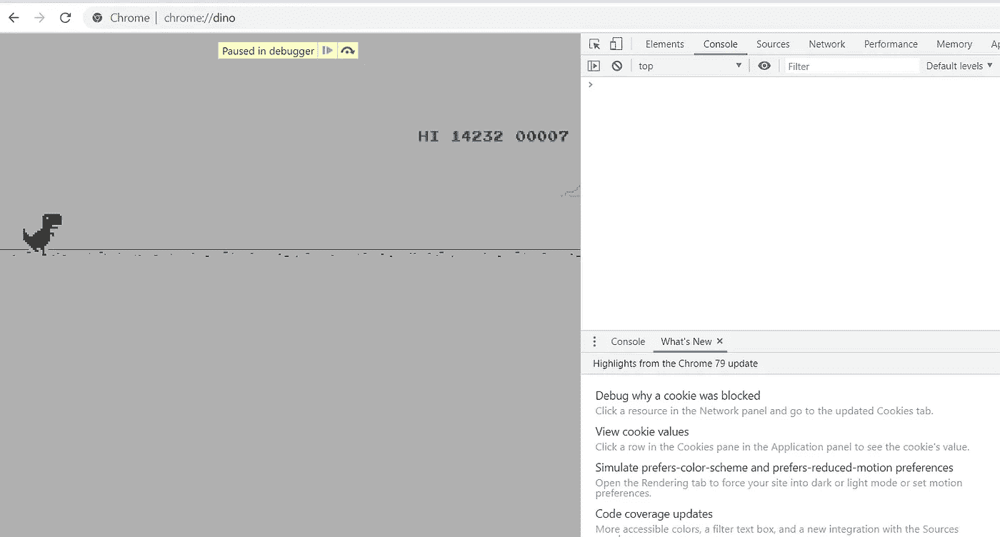
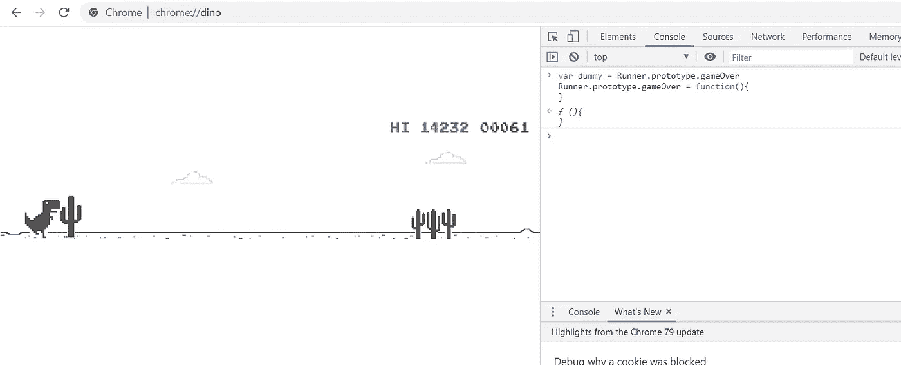

# 从谷歌 Chrome 破解恐龙游戏

> 原文：<https://levelup.gitconnected.com/hacking-the-dino-game-from-google-chrome-b869aa6e8cfc>


作者 GIF

当没有互联网连接时，Windows 和 macOS 上的谷歌 Chrome 浏览器(很可能也在 Linux 上)会显示一个页面，详细说明可能的原因，以及一个小型的无休止的跑步游戏，其中有一只恐龙必须奔跑，躲避障碍，并积累分数。游戏比较头脑简单。一个单色的游戏区，有云、仙人掌、地上的突起、恐龙、高分计数器和当前分数计数器。随着复杂程度的增加，恐龙将不得不躲避仙人掌、翼龙等等。该游戏还在随机点反转对比度，使背景为黑色，生物为白色，以模拟夜间模式，同时吸引玩家对背景变化的注意，使其更难玩一秒钟，这可能会被证明是致命的。

**当您的互联网工作时，您可以从** `**chrome://dino**` **直接访问谷歌的恐龙游戏。**

# 游戏的逻辑

一旦你打开游戏画面，右击并打开检查选项或 CTRL+SHIFT+I。

我们可以看到游戏运行在一个名为“runner-container”的 div 类中。在右边，我们有显示 CSS 的“样式”。有几个“转轮容器”组件。如果我们点击“索引。数字”，我们会看到一个包含调试器的子菜单。我们可以暂停、前进、奔跑等等。让我们重新启动游戏，并使用调试器快速暂停它。太好了！现在它显示“在调试器中暂停”。我们也在调试器上获得了关于游戏的第一点信息。有一个叫“Runner”的功能，里面有很多看起来和游戏逻辑有关的组件。以下是“Runner”函数中的一些组件。在其他东西中，在" **proto** "中你可以看到一个叫做" gameOver()"的函数



作者提供的控制台截图

# 入侵游戏

一旦从菜单中打开“检查元素”选项。转到控制台，写下下面几行。

```
var dummy = Runner.prototype.gameOver
Runner.prototype.gameOver = function(){
}
```

在控制台写好代码后，按回车键，开始游戏。你会注意到，在这一点上，恐龙将能够简单地通过所有的障碍。现在让我们做一些更有趣的事情。



作者图片

## 恐龙速度:

让我们稍微调整一下游戏的速度。为此，我们使用了另一个名为“setSpeed()”的函数，它接受一个数字。通过改变数值，我们可以改变恐龙的速度，从而更快地得分。游戏给你的最高分是 99999 分，然后会重置回 0 分。

在控制台中，我们将编写:

```
Runner.instance_.setSpeed(6000)
```

这将改变恐龙的速度为 6000。您可以使用任何其他号码。

试着将速度写为“-1”它将使恐龙后退，整个游戏场景跟随它的后退运动。LOL。

## 恐龙跳跃极限:

你可以控制恐龙应该跳多高。改变数字，如 10，20，25 等。

在控制台中，我们将编写:

```
Runner.instance_.tRex.setJumpVelocity(10)
```

## 停止游戏:

由于你的游戏不再有碰撞停止机制，它将永远运行。如果你想停止它，你需要再次使用控制台。

为此，我们将在控制台中编写:

```
Runner.prototype.gameOver = dummy
```

当没有互联网连接时，这是一个简单而有趣的方法:)

# 分级编码

感谢您成为我们社区的一员！在你离开之前:

*   📰查看[级编码出版物](https://levelup.gitconnected.com/?utm_source=pub&utm_medium=post)中的更多内容
*   🔔关注我们:[推特](https://twitter.com/gitconnected) | [LinkedIn](https://www.linkedin.com/company/gitconnected) | [时事通讯](https://newsletter.levelup.dev)

🚀👉 [**将像你这样的开发人员安置在顶级创业公司和科技公司**](https://jobs.levelup.dev/talent/welcome?referral=true) 。

[](https://jobs.levelup.dev/talent/welcome?referral=true) [## 升级—转变技术招聘

### 升级—转变技术招聘🔥使软件工程师能够找到完美的角色…

作业. levelup.dev](https://jobs.levelup.dev/talent/welcome?referral=true)