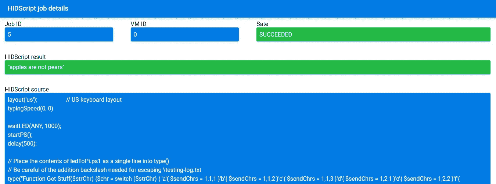

# 用 Raspberry Pi Zero W 黑客攻击

> 原文：<https://levelup.gitconnected.com/hacking-with-the-raspberry-pi-zero-w-8520a4d72b2e>

没有互联网连接…禁用蓝牙和 WiFi…禁用外部媒体存储…硬盘加密…但这不是我们不能从这类机器中检索敏感信息的理由！我将分享的漏洞基于以下行为:

该图显示了在所有连接的键盘之间共享的键盘状态

看看在一个键盘上切换 *Caps Lock* 实际上是如何更新另一个键盘上的状态的——对于 *Scroll Lock* 和 *Num Lock* 也观察到相同的行为。这告诉我们，你的操作系统跟踪这些键盘状态，**输出**到所有连接的键盘设备。很抱歉我是显而易见的队长，但我们通常与键盘的互动也告诉我们，它是一个**输入**设备，将字符输入操作系统。这意味着，只要您的目标笔记本电脑/台式机有一个开放的 USB 端口，允许外部键盘连接，就可以取出数据。总而言之，以下是你需要的:

*   允许通过 USB 连接外部键盘的目标笔记本电脑
*   一个树莓派 Zero W(约 15 美元)，安装了 P4wnP1 A.L.O.A
*   坚持完成这篇文章需要一些耐心

P4wnP1 A.L.O.A(一个小的攻击性设备)为你提供了一个图像，可以将你的 RPi Zero W 转化为一个方便的 pentest/trolling 设备。它有两个重要的功能，1)欺骗目标机器，使其认为这是一个外部键盘，2)广播一个(隐藏的)WiFi 热点/蓝牙连接，允许您在范围内控制它。

RPi 作为键盘提取信息的示意图

上图显示了一个通用流程，说明如何在目标机器上触发一系列击键，以及如何从中检索所需信息。为了增加趣味，本指南将帮助您完成一个概念验证，该验证执行以下操作:

1.  将一个键盘记录脚本注入目标机器，该脚本将击键输出到一个文本文件中
2.  注入第二个脚本，该脚本读取文本文件，将其编码为一系列的 *Num* ， *Scroll* ， *Caps* 按键，然后由 RPi Zero W 解码。

虽然 P4wnP1 A.L.O.A 可以在 Windows、OSX 和 Linux 上运行，但是我们将注入到目标机器中的脚本是 Powershell 脚本。您需要将它们改编成另一种语言，并且确信可以在您的目标机器上执行(例如，Python 已经预装在 OSX 和大多数流行的 Linux 版本中)

# 设置 P4wnP1 A.L.O.A

*   从[官方 A.L.O.A GitHub 发布页面](https://github.com/RoganDawes/P4wnP1_aloa/releases)下载最新图片
*   使用 [Balena Etcher](https://www.balena.io/etcher/) 将图像闪存到 microSD 卡中
*   将 microSD 卡插入 RPi Zero W。确保 microUSB 电缆连接到第二个端口，然后将其插入*目标机器*。

将此 microUSB 端口用于电源和数据供应

*   1-2 分钟后，您的 RPi 应开始广播 WiFi 热点，如下图所示。从*摄魂机*，使用密码`MaMe82-P4wnP1`连接到摄魂机。

RPi 热点的 SSID

*   打开您的浏览器到`http://172.24.0.1:8000`，它为您提供了一个方便的 GUI 来更改任何配置。借此机会隐藏/修改热点 SSID。

# web GUI 快速介绍

首先，让我们看看`USB SETTINGS`选项卡。为了确保您的 RPi 不会被*目标机器*阻塞，请确保在右下面板中仅启用了*键盘*功能。您还应该让您的 RPi 复制您的*目标机器*预期使用的外部键盘的产品描述。毕竟，当用户看到通知说' *P4wnP1 by MaMe82* '已经可以使用时，你不会想让目标机器的用户惊慌😅。快速的谷歌搜索会返回所需的罗技 USB 键盘信息。相关信息更新后，点击`DEPLOY`使更改生效。要让这些设置在启动时运行，`STORE`将其作为一个新的配置文件，并在`GENERIC SETTINGS`选项卡下将其设置为默认值。

P4wnP1 A.L.O.A 的 USB 设置

接下来，我们将关注`HIDSCRIPT`选项卡，在这里我们可以配置要运行的脚本，以及返回的任何结果。花些时间浏览一下 [GitHub 自述文件](https://github.com/RoganDawes/P4wnP1_aloa)，以及默认情况下 A.L.O.A 映像附带的默认脚本——可通过`LOAD & REPLACE`按钮访问。这允许您快速熟悉可供您使用的标准功能。请注意，虽然 HID 脚本是用 JavaScript 编写的，但是 setTimeout、setInterval 甚至 Promises 等方法似乎都不可用。

P4wnP1 A.L.O.A 的 HID 脚本

每当脚本成功运行完成时，它将被附加到右侧面板的“成功”部分。如果您的脚本被编写为返回一个结果，您可以通过点击`i`工具提示来查看详细信息。

单击“I”工具提示查看脚本结果

# 将字符映射到数字、滚动、大写锁定

P4wnP1 将 Num、Scroll 和 Caps Lock 按钮称为一组按键，称为 *LED 按键*。如前所述，我们的目标是利用 LED 按键状态可以输出到键盘的事实，将数据从*目标机器*传输到 RPi。为了容纳所有 26 个小写字母+空格键，我们可以将它们中的每一个映射到 3 个 LED 按键的唯一组合(因为 3 个按键= 27 个按键)。

字符到 LED 按键的映射

根据 A.L.O.A 文档，注意到除了 *Num* 、 *Scroll* 和 *Caps Lock* 之外，`waitLED()`和`waitAnyLED()`函数还返回了 *Compose* 和 *Kana* 的额外 LED 状态。我还没有尝试使用它们，但可能有必要将键盘改为日语布局，以便这两个额外的 LED 键正常工作。如果你真的让它们工作，你可以通过 3 次击键(5 = 125)大幅增加字符数。

# HID 脚本 1:键盘记录器

下面的 Powershell 脚本(改编自[这里是](https://gist.github.com/dasgoll/7ca1c059dd3b3fbc7277))记录了用户输入到桌面上一个名为`testing-log.txt`的文件中的字符。为便于调试，`testing-log.txt`在`CTRL + C`键记录取消后打开。在 Powershell 终端中执行该命令，以验证它是否按预期工作。

键盘记录器 Powershell 脚本

需要做一些额外的工作，因为 Powershell 脚本预计将在目标机器上运行。假设我们的*目标机器*没有任何互联网连接，我们将需要让我们的 RPi 打开 Powershell，并一次一个字符地输入脚本(谢天谢地，这只需要大约 3 秒)。请注意我们是如何在下面的 HID 脚本中将整个 Powershell 脚本压缩成一行(第 11 行)的。一定要警惕需要对特殊字符进行转义，比如`"`和`\`。

用于将键盘记录器 PS 脚本注入*目标机器*的 HID 脚本

# HID 脚本 2:读取文件和启动 LED 键

一旦您觉得键盘记录器有您想要的某些信息，您可以尝试使用第二个脚本获取它。首先，我们将依赖注入的 Powershell 脚本来读取`testing-log.txt`文件，并将每个字符翻译成一系列 LED 按键。同时，HID 脚本(JavaScript 部分)必须准备好响应每个 LED 状态变化，并将这些变化映射回其原始字符。以下是 Powershell 脚本:

用于读取日志文件和触发 LED 按键的 Powershell 脚本

确保您的桌面上有一个包含一些内容的`testing-log.txt`文件(只保留 a-z 和空格字符)。然后，在 Powershell 终端中运行上面的脚本。验证当它对日志文件的内容进行编码并触发 LED 按键时，键盘上的 LED 灯是否会发生变化。

像往常一样，一旦您对结果感到满意，我们就准备将整个 Powershell 脚本折叠成一行，并将其放在一个 HID 脚本中。需要注意的重要一点是我们在上面第 54 行引入 Powershell 脚本的延迟。通过在触发 LED 按键之前允许 3s，我们允许 HID 脚本的 JavaScript 部分正确初始化。这确保了当 LED 按键被触发时，HID 脚本准备好将它们翻译回实际的字符。

HID 脚本，用于注入触发 LED 按键的 Powershell 脚本，并将其解码为字符

# 这个怎么执行？

1.  如果你只有一两分钟的时间，将 RPi 连接到*目标机器*上的 USB 端口。如果是台式机，你有更多的时间，你可以打开机箱，在主板上加一个 USB 接口，把你的 RPi 藏起来。
2.  到达距离目标机器几米以内的地方，将您的手机连接到广播的热点。
3.  当你从你的手机上触发 HID 脚本#1 的时候，分散用户几秒钟的注意力(取消对`hidePS()`的注释，并隐藏日志文件的位置)，这将启动键盘记录程序。
4.  让用户输入一些敏感的东西……“嘿，兄弟，我登录 XYZ 系统有困难。您是否面临同样的问题？”
5.  当你触发 HID 脚本#2 的时候，再次分散用户的注意力。这将对数据进行编码，触发 LED 按键，然后在 RPi 中对其进行解码。
6.  一旦脚本提取了数据，点击`i`工具提示查看提取的内容(例如，在下图中，“苹果不是梨”)。

查看从目标计算机提取的信息

# 结论

只要你的机器不阻塞它的 USB 端口，你就不会安全地避免这种数据泄露。除了这里分享的材料之外，您的 P4wnP1 A.L.O.A 可以作为一个很好的工具来学习 pentesting，因为它是建立在 Kali Linux 之上的。不过，在使用这些工具时一定要小心——学习如何更好地保护自己，与在密友的电脑上钓鱼，与非法/犯罪行为之间有一条细微的界限。

由于本指南中的脚本是用 Powershell 编写的，它们只与 Windows *目标机器*相关。然而，它们可以很容易地适应其他操作系统支持的另一种语言。此外，我认为目前的实施是片状和不完整的。需要做额外的工作来覆盖全部键盘字符(映射功能增强)，以及处理按键发生得太快以至于丢失一些信息的情况(充当分隔符的 LED 按键序列？).

不管你关注这篇文章是为了什么，我希望你喜欢它。黑客快乐！