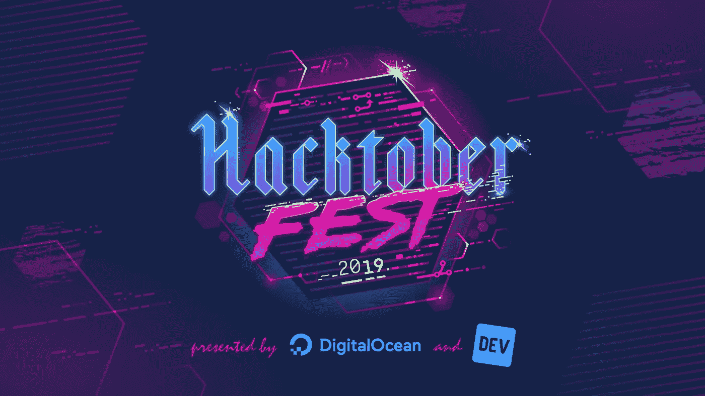
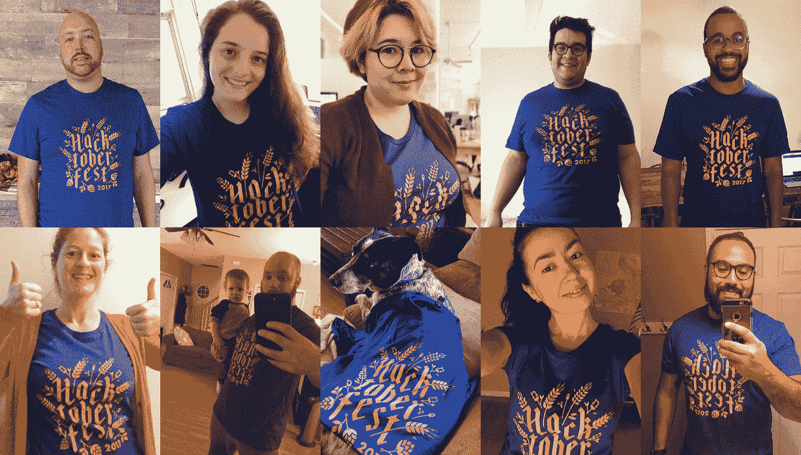

# Hacktoberfest 2019 —通过贡献开源获得免费赠品！

> 原文：<https://levelup.gitconnected.com/hacktoberfest-2019-get-free-swag-by-contributing-to-open-source-6fa2b64c4d55>

## 整个十月，通过开放 Github 项目的拉取请求，你将加入最大的 OSS 节！

又到了一年的这个时候了！第六届 Hacktoberfest 已经开始直播了！为开源社区做出贡献的人是时候获得奖励了。

你知道吗，有很多科技公司会参加 Hacktoberfest，并赠送甜蜜的礼物。

# 什么是 Hacktoberfest？

Hacktoberfest 是为开源软件举办的长达一个月的庆典。它始于[数字海洋](https://hacktoberfest.digitalocean.com)，作为一种培养社区意识和鼓励更多人参与开源项目的方式。

为了奖励 Hacktoberfest 的贡献者， [DigitalOcean](https://hacktoberfest.digitalocean.com) 为每年完成挑战的人设计了一件限量版 t 恤。今年，前 50，000 名参与者将有资格获得限量版衬衫。

# 我为什么要加入？

您可以帮助推动开源的发展，并为一个每年呈指数增长的社区做出积极的贡献！

你将会学到一些东西，比如对你的拉式请求进行代码审查，并且你将会遇见和了解那些每天都在你喜欢和使用的 OSS 项目上工作的新人！

来自[https://hacktoberfest . digital ocean . com/details # participation-rules](https://medium.com/u/8df3bf3c40ae#participation-rules)阅读更多关于所有[规则](https://hacktoberfest.digitalocean.com/details#participation-rules) [的详情](https://hacktoberfest.digitalocean.com/details#participation-rules)

# 资源和参考资料

*   [https://hacktoberfestswaglist.com](https://hacktoberfestswaglist.com/)
*   [https://blog . digital ocean . com/hacktoberfest-is-back-for-year-six/](https://blog.digitalocean.com/hacktoberfest-is-back-for-year-six/)
*   [https://hacktoberfest . digital ocean . com/details #参与规则](https://hacktoberfest.digitalocean.com/details#participation-rules)