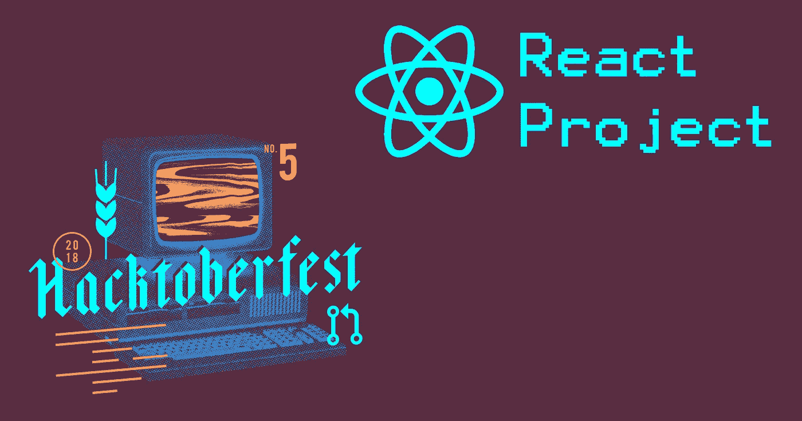

# Hacktoberfest 中途检查点—继续编码！

> 原文：<https://levelup.gitconnected.com/hacktoberfest-midway-checkpoint-keep-on-coding-e5f5c4b15379>

Hacktoberfest 已经过半，还有大把时间投稿！如果你想赢得 t 恤并为开源技术做贡献，Hacktoberfest 还剩 15 天。以 Hacktoberfest 为起点，推动自己成为一名更好的开发人员，并全年为开源做出贡献。

如果您还没有机会，请访问 gitconnected Hacktoberfest 页面:

 [## Hacktoberfest 2018 | gitconnected

### 与其他开发人员联系，建立一个 Hacktoberfest 项目。创建一个黑客新闻克隆(在夜间模式！).跟随…

gitconnected.com](https://gitconnected.com/hacktoberfest) 

## **跟随教程**

使用 React、Redux 和 Styled 组件从头构建一个黑客新闻克隆。使用 GitHub 页面将项目部署到生产环境中。

 [## React & Redux 教程-构建一个黑客新闻克隆

### 这是 gitconnected Hacktoberfest 项目的分步解决方案。在本教程中，我们将建立一个…

gitconnected.com](https://gitconnected.com/courses/learn-react-redux-tutorial-build-a-hacker-news-clone) 

## 下载 Chrome 扩展

查看项目运行情况，或在夜间模式下通过图片关注黑客新闻。

 [## 黑客新闻

### 黑客新闻给你的新标签。夜间模式或白天模式(就像你的 IDE 一样)。带有图像或经典 HN 列表的卡片视图…

chrome.google.com](https://chrome.google.com/webstore/detail/hacker-news/hknoigmfpgfdkccnkbfbjfnocoegoefe) 

## 查看源代码

GitHub 上的开源。

 [## git connected/黑客-新闻-阅读器

### Hacktoberfest 项目构建黑客新闻克隆-git connected/Hacker-News-reader

github.com](https://github.com/gitconnected/hacker-news-reader) 

## YouTube 教程播放列表

使用这个截屏视频，从开始项目到将其部署到生产环境。

## 学习编码

学习任何编程语言或框架。

 [## 最佳编码课程和教程-学习编码| gitconnected

### 通过我们完整的编码资源列表，成为更好的开发人员并提高您的编码技能。我们分享…

gitconnected.com](https://gitconnected.com/learn) 

继续往前推，继续编码。如果你需要帮助或者想找编码伙伴，加入[git connected Slack](https://community.gitconnected.com)# hack toberfest 频道。继续编码！