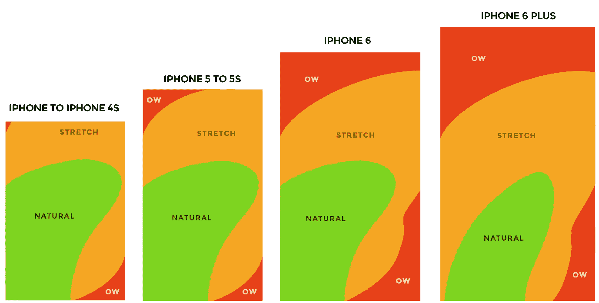

# 汉堡菜单——对易访问性和 UX 设计原则的挑战？

> 原文：<https://levelup.gitconnected.com/hamburger-menus-a-challenge-to-accessibility-and-ux-design-principles-697ccec0ee63>

## 汉堡好吃吗？绝对的。易接近？没有那么多。

动画由[奥列格](https://dribbble.com/shots/2148679-Icon-Transition-Kit)对[运球](https://dribbble.com/search/hamburger%20menu%20icon)

我最近在为一个客户设计一份汉堡菜单，在我意识到之前，我已经开始了这段旅程，我阅读了一篇又一篇关于伴随汉堡图标的可访问性问题的文章。原来，这些在 1981 年 [*通过 Norm Cox*](https://en.wikipedia.org/wiki/Hamburger_button) 进入用户界面设计世界的菜单图标，是最受欢迎的导航栏组件中有争议的一个。引起我兴趣的一件事是，尽管是如此严格审查的目标，汉堡包仍然被谷歌和微软等公司广泛用于导航栏和标题中。

在我们讨论为什么这三种危险的堆叠线如此深地嵌入网络世界之前，让我们看看它们的缺陷。

## 1.它们对用户隐藏了重要的信息。

一个被广泛接受的设计原则是，用户在浏览网络/移动应用时，应该拥有他们需要的所有信息。据[苹果 UX 传道者麦克·史登](https://medium.com/design-philosophies/apple-and-hamburgers-a17e4099fada)，

> “记住，直观导航系统的两个关键点是，它们会告诉你你在哪里，还会告诉你可以去哪里。”
> 
> “汉堡菜单在这两方面都很糟糕，因为菜单不在屏幕上。看不出来。只有显示菜单的按钮是。

哦，讽刺的是，斯特恩先生。苹果是一个使用汉堡图标的粉丝，与众不同。说到要点，hamburger 与用户友好性背道而驰，因为它需要两次点击才能导航到一个屏幕，而传统链接只需要一次。那也是，没有向用户显示他们正在导航到什么。

## 2.他们的位置在触摸屏上不太容易触及

你有没有发现自己躺在床上，手里的手机放在脸上方，当你试图用拇指够到最左边的角落时，你意识到这是一个错误，但现在已经太晚了，因为手机已经从你手中滑落，打在了你的脸上。如果你没有，那么相信我，没有什么比 iPhone SE 的经典方形边缘更疼的了。对我来说，要么是后退按钮，要么是汉堡图标，让我想起了那些时刻。

理解包含任何手机应用程序中最重要的按钮的组件应该是最容易够到的，这一点非常重要，这与汉堡图标的情况不同。根据一项关于触摸屏 不同部分的相对易用性的 [*研究，汉堡包图标是最容易触及的，因为它们通常出现在屏幕的左上角或右上角。*](https://www.scotthurff.com/posts/how-to-design-for-thumbs-in-the-era-of-huge-screens/)

汉堡包位于现代触摸屏的“ow”部分。[照片由斯科特·赫尔夫拍摄](https://www.scotthurff.com/posts/how-to-design-for-thumbs-in-the-era-of-huge-screens/)。

随着现代手机变得越来越大，汉堡图标被进一步推离“自然”区，进入“低”区。这可能是一个微妙的方面，但在有许多标签和复杂层次结构的大型应用程序中，每次用户必须向后或向前导航一个屏幕时点击汉堡图标会令人沮丧。

如果任何其他网页设计组件有这些缺点，它会被更容易使用的替代方案所取代。那么，为什么汉堡包图标已经成为响应应用程序和网站的一个几乎必不可少的部分呢？

## 1.他们的受欢迎程度超过了所有的担忧。

汉堡图标已经使用了大约四十年，为设计师和用户所熟知，它们可以作为独立的组件，而不需要任何额外的标签，如“菜单”标签。这样的受欢迎程度反驳了麦克·史登的论点，因为用户不需要知道汉堡包图标后面是什么。三条线堆叠在一起的图像立即向用户传达了一个想法，即它包含了应用程序/网站不同部分的链接。

## 2.多功能性是无止境的。

谷歌在 chrome 设置中使用了一个汉堡图标，在 gmail 和其他服务中也是如此。苹果和微软用它来指向较小屏幕上的导航栏链接。坦率地说，汉堡包图标就像你硬盘里的“杂项”文件夹。任何东西都可以进去。最重要的是，它节省了空间，这在“小屏幕”生态系统中是非常重要的。

我喜欢制作汉堡图标动画吗？是的。你可以旋转三条线的方式是无限的。但是，当我不得不打开它才能看到联系页面时，我会感到沮丧吗？一点点。从开发者的角度来看，这取决于你希望你的网站达到什么样的效果。如果你试图追求极简设计或者受到小屏幕的限制，那么实现汉堡图标会牺牲可访问性。然而，如果你坚信用户友好高于一切，那么你可以在你的应用中使用更好的选择*。*

## *资源:*

1.  *[麦克·史登关于汉堡包图标的完整谈话。](https://medium.com/design-philosophies/apple-and-hamburgers-a17e4099fada)*
2.  *[汉堡菜单的替代品。](https://uxplanet.org/alternatives-of-hamburger-menu-a8b0459bf994)*