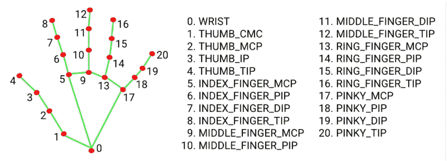
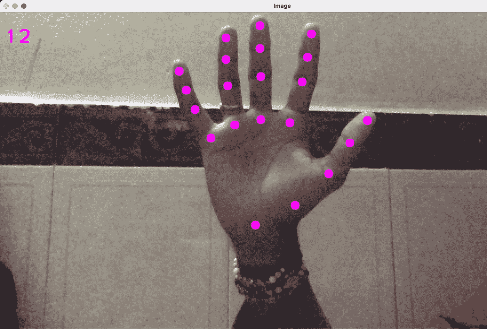
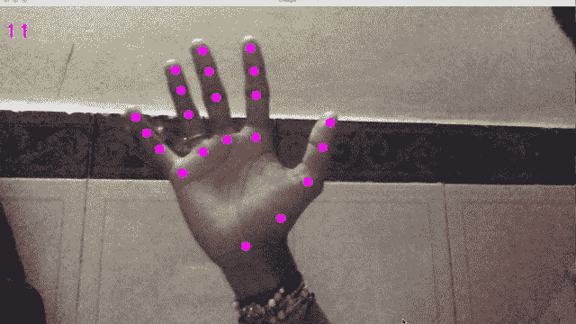
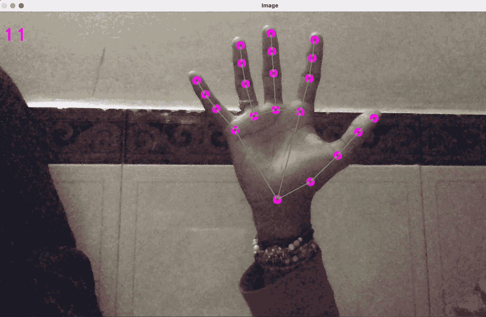
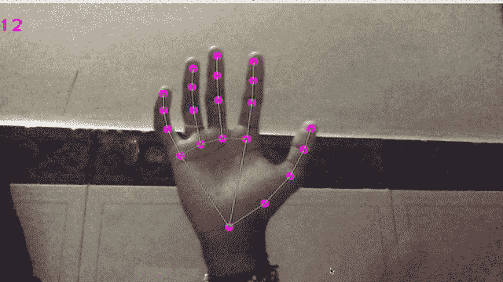

# 如何用 Python 制作手部跟踪模块

> 原文：<https://levelup.gitconnected.com/hand-tracking-module-using-python-eb27c8772664>

仅仅通过在空中挥动你的手就能让不同的事情发生，这有多好？这种神奇的力量可以比作拥有你的设备网络，就像钢铁侠指挥他的人工智能系统网络一样。如果你为自己创造一个不是很好吗？

嗯，追踪你的手是你需要做的第一步。在本文中，我们将创建我们的实时手跟踪模块来检测我们的手和估计界标。

# 我们开始吧

信不信由你，如果你在计算机视觉领域工作，你肯定用过 OpenCV 库，或者如果你是初学者，你至少见过这个库。你猜怎么着？我们将在我们的项目中使用这个库。OpenCV 将帮助我们访问网络摄像头。如果您不知道如何使用 OpenCV 库，请不要担心。我会解释每一行代码。对于手和界标估计，我们将使用 Mediapipe。

# 什么是 Mediapipe？🤔

Mediapipe 是 Google 开发的机器学习框架。它是开源的，并且是轻量级的。Mediapipe 提供了很多 ML 解决方案 API，比如人脸检测，人脸网格，虹膜，手，姿势，还有很多。点击查看更多关于 Mediapipe [的信息。](https://google.github.io/mediapipe/)

在这个项目中，我们将使用 Mediapipe 的**双手地标模型。**



图 1: [Mediapip 双手地标模型](https://google.github.io/mediapipe/solutions/hands.html)

让我们从一些基本代码开始

```
1\. import cv2
2\. import mediapipe as mp3\. cap = cv2.VideoCapture(0) 
4\. mp_hands = mp.solutions.hands
5\. hands = mp_hands.Hands()
6\. mp_draw = mp.solutions.drawing_utils
```

如果你不熟悉 OpenCV，让我帮助你理解上面的代码。我们导入了两个库，这是我们项目的一个依赖项。在 3 号线上，我们正在访问我们系统的网络摄像头。Mediapipe 提供了手动模块 API，我们正在 4 号线上访问它们。我们正在第 5 行创建类 ***Hands*** 的对象。 ***Hands()*** 类的构造函数有一些可选参数，如， ***static_image_mode、max_num_hands、min_detection_confidence 和 min_tracking_confidence。*** 为了这个项目，我们不打算使用它们中的任何一个，但是你可以根据你的项目需要来配置它们。还有关于 ***mp_draw*** 你一会儿就知道了。

# 探测手

我们正在通过类 ***VideoCapture()*** 提供的 ***cap.read()*** 方法读取第 12 行的网络摄像头中的帧。我们将把网络摄像头捕捉到的图像(帧)转换成 RGB。等等，Jiten，为什么我们要把图像转换成 RGB 图像？我看过大部分教程，也读过大部分文章，但是没有人真正解释我们为什么要这么做？但别担心，我会解释给你听。我们这样做的原因是，当 OpenCV 在许多年前首次被开发时，读取图像的标准是 BGR 顺序。多年来，标准现在已经变成了 RGB，但是 OpenCV 仍然保持这种**BGR 顺序，以确保现有代码不被破坏。**

**接下来，我们在一个***hand . process()***方法(第 14 行)的帮助下检测帧中的手。一旦检测到手，我们进一步定位关键点(图 1)，然后高亮显示关键点中的点。我们检查用户是否在网络摄像头上展示他/她的手(第 17 行)。如果是，那么我们必须捕捉用户的手的标志。我们循环手部标志(第 19–22 行),并在检测到的关键点上画圈。**

****

**作者图片**

****

**作者 GIF**

**还记得我们访问 Mediapipe 的绘图工具 API，我告诉过你以后再解释吗？media pipe***drawing _ utils***提供了一个名为***draw _ landmarks()***的方法，帮助我们将检测到的点(关键点)连接起来。最后但同样重要的是，我们必须向用户显示最终的输出、最终的图像，这就是 ***cv2.imshow()*** 方法派上用场的地方。我们已经将整个手部跟踪代码包装到一个 while 循环中。这是一个无限循环。我们之所以将整个代码包装成一个无限循环，是因为这是一个连续的过程。每当网络摄像头捕捉到一帧，我们就必须处理该帧(图像)，检测帧中的手，检测手上的关键点，并连接关键点。那么，我们如何打破这个无限循环呢？在第 26 行，我们检查用户是否按下了**“q”**，然后我们退出循环。**

# **最终输出**

****

**作者图片**

****

**作者 GIF**

**谢谢你来这里！我很欣赏你。这个项目的代码可以在我的 [Github](https://github.com/TheBoy-WhoCode/handtracker) 上找到。如果你喜欢它，别忘了在 Github 上给它一个⭐️星，如果你喜欢这篇文章，别忘了给一个赞赏的手势(鼓掌)👏。**

**在 [**LinkedIn**](https://www.linkedin.com/in/jiten-patel-jp/) **，** [**Twitter**](https://twitter.com/thejitenpatel) **，**&[**insta gram**](https://www.instagram.com/thejitenpatel/)上与我联系**

****快乐编码😄****