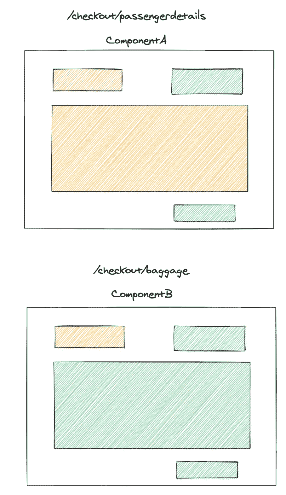
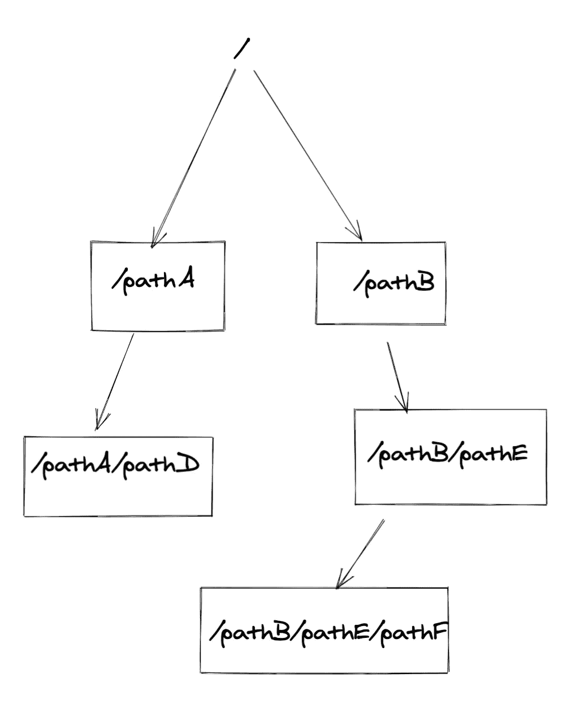
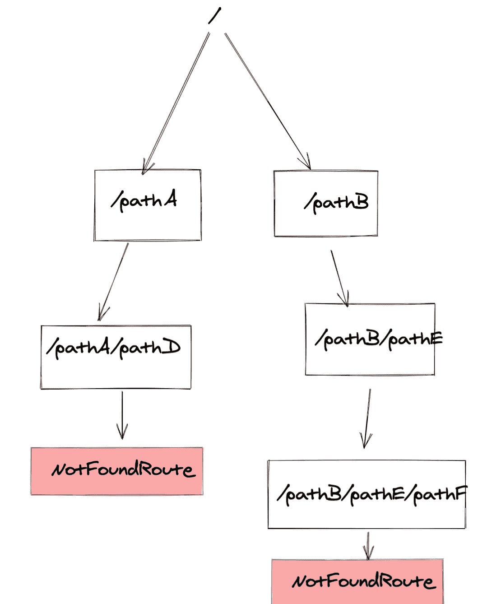

# react-router 中嵌套路由的 404 页处理

> 原文：<https://levelup.gitconnected.com/handle-404-pages-for-nested-routes-in-react-router-2b31572a5b2f>


埃里克·麦克林在 [Unsplash](https://unsplash.com?utm_source=medium&utm_medium=referral) 上的照片

React 路由器是 React 社区中使用最多的路由器之一。

它允许我们以嵌套的形式写“路线”。路由只不过是反应组件。当我们想要基于条件显示页面的子部分时，嵌套路由有优势。嵌套路由还会导致更少的重新装载，因为只有嵌套路由的内容会再次装载。

**我们为什么需要嵌套路由**

假设我们有这样一个路线系统:

```
<Router><Route path="/checkout/passengerdetails"><ComponentA /></Route><Route path="/checkout/baggage"><ComponentB /></Route></Router>
```



现在，如果我们没有嵌套路由，整个“ComponentA”将被卸载，而“ComponentB”将被装载。

# 这样好吗？

嗯，是你对性能的热爱超过了对写作的轻松程度。我可以肯定地说，这种写路线的方式既简单又直接。

但是这种路由存在什么问题呢？

在上面的图中，我给了组件颜色，请注意两条路线之间的公共颜色框。两条路线之间只有中间部分发生了变化。

从“/checkout/passengerdetails”到“/ check out/laugh”的路线改变导致所有组件的完全卸载，即使对于不需要随着路线改变的组件也是如此。

这正是嵌套路由非常有用的情况。

我们可以通过编写如下路径来防止卸载整个页面:

```
function SomeComponent() {
  return (
    <>
      <CommonUI />
      <Switch>
        <Route path="passengerdetails">
          <PassengerDetails />
        </Route>
        <Route path="baggage">
          <Baggage />
        </Route>
      </Switch>
      <Footer />
    </>
  );
}function App() {
  return (
    <Router>
      <Route path="/checkout">
        <SomeComponent />
      </Route>
    </Router>
  );
}
```

注意，在上面的例子中，当路由改变时,‘common ui’和‘footer’不会卸载。

这是嵌套路由可以实现的简单要点。

# **嵌套路由挑战**

嵌套路由的主要挑战之一是处理“未找到”页面。现在，由于路由是嵌套的，所以没有一个位置来保存“未找到”路由。您必须将未找到的路由放在嵌套路由的最末端。

见下图了解更多。

假设我们目前有以下路由结构。



现在，让我们假设我们点击了类似如下的 URL:


如果没有匹配的路由，您将如何处理这些路由以显示 404 自定义屏幕？

您可以在树形图中的每个分支的末尾添加“NotFound”组件。下图展示了:



这种解决方案可以工作，但它不是最好的，因为它有一个主要缺点:

你引入的任何新的路线分支，你都必须在最后加上“没有找到”的成分。所以表面积越大，出错的机会就越多。

> **我们能做些什么来解决这个问题？。我们的目标如下:**

1.一种集中处理 404 页的方式。

2.应该不需要手动添加“未找到”路线。

## **解决方案**

如果我们能编写一个自定义的`自定义开关'组件，在每个路由分支的末尾自动添加一个`未找到'路由，我们就能做到这一点。因此，我们将在任何地方使用“自定义开关”,而不是 react-router-dom 中的“开关”组件

这个简单的组件将如下所示:

```
import { Switch, useRouteMatch } from "react-router-dom";function NotFoundPage({ CustomNotFoundPage }) {
  const history = useHistory();
  useEffect(() => {
    history.push("/notfoundpage");
  }, []);
  return null;
}function CustomSwitch(props) {
  const { children } = props;
  return (
    <Switch>
      {children}
      <NotFoundPage />
    </Switch>
  );
}
```

以及在我们的应用程序中所有路由的顶部的“未找到”路由。最好是你渲染基本路线的地方。

您还可以在组件中使用“useRouteMatch”来检查是否呈现“未找到”。

## **总结一下:**

CustomSwitch 将在每个“Switch”块的末尾添加“Notfound”路由。无需手动添加未找到的路线。由于我们在 NotFound 组件中编写的逻辑，无论何时呈现一个 Not found 组件，它都将重定向到“/notfoundpage”

以下是示例的 codesandbox 链接:

如果我们在同一级别上有两个“CustomSwitch”组件会怎么样？那么第一个“自定义开关”可能会把你扔到“未找到”页面。但是这个场景，我在做应用的时候从来没有遇到过。为了清楚起见，在这里指出来。

目前就这些。当我写这篇文章的时候，有一个我可以想到的解决方法。

谢谢，请在评论中告诉我你喜欢什么，不喜欢什么。