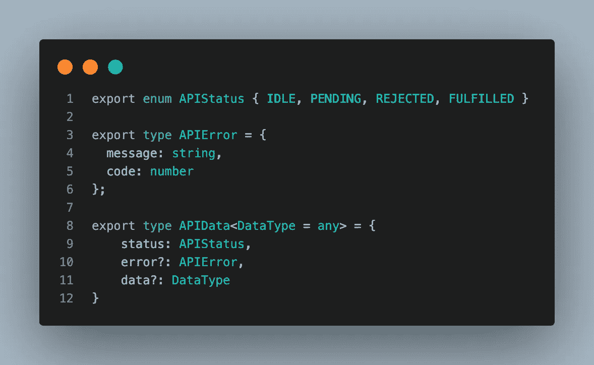
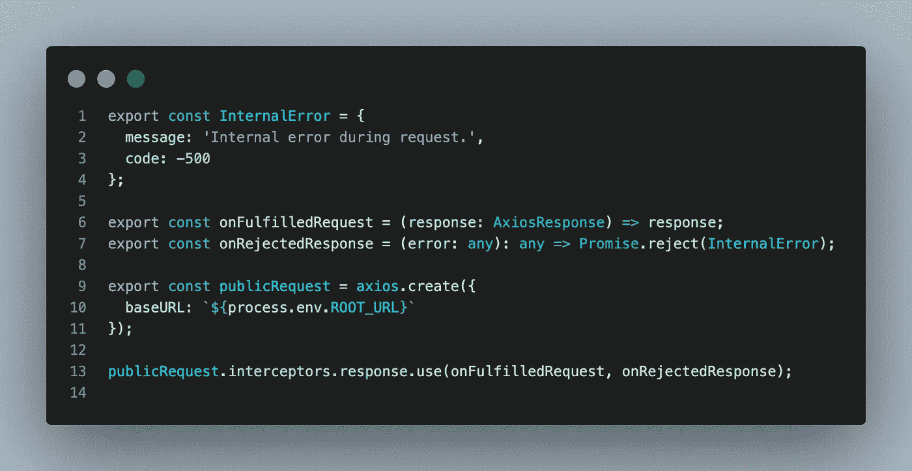
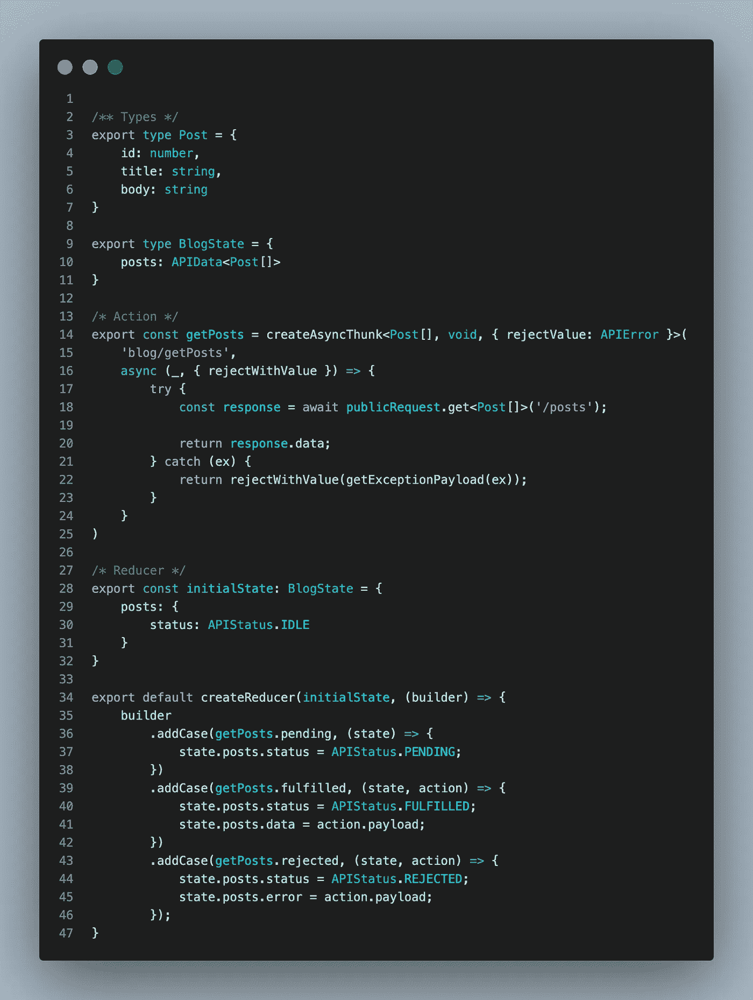
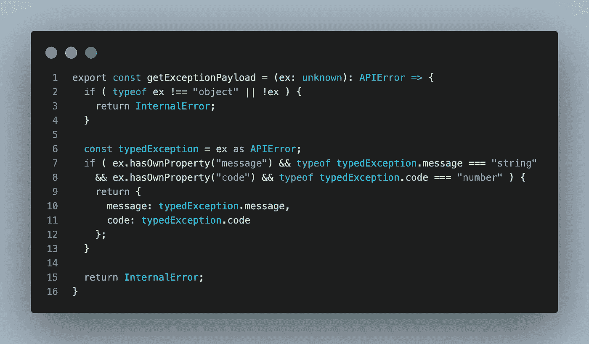
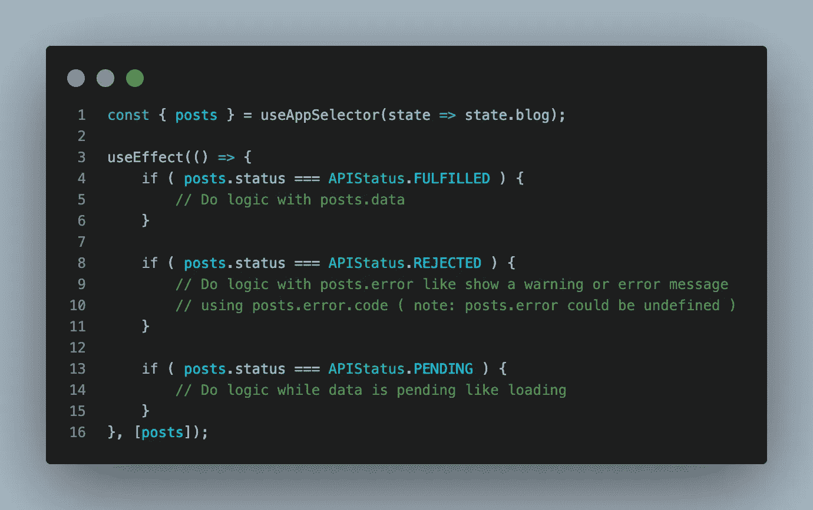
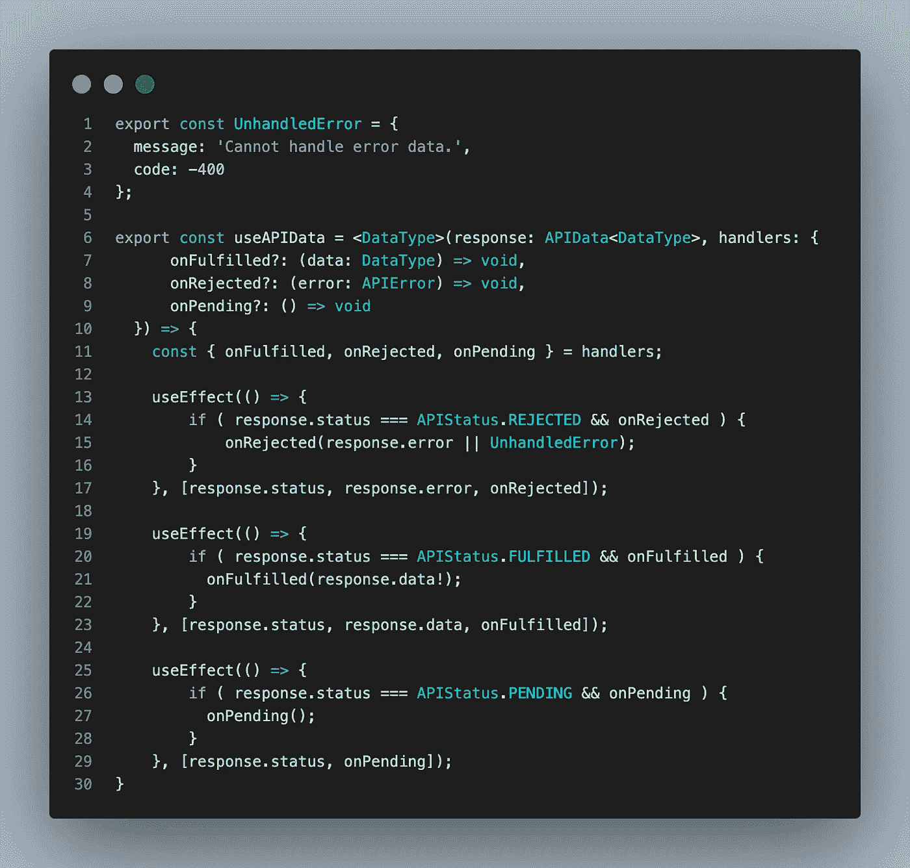
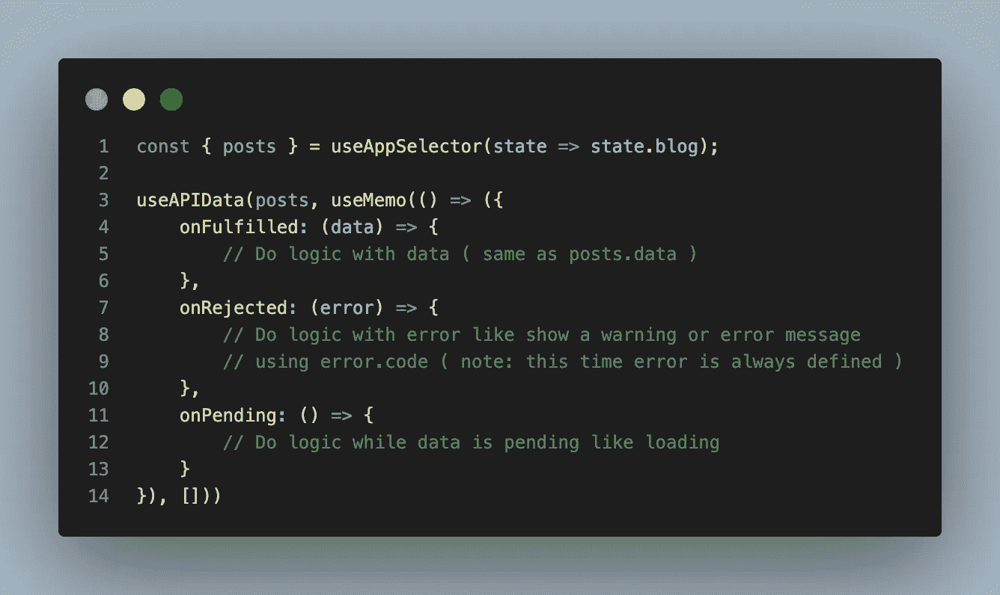

# 利用 React、Axios 和 Redux 工具包处理 API 生命周期

> 原文：<https://levelup.gitconnected.com/handle-api-lifecycle-with-react-axios-and-redux-toolkit-1212645a6a06>

大家好，这一次我想和大家分享一下我在 React 项目中处理 API 请求的方法，并获得反馈。

上下文是一个用[类型脚本](https://www.typescriptlang.org/)编写的 [React](https://reactjs.org/) 项目，其中我们有一个使用 [Redux 工具包](https://redux-toolkit.js.org/)处理的商店和由 [Axios](https://axios-http.com/) 管理的 API 请求。根据当前组件，我们必须根据检索到的数据执行不同的操作，并定义一个公共接口来访问交换的数据。

> 如果你想要一个更“捆绑”的解决方案，Redux Toolkit 已经提供了 [**RTK 查询**](https://redux-toolkit.js.org/tutorials/rtk-query) 实用程序。

很好，现在我们可以开始编码了。我们知道每个请求可能处于四种状态:

1.  **空闲:**请求未发送，因此我们没有数据和错误
2.  **待定:**请求已发送，但我们还没有数据和错误。
3.  **已完成:**请求已发送，我们已收到数据。
4.  **拒绝:**请求已发送，但出现问题。

下一步是知道如果请求被拒绝，如何处理错误。也许我们可以有一条消息和一个代码来标识错误类型。

有了这两个步骤，我们就有了处理所有请求的通用结构:

现在我们必须使用拦截器设置至少一个 axios 实例，以正确处理数据。对于这个例子，我们将创建一个没有自定义头或奇怪逻辑的通用实例。如果请求失败时服务器返回一个已定义的响应(如 APIError 类型),这将非常有用。

> 如果一个请求在没有任何有效主体的情况下失败，就会引入*内部错误*。

此时，我们可以构建 redux 部分来处理请求及其响应。因此，我们必须定义状态、减速器和动作:

函数 *getExceptionPayload* 将异常转换为 APIError 类型。如果异常是由 axios 抛出的，我们可以读取 API 响应，否则，如果异常是由我们的逻辑引起的，我们可以设置一个自定义错误。

现在有了所有的工具来分派动作、处理结果，并将数据分布到连接到商店的所有组件上。但是..如何在组件内部管理它？

第一种方法可以是处理 [useEffect](https://it.reactjs.org/docs/hooks-reference.html#useeffect) 钩子中的数据(一次全部处理，或者每个状态一个钩子，其中有逻辑要执行)

第二种方法是创建一个自定义挂钩，以降低检查每个状态和处理所有相关类型的代码复杂性:

上面的钩子保留了 API 中定义的类型，并为每个状态直接提供了可用的数据。第一个参数是使用的 APIData 对象，第二个参数是我们可以为每个状态定义回调的对象(如果现在有 commons logics，我们可以直接在多个 API 中重用同一个回调)。

> 如果第二个参数对象是在我们的组件中内联定义的，我们需要将它包装在 [useMemo](https://it.reactjs.org/docs/hooks-reference.html#usememo) 回调中，否则，对于每个渲染周期，[对象将改变](https://javascript.info/object-copy)再次触发事件。

下面的代码与之前使用的逻辑相同，但带有 *useAPIData 挂钩*:

在这种情况下，我将对象内联以显示 useMemo hook 的用法，但是，如果不依赖于其他组件的变量，最好在组件外部定义它。

就这样，我跳过了一些关于 hook，redux 和 axios 的概念，但是我在这篇文章中链接了所有这些的网站或文档:)

谢谢你，并祝你有一个可怕的编码之旅！