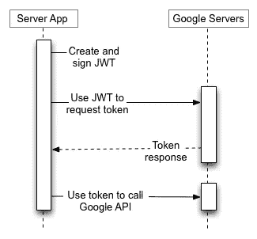

# 在 Golang 中为云功能客户端处理认证

> 原文：<https://levelup.gitconnected.com/handle-authentication-for-cloud-function-client-in-golang-9337b20f9650>

***注*** *:我为此发布了一个开源库*[*go-cloud function-auth*](https://github.com/CodeLinkIO/go-cloudfunction-auth)*。如果你遇到同样的需求，你可以直接使用这个库(见示例* [*此处*](https://github.com/CodeLinkIO/go-cloudfunction-auth/blob/master/samples/main.go) *)。在这篇文章中，我将更多地谈论我是如何调查和解决这个问题的。*

几周前，我需要将我的后端与部署在云功能上的另一项服务相集成。最初，我认为这种集成应该是直接的，因为我的后端和新服务都是由谷歌的服务支持的。使用我的谷歌服务账户认证云功能应该很简单。

这个假设对于 Javascript 是正确的。google-auth-library 很好地支持了这种情况。下面的 JS 代码运行良好:

```
const {GoogleAuth} = require('google-auth-library');

const targetAudience = "cloud-function-url"

async function run() {
	const auth = new GoogleAuth();

	const client = await auth.getIdTokenClient(targetAudience);
	const res = await client.request({ url });
	console.info(res.data);
}
```

# 它不起作用！

google 在 Golang 也有 [OAuth2](https://godoc.org/golang.org/x/oauth2) 库，其中包含支持 Google 服务认证的子包 [google](https://godoc.org/golang.org/x/oauth2/google) 。读了一会儿文档后，我想到了下面的代码。但是好像不管用…

```
import	"golang.org/x/oauth2/google"
func getToken() (err error) {
    scope := "https://www.googleapis.com/auth/cloud-platform"
    client, err := google.DefaultClient(context.Background(), scope)
    if err != nil {
    	return
    }
    res, err := client.Get("cloud-function-url")
    if err != nil {
	    return
    }
    fmt.Println(res)
    return
}
```

与 Nodejs 代码相比，我认为上面的代码缺少了`targetAudience` param，而它可能是一个强制参数。嗯，有道理。过了一会儿，我深入研究了这个库，以这段代码结束。还是不行！

```
baseUrl := "your-cloudfunction-baseurl"
ctx := context.Background()
targetAudience := baseUrl
credentials, err := google.FindDefaultCredentials(ctx)
if err != nil {
	fmt.Printf("cannot get credentials: %v", err)
	os.Exit(1)
}

tokenSrc, err := google.JWTAccessTokenSourceFromJSON(credentials.JSON, targetAudience)
if err != nil {
	fmt.Printf("cannot create jwt source: %v", err)
	os.Exit(1)
}

client := oauth2.NewClient(context.Background(), tokenSrc)
if err != nil {
	return
}
res, err := client.Get(baseUrl + "sub-url")
if err != nil {
	return
}
```

经过一段时间的反复检查，以确保服务帐户在我的本地环境中设置正确，我知道这一部分可能比我预期的要长得多。我需要深入研究 OAuth2 代码。

# 调查

由于我的 Nodejs 代码已经运行，我开始比较双方生成的 JWT 令牌。下面是来自 GCP 的 JWT 令牌的结构，它允许我验证云函数调用:

```
{
 alg: "RS256",
 kid: "...",
 typ: "JWT"
}.
{
 aud: "<my cloud function base url>",
 azp: "<my service account email>",
 email: "<my service account email>",
 email_verified: true,
 exp: <time>,
 iat: <time>,
 iss: "https://accounts.google.com",
 sub: "<a string of digits>"
}.
[signature]
```

这是我从 Golang 代码中收到的 JWT:

```
{
 alg: "RS256",
 kid: "...",
 typ: "JWT"
}.
{
 iss: "<my service account email>",
 aud: "<my cloud function base url>",
 exp: <time>,
 iat: <time>,
 sub: "<my service account email>"
}.
[signature]
```

结构差别很大。但至少我找到了一丝光亮。无效登录可能是由于 JWT 的结构无效。我开始实现 google 库的修改版本，按照我的 Nodejs 输出来改变 JWT 结构。

经过一段时间的编码，我使输出结构匹配。可惜还是不行。这里有什么问题？我感到很失落。过了一会儿，似乎最好离开 IDE，去拿我的咖啡。

这个问题似乎比我想象的更复杂。我决定深入研究谷歌的 [OAuth2 协议](https://developers.google.com/identity/protocols/oauth2/service-account)。授权流程有两个主要步骤，如下图所示:



在这个流中生成了两个不同的 jwt。第一个由客户端代码创建和签名，而第二个由 Google 的服务器生成。Google 返回的 JWT 应该是最后一个，并附加到 HTTP 客户端的请求头中。Nodejs 库也是如此。当我添加了一个断点来跟随它的执行流时，我可以看到它生成了一个签名的 JWT，调用 Google，并为以后的请求捕获响应的 JWT。

Golang 图书馆没有。它产生一个 JWT 并直接使用这个值。这个流程可能适用于 Google 的其他产品，其中 Google API 接受从我们的服务帐户生成的令牌。另一方面，我的云函数是一个自定义 API，需要来自谷歌的签名 JWT。

至此，我可以解决 Golang 库的两个问题:

*   它没有遵循 Google 的 OAuth2 流程。虽然这种实现可能适用于其他服务，但它不适用于云功能。
*   Golang 库的输出 JWT 的结构与 Nodejs 库生成的第一个 JWT 不匹配。为此，我需要一些自定义代码。

# 解决办法

调查是正确的。我设法让我的自定义代码工作。以下是我所做的总结:

*   在本地生成并签署 JWT。令牌应该包括`audience`字段，该字段设置为我们的云函数的基本 URL。
*   将这个 JWT 发送到 Google，遵循他们的规范，从响应中分离返回的令牌。
*   将这个最后的令牌附加到所有 HTTP 客户端的头部

以下是我的代码的一些主要部分:

```
const GOOGLE_TOKEN_URL = "https://oauth2.googleapis.com/token"

func JWTAccessTokenSourceFromJSON(jsonKey []byte, audience string) (oauth2.TokenSource, error) {
	cfg, err := google.JWTConfigFromJSON(jsonKey)
	if err != nil {
		return nil, fmt.Errorf("google: could not parse JSON key: %v", err)
	}
	pk, err := internal.ParseKey(cfg.PrivateKey)
	if err != nil {
		return nil, fmt.Errorf("google: could not parse key: %v", err)
	}
	ts := &jwtAccessTokenSource{
		email:    cfg.Email,
		audience: audience,
		pk:       pk,
		pkID:     cfg.PrivateKeyID,
	}
	tok, err := ts.Token()
	if err != nil {
		return nil, err
	}
	return oauth2.ReuseTokenSource(tok, ts), nil
}

type TokenResponse struct {
	IdToken string `json:"id_token"`
}

func Authenticate(tokenSource oauth2.TokenSource) (token oauth2.Token, err error) {
	jwt, err := tokenSource.Token()
	if err != nil {
		return
	}

	client := &http.Client{Timeout: time.Second * 10}
	payload := strings.NewReader("grant_type=urn%3Aietf%3Aparams%3Aoauth%3Agrant-type%3Ajwt-bearer&assertion=" + jwt.AccessToken)
	req, _ := http.NewRequest("POST", GOOGLE_TOKEN_URL, payload)
	req.Header.Add("Content-Type", "application/x-www-form-urlencoded")
	res, err := client.Do(req)
	if err != nil {
		return
	}
	defer res.Body.Close()
	body, err := ioutil.ReadAll(res.Body)
	if err != nil {
		return
	}
	tokenRes := &TokenResponse{}
	err = json.Unmarshal(body, tokenRes)
	if err != nil {
		fmt.Println(err.Error())
	}
	token = oauth2.Token{
		AccessToken: tokenRes.IdToken,
	}
	return
}

func NewClient(jwtSource oauth2.TokenSource) *http.Client {
	token, err := Authenticate(jwtSource)
	if err != nil {
		fmt.Printf("cannot authenticate with google: %v", err)
		os.Exit(1)
	}

	return &http.Client{
		Transport: &oauth2.Transport{
			Base: http.DefaultClient.Transport,
			Source: &googleTokenSource{
				GoogleToken: &token,
			},
		},
	}
}
```

# 结论

这一部分比我计划的要长得多。由于我与 Nodejs 的其他集成运行得相当顺利，我认为它与 Golang 的集成也会很简单，特别是当 Golang 是 Google 的语言时。令人惊讶的是，我在网上找不到任何好的文档或对话。

从积极的一面来看，深入这个问题让我对 JWT 一代和 OAuth2 流有了更多的了解。我将我的代码作为开源库发布 [go-cloudfunction-auth](https://github.com/CodeLinkIO/go-cloudfunction-auth) 。我希望这篇文章和这个库可以帮助其他遇到类似问题的人。

*最初发布于*[*https://huynvk . dev*](https://huynvk.dev/blog/handle-authentication-for-cloud-function-client-using-google-service-account)*。*