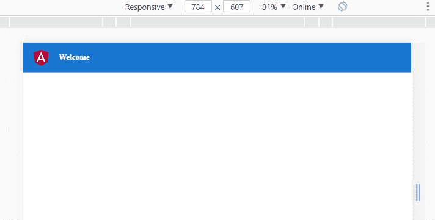
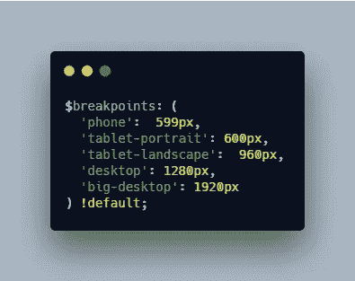
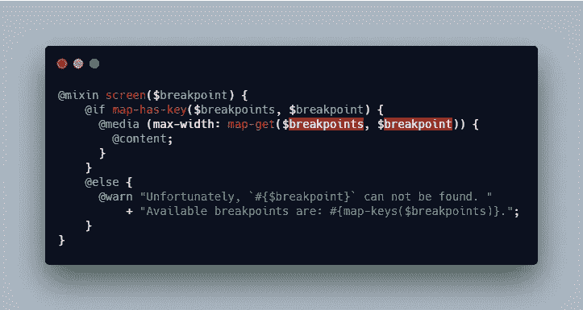
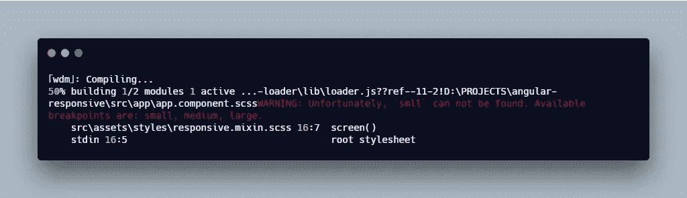
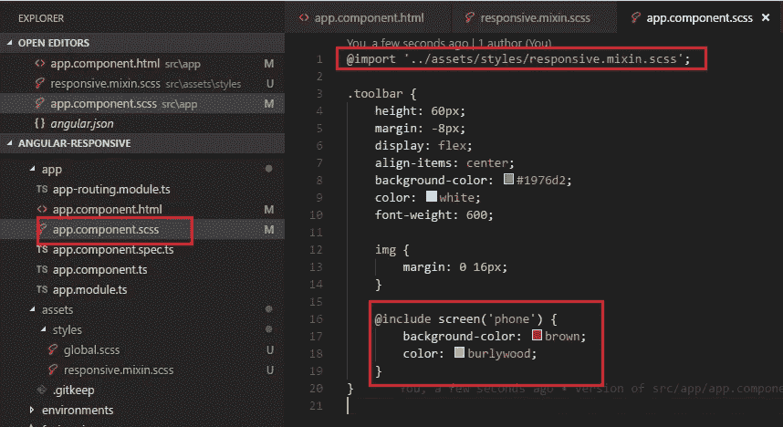
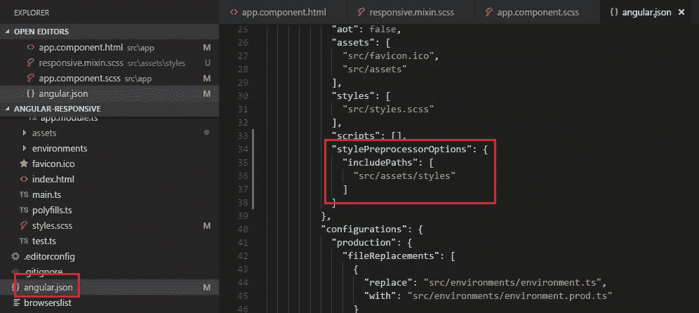
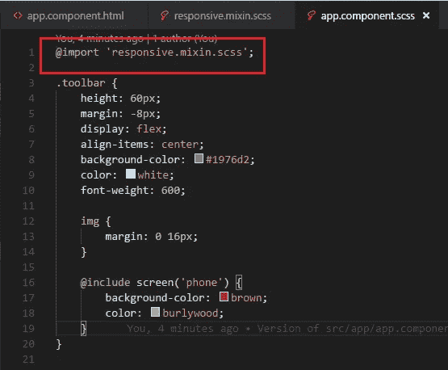
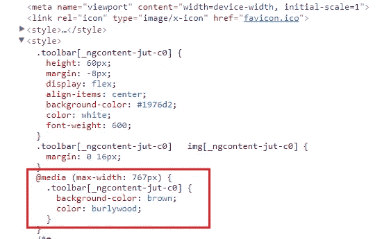

# 在 Angular 和 Sass 中处理@media 断点

> 原文：<https://levelup.gitconnected.com/handle-media-breakpoints-in-angular-and-sass-b8cef4137747>

## 有角的

## 一个简单的指南如何定义断点，并使用 mixin 在 Angular 的任何样式文件中应用它

[亚历杭德罗·埃斯卡米拉](https://unsplash.com/@alejandroescamilla?utm_source=unsplash&utm_medium=referral&utm_content=creditCopyText)在 [Unsplash](https://unsplash.com/s/photos/coffee?utm_source=unsplash&utm_medium=referral&utm_content=creditCopyText) 上的照片

在本文中，我将向您展示如何处理前端项目中的断点，该项目可以扩展到任何规模。

1.  问题
2.  示范
3.  创建 mixin
4.  在角度上使用混音
5.  浏览器中会发生什么

*更多类似内容，请查看*[*https://betterfullstack.com*](https://betterfullstack.com)

# 问题

随着应用程序的规模和复杂性的增加，我花了很多时间试图让项目变得响应迅速。这个项目变得很大，有许多组件，有许多复杂的屏幕，根据视图呈现不同的布局。

所以一开始，我只有 3 个主要断点。我有大屏桌面和移动，然后在修复 bug 的时候诞生了一些小断点。

当项目变得非常大时，管理断点并不是一件容易的事情，因为现在添加或更新断点是很繁琐的。

解决的办法就是如何把所有的断点整合到一个地方。这使得在整个应用程序中更新和修改断点变得容易。

# 示范

在本文中，我将添加一个简单的演示来做两件事:

1.  使用#1976d2 作为背景色，白色作为文本色
2.  在移动断点处，将背景颜色更改为棕色，将文本颜色更改为 burlywood。

角度 8 的简单演示

# 创建 mixin

在本节中，我将创建一个名为`responsive.mixin.scss`的文件，并将其放在 assets 文件夹中。

注意:你可以把它放在任何地方，这取决于你的项目和你的视图。

在文件中，我将做两件事:

1.  创建断点
2.  创建 mixin `screen`

## 创建断点

我在 SCSS 创建了一个断点变量，有 5 个大的断点，如下所示:

断点变量

基于[材料设计](https://material.io/design/layout/responsive-layout-grid.html#breakpoints)的断点太多。所以你想要什么真的取决于你的项目。

我用有意义的名称命名这些断点，它们是:

*   电话
*   写字板肖像
*   平板电脑-景观
*   桌面
*   大桌面

## 创建 mixin

Mixins 允许您定义可以在整个样式表中重用的样式

混合是使用`@mixin` at 规则定义的，该规则写成`@mixin <name> { ... }`或`@mixin name(<arguments...>) { ... }`

屏幕混合

名为`screen`的 mixin 就可以了:

1.  检查作为键的参数在断点中是否有效
2.  如果是，则使用断点变量中的值`max-width`创建媒体
3.  如果没有，在终端上添加警告信息

以下是使用错误名称后终端上的警告信息

将错误的名称传入屏幕 mixin

在这个 mixin 中，我使用了 3 个函数:

1.  `map-has-get($map, $key)`:返回`$map`是否包含与`$key`关联的值。
2.  `map-get($map, $key)`:返回`$map`中与`$key`关联的值。如果`$map`没有与`$key`关联的值，则返回`[null](https://sass-lang.com/documentation/values/null)`。
3.  `map-keys($map)`:返回`$map`中所有键的逗号分隔列表。

为什么是`max-width`？

当我们决定使用`max-width`或`min-width`时，最终决定是移动优先还是桌面优先。

关于 mixin 名称，我还想补充一点——它们将连字符和下划线视为相同。这意味着`reset-list`和`reset_list`都指向同一个 mixin。

# 在角度中使用混合

使用 mixin 很容易。我只需要将 mixin 导入到`.scss`文件中，在那里我需要改变手机视图或平板电脑横向视图的样式。

在 app.component.scss 中使用 mixin

有一些小点需要注意。

使用`@import`将 mixin 导入组件 scss 文件。如果元件被放在类似`shared/modules/components/a.component.scss`的文件夹中。那么，我不喜欢使用`../../../path-to-mixin`。我建议你在`angular.json`配置那个路径。

angular.json 上资源/样式的配置路径

然后，从你的组件样式中移除`../..`

在 app.component.scss 中导入 mixin

当我们使用这种混音时会发生什么？让我们看下一节！

# 浏览器中发生了什么

打开浏览器，就可以看到生成的样式包含了`max-width: 767px`。

DOM 呈现后的样式

# 摘要

总之，在这篇文章中，我分享了一个简单的方法，将所有断点放在一个文件中，并将其应用于 Angular 中的多个组件。

此外，添加一个小的配置来删除`../../`当我们导入 mixin 文件到一个角度组件，以避免许多点点点。

我希望这篇文章对你有用！你可以通过我的[网站](https://www.hoangtran.co/)找到我。欢迎在下面的评论中留下任何问题。我很乐意帮忙！

# 资源/参考资料

[1]:米欣【https://sass-lang.com/documentation/at-rules/mixin 

[2]:地图方法[https://sass-lang.com/documentation/modules/map](https://sass-lang.com/documentation/modules/map)

[3]:断点列表[https://material . io/design/layout/responsive-layout-grid . html #断点](https://material.io/design/layout/responsive-layout-grid.html#breakpoints)

 [## 故事-更好的全栈

### 关于 JavaScript、Python 和 Wordpress 的有用文章，有助于开发人员减少开发时间并提高…

betterfullstack.com](https://betterfullstack.com/stories/)