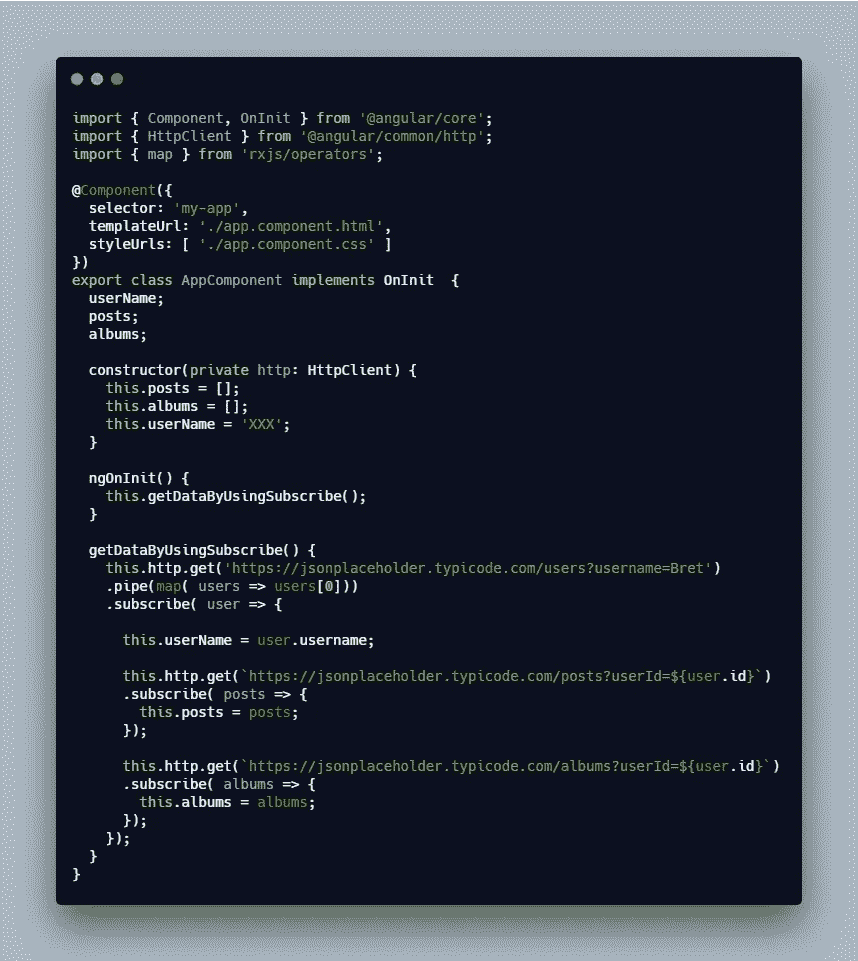
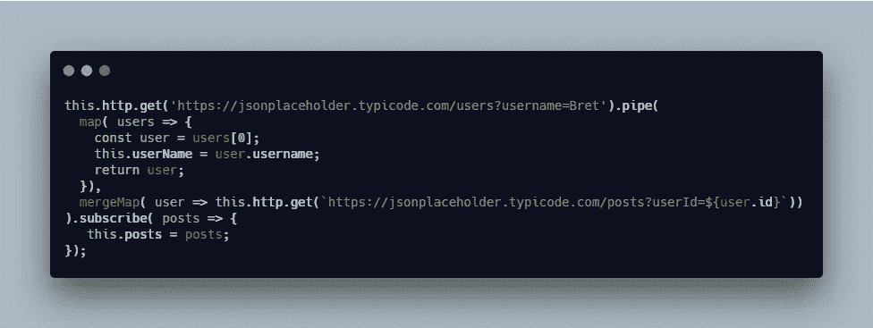
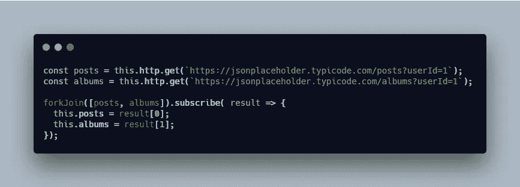
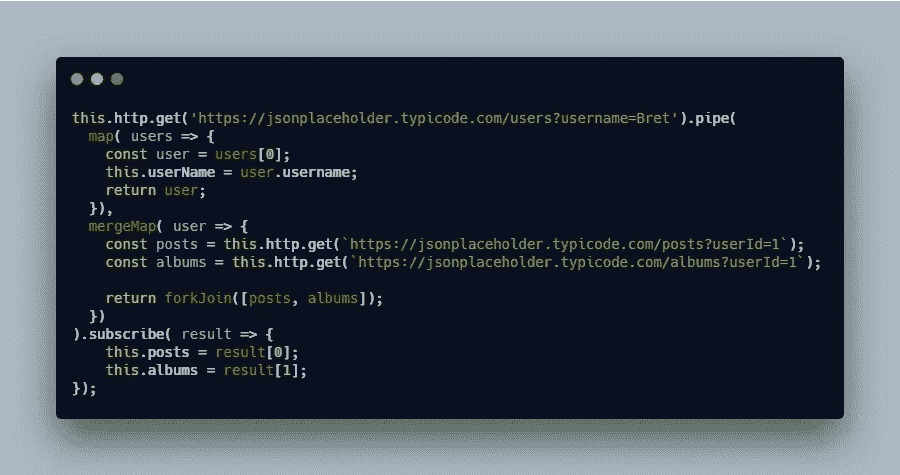
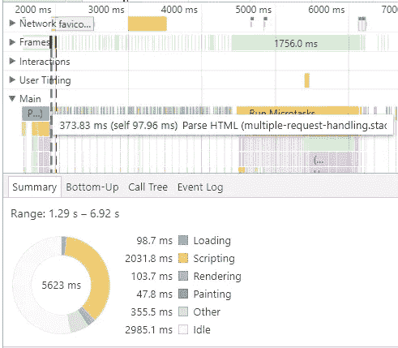
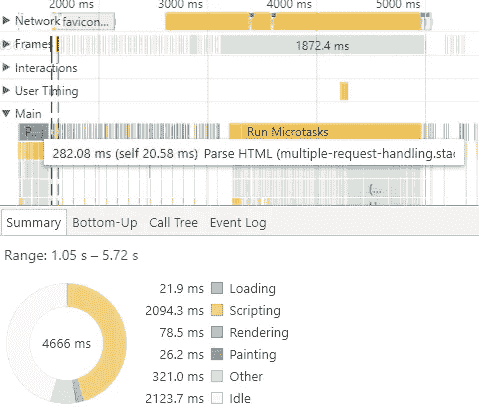

# 使用 mergeMap 和 forkJoin 在 Angular 中处理多个 API 请求，以避免嵌套订阅

> 原文：<https://levelup.gitconnected.com/handle-multiple-api-requests-in-angular-using-mergemap-and-forkjoin-to-avoid-nested-subscriptions-a20fb5040d0c>

## 有角的

## 关于在调用多个 API 时如何使用`mergeMap`和`forkJoin`来避免嵌套订阅的指南

照片由 [Yanapi Senaud](https://unsplash.com/@yaanapi?utm_source=unsplash&utm_medium=referral&utm_content=creditCopyText) 在 [Unsplash](https://unsplash.com/s/photos/coffee?utm_source=unsplash&utm_medium=referral&utm_content=creditCopyText) 上拍摄

在本文中，我将通过使用 [mergeMap](https://www.learnrxjs.io/operators/transformation/mergemap.html) 和 [forkJoin](https://www.learnrxjs.io/operators/combination/forkjoin.html) 来介绍两种在 Angular 中处理多个请求的技术。

内容:

1.  问题
2.  `subscribe`
3.  `mergeMap`
4.  `forkJoin`
5.  组合`mergeMap`和`forkJoin`
6.  `subscribe`与`mergeMap`和`forkJoin`的性能对比

更多类似的内容，请查看 https://betterfullstack.com 的

# 问题

在现实世界中，我们经常在 web 应用程序中调用不止一个 API。当您进入一个页面时，您经常会发出多个请求来检索所有需要的数据，并且后续调用需要一些 API 请求的结果。

当我们发出多个请求时，有效地处理它们以保持用户的快速性能，同时编写良好的代码是非常重要的。

我将通过在[https://jsonplaceholder.typicode.com](https://jsonplaceholder.typicode.com)使用虚拟 API 演示一个简单的项目，该项目有 3 个要求:

1.  调用 API 来验证和检索用户信息
2.  基于用户信息，我们调用一个 API 来获取用户创建的所有帖子。
3.  基于用户信息，我们调用一个 API 来获取用户创建的所有相册。

`subscribe`是 Angular 中处理请求的常用方式，但是还有更有效的方法。我们将首先使用`subscribe`解决我们的问题，然后使用`mergeMap`和`forkJoin`对其进行改进

# 订阅

使用这种技术非常简单。首先，我们调用一个 API 来获取用户信息，然后我们调用另外两个 API。我们在嵌套订阅中这样做，这样我们就可以使用第一次 API 调用的结果。

多重请求的嵌套订阅

这种技术适用于 2 到 3 个请求，但是随着应用程序的增长，很难读取更多的请求。我们将被要求创建许多嵌套订阅。这就是为什么我们将使用 RxJS 来处理多个请求。

# 合并地图

当您希望展平内部可观察对象，但希望手动控制内部订阅的数量时，最好使用该运算符。

那么我们什么时候应用`mergeMap`？

当我们需要来自第一个 API 请求的数据向第二个 API 发出请求时。

mergeMap 案例研究

看看上面的源代码，我们可以看到第二个 API 需要第一个 API 的用户 ID 来获取数据。

注意:

1.  `flatMap`是`mergeMap`的别名。
2.  `mergeMap`同时维护多个活动的内部订阅，因此有可能通过长期内部订阅造成内存泄漏。

# 叉连接

当您有一组可观测量，并且只关心每个可观测量的最终发射值时，最好使用该运算符。这意味着`forkJoin`允许我们将多个可观测值分组并并行执行，然后只返回一个可观测值。

我们什么时候应用`forkJoin`？

当 API 请求独立时，我们使用它。这意味着它们不依赖于彼此来完成，并且可以并行执行。

forkJoin 案例研究

# 合并地图和叉连接

在现实世界中，有多个 API 请求依赖于另一个请求的结果。让我们看看如何使用`mergeMap`和`forkJoin`来处理这种情况。

这里有一个例子可以解决我们的问题:

合并地图和叉连接

通过使用这些函数，我们避免了嵌套订阅，并且可以将代码分成许多小方法。

你必须用从上面的`map`返回的`user`替换`mergeMap`里面的`userId`。

# subscribe 与 mergeMap 和 forkJoin 的性能比较

我注意到的唯一区别是解析 HTML。

首先，看看使用嵌套订阅解析 HTML 的时间:

373.83 毫秒解析 HTML

然后，使用`mergeMap`和`forkJoin`查看解析 HTML 时间:

对 HTML 进行语法分析

我多次尝试渲染页面来比较结果，我发现使用`mergeMap`和`forkJoin`时解析 HTML 的时间总是比使用嵌套订阅时快，但是差别非常小(大约 100 毫秒)。

重要的是知道如何使代码更具可读性和可维护性。

# 摘要

综上所述，我们可以用 RxJS 来处理 Angular 中的多个请求。这有助于我们编写可读性和可维护性更强的代码。作为一个额外的好处，我们还看到，与嵌套订阅相比，通过使用我们的 RxJS 函数，性能略有提高。

我希望这篇文章对你有用！你可以跟着我上[中型](https://medium.com/@transonhoang)。我也在[推特](https://twitter.com/transonhoang)上。欢迎在下面的评论中留下任何问题。我很乐意帮忙！

点击此处查看源代码。

 [## 多请求处理堆栈

### 导出到 Angular CLI 的 Angular 应用程序的启动项目

stackblitz.com](https://stackblitz.com/edit/multiple-request-handling?embed=1&file=src/app/app.component.ts)  [## 故事-更好的全栈

### 关于 JavaScript、Python 和 Wordpress 的有用文章，有助于开发人员减少开发时间并提高…

betterfullstack.com](https://betterfullstack.com/stories/)  [## 编写面试问题

### 一个完整的平台，在这里我会教你找到下一份工作所需的一切，以及…

技术开发](https://skilled.dev)