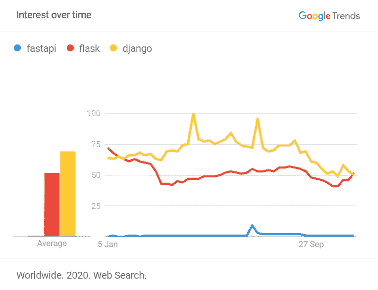
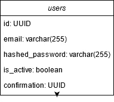

# 在 FastAPI 和 Tortoise ORM 中处理注册

> 原文：<https://levelup.gitconnected.com/handle-registration-in-fastapi-and-tortoise-orm-2dafc9325b7a>

## 在这个过程中掉一两滴眼泪——第一部分


[iMattSmart](https://unsplash.com/@imattsmart?utm_source=medium&utm_medium=referral) 在 [Unsplash](https://unsplash.com?utm_source=medium&utm_medium=referral) 上拍摄的照片

FastAPI 最近获得了一些势头。在 GitHub 上，它大约有 Django 或 Flask 一半的星星。但是当你考虑到谷歌搜索结果时，它就不那么受欢迎了:



FastAPI vs. Flask vs. Django 人气

在实践中意味着什么？几乎没有机会找到你的堆栈溢出问题的答案。留给你的是(伟大的)文档和框架代码本身。它仍然是一项前沿技术，但它足够有希望让我为您介绍一些基础知识。我相信，考虑到一些覆盖面，FastAPI 可以超越它的前辈。

说够了。让我们建立一些有用的东西。

# Deps

你首先需要一些依赖。虽然库是必须的，但是选择一个数据库和它的版本系统(或者缺少版本系统)取决于你。你*能不能*坚持乌龟的默认 [Aerich，](https://github.com/tortoise/aerich)但是我相信它就是不够成熟。我推荐使用 [PostgreSQL](https://www.postgresql.org/download/) 和 [dbmate](https://github.com/amacneil/dbmate) tandem。您将手动编写 SQL 查询，这意味着完全控制，但可能比使用像 [Alembic](https://alembic.sqlalchemy.org/en/latest/) 这样的工具要困难得多。

调用以下命令:

```
pip install tortoise-orm[asyncpg] fastapi[all] python-jose[cryptography] passlib[bcrypt]
```

FastAPI 开发人员不会强迫您使用任何特定的文件夹结构。就像 React，你可以想出任何你想要的东西。就我们的目的而言，我认为这样做最好:

```
.
├── app
│   ├── __init__.py
│   ├── main.py
│   ├── config
│   │   ├── __init__.py
│   │   ├── db.py
│   │   └── settings.py 
│   ├── models
│   │   ├── __init__.py
│   │   └── users.py
│   ├── routers
│   │   ├── __init__.py
│   │   └── auth.py
│   ├── services
│   │   ├── __init__.py
│   │   ├── mailer.py
│   │   └── auth.py
```

现在，您必须指定一个包含 DB 连接字符串的环境变量。用安装 PostgreSQL 时提供的值替换占位符:

```
DATABASE_URL=postgres://{USERNAME}:{PASSWORD}@{HOST}:{PORT}/{DATABASE}?sslmode=disable
```

出于本教程的目的，我们不打算实施 SSL ( `sslmode=disable`)。但是对于真正的应用，[你应该](https://tortoise-orm.readthedocs.io/en/latest/databases.html?highlight=ssl%20mode#passing-in-custom-ssl-certificates)。

# 你的第一次迁移

如果数据库不是您自己创建的，您可以让 dbmate 为您创建:

```
dbmate create
```

有了这些，您应该告诉它创建您的第一个迁移文件:

```
dbmate new create_users_table
```

它在`/app/db/migrations`目录中创建了一个新文件。打开它。您将看到下面列出的语法:

```
-- migrate:up-- migrate:down
```

`-- migrate:up`下面的一切都是你实际的迁移。`-- migrate:down`下面的内容用于回滚迁移(您将使用一个`DROP TABLE` SQL 命令来实现这一点)。

我们的目标是一个简单的模式:



*用户*表模式

它转化为以下 SQL 查询(迁移和回滚):

```
-- migrate:up
CREATE TABLE users (
    id UUID PRIMARY KEY,
    email varchar(255) UNIQUE NOT NULL,
    hashed_password varchar(255) NOT NULL,
    is_active boolean NOT NULL DEFAULT FALSE,
    confirmation UUID
)
-- migrate:down
DROP TABLE users
```

现在您可以开始迁移了:

```
dbmate up
```

这就是。桌子竖起来了。

# 配置

这里你需要两样东西:

1.  应用程序设置
2.  数据库设置

让我们从前者开始，因为数据库设置将依赖于它。

## 应用程序设置

设置放在`/app/config/settings.py`文件中。FastAPI 依赖项之一是[Pydantic](https://pydantic-docs.helpmanual.io/)——一个用于设置管理和数据验证的工具。最终我们将使用这两个特性。首先，你需要创建一个从`BaseSettings`类继承的模型。这是正确的选择，因为我选择将一些敏感数据保存在环境变量中。正如 Pydantic devs [所说](https://pydantic-docs.helpmanual.io/usage/settings/):

> 如果您创建一个继承自`BaseSettings`的模型，模型初始化器将试图通过从环境中读取来确定任何未作为关键字参数传递的字段的值。(如果没有设置匹配的环境变量，仍将使用默认值。)

知道了这一点，您的设置类应该如下所示:

让我们把它分解一下:

*   `DATABASE_URL` —设置 dbmate 时定义的环境变量。它需要属于`Settings`类，因为你在设置乌龟 ORM 的时候会引用它。
*   `SECRET_KEY` —生成注册确认令牌时使用的环境变量(**，需要定义** **，现在为**)。出于本教程的目的，它可以是任何随机的字符串，比如`sdasfgrt23`。对于真实的应用程序，使用由 [OpenSSL](https://www.openssl.org/) 生成的字符串。
*   `REGISTRATION_TOKEN_LIFETIME` —用户注册帐户后收到的电子邮件中发送的令牌的生命周期(秒)。
*   `TOKEN_ALGORITHM` —生成注册令牌时您将提供的算法。
*   `APP_NAME` — FastAPI 为您生成一个 Swagger 文档。这是显示应用程序名称的地方。
*   `SMTP_SERVER` —在本教程中，您将使用 Python 内置的调试服务器。马上就要`localhost:25`了。**现在定义一下。**
*   `MAIL_SENDER` —注册确认邮件的发送者。
*   `API_PREFIX` —在每个端点前添加的字符串。你最好让它空着。
*   `HOST` —服务器主机。
*   `PORT` —服务器端口
*   `BASE_URL` —用于生成确认链接的基本 URL。
*   `MODELS` —在这里你申报你的型号。您指定模块路径，这意味着`models.users`代表`models`包中的一个模块`users`。
*   您还提供了一个`Config`类，您在其中指定变量名区分大小写。对于 Windows 来说无所谓，但是如果用 Linux 就很重要了。

没有必要每次需要引用变量时都创建`Settings`对象。我们可以定义一个返回单例的工厂方法，如下所示:

```
from functools import lru_cache @lru_cache()
def get_settings():
    return Settings()
```

到目前为止，一切顺利。让我们转到数据库配置。

## 数据库设置

您在`/app/config/db.py` *中定义数据库配置。*再说一遍——这只是一个惯例。如果你需要提供自定义设置，你可以在 Tortoise ORM [文档](https://tortoise-orm.readthedocs.io/en/latest/setup.html#tortoise.Tortoise.init)中查找。在本教程中，配置很简单。我们只需要定义两件事:

*   连接字符串
*   在`Settings`类中声明的 ORM 模型

很简单:

有一点需要注意:您需要去掉可选参数的数据库连接字符串:`settings.DATABASE_URL.split('?')[0]`。这意味着连接字符串将不包括`sslmode=disable`部分。

现在你实际上可以*使用*配置。

# 设置服务器

所有初始化的东西都属于`/app/main.py` 文件。在这里，您可以定义一个 FastAPI 应用程序，注册数据库，并提供一种运行[uvicon](https://www.uvicorn.org/)服务器的方法。因为您使用的框架应该是*快*，所以这里没有太多内容:

*   您定义了`FastAPI`对象，只要需要应用程序上下文，就提供这个对象。您使用前面在`Settings`类中定义的`APP_NAME`变量，该变量将显示在 Swagger 文档中。
*   使用`register_tortoise`函数，您将 Tortoise 与您的应用程序绑定。因为我们使用 dbmate 来管理模式，所以您将`generate_schemas`参数设置为`False`。
*   您定义调用脚本时会发生什么。在这里，我们运行一个 Uvicorn 服务器。您可以使用`127.0.0.1:8080`地址访问它。

# 运行应用程序

调用命令:

```
python main.py
```

在浏览器中转到`127.0.0.1:8000/docs`地址。这是你应该看到的:


默认 Swagger 文档页面

不要介意这个错误。您将很快添加一些端点。

# 最后的话

感谢阅读！

在[下一部分](/handle-registration-in-fastapi-and-tortoise-orm-a661162d27f1)中，您将:

*   处理发送确认电子邮件
*   将`users`表映射到 ORM 模型
*   编写用于注册和确认的端点

所有代码都可以在我的 GitHub 上找到。