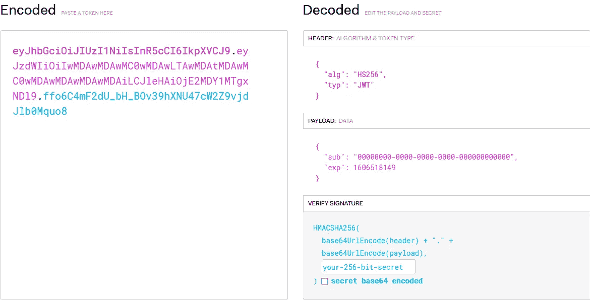

# 在 FastAPI 和 Tortoise ORM 中处理注册

> 原文：<https://levelup.gitconnected.com/handle-registration-in-fastapi-and-tortoise-orm-a661162d27f1>

在这个过程中掉一两滴眼泪——第二部分


[罗布·金](https://unsplash.com/@zenking?utm_source=medium&utm_medium=referral)在 [Unsplash](https://unsplash.com?utm_source=medium&utm_medium=referral) 上的照片

在本教程的前一部分中，您已经设置好了 Uvicorn 服务器。您还不能很好地使用它，但是您仍然应该编写一些代码。在本部分中，您将添加两个服务:

*   `auth` —用于生成注册令牌
*   `mailer` —用于发送注册确认电子邮件

我们开始吧。

# 认证服务

打开`/app/services/auth.py`，从这个方法(和一个类)的存根开始:

```
class Auth:
    @staticmethod
    def create_token(data: dict, expires_delta: int):
        pass
```

该方法应该这样工作:您提供要编码的数据和令牌过期后的时间(以秒为单位)。我们用一个`staticmethod`装饰器包装它，因为它既不依赖于对象也不依赖于类属性。这是我对这个方法的想法:

*   用`exp`(到期时间)[索赔](https://tools.ietf.org/html/rfc7519#section-4.1.4)更新提供的`data`。这很重要，因为你不希望确认链接永远存在。我们使用 UTC 时间。这是一个共同点。用户时区可以不同，但 UTC 时间将始终相同。
*   指定令牌的颁发者(`iss` claim)。
*   用本教程前面部分指定的密钥和算法对`data`进行编码。

为了方便起见，您将创建另一个方法，仅用于生成确认令牌。它将用户 ID 作为唯一的参数。它也将是静态的:

*   `sub`声明是令牌的订阅者——用户。你通过他的身份证认出他。
*   `scope` — JWT 令牌可以有多种作用域。我在本教程中只涉及`registration`。
*   `jti` —令牌的唯一标识符。没有它，如果生成了多个令牌，我们就无法使其无效。

唯一需要添加的是生成散列密码的选项:

```
class Auth:
    password_context = CryptContext(schemes=["bcrypt"], deprecated="auto")

    @classmethod
    def get_password_hash(cls, password: str):
        return cls.password_context.hash(password)
```

*   使用`bcrypt`。很方便，省去了你自己管理密码盐。
*   定义`classmethod`，这次不定义`staticmethod`。那是因为已经添加了类别字段`password_context`。

现在你可以参加考试了。在 Python REPL 中，包含服务:

```
from services.auth import Auth
```

你需要一个 UUID。`00000000-0000-0000-0000-000000000000`会做:

```
uuid = '00000000-0000-0000-0000-000000000000'
Auth.create_confirmation_token(uuid)
```

根据您提供的密钥，您将获得一个令牌。贴在 [https://jwt.io](https://jwt.io:) 上。一切都应该是健全的:



解码的 JWT 令牌

# 邮件服务

打开`/app/services/mailer.py`。您将添加一个发送电子邮件的方法。这很简单:

*   创建一个新的空的`EmailMessage`分配给一个`message`变量。然后，使用提供的方法参数设置消息`content`。
*   设置割台— `Subject`、`From`和`To`。
*   使用您的 SMTP 服务器发送邮件。

您可以添加另一种方法来处理确认电子邮件:

*   从`localhost/api/auth/verify.`开始生成`confirmation_url`
*   `'''`表示一个[多线串](https://docs.python.org/3/library/stdtypes.html?highlight=str#text-sequence-type-str)。

就是这样。`mailer`模块完成。现在你必须测试它。出于我们的目的，您将使用内置于 Python 中的 SMTP 调试服务器。要运行它，调用:

```
python -m smtpd -c DebuggingServer -n localhost:25
```

它将在主机`localhost`和端口`25`运行服务器。在 REPL，输入以下内容:

```
from services.mailer import Mailer
Mailer.send_confirmation_message('test-token', '[test@example.com](mailto:test@example.com)')
```

在运行 SMTP 服务器的窗口中，您应该会看到以下输出:

```
---------- MESSAGE FOLLOWS ----------
b'Content-Type: text/plain; charset="utf-8"'
b'Content-Transfer-Encoding: 7bit'
b'MIME-Version: 1.0'
b'**Subject: Please confirm your registration**'
b'**From:** [**noreply@example.com**](mailto:noreply@example.com)'
b'**To:** [**test@example.com**](mailto:test@example.com)'
b'X-Peer: ::1'
b'**Hi!**'
b''
b'**Please confirm your registration: localhost:8000/verify/test-token.**'
------------ END MESSAGE ------------
```

如果您的输出匹配，那么您就完成了教程的这一部分。

# 最后的话

感谢阅读！

在[最后一部分](/handle-registration-in-fastapi-and-tortoise-orm-a673263bdba3)中，您将:

*   将`users`表映射到 ORM 模型
*   编写用于注册和确认的端点

所有代码都可以在我的 GitHub 上找到。