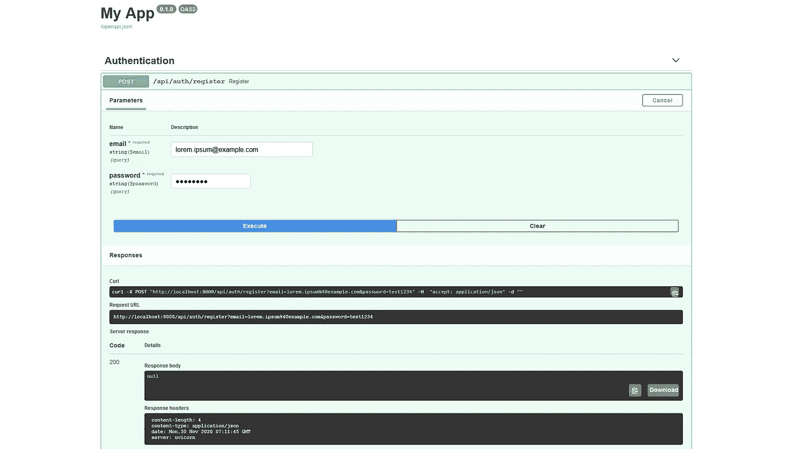
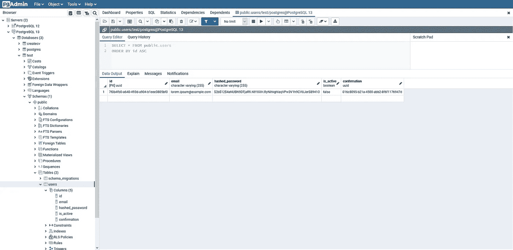
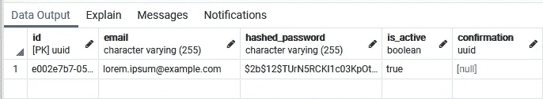

# 在 FastAPI 和 Tortoise ORM 中处理注册

> 原文：<https://levelup.gitconnected.com/handle-registration-in-fastapi-and-tortoise-orm-a673263bdba3>

在这个过程中掉一两滴眼泪——第三部分


由 [Markus Spiske](https://unsplash.com/@markusspiske?utm_source=medium&utm_medium=referral) 在 [Unsplash](https://unsplash.com?utm_source=medium&utm_medium=referral) 上拍摄的照片

在本教程的前[部分，您配置了应用程序并编写了一些服务。现在是时候使用它们了。](/handle-registration-in-fastapi-and-tortoise-orm-a661162d27f1)

您将定义两个端点:

*   `/api/auth/register`
*   `/api/auth/verify`

我介绍了一些必须的特性，比如验证令牌。我不负责重新发送确认。理想情况下，它只对经过身份验证的用户可用，这超出了本教程的范围。

# 模型

在教程的第一部分，您已经创建了一个用户表。您现在就可以使用它，但是还没有方便的方法在乌龟 ORM 中使用它。您需要先添加一个模型。在`/app/models/auth.py`增加以下内容:

*   根据迁移的数据库模式定义字段。
*   因为模型类的命名不同于数据库表，所以您需要在`Meta`类中指定它。

注册和确认帐户时，您需要使用两个以上的模型。

## 创建用户

```
class CreateUser(pydantic.BaseModel):
    email: pydantic.EmailStr
    password: pydantic.SecretStr
```

*   使用 Pydantic 中的`BaseModel`显式创建模型。
*   设置`email`字段类型进行自动验证。
*   制作密码 a `SecretStr`。

## 用户

```
User_Pydantic = pydantic_model_creator(
    UserModel, 
    name='User', 
    exclude=('hashed_password', 'confirmation')
)
```

*   使用数据库映射创建`User`模型。
*   这个模型将会被一个`verify`方法返回，这个方法你马上就要写了。排除`hashed_password`和`confirmation`，因为不需要它们。

有了这些，我们终于可以写一些…

# 端点

如前所述，您只公开了两个端点。

## /注册

这里发生了很多事情。让我们把它分解一下:

*   创建新的`APIRouter`。这是注册端点所必需的。
*   使用上述路由器注册一个`/register`端点。
*   使用 FastAPI 主要好处是请求是异步处理的。所以才这么快。这里，我们定义一个函数，它将把一个`CreateModel`作为参数。上面有 It `Depends`,表示它是必需的。这种机制也用于[依赖注入，](https://fastapi.tiangolo.com/tutorial/dependencies/)虽然我在本教程中没有涉及。
*   使用 Tortoise，您可以通过电子邮件引用一个用户来检查它是否存在于数据库中。这意味着它是重复的，意味着您必须拒绝查询，因为用户已经存在。
*   使用发送的电子邮件和密码创建用户。您使用了来自`Auth`类的一个实用方法。注意，这里使用了`get_secret_value`方法，因为`password`字段使用了来自 Pydantic API 的自定义[类型](https://pydantic-docs.helpmanual.io/usage/types/#secret-types)。
*   生成确认令牌，并将其 ID ( `jti`)分配给确认数据库字段。它确保用户使用他有权访问的电子邮件进行注册。
*   将用户保存在数据库中，并发送确认电子邮件，确保消息可以在第一时间发送。

## /验证

同样，这里面有很多东西，但逻辑相当简单:

*   声明将`token`作为参数的`/verify`端点。
*   健全检查。令牌是否过期？是 scope 以外的`registration`(意思是不是注册令牌)？用户是否已被激活？用户是否存在？令牌 ID 是否存储在数据库中？如果任何一个问题的答案是肯定的，返回一个`HTTPException`。
*   激活用户。
*   返回映射到`User_Pydantic`模型的用户。

根据本教程的范围，这些是您需要定义的唯一端点。我们来测试一下。

# 注册路由器

你就快到了。在`/app/main.py`文件中添加以下内容:

```
from routers.auth import auth_router app.include_router(
    auth_router,
    prefix=settings.API_PREFIX + '/auth',
    tags=['Authentication'],
)
```

*   为`auth_router`注册的所有端点设置 API 前缀。
*   设置`Authentication`标签。这将在 Swagger 文档中显示为端点类别。

# 测试应用程序

确保 SMTP 服务器已启动:

```
python -m smtpd -c DebuggingServer -n localhost:25
```

然后运行应用程序:

```
python main.py
```

在您的浏览器中，转到`localhost:8000/docs`。注册一个虚拟账户:



运行 pgAdmin。如您所见，帐户已经创建，但尚未激活:



在运行 SMTP 守护程序的控制台窗口中，会输出一个确认链接。将其复制并粘贴到您的浏览器中。您应该得到这样的输出:

```
{
  "id": "e002e7b7-05c2-4ad2-85cd-a8942d75cec3",
  "email": "lorem.ipsum@example.com",
  "is_active": true
}
```

转到 pgAdmin 并检查用户是否已被激活:



就是这样！您刚刚完成注册。

# 最后的话

感谢阅读！

所有代码都可以在我的 [GitHub](https://github.com/izdwuut/fastapi-registration-tutorial/tree/part-3) 上找到。