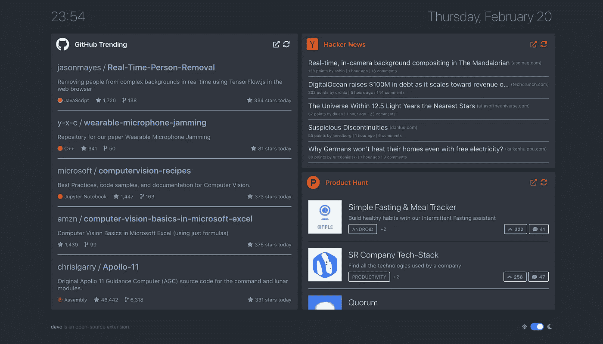
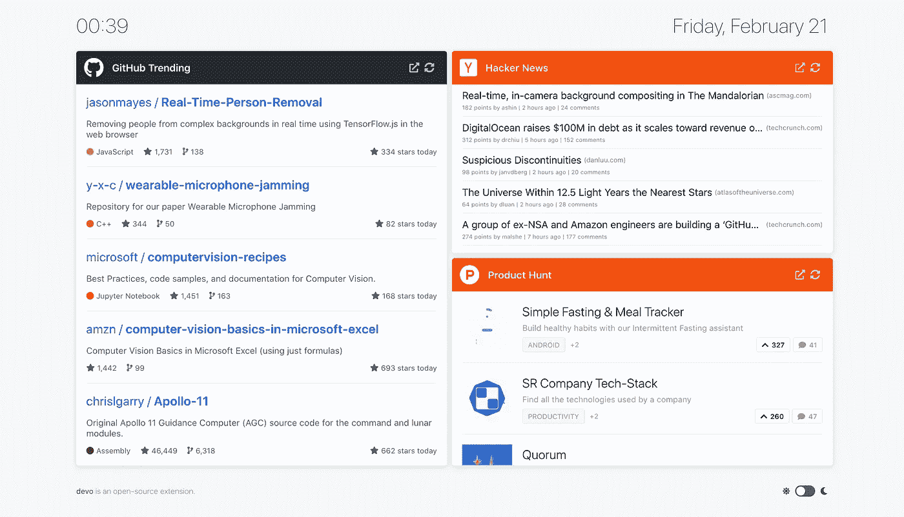
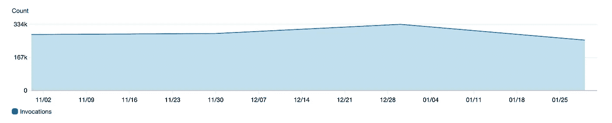
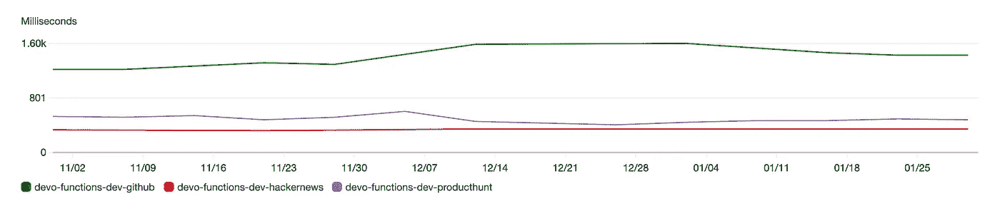
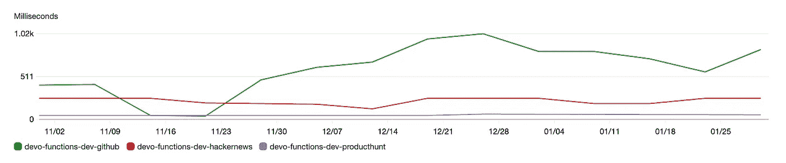
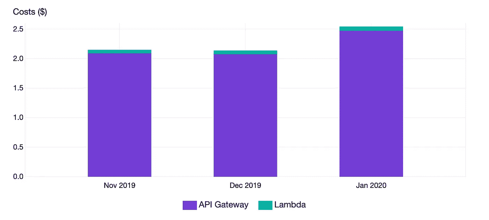

# 使用 Lambda 处理 35 万个 3 美元的请求

> 原文：<https://levelup.gitconnected.com/handling-350k-requests-for-3-using-lambda-c258ace3da58>

无需管理服务器，无需维护，无需部署，一劳永逸。我想我找到了 Lambda 的一个有效用例。



这是 Devo 在黑暗模式下的样子。

自 2014 年底推出以来，Lambda 已经制造了大量宣传，更重要的是，它将“无服务器”一词引入了行业。就其核心而言，“无服务器”并不意味着没有服务器或任何东西；有服务器，但你不是管理这些服务器的人。你不知道你的代码在哪里运行，你不能 SSH 到服务器，你不能做任何你在普通服务器或虚拟机上做的事情。你只需给 Lambda 一个你想执行的函数，让它为你运行代码。

例如，假设您有一个函数，它获取产品列表并计算整个购物车的价格，包括各种小计、运输价格和总计。如果这是一个更大的服务的一部分，那么把它放在那里可能是好的。然而，如果这是一个将在不同用例之间共享的功能，或者如果这是一个独立的完整服务，那么您需要考虑如何部署、管理和扩展它。这正是 Lambda 等无服务器平台的切入点:

*   构建代码的 ZIP 存档
*   上传到 Lambda
*   将 API 网关映射到 lambda 函数
*   Bam，您完成了:您拥有了一个可以无限扩展的服务，不需要维护，并且可以直接从 ZIP 存档部署。

好吧，“*无限扩展*”部分可能有点夸张。它仍然是运行在物理硬件上的软件，从每分钟**一个请求到一百万个请求**的平稳扩展存在一系列挑战，但实际上，作为开发人员，你不需要关心它，平台本身会处理它。

# Devo:我的理想用例

我一直使用 Lambda 的原因是我的副业项目， [**Devo**](https://github.com/karakanb/devo) 。Devo 是一个简单的开源新标签扩展，可以显示一堆平台的主页，比如 [GitHub Trending](https://github.com/trending) 、[黑客新闻](http://news.ycombinator.com/)、[产品搜索](http://producthunt.com/)或 [DEV](http://dev.to/) 。我发现自己相当频繁地访问这些页面，我想"*为什么不在每个新标签页中都准备好它们呢？*”，进而引出项目本身。



光模式的 Devo，我比较喜欢这个。

它目前适用于谷歌 Chrome 和 T2 的 Mozilla Firefox，由于它是开源的，如果你使用的是支持 T4 web extensions API 的不同浏览器，你可以自己编译并在本地安装。

由于 Devo 使用不同的平台，因此需要**安全地从这些 API 中获取数据**，这些 API 主要由 API 密钥保护，同时**为一些没有任何公共 API 的平台处理**一些抓取的 HTML。我本可以将所有的客户端秘密放入扩展本身，但这意味着我要将所有的 API 密匙发送给每个用户，这不是一个选项。我必须构建一个简单的 API 来处理认证，完成所需的处理，并返回 API 可以直接使用的数据。

构建后端有多种解决方案:

*   我可以构建一个简单的 PHP 脚本来进行处理，并将其存储在某个共享主机中，但这将引入各种问题，如**不可靠的正常运行时间**、**缓慢的响应**，无法定制任何东西，以及**无法轻松部署**。
*   我可以存储在 [DigitalOcean](https://m.do.co/c/122788111d99) 或类似的提供商中，并直接运行虚拟机，但这意味着我需要管理机器，安装服务器和应用程序，并处理部署。我迫切需要简单的东西。这应该是一个有趣的玩具项目，所以我不想花时间尝试构建一个部署 API 的方法。另外，管理它每月要花费我 5 美元:当然不贵，但是如果我能找到一个免费的选项，为什么还要付费呢？
*   我可以使用 Lambda 之类的无服务器解决方案。我知道当时有这样的平台，但我以前从未使用过。如果它们像广告宣传的那样，实际上可能**解决我所有的问题**:如果使用率低，我就不用支付任何费用，我也不需要关心部署什么服务器或安装什么设置，我当然也不会关心扩展的事情。另外，它们看起来很容易部署。

经过一番研究，我决定硬着头皮给[**λ**](https://aws.amazon.com/lambda/)一个尝试。由于这是一个我不想在后端花费太多时间的项目，我希望能够有一个超级简单的部署流程，理想情况下运行某种`deploy`命令，它就会上线。在寻找各种解决方案时，我遇到了[无服务器框架](https://serverless.com/)。

## 什么是无服务器框架？

虽然他们目前显然有商业服务，但在我做研究的时候，我偶然发现了他们的开源 CLI 工具，并决定尝试一下。它基本上是通过 **ZIP** 存档设置**所有关于基础设施的东西**，比如 **API 网关**和 **Lambda 部署**。他们的 CLI 工具允许**为不同的平台搭建无服务器应用**，并且他们允许超级容易地开始。准备好模板后，只需运行以下命令即可部署代码:

```
serverless deploy
```

就是这样！似乎我找到了我一直在寻找的东西，直到今天才被证明是正确的。

## 构建后端

正如我说过的，Devo 有一个非常简单的后端。它需要对各种形式的数据进行一些简单的抓取和整形处理，但本质上，它是一个非常简单的后端。一开始，我从 GitHub 趋势、黑客新闻和产品搜索开始，我以前将一些功能提取到较小的 NPM 包中，这使得暴露后端变得轻而易举。例如，这是产品搜索主页产品的处理程序:

那里的帮助器是超级简单的函数，负责执行 HTTP GET 请求或用内容构建响应对象。总的来说，API 应该是非常简单的，事实也的确如此。一旦有了代码，我所要做的就是创建一个包含 URL 路径和函数映射的`serverless.yml`文件:

一旦准备好了，我要做的就是运行`serverless deploy`，瞧，Devo 有了一个全功能的后端，**在我不知道的地方运行**，最好的部分是**我不需要知道**。

# 无服务器的优势

无服务器架构有很多好处，但最大的好处似乎是达到一定规模的成本效益，实际上是无限扩展的 T2、T3、T5 和 T6。当然还有其他好处，比如能够在边缘以低延迟或快速更新运行服务，但我现在不会深入讨论这些。

## 成本效益

Lambda 和类似的无服务器平台是按应用程序的使用计费的，这意味着如果你的应用程序没有被使用，你不用为此支付任何费用。特别是如果你正在开始一个新项目，这意味着你不必支付任何费用，直到你达到一定的规模，这使你可以更快地行动，而不用考虑成本；本质上，如果你在一个不会获得任何牵引力的项目后面跑，让我们诚实地在这里，它发生了，那么它不会花你一分钱。

除了基于使用的定价模式，许多无服务器云平台都有慷慨的免费层。例如，AWS Lambda 在前 12 个月每月提供**100 万次免费请求**，或者谷歌云功能每月提供**200 万次调用和 5GB 互联网出口流量**。所有这些激励因素可能会使无服务器成为某些用例的可行选择。

## **无限制缩放**

无服务器平台本质上是**自动可伸缩的**，这实质上意味着您不必担心如何扩展您的应用程序来处理更多的负载，或者当情况平静时如何缩减规模。Cloudflare 是一家无服务器提供商，其产品 [Cloudflare Workers](https://workers.cloudflare.com/) ，[是这样说的](https://www.cloudflare.com/learning/serverless/why-use-serverless/)::*如果一个功能需要在多个实例中运行，供应商的服务器将根据需要启动、运行和结束它们。(…)因此，无服务器应用程序将能够处理异常多的请求，就像它能够处理来自单个用户的单个请求一样。*”。

当然，现实的软件，比如一个 web 应用后端，需要考虑后端的不同方面；即使你的应用程序代码是完全可扩展的，这并不意味着你的数据库、缓存、业务的其他部分已经准备好无限扩展，但是能够在应用程序级别上扩展有它自己的好处，如果你足够幸运达到那个规模，它将允许你带来更多的业务。

## 安心

这是我最喜欢的:由于我所依赖的外部 API 的某些变化，我去年只部署了 Devo 的后端三次，我从来没有，甚至一次也没有，考虑过如何让事情工作并确保它们为全球的用户服务。我不得不同意，Devo 的后端非常简单，与你的平均 API 相比，它做得不多，但不关心如何部署，如何服务，以及如何保持它的运行给了我**极大的安心**。我一直把它作为一个副业项目来维护，我没有从中赚到任何钱，我设法把它维护到现在，因为**我不需要为这样一个简单的项目处理服务器和部署**之类的事情。

我坚信，任何工作的门槛越低，无论是软件项目还是建造摩天大楼，生产率就会越高。如果你家里有一个音乐设置，允许你在 1 分钟内开始录制，你会录制更多的歌曲。如果你有一台更快的电脑，你会工作得更有效率。如果你可以一次完成部署，你将会更加关注软件的重要部分。

# 无服务器的缺点

就像任何其他技术一样，无服务器平台也有各种权衡。简而言之，它们可能变得太贵太快，它们很难监控和调试，它们促进了强大的供应商锁定，这是真实的。

## 高成本

Lambda 和类似的无服务器产品对于启动一个项目来说非常好，它们可能允许**非常快速的原型制作**以及**灵活的定价**。然而，根据工作负载的不同，与常规的基于服务器的解决方案相比，无服务器解决方案可能**非常昂贵**，这是肯定的。使用 AWS 提供的[计算器](https://aws.amazon.com/lambda/pricing/#Calculator)，让我们考虑以下情况:

*   你已经通过 API 网关公开了 1 个 Lambda 函数。
*   你每秒收到 **100 个请求**。
*   你的平均要求需要**500 毫秒**才能完成。
*   您的函数使用 256MB 内存。

通过这些数字，您将支付:

*   **584.97 美元**给 Lambda 本身，包括自由层、
*   **917 美元**至 API 网关，
*   总计 **1501，97 美元**不含税。

是的，如果您进行纵向扩展，成本可能会变得很高，但是您可能需要考虑在为您将要运营的规模管理不同的基础架构、这种变化的成本以及当前形势之间进行权衡。就像很多事情一样，**看情况**。

## 难以监控和调试

这是一件困扰我至今的事情；对于许多人来说，无服务器工作流存在一系列问题，这些问题很可能会阻碍交易:

*   在本地运行它们非常棘手；对于大多数平台来说，这是不可能的，您需要部署您的更改。许多平台允许功能的开发环境，并且它们被作为本地开发流程的替代方案。
*   **监控运行在无服务器平台上的服务是非常棘手的，尤其是当它们调用不同的服务或其他无服务器功能时。**像或[蜂巢](https://www.honeycomb.io/)这样的工具正在为这些问题带来各种各样的解决方案；然而，这并不能改变在这种粒度的分布式环境中建立适当的监控可能非常困难的事实。
*   在你无法控制的环境中很难进行调试。这些函数运行在对资源、底层操作系统和依赖关系施加了某些限制的环境中，这可能很容易破坏应用程序，从而导致调试一塌糊涂。我没有太多使用它的经验，但是有一次我试图调试一个间歇性的外部 API 故障，我真的很难理解发生了什么。

因此，即使开发人员的总体体验很好，但根据您想要实现的目标以及您的工程实践有多好，运行大型分布式无服务器应用程序可能需要大量的工作。

## 供应商锁定

这是我最讨厌的一个；**几乎所有的无服务器平台都迫使你以某种方式锁定他们的平台。**从根本上说，它们似乎是便携的；然而，一旦你开始使用一个特定于该特定提供商的特性，如果竞争对手没有替代者，你实际上被迫继续使用该平台。

如果您使用 RDS for Postgres，并且您的应用程序遵循最佳实践，那么您可以将您的代码转移到另一个提供商，或者如果您使用 S3，那么您可以用 DigitalOcean 的块存储替换它，作为一种替代。然而，**举例来说，如果您将 AWS Aurora 用于数据库，那么您将被锁定在 AWS 中，直到您移除或抽象掉对应用程序级别的依赖**，这可能需要也可能不需要大量的工作。

就像许多其他问题一样，这是一些人的问题，而不是另一些人的问题。我强烈反对锁定平台，因为我相信技术的最佳特性之一是它代表自由的能力，这就是为什么我讨厌无服务器平台主要由专有软件控制的事实。有各种开源替代方案，如[Apache open whish](https://openwhisk.apache.org/)或 [OpenFaas、](https://github.com/openfaas/faas)但当你想开始做某事时，你可能会选择大型云提供商之一的解决方案，这将是封闭源代码的。

# 缩放 Devo

在过去的几个月里，我注意到 AWS 向我收取了很少的费用，每月大约 2 美元。我在开始时忽略了它，然后当我检查时，我注意到它是用于 Devo 的 API 后端的。显然，在免费层运行了大约一年后，AWS 开始向我收取使用费，这很好。然而，真正让我惊讶的不是成本，而是实际使用情况:**仅在 12 月份，Devo 的 API 就被调用了 334k 次。我知道这对于任何一家有价值的企业来说都不是一个大数字，但是对于一个拥有大约 900 名活跃用户的副业项目来说，我认为这是一个相当高的数字。我不知道你，但这是我最大的使用方面的副业。**



Devo 在 2019 年 11 月至 2020 年 1 月期间每月的调用次数

Devo 的后端在 2019 年 11 月有 **283k** 个请求，2019 年 12 月有 **334k** 个请求，2020 年 1 月有 **254k** 个请求。一直以来，它都很好地处理了所有这些请求，而我却毫无头绪！作为我的扩展的活跃用户(我喜欢它！)，我没有遇到后端的任何问题，它处理一切都很好。同样，对于严肃的用例来说，请求量相当低，但是考虑到我没有做**任何维护，任何部署**，并且它作为一个**一劳永逸**后端已经工作了一年多，我对结果非常满意。

## 潜伏

主要后端包括 3 个功能，GitHub 趋势，黑客新闻和产品搜索。计时不是最好的，但是考虑到后端在做一些网络调用+一些处理，我相信他们是没问题的(除了 GitHub，我不知道那个为什么这么慢)。黑客新闻的平均值似乎是 **~350ms，产品搜索**的平均值是 **~450ms，GitHub 趋势**的平均值是 **~1500ms。**



Devo 函数的最大调用持续时间。

我很乐意就 Lambda 的延迟和外部调用给出一些见解。但是目前所有的 Devo 函数都在做外部调用；因此，它可能不是 Lambda 性能的一个很好的代表，这只是我拥有的一个非常小的样本。

说到最小值， **Product Hunt 似乎是最快的**，响应时间在**~ 35 毫秒和~ 60 毫秒**之间，然后是**黑客新闻**端点，响应时间在**~ 130 毫秒和~ 250 毫秒**之间，然后是 **GitHub 趋势**端点，响应时间范围在**~ 35 毫秒到~ 1000 毫秒**。这些数字是 7 天内的最小值。



Devo 函数的最小调用持续时间。

## 费用

我每个月支付大约 2.5 美元，其中大部分都花在了 API Gateway 上。这是我不喜欢 Lambda 的一个棘手的概念；**定价结构不太容易掌握**和**除了 Lambda** 之外，你可能最终还要支付很多钱。例如，如果你想在互联网上公开你的 Lambda 函数，你必须启用 API Gateway，这带来了[它自己的定价](https://aws.amazon.com/api-gateway/pricing/)，在编写爱尔兰地区的报告时，前 3 亿个请求的每百万个请求 1.11 美元。例如，2019 年 12 月，我为 API Gateway 支付了**2.08 美元，为 Lambda** 本身支付了**0.05 美元。**



过去整整 3 个月 Devo 无服务器后端的实际成本。

# 结论

总的来说，我对 Lambda 驱动 Devo 后端的体验非常积极。我有机会使用无服务器技术，设法得到了一个不错的结果，并且用最少的时间和精力用我的扩展服务了大约 900 个用户。就像其他任何技术一样，有优点也有缺点；因此，应该为用例选择合适的对象。我头脑中的简单决策树说，如果有一个运行时间短、资源需求少且负载不可预测的无状态服务，那么无服务器解决方案可能是一个非常好的解决方案。对于以下情况:

*   需要对环境进行广泛的控制，
*   执行需要很长时间
*   使用大量资源
*   接收恒定或可预测的负载
*   与其他服务有复杂的交互

那么使用传统的、基于服务器的解决方案可能是正确的选择。作为一个中间地带，我在我的项目中很大程度上依赖于**容器**，并且**将** [**Docker**](https://medium.com/swlh/what-exactly-is-docker-1dd62e1fde38) **和 Kubernetes** 集成到我的项目工作流中非常有帮助。它们似乎为**可移植性、易用性和独立性**提供了一个良好的基础，同时允许**快速原型**，因此它可能也是无服务器平台的一个重要考虑和替代方案。

# 额外资源

这个行业相当大；因此，涵盖所有主题并不简单。对于那些想了解更多关于这个主题的人来说，这里是我在学习如何使用 Lambda 时探索的一些资源:

*   [https://aws.amazon.com/lambda/](https://aws.amazon.com/lambda/)
*   [https://cloud.google.com/functions](https://cloud.google.com/functions)
*   [https://azure.microsoft.com/en-us/services/functions/](https://azure.microsoft.com/en-us/services/functions/)
*   [https://martinfowler.com/articles/serverless.html](https://martinfowler.com/articles/serverless.html)
*   [https://blogs.oracle.com/cloudnative/lost-in-serverless](https://blogs.oracle.com/cloudnative/lost-in-serverless)

此外，如果你在帖子中看到任何不正确的信息或错误，请随时指出，以便我可以修复它们。

感谢你读到这里，这是一张漂亮狐狸的照片。


[guille pozzi](https://unsplash.com/@guillepozzi?utm_source=unsplash&utm_medium=referral&utm_content=creditCopyText) 在 [Unsplash](https://unsplash.com/s/photos/animal?utm_source=unsplash&utm_medium=referral&utm_content=creditCopyText) 上拍摄的照片