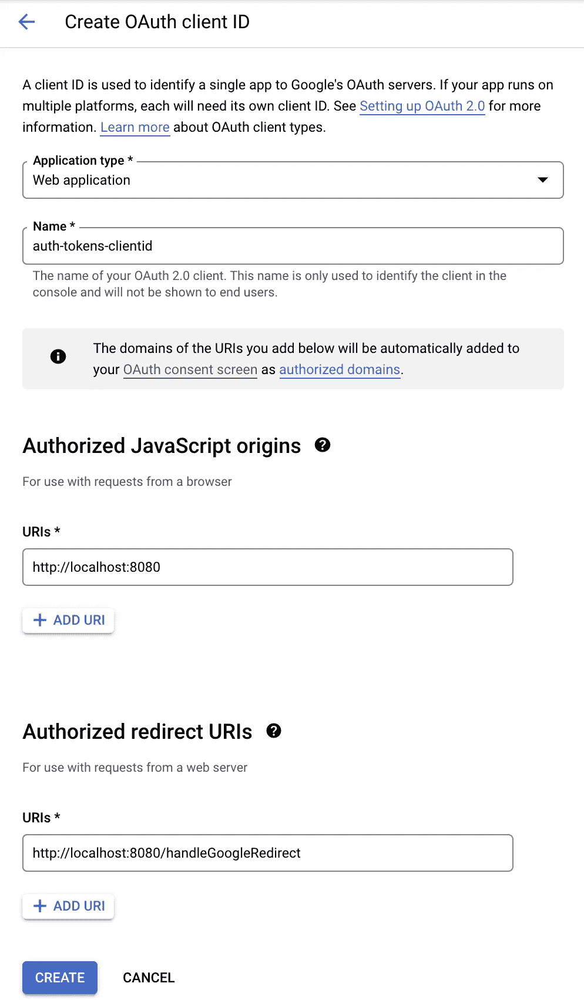

# 使用 React & Node.js 教程处理 Google APIs 的访问令牌

> 原文：<https://levelup.gitconnected.com/handling-access-tokens-for-google-apis-with-react-node-js-tutorial-5ebf94d8f90f>

Google 认证、访问令牌和 API 使用的刷新令牌

这是一个认证和处理 API 使用的 Google 访问令牌的指南。我将使用 Google 日历 API 作为例子。

您将了解如何通过 Google 进行身份验证、取回令牌、存储访问令牌、使用 API 访问令牌、处理刷新令牌，以及如何检查令牌是否过期，以便获得新的访问令牌或使用旧的令牌。

我也正在写一本电子书来分享我从零开始学到的关于 Google APIs 的一切！如果您感兴趣，请告诉我:)

 [## React & Google APIs

### 从头开始学习操作谷歌 API:认证，电子表格管理，谷歌日历，令牌…

react-ultimate-guide-Google APIs . vercel . app](https://react-ultimate-guide-googleapis.vercel.app/) 

## 要求

*   Basic React.js
*   Javascript 获取
*   基本节点. js

## 问题是

谷歌访问令牌在 1 小时后过期。这意味着，如果您通过谷歌认证，获得一个访问令牌，并使用它来访问您的谷歌日历 API，您将只能使用该访问令牌 1 小时。之后，令牌过期，您需要一个新的。

## 解决方案

我们将在 Node.js 服务器上与 Google 进行认证，认证完成后将 **access_token** 和 **refresh_token** 发送给前端用户，并将 **refresh_token** 存储在 **localStorage** 上。您也可以将它存储在您的用户数据库文件中。然后，每次我们向 Google API 发出请求时，检查令牌是否过期，并相应地处理它。

## 开始前的步骤

1.  创建新的 React 应用程序
2.  用 Express.js 创建新的 Node.js 服务器

## 项目设置

我建立了一个名为 google-auth-tokens 的文件夹，然后在里面创建了一个名为 **client** 的 React 应用和一个名为 **server 的 Node.js 应用。**然后我在服务器上安装了 express、googleapis、cors 和 dotenv 依赖项。

您可以复制以下命令来设置项目。

`mkdir google-auth-tokens && cd google-auth-tokens`

`npx create-react-app client && touch client/src/tokens.js && touch client/src/calendarApi.js`

`mkdir server && touch server/index.js && touch server/.env && cd server && npm init -y && yarn add express dotenv googleapis cors node-fetch@2.0 body-parser`

项目结构设置完毕！

## **React 客户端:**

让我们直接跳到代码。客户端应用程序基本上有 3 个步骤。

1.  登录并从查询参数中获取凭据
2.  将令牌凭据存储在会话存储中
3.  发送 API 请求时处理过期和未过期的令牌

在 App.js 上，使用按钮 **Login** 启动认证，该按钮调用函数 **createGoogleAuthLink。**这会在您的服务器中创建链接，将验证链接发送回客户端，并在成功时将 React 应用重定向到 Google 验证链接。

在通过 Google 认证之后，应该发送回另一个包含访问令牌和刷新令牌的链接。这将在 useEffect 钩子中用一个名为**handleTokenFromQueryParams()**的函数来处理，并让用户登录。

现在我们将处理日历请求和令牌过期。

## 客户端上的访问令牌管理

我们将创建令牌管理系统来处理到期时间，并始终获得有效的 **access_token** 。

在文件 **tokens.js** 上，我们将创建一个函数 **getToken()。**它的功能非常简单:

功能**检查令牌是否过期**。

如果**过期**，它将使用存储在 sessionStorage 中的 refresh_token 从服务器获取一个新令牌。它还在 **sessionStorage 上设置新的 access_token 和新的 expirationDate。**

如果**没有过期**，我们返回当前存储的访问令牌。

这一切都发生在用户至少被认证一次之后。

现在，我们需要做的就是用从 **getToken()返回的令牌调用 Google Calendar API。**我们将在一个名为 **calendarApi.js** 的文件中完成这项工作。

你可以在这里阅读更多关于谷歌日历 API REST 功能的信息[https://developers.google.com/calendar/api/v3/reference](https://developers.google.com/calendar/api/v3/reference)

太好了！您已经设置了客户端。现在让我们设置 Google 项目，这样您就可以在服务器上进行身份验证。

## 服务器的 Google 控制台项目设置

为了通过您的服务器进行认证，您需要设置一个 Google 控制台项目。

在此创建新项目:

 [## 谷歌云平台

### Google 云平台让您可以在同一基础设施上构建、部署和扩展应用程序、网站和服务…

console.cloud.google.com](https://console.cloud.google.com/projectcreate) 

在 API 和服务->库上启用 Google 日历 API。寻找日历 API

在 OAuth 同意屏幕上设置允许的访问路由，并在控制台上设置重定向路由。您需要首先转到 API 和服务，并创建外部使用设置:

当您到达 OAuth 同意屏幕的 scopes 部分时，确保添加 scope Google Calendar API。

点击保存，然后通过**可选**信息和**摘要。**

现在，在**凭证**页面上设置您的身份验证客户端 id:

最后，在**凭证**选项卡上，将其配置为一个 web 应用程序，并在登录时重定向到正确的路由。

注意:你需要在一个我们称之为 **/handleGoogleRedirect 的 GET 路径上处理成功的 Google 登录。**这就是如何使用 URL 查询上的令牌将服务器指向客户端。

确保你点击了**发布应用。**否则，您将无法登录。

完成这一步后，您将获得您的**客户端 id 和密码**。在下一步中，您将使用这两者。

## Node.js 项目配置

将您的 Google **客户端 id 和密码**添加到您的**中。Node.js 服务器上的 env** 文件。

如果设置正确，将以下代码添加到 index.js 并运行您的服务器。

## 鉴定

现在同时运行 React 应用程序和 Node.js 服务器。在客户端，点击登录按钮。您将被带到由服务器处理的 Google 登录屏幕。

## 警告

当你授权时，你会看到一个来自谷歌的警告屏幕，因为你正在使用敏感范围(谷歌日历)。如果你想发表它，你需要向谷歌核实。出于时间考虑，我们将忽略警告消息底部的最后一个按钮“**转到身份验证令牌(不安全)**”。

*您应该会在该文本上方看到“转到授权令牌”。*

允许您的应用程序访问您的日历，然后点击**继续。**

## **服务器代码解释**

在允许应用程序访问您的日历后，您将被重定向到 localhost:8080/handleGoogleRedirect，带有 Google access **代码。**这不是一个 API 访问令牌，而是一个代码，用来识别你是不是谷歌的登录用户。您可以使用此代码获得**令牌。**

有了 **googleapis** 包，我们可以用 **getToken** 函数从 Google 获得带有**代码**的令牌。这提供了一个**访问令牌**和一个**刷新令牌。**

我们可以用一个响应将这些内容发送回客户端:

**RES . redirect(client:refresh token，accessToken，expiration date)**call(line 48 server/index . js)。

如果操作正确，您将被重定向到位于 localhost:3000 的 React 客户端。

然后点击“获取谷歌日历”按钮，你应该会看到它在控制台打印出来！

**大功告成！现在，您拥有了一个成功运行的身份验证流程，其中的访问令牌不会过期。**

您可以在此处访问回购:

 [## GitHub-Ignacio 1996/谷歌-授权-令牌

### 此时您不能执行该操作。您已使用另一个标签页或窗口登录。您已在另一个选项卡中注销，或者…

github.com](https://github.com/Ignacio1996/google-auth-tokens) 

几周前，我构建了一个解决方案，旨在分享我如何用 Firebase 解决这个问题。这是一个高级教程，但如果你事先阅读当前的文章，你会更好地理解它。

你可以在这里查看:

 [## 用 React 和 Node 重用 Firebase 中的访问令牌

### 适用于 Google APIs 无过期访问(中级/高级)

inaguirre.medium.com](https://inaguirre.medium.com/reusing-access-tokens-in-firebase-with-react-and-node-3fde1d48cbd3) 

如果你在 inaguirre96@gmail.com 有任何问题/建议，请告诉我，我很乐意帮忙。

我正在为高中建立一个名为雪球的金融教育平台。你可以在这里查看:

[www.snowballfinances.com](http://www.snowballfinances.com)

谢谢你，一如既往，

## 编码快乐！