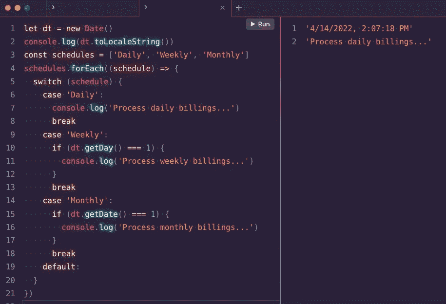
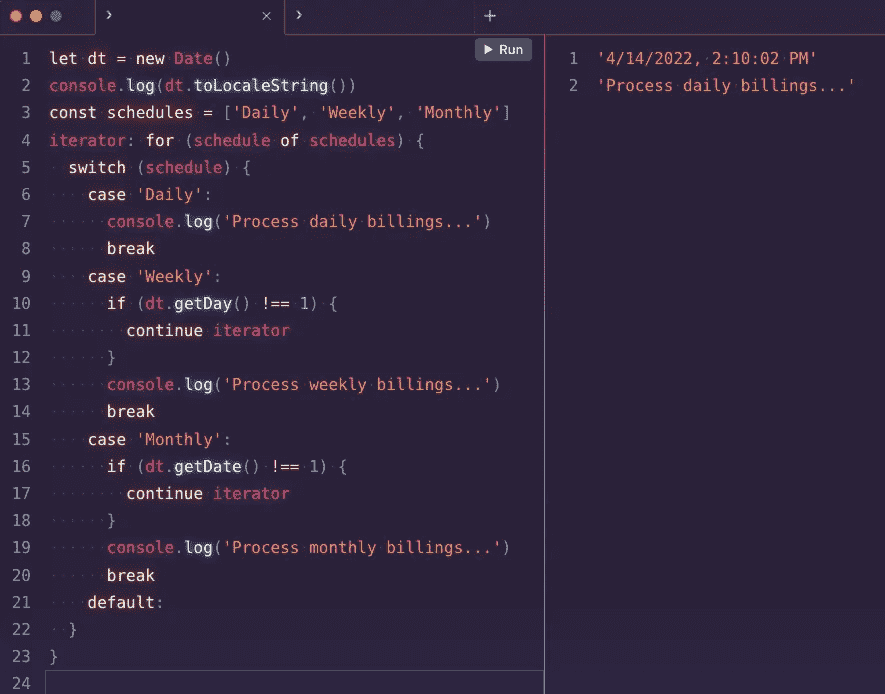

# 迭代数组时有效处理条件异常

> 原文：<https://levelup.gitconnected.com/handling-conditional-exceptions-efficiently-when-iterating-arrays-99a6e6e5c664>

照片由 [NIKHIL](https://unsplash.com/@vinikhill?utm_source=medium&utm_medium=referral) 在 [Unsplash](https://unsplash.com?utm_source=medium&utm_medium=referral) 上拍摄

像往常一样，我写这个故事是因为这个话题不止一次给我带来了问题。有多少次你在遍历一个数组，并且想在当前元素满足某些条件的情况下对它做些什么？一直都是，对吧？

我对编程并不陌生，但对 JavaScript 却相对陌生。在学习 JavaScript 时，我学习了迭代数组的`map()`和`forEach()`方法。直到最近我才意识到，这些方法实际上是数组本身的一部分。数组是一个 JavaScript 对象，带有许多固有的属性和方法。这些方法不是循环，因此缺少循环的某些功能。JavaScript 循环语句包括:

*   做…的同时
*   为了…在
*   为了…的
*   为
*   在…期间

# 方案

让我用一个真实的用例来进一步解释我自己的困境。我需要建立一个每天运行并生成发票的流程；然而，我需要根据我正在处理的项目，将发票分成“每日”、“每周”和“每月”的时间表。

该过程将在由计划触发的服务器上运行。

“每日”发票流程应每天处理，并包含其账单时间表设置为每日且发生在今天的所有项目。

“每周”发票流程应仅在周一处理，并包含其账单时间表设置为每日且发生在上周的所有项目。

“每月”发票流程应仅在每月的第一天进行处理，并包含其开票计划设置为每月且发生在上个月内的所有项目。

作为一名优秀的开发人员，我不会构建三个独立的过程。我将构建一个处理所有三种场景的流程。

# 使用数组方法

在上面的场景中，我使用的是`Array.prototype.forEach`方法。这种方法没有明显的问题，因为我们没有准备好所有的代码。

# Using 循环语句

在这个场景中，我使用带有标签的`for...of`循环语句。你注意到细微的差别了吗？

> 注意:我发现`for...of`循环语句在处理数组时非常有用。也可以用`for...in`代替`Object.keys(myObject).forEach()`。

当使用循环语句时，我可以使用数组方法中没有的另外两个重要语句:break 和 continue。

关键是后一个例子随着时间的推移将更具可读性。当您查看“每周”切换案例时，您会看到我的(负)条件，该条件中唯一的语句是“继续”。与第一个场景相比，在第一个场景中，我的所有代码都在`if`条件中。

> 注意:当你有嵌套循环时，标签的使用非常重要。标签允许您指定继续或中断哪个循环。

# 结论

大多数开发者都同意条件语句(`if`、`switch`等)。)应该尽快结束。在这些结构中有几页语句很难阅读和维护。

使用`break`和`continue`也可以加快处理速度，因为循环实例化会立即停止，而不是继续到循环语句的末尾。

我无法告诉你我遇到过多少次在`map()`或`forEach()`中得到意外结果的情况，因为我的逻辑最终并不总是排除所有条件。这是因为我的条件逻辑在规模上变得难以管理。使用带有`break`和`continue`的循环肯定有助于缓解这种情况。