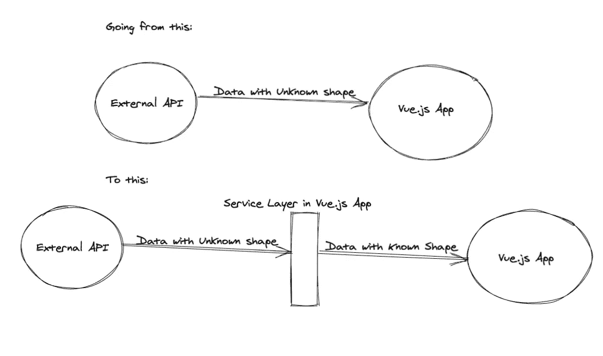

# 在 Vue.js 应用程序的边缘处理数据

> 原文：<https://levelup.gitconnected.com/handling-data-at-the-edge-of-your-vue-js-application-1872782d391a>

> TLDR:在本文中，我们将讨论如何在应用程序边界处理数据。代码在[*vinicius 0026/handling-application-boundary*](https://github.com/vinicius0026/handling-application-boundary)可用

照片由[西尔维亚·巴蒂泽尔](https://unsplash.com/@sylwiabartyzel?utm_source=unsplash&utm_medium=referral&utm_content=creditCopyText)在 [Unsplash](https://unsplash.com/s/photos/boundary?utm_source=unsplash&utm_medium=referral&utm_content=creditCopyText) 上拍摄

这是我们构建大型 Vue.js 应用程序系列的第五篇文章。以下是已发布和计划发布的文章的完整列表:

*   [正确输入的 Vuex 商店](https://medium.com/swlh/properly-typed-vuex-stores-427bf4c6a3d1)—*2020 年 5 月 13 日发布*
*   [以同样的方式在你的 Vue.js 应用中采用 TypeScript](https://medium.com/swlh/adopting-typescript-in-your-vue-js-application-in-a-sane-way-d6bd31757fe5)—*发布于 2020 年 5 月 14 日*
*   [模块化您的 Vue.js 应用程序的逻辑](https://medium.com/swlh/modularizing-the-logic-of-your-vue-js-application-5b920e17c25e)—*2020 年 5 月 15 日发布*
*   [数据驱动组件](https://medium.com/swlh/data-driven-components-2ab02ccbf204)—*2020 年 5 月 25 日发布*
*   在你的 Vue.js 应用边缘处理数据— *发布于 2020 年 6 月 1 日—* **你在这里**

在本系列的前几篇文章中，我们只处理了应用程序本地的数据，这意味着我们数据的整个生命周期都在控制之中。绝大多数应用程序都有一些与外部服务(应用程序的 REST API)的接口，因此数据是在应用程序范围之外生成的。

今天，我们将讨论如何在应用程序的边界处理数据，确保无论何时数据从外部来源进入我们的 Vue.js 应用程序，我们都有适当类型的格式良好的对象。

# 问题是

每当我们接触外部 API 时，我们都无法确切知道将交付给我们的数据的形状。我们必须依赖 API 的文档，如果可用的话，用 API 来构建我们的前端应用程序接口。尽管如此，由于 HTTP JSON APIs 并没有对数据实施特定的模式，我们应该对传入的数据保持一定的不信任。

因此，为了增加我们对应用程序中处理的数据的信心，我们应该在应用程序和消费的 API 之间建立一个清晰的边界，确保通过这个边界进入的所有数据都是预期的形状。

在本文中，我们将构建一个服务层，作为外部 API 的唯一接口，确保流经它的所有内容都是已知的类型。

# 使用服务作为应用程序边界

外部 API 和 Vue.js 应用程序之间的服务层

我们的目标是拥有一个处理所有外部通信的服务层，确保进入我们应用程序的数据处于正确的状态。

我们将扩展我们在以前的文章中讨论过的发票模型，并将为发票的 CRUD 操作构建服务层。

# 查看类型定义

在前一篇[文章](https://viniciusteixeira.tk/2020/05/14/adopting-typescript-in-your-vue-application-in-a-sane-way/)中，我们将发票类型定义为:

发票类型定义

我们为发票添加了类型为`number`或`null`的`id`字段(当发票还没有在服务器端创建时)。

现在，我们希望构建一个服务层，允许我们在发票中进行 CRUD 操作。现在让我们来定义服务框架。

# 服务层

正如我们在构建应用程序的[核心逻辑](https://medium.com/swlh/modularizing-the-logic-of-your-vue-js-application-5b920e17c25e)时所做的那样，我们将使用模块模式来构建我们的服务层。我们可以这样做:

发票服务存根

我们假设 REST API 与我们的应用程序在同一个地方可访问，所有 CRUD 端点都可用。

通过我们的应用程序专门通过这个服务访问外部数据，我们可以确信它将接收到有效的对象，并且具有已知的类型。请注意，我们留下了注释，说明我们需要解析来自 API 的响应。我们仍然需要编写这些解析函数。它们将是应用程序核心逻辑的一部分，在模块中，每个模块负责解析它们相关的数据类型。让我们看看这是什么样子:

# 解析 API 响应

在[的上一篇文章](https://medium.com/swlh/data-driven-components-2ab02ccbf204)中，我们引入了一个`Partial`类型，用于当对象没有一个类型的所有必需属性时。我们可以在这里重用它，将来自 API 的数据视为我们想要的类型的可能部分对象。

API 提供的数据很可能有一些与我们的前端类型定义相同的字段(理想情况下是全部)。但是，为了安全起见，我们将假设任何字段都可能丢失，使用`Partial`类型包装来自 API 的所有数据。

我们来写发票解析函数。我们将把它放在之前创建的发票模块中:

发票模块中的发票解析功能

`parse`函数接受一个未知的数据对象，也可以是未定义的。然后，我们构建一个有效的 Invoice 对象，默认情况下给它一个 null id，并适当地解析其他字段。例如，对于`totalAmount`字段，我们调用`Decimal`构造函数来构建有效的十进制数，而来自 API 的数据肯定不是十进制对象——它可能是字符串或数字，这取决于服务器如何序列化数据。

我们已经将用户和行项目处理委托给他们自己的模块的 parse 函数，我们还没有实现它。让我们现在做那件事。

用户模块中的用户解析函数

因为我们的用户模型非常简单，所以用户`parse`功能很简单。我们只需要为用户名和头像提供默认值，以防来自 API 的数据缺少这些字段。

让我们继续讨论行项目解析函数:

行项目模块中的行项目解析功能

对于行项目解析函数，我们将比率转换为有效的小数对象(就像我们对发票总金额所做的那样)；我们给 quantity 字段一个默认值 0，并将产品解析委托给它自己的模块。让我们看看这是什么样子:

产品模块中的产品解析功能

类似于用户解析函数，解析产品非常简单。

至此，我们已经为所有数据类型编写了解析器，现在我们可以将发票解析功能插入到发票服务中。

下面是我们发票服务的最终实现:

发票服务的最终实现

注意服务变得多么简单，因为我们将解析逻辑委托给了发票模块。服务的职责是与 API 对话，然后将 API 对解析逻辑的响应传送到模块中。这将确保服务的返回类型是已知的。

# 处理有效载荷形状的不匹配

在前面的例子中，我们假设来自 API 的对象的形状类似于 Vue.js 应用程序中的对象的形状。如果我们能控制等式的两边，我们就能(或许应该)强制执行。但有时我们要么不控制服务器端，要么因为任何原因无法改变它。

如果是这种情况，我们可以为来自 API 的数据声明一个特定的类型，将其包装在一个分部类型中，然后在我们的应用程序中将其转换为一个适当的类型。

为了构建一个例子，我们假设有效载荷中的`Product`对象有不同的字段名:`product_name`而不是`name`和`product_desc`而不是`description`。我们可以如下处理这种情况:

处理 API 响应和应用程序定义类型的不匹配

我们已经声明了`ApiProduct`接口，来表示 API 发送的产品的形状。

我们不需要将这个接口导出到应用程序的其余部分，也不需要在我们的类型名称空间中声明它。它仅用于解析函数中。在应用程序的其余部分，我们应该只使用适当的`Types.Product`类型。

如果我们需要从 app `Product`类型转换回 API 的`ApiProduct`类型(例如，当处理产品 CRUD 时)，我们应该向产品模块添加一个函数来进行转换。我们可以随便叫它什么，只要我们在模块间的命名是一致的。

# 获取意外 API 响应的通知

在本文构建的示例中，我们忽略了 API 没有发送预期类型的完整对象这一事实。有时候这可能就是我们需要做的。但是在大多数情况下，我们应该得到通知并修复我们的 API(如果这是我们可以控制的)或解析函数。

我们编写的`parse`函数是实现这一点的最佳场所。如果你正在使用类似于 [Sentry](https://sentry.io/) 的东西来收集前端异常，你可以在有任何缺失字段的情况下引发一个异常，这个异常会被 Sentry 捕获。或者您可以使用[捕获控制台](https://docs.sentry.io/platforms/javascript/#captureconsole)集成，记录一个错误并返回一个有效的默认值(就像我们在示例中所做的那样),这样应用程序仍然可用，即使有一些数据丢失。

# 包扎

我们已经为我们的应用程序创建了一个清晰的边界，使用服务来转换来自外部来源(如我们的后端 API)的数据，确保进入我们应用程序的数据具有已知的形状。

我们在每个模块中创建了`parse`函数来处理从一个潜在的不完整对象到一个已知的符合类型的对象的转换。

我们讨论了如何以完全不同的格式解析数据，而不会用仅转换类型污染我们的全局类型。

产生的服务和解析函数很短，易于推理和测试，使我们对应用程序的状态更有信心。

*原载于 2020 年 6 月 1 日*[*https://viniciusteixeira . tk*](https://viniciusteixeira.tk/2020/06/01/handling-data-at-the-edge-of-your-vuejs-app/)*。*