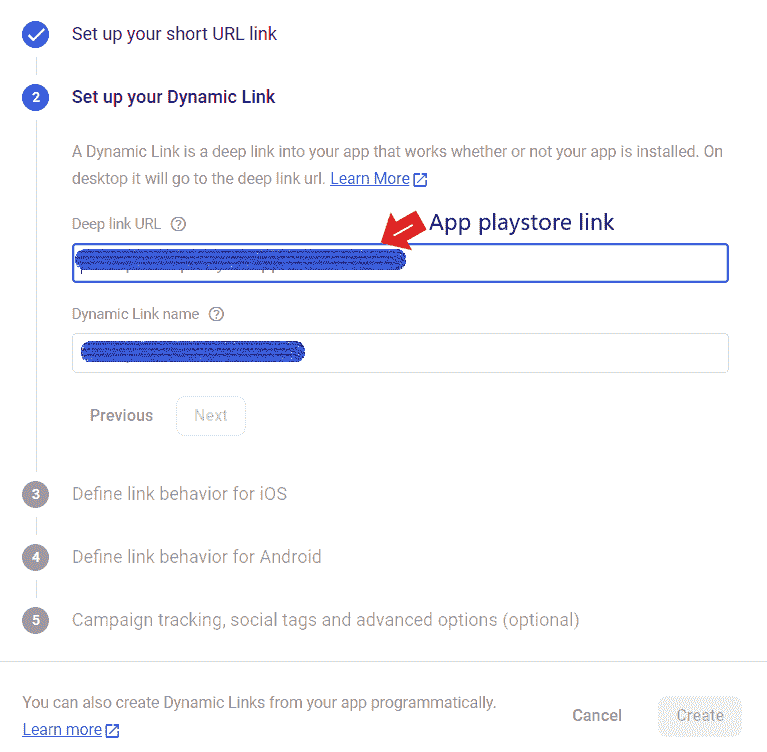

# 用颤振和火焰基处理动态链路

> 原文：<https://levelup.gitconnected.com/handling-dynamic-links-using-flutter-and-firebase-2be5f6a85e1f>

## *一步一步清晰指导用 firebase 创建带有 flutter 动态链接的手机 app*


作者图片

***什么是动态链接？***

> 一个动态链接是一个智能链接，它在你的本地应用程序上提供最佳的用户体验，这样你就可以控制应用程序的具体位置，用户应该被重定向到那里。通过使用动态链接，如果用户没有在他们的手机上安装特定的应用程序，并且如果用户通过手机打开链接，您可以通过强制将特定的应用程序安装到他们的手机上将用户重定向到 Android Play 商店或 Apple 商店。如果用户的手机上没有应用程序，那么用户将重定向到应用程序特定的位置。

在本文中，**动态链接**的使用将通过使用**颤振**和**火基**来实现。

在这种情况下，我们将提供一个最简单的编程方式的解决方案，例如当应用程序安装到用户的手机时，用户重定向到特定的页面。为了明确深层链接的创建及其目的，有一个[虚拟项目](https://github.com/sajee1dw/DynamicLink/tree/master)，有三个页面**主页**、**登录页面**和**个人资料页面**。主页是初始页面，如果应用程序试图打开深层链接，它将重定向到**登录页面**。

你需要有一个现有的颤振项目或使用`flutter create <Your Project Name>`命令创建一个新的颤振项目。

然后有一个名为“ [firebase_dynamic_links](https://pub.dev/packages/firebase_dynamic_links) 的插件，添加到你创建的项目的 **pubspec.yaml** 文件中。

这个插件将帮助我们检测应用程序中的动态链接。

```
firebase_dynamic_links: ^2.0.6
```

让我们按照以下步骤进行吧……..

# 1.设置和初始配置

1.1 作为第一步，我们必须从 firebase.google.com 为动态链接创建创建一个 firebase 项目，并登录到您的谷歌帐户，开始创建一个新的项目，点击“创建一个项目”按钮。


作者图片

1.2 为您的项目提供一个名称，如果您同意条款和条件，请打勾，然后单击“继续”按钮。


作者图片

1.3 然后，您将重定向到此页面，并单击“继续”按钮。


作者图片

1.4 选择您的位置，如果您同意条款和条件，请打勾。


作者图片

1.5 现在，您已经成功创建了一个 Firebase 项目，可以使用了，单击“继续”按钮。


作者图片

1.6 现在点击 android flutter 应用重定向页面上的 android 符号。


作者图片

# 2.Firebase 与 Android 应用程序的集成

2.1 在这一步，我们需要将 Firebase 集成到我们现有的 android 项目中。


作者图片

这里需要特别提到的是，Android 包名要和你的 flutter app 包名匹配，并通过查找；

您的应用名称> android >应用> build.gradle

然后点击“注册 app”。

2.2 然后通过“*Download Google-services . JSON*”下载配置文件。该文件夹将下载到您的默认下载文件夹。点击“下一步”按钮。


作者图片

2.3 之后，将下载的文件夹复制到您的:

您的应用名称> android >应用


作者图片

在成功将 *google-services.json* 文件添加到你的 app 文件夹后，你需要将 Firebase SDK 添加到 *build.gradle* 文件夹。

现在，我们已经成功地完成了初始配置，并将 Firebase 添加到我们现有的项目中。然后我们将进入下一步。

# 3.设置 Firebase

3.1 在 Firebase 控制台的右侧，在重定向到 firebase flutter 动态链接项目后，选择“动态链接”。然后点击“开始”。


作者图片

3.2 在给定的模式“添加 URL 前缀”下选择一个域。这里他们会自动提供一些域名。如果你需要自定义它，你可以输入你喜欢的域名。然后点击“继续”按钮。


作者图片

# 4.在 Firebase 控制台中创建一个动态链接

4.1 点击“新建动态链接”。


作者图片

4.2 设置一个短 URL 链接，点击“下一步”。


作者图片

4.3 然后，您需要在“设置您的动态链接”下设置您的动态链接 URL。有一个到你的应用程序的深层链接，如果一个特定的用户没有安装该应用程序，该用户应该重定向。例如，您可以提供 app play store 链接作为动态链接。链接名称可以是您喜欢的关于动态链接的任何有意义的简称。点击“下一步”。



作者图片

4.4 选择“在浏览器中打开深层链接 URL”选项。在这种情况下，如果您的应用程序中没有安装特定的应用程序，链接将通过浏览器打开。如果没有，你可以选择“在你的 iOS 应用程序中打开深层链接”，但如果是这样，你需要有一个 iOS 应用程序。然后点击“下一步”。


作者图片

4.5 这里我们定义了 Android 的行为。选择“打开您的 android 应用程序中的深层链接”并选择您的 Android 应用程序。然后点击“下一步”。


作者图片

4.6 此外，您可以自定义一些高级选项。然后点击“创建”。


作者图片

4.7 在 URL 下，你会得到你创建的动态链接。


作者图片


作者图片

# 5.处理应用程序内部的动态链接

5.1 这里我们需要安装" [get 包](https://pub.dev/packages/get)"来处理页面间的导航。因此，将这个包添加到您创建的项目的 **pubspec.yaml** 文件中。

```
get: ^4.1.4
```

5.2 让我们在 main.dart 文件中实现下面的方法。该方法将检测 firebase 动态链接并导航到特定页面，在本例中为 *LogInPage()。*

```
void initDynamicLinks() async {
FirebaseDynamicLinks.instance.onLink(
onSuccess: (PendingDynamicLinkData dynamicLink) async {
final Uri deepLink = dynamicLink?.link;
print("deeplink found");
if (deepLink != null) {
print(deepLink);
Get.to(() => LogInPage(title: 'firebase_dynamic_link  navigation'));
}
}, onError: (OnLinkErrorException e) async {
print("deeplink error");
print(e.message);
});
}
```

实现上述方法后，完成 main.dart 文件的代码，如下所示。

```
import 'package:get/get.dart';
import 'package:flutter/material.dart';
import 'package:dynamic_links/homepage.dart';
import 'package:dynamic_links/loginpage.dart';
import 'package:firebase_dynamic_links/firebase_dynamic_links.dart';void main() {
runApp(MyApp());
}
class MyApp extends StatefulWidget {
@override
_MyAppState createState() => _MyAppState();
}
class _MyAppState extends State<MyApp> {
@override
initState() {
super.initState();
this.initDynamicLinks();
}
void initDynamicLinks() async {
FirebaseDynamicLinks.instance.onLink(
onSuccess: (PendingDynamicLinkData dynamicLink) async {
final Uri deepLink = dynamicLink?.link;
print("deeplink found");
if (deepLink != null) {
print(deepLink);
Get.to(() => LogInPage(title: 'firebase_dynamic_link  navigation'));
}
}, onError: (OnLinkErrorException e) async {
print("deeplink error");
print(e.message);
});
}
@override
Widget build(BuildContext context) {
return GetMaterialApp(
title: 'Flutter Demo',
theme: ThemeData(
primarySwatch: Colors.blue,
),
debugShowCheckedModeBanner: false,
home: HomePage(title: 'Demo Home Page'),
);
}
}
```

> 现在，您将使用 Flutter 和 Firebase 成功创建动态链接。在这种情况下，如果你的应用程序通过手机打开，它通常会重定向到主页。如果没有安装应用程序，并试图使用动态链接打开它，它会重定向到登录页面。最后，如果应用程序没有安装并试图打开动态链接，那么用户将重定向到您在创建动态链接时提供的深层链接 URL。

通过这个 [GitHub 库](https://github.com/sajee1dw/DynamicLink/tree/master)，你可以得到进一步的代码实现。

感谢您的阅读！！！

如果你认为这对你有用，那就鼓掌吧。👏