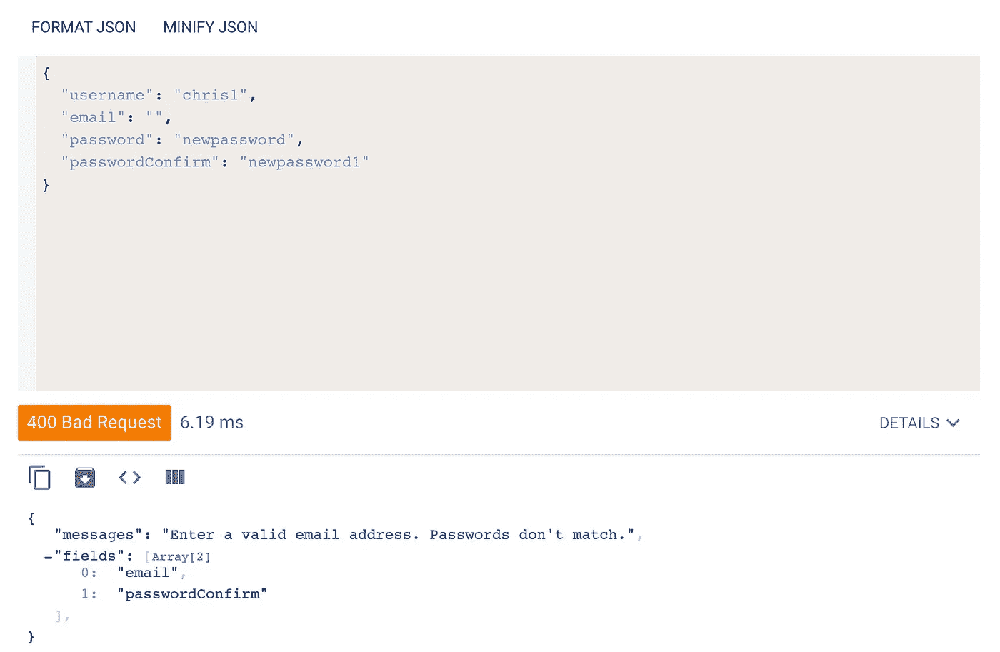

# 在 mongose/Express 中处理错误以在 React 中显示

> 原文：<https://levelup.gitconnected.com/handling-errors-in-mongoose-express-for-display-in-react-d966287f573b>


犯错是人之常情，创建错误处理中间件是神圣的。本文将探讨如何使用 Mongoose 捕获和处理 Express 中的错误，然后使用 React 向最终用户显示这些错误。

本文中使用的所有代码都在这个 [repo](https://github.com/jawblia/errors) 中。

这个图表显示了我们将在文章中讨论的模块。此应用程序正在使用 MERN 堆栈。服务器通过 Express 应用程序运行，并连接到 MongoDB 数据库。前端是一个 React app。这些是我们将用于错误验证的文件:


描述的步骤:

1.  **设置错误处理中间件。**
2.  **处理不同的错误。**
3.  **向浏览器发送错误。**
4.  **在前端显示错误信息。**
5.  **高亮显示** **前端**有错误的字段。

正如你所看到的，这篇文章有几个步骤。假设您对 Express、MongoDB/mongose、身份验证、React/React 路由器和 React 挂钩有所了解。

**//如果已经设置了基本的错误处理中间件和验证，请跳到第 2 步。**

# 1.设置错误处理中间件

Express 附带了错误处理中间件，它应用于中间件堆栈的末端。它们还允许您定义自己的错误处理中间件。与其他中间件不同，它需要四个参数。第一个参数总是存储 [**错误**](https://nodejs.org/api/errors.html) **对象**，这是一个内置的节点类，存储关于错误的信息。

> **app.js**

```
app.use((err, req, res, next) => { console.log('congrats you hit the error middleware');
     console.log(err);}
```

我们的错误处理中间件将会很长，所以我将把函数保存在一个单独的文件中。错误处理中间件位于应用程序堆栈的末端，因此它可以“捕捉”整个应用程序中的错误。我将它们安装在我的主 app.js 文件中——这是该文件的简化版本:

> **app.js**

```
const express = require('express');const cors = require('cors');const authRouter = require('./routers/authRouter');const errorController = require('./controllers/errorController'); const app = express(); app.use(cors()); app.use(express.json());
   app.use(express.urlencoded({extended: true})); app.use('/auth/', authRouter); **app.use(errorController);** module.exports = app;
```

在 errorController 文件中，我们定义了当 Express 检测到错误时将发生的行为。上面，我们只是控制台记录了一个字符串，但是当我们与前端通信时，我们将需要实际发送一个响应对象。

错误的 HTTP 状态代码在 400 和 500 之间。(所有状态代码可在[这里](https://developer.mozilla.org/en-US/docs/Web/HTTP/Status)找到。)我们将在用户注册时处理错误，所以我们的大多数状态代码将是`[400 Bad Request](https://developer.mozilla.org/en-US/docs/Web/HTTP/Status/400): Invalid syntax`。但并不是所有的错误都是验证错误——我们应该为一些我们无法预测的错误做好准备。一个错误总括是`[500 Internal Server error](https://developer.mozilla.org/en-US/docs/Web/HTTP/Status/500): Situation the server doesn't know how to handle`。当出现错误时，这总是最后一道防线。

**error controller . js**

```
module.exports = (err, req, res, next) => {
 res.status(500).send('An unknown error occurred.');}
```

我们希望定制我们的错误，以便最终用户理解他们为什么会看到错误消息。我们如何做到这一点？我将对所有这些示例使用身份验证，因为这种情况有许多不同的错误，需要不同的处理。

抛出的错误是由我在这里应用于用户模型的验证定义的。在这个用户模型中，我们有以下可能的错误:

1.  电子邮件或用户名已被占用。
2.  用户名包含非字母/数字字符。
3.  密码不够长。
4.  密码不匹配(用户必须确认他们的密码)。
5.  一个或多个字段为空。

```
const mongoose = require('mongoose');const bcrypt = require('bcrypt');const validator = require('validator');const Schema = mongoose.Schema;const userSchema = new Schema({ username: { type: String, required: [true, 'Enter a username.'], unique: [true, 'That username is taken.'], lowercase: true, validate: [validator.isAlphanumeric, 'Usernames may only have letters and numbers.']}, email: { type: String, require: [true, 'Enter an email address.'], unique: [true, 'That email address is taken.'], lowercase: true, validate: [validator.isEmail, 'Enter a valid email address.']}, password: { type: String, required: [true, 'Enter a password.'], minLength: [4, 'Password should be at least four characters']}, passwordConfirm: { type: String, required: [true, 'Retype your password.'], validate: { validator: function(el) { return el === this.password; }, message: 'Passwords don\'t match.' } }});//schema middleware to apply before saving
userSchema.pre('save', async function(next) {
    this.password = await bcrypt.hash(this.password, 12);
    this.passwordConfirm = undefined; next();});const User = mongoose.model('User', userSchema);module.exports = User;
```

上面，我概述了注册时可能出现的五个错误。对于 MongoDB，有一个内部的错误分类系统。MongoDB 为控制台记录的错误分配不同的名称和代码。通过控制台记录错误，您可以看到错误堆栈跟踪(错误元数据以及它在应用程序中出现的位置)的样子。


MongoDB 中重复键错误的堆栈跟踪

上面，我概述了注册验证可能出现的五个错误。通过使用 MongoDB 的分类，我可以标记那些特定的错误何时发生。在我提到的五个错误中，它们都属于两个不同的错误类别:

1.  **现有用户名/电子邮件的重复键错误**。通过查看 stacktrace，我知道这个错误的代码是 E11000。
2.  **空字段或格式错误字段的验证错误**。通过查看 stacktrace，我看到这个错误的名称是 ValidationError。

# 2.处理不同的错误

我们知道我们正在处理两种不同的错误，并且我们有它们的代码/名称。因为 MongoDB 将 error 类存储在错误处理中间件的第一个参数中，所以我们可以从该参数中访问 Error 对象的属性。

我们的错误处理中间件现在可以区分两种错误类型，如果错误没有被标记，它将求助于无所不包的错误。

**> errorController.js**

```
module.exports = (err, req, res, next) => { try { console.log('congrats you hit the error middleware');
        if(err.name === 'ValidationError') return err = handleValidationError(err, res);
        if(err.code && err.code == 11000) return err = handleDuplicateKeyError(err, res);} catch(err) {
       res.status(500).send('An unknown error occurred.'); }}
```

我们将重复键错误和验证错误的错误处理分解到单独的函数中。重复键错误的函数如下所示:

**error controller . js**

```
//handle email or username duplicatesconst handleDuplicateKeyError = (err, res) => { const field = Object.keys(err.keyValue); const code = 409;res.status(code).send(`An account with that ${field} already exists.`);}
```

这是怎么回事:

1.  我们可以通过对 error 对象应用 vanilla JS 来提取发生错误的字段，该对象有一个内置的`keyValue`属性。
2.  使用 HTTP 代码列表，我们可以确定 409 中重复条目的正确代码(与服务器中现有数据冲突的请求)。
3.  我们将代码和消息附加到带有`status`和`send`的响应对象上。**需要使用 send 向前端显示错误信息。** `Send`可以推送可以立即在 React 中使用的 JavaScript(字符串、对象、数组)，与`json`方法相反。

我们不仅要在前端显示一条错误消息，还要突出显示需要纠正的字段。因此，除了推送消息之外，我们还将发送数组中抛出错误的字段(用户名或电子邮件字段)。

```
//handle email or username duplicatesconst handleDuplicateKeyError = (err, res) => { const field = Object.keys(err.keyValue); const code = 409; const error = `An account with that ${field} already exists.`; res.status(code).send({messages: error, fields: field});}
```

这相当简单。但是注意，我们没有做两件事:1。使用我们添加到用户模型中的错误消息，或者 2。创建一次处理多个错误的能力。我们将在验证函数中完成这两项工作:

```
//handle field formatting, empty fields, and mismatched passwordsconst handleValidationError = (err, res) => { let errors = Object.values(err.errors).map(el => el.message); let fields = Object.values(err.errors).map(el => el.path); let code = 400; if(errors.length > 1) { const formattedErrors = errors.join(' '); res.status(code).send({messages: formattedErrors, fields:     fields}); } else { res.status(code).send({messages: errors, fields: fields}) }}
```

在这个函数中，我们在上面所做的基础上又增加了:

1.  使用`el.message`获取我们添加到用户模型中的错误消息。
2.  循环遍历 error 对象以存储多个错误(如果有多个错误)。
3.  检测错误是否大于 1，并用空格将所有消息连接在一起，使它们成为一个字符串。

为什么我们需要用空格来连接消息？没有它，它们将是一组消息。为了在前端显示它，**错误信息需要是一个单独的字符串**。为了测试这一点，我从一个 API 客户端发出了一个请求(我使用的是 Google 的高级 RESTful 客户端)，并故意留下了两个错误:电子邮件字段为空和密码不匹配。



在下面的响应中，您可以看到“messages”值现在是一个字符串，而“fields”值仍然是一个数组。

我们现在准备向浏览器发送错误消息，我们的错误控制器如下所示:

```
//handle email or usename duplicatesconst handleDuplicateKeyError = (err, res) => {
   const field = Object.keys(err.keyValue);
   const code = 409;
   const error = `An account with that ${field} already exists.`;
   res.status(code).send({messages: error, fields: field});}//handle field formatting, empty fields, and mismatched passwordsconst handleValidationError = (err, res) => {
   let errors = Object.values(err.errors).map(el => el.message);
   let fields = Object.values(err.errors).map(el => el.path);
   let code = 400; if(errors.length > 1) {
     const formattedErrors = errors.join('')res
         .status(code)
         .send({messages: formattedErrors, fields: fields}); } else { res
            .status(code)
            .send({messages: errors, fields: fields}
     }
}//error controller functionmodule.exports = (err, req, res, next) => {try { if(err.name === 'ValidationError') return err = handleValidationError(err, res);
    if(err.code && err.code == 11000) return err = handleDuplicateKeyError(err, res);
    } catch(err) {
        res
          .status(500)
          .send('An unknown error occurred.');
}
}
```

# 3.向浏览器发送错误

如何从 Express → React 得到这些错误？我们需要从像 Google 的 REST 客户端或 Postman 这样的程序调用 API，转移到浏览器中。

我的登记表是这样的。它在名为 Register.js 的 React 组件中。


Register.js 中的注册表

我将使用一个名为 useForm.js 的定制钩子使这个表单有状态，在这个钩子中，我将跟踪和存储表单值，并处理提交事件。

错误处理将出现在提交事件之后，在对服务器的 POST 请求中。

> useForm.js

```
import { useState } from 'react';
import { useHistory } from 'react-router-dom';
import axios from 'axios';export default function useForm({ initialValues }) { let history = useHistory();
    const [values, setValues] = useState(initialValues || {});
    **const [error, setError] = useState(null);**//track form values
const handleChange = event => {
    const value = event.target.value;
    const name = event.target.name;
       setValues({
          ...values,
          [name]: value
        });
     };//submit form when enter key is pressed
const handleKeyDown = event => {
     const enter = 13;
     if(event.keyCode === enter) {
       handleSubmit(event);
     }
   }//submit form when submit button is clicked
const handleSubmit = event => {
     event.preventDefault();
     submitData({ values });
};//send data to database
const submitData = async (formValues) => {
     const url = 'http://127.0.0.1:5000/';
     const dataObject = formValues.values;
     const { username, email, password, passwordConfirm } = dataObject;try {
await axios ({
method: 'POST',
url: `${url}auth/register`,
data: {
   username: username,
   email: email,
   password: password,
   passwordConfirm: passwordConfirm
},
headers: new Headers({ 'Content-Type': 'application/json' })
}).then(res => {
     history.push('/home');
})
} catch(err) {
     **setError(err.response.data);**
   }
};return { handleChange,
   handleKeyDown,
   values,
   handleSubmit,
   **error**
  }
}
```

当 POST 请求抛出一个错误时，我们在`err.response.data`中捕获该错误，并将其存储在上面的状态中。然后我们从钩子返回它，所以我们可以在我们的注册表中使用它。

# 4.在前端显示错误信息。

我们返回的值是一个带有字段数组和消息字符串的对象。


我们想要显示的消息在`messages`值中。

为了在注册表单中显示它，我们可以创建一个错误组件，在出现错误时有条件地出现。错误的初始状态是`null`，所以错误将评估为假，直到状态被更新为消息。

>注册. js

```
import React from 'react';
import FormInput from './../components/FormInput';
import CTA from './../components/CTA';
import Prompt from './../components/Prompt';
import ConfirmPasswordInput from './../components/ConfirmPasswordInput';
import useForm from './../hooks/useForm';
import Error from './../components/Error';export default function Register() {const { values, handleChange, handleKeyDown, handleSubmit, error } = useForm({initialValues: {
   email: '',
   username: '',
   password: '',
   passwordConfirm: ''
}
});return(
  <div className="page">
     <div className="inlineForm">
        <h3>Register</h3>
     <div className="inlineForm__notif">
       ** {error && <Error error={error.messages}/> }**
    </div> <FormInput type={"email"} placeholder={"Email"} name={"email"} value={values.email} handleChange={handleChange} handleKeyDown={handleKeyDown} />///rest of the form fields
```

所以，如果有错误，就会出现错误组件，它会以`error.messages`为道具。误差分量本身非常简单:

Error.js

```
import React from 'react';export default function Error(props) {return(
  <div className="notifError">
     <h5>{props.error}</h5>
  </div>
  )
}
```

当出现错误时，通知会出现在表单的顶部:


该通知将持续到发出另一个请求，但是可以很容易地通过超时功能自动取消。

现在，最后一部分是如何让抛出错误的字段有一个红色的高亮显示，这样最终用户就可以修复它们了。

# 5.突出显示前端有错误的字段。

我们的字段存储在`error.fields`键中。如何在我们的表单中动态反映字段数组的错误状态，大概是这样的，`error.fields = ["username", "password"]`？

这又是登记表。

>注册. js

```
export default function Register() {const { values, handleChange, handleKeyDown, handleSubmit, error } = useForm({initialValues: {
   email: '',
   username: '',
   password: '',
   passwordConfirm: ''
}
});**let invalidFields;
error ? invalidFields = error.fields : invalidFields = [];**return(
  <div className="page">
     <div className="inlineForm">
        <h3>Register</h3>
     <div className="inlineForm__notif">
        {error && <Error error={error.messages}/> }
    </div><FormInput type={"email"} placeholder={"Email"} name={"email"} value={values.email} handleChange={handleChange} handleKeyDown={handleKeyDown} **fail={invalidFields.includes("email")}**/>///rest of the form fields
```

1.  初始化一个名为 invalidFields 的变量。如果有错误(错误！== null)，invalidFields 等于误用字段的数组。如果没有错误，就等于空数组。
2.  在表单字段组件中创建一个名为`fail`的属性，它将决定字段是否无效。道具中值也应该评估为`true`或`false`。如果`invalidFields.includes('email')`为真，该字段将无效。

在 field 组件中，我们必须根据`fail`是真还是假来改变它的样式。如果是假的，样式将保持不变。如果是真的，我们将向它添加一个应用红色边框的错误类。

下面是我的 FormInput 组件的代码

> FormInput.js

```
import React from 'react';export default function FormInput(props) {
    let fail = props.fail;return(
   <> <input type={props.type} name="input"
            ** className={`input ${fail ? "input--fail" : null} `}**
             placeholder={props.placeholder} name={props.name}
             value={props.value} onChange={props.handleChange}
             onKeyDown={props.handleKeyDown}
       />
   </>
  )
}
```

在 SCSS。输入-失败类在应用了该类的字段周围添加红色边框。


提交一个空表单会突出显示每个字段。

这就是在 Express/mongose 中显示错误的全部内容。在这方面可以做的还有很多。如果你想看这个演示的所有代码，回购链接是[这里](https://github.com/jawblia/errors)。可以在那里找到整个表单和服务器代码。

## 关于错误处理的进一步阅读:

*   默认快递出错中间件:【https://expressjs.com/en/guide/error-handling.html 
*   快递处理错误:【https://www.robinwieruch.de/node-express-error-handling/ 
*   Express to React 错误处理:[https://it next . io/JavaScript-error-handling-from-express-js-to-React-810 de b5 e 2e 28](https://itnext.io/javascript-error-handling-from-express-js-to-react-810deb5e5e28)
*   HTTP 状态码:[https://developer.mozilla.org/en-US/docs/Web/HTTP/Status](https://developer.mozilla.org/en-US/docs/Web/HTTP/Status)