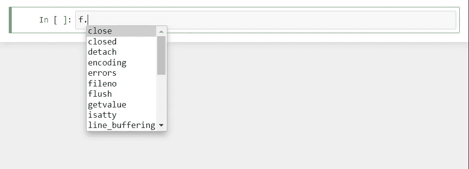

# 用 Python 处理文件

> 原文：<https://levelup.gitconnected.com/handling-files-in-python-76bbefa58663>

## 学习如何使用不同的库在 Python 中执行不同的功能来处理文件的指南。

# io 模块

io 模块实现了内存中类似文件的对象。然后，该对象可以用作输出的输入。

```
**>>> import** io
```

让我们创建一个句子，然后为该句子创建一个目标文件..

```
>>> txt **=** 'Python is fun and easy'>>> f **=** io.StringIO(txt)
```

这将创建一个对象“f ”,我们可以像对待一个文件一样对待它。



```
>>> f.read()
'Python is fun and easy'>>> f.write(' Python is nice languague')
25
```

将光标设置回开始。

```
>>> f.seek(0)
0>>> f.read()
'Python is fun and easy Python is nice languague'
```

# 操作系统模块

操作系统模块有助于与操作系统进行交互。它可以执行的一些功能是以编程方式打开和读取文件。让我们来看看它的一些功能。

```
**>>> import** os
```

获取当前目录。

```
>>> os.getcwd()
'D:\\JAY\\projects\\Python_guide\\Python modules and packages'
```

列出当前目录和任何其他目录中的目录。

```
>>> os.listdir()
['.ipynb_checkpoints',
 'Collections module in Python.ipynb',
 'Datetime module in python.ipynb',
 'Debugger module in Python.ipynb',
 'Handling files in\xa0Python.ipynb',
 'Modules and packages in python',
 'Name and main in python',
 'README.md',
 'Regular expression in Python.ipynb',
 'Timing module in Python - timeit.ipynb']>>> os.listdir("C:\\Users")
['All Users', 'Default', 'Default User', 'desktop.ini', 'Jayashree', 'Public']
```

# shutil 模块

内置的 shutil 模块有助于将文件移动到不同的位置。

```
**>>> import** shutil>>> shutil.move('demo.txt','D:\\demo')
'D:\\demo\\demo.txt'>>> os.listdir('D:\\demo')
['demo.txt']>>> shutil.move('D:\\demo\demo.txt', os.getcwd())
'D:\\JAY\\projects\\Python_guide\\Python modules and packages\\demo.txt'>>> os.listdir()
['.ipynb_checkpoints',
 'Collections module in Python.ipynb',
 'Datetime module in python.ipynb',
 'Debugger module in Python.ipynb',
 'demo.txt',
 'Handling files in\xa0Python.ipynb',
 'Modules and packages in python',
 'Name and main in python',
 'README.md',
 'Regular expression in Python.ipynb',
 'Timing module in Python - timeit.ipynb']
```

# send2trash 模块

os 模块提供了 3 种删除文件的方法:

*   os.unlink(path ),它删除您提供的路径中的文件
*   os.rmdir(path ),它在您提供的路径下删除一个文件夹(文件夹必须为空)
*   这是最危险的，因为它将删除路径中包含的所有文件和文件夹。

所有这些方法都不能逆转！这意味着如果你犯了一个错误，你将无法恢复文件。相反，我们将使用 send2trash 模块。一种更安全的替代方法，将删除的文件发送到垃圾箱，而不是永久删除。

```
**>>> !**pip install send2trash
Requirement already satisfied: send2trash in d:\anaconda3\lib\site-packages (1.5.0)**>>> import** send2trash>>> os.listdir()
['.ipynb_checkpoints',
 'Collections module in Python.ipynb',
 'Datetime module in python.ipynb',
 'Debugger module in Python.ipynb',
 'demo.txt',
 'Handling files in\xa0Python.ipynb',
 'Modules and packages in python',
 'Name and main in python',
 'README.md',
 'Regular expression in Python.ipynb',
 'Timing module in Python - timeit.ipynb']>>> send2trash.send2trash('demo.txt')>>> os.listdir()
['.ipynb_checkpoints',
 'Collections module in Python.ipynb',
 'Datetime module in python.ipynb',
 'Debugger module in Python.ipynb',
 'Handling files in\xa0Python.ipynb',
 'Modules and packages in python',
 'Name and main in python',
 'README.md',
 'Regular expression in Python.ipynb',
 'Timing module in Python - timeit.ipynb']
```

# 浏览目录

os.walk()方法有助于递归遍历文件和文件夹。

```
>>> os.listdir()
['.ipynb_checkpoints',
 'Collections module in Python.ipynb',
 'Datetime module in python.ipynb',
 'Debugger module in Python.ipynb',
 'Handling files in\xa0Python.ipynb',
 'Modules and packages in python',
 'Name and main in python',
 'README.md',
 'Regular expression in Python.ipynb',
 'Timing module in Python - timeit.ipynb']**>>> for** folder, sub_folder, files **in** os.walk('..\Python modules and packages'):
        print("Currently looking at folder: " **+** folder)
        print('\n') print("The subfolders are: ")
        **for** sub_fold **in** sub_folder:
            print("\t Subfolder: " **+** sub_fold)
        print('\n') print("The files are: ")
        **for** f **in** files:
            print("\t File: " **+** f)
        print('\n')Currently looking at folder: ..\Python modules and packages The subfolders are: 
	 Subfolder: .ipynb_checkpoints
	 Subfolder: Modules and packages in python
	 Subfolder: Name and main in python The files are: 
	 File: Collections module in Python.ipynb
	 File: Datetime module in python.ipynb
	 File: Debugger module in Python.ipynb
	 File: Handling files in Python.ipynb
	 File: README.md
	 File: Regular expression in Python.ipynb
	 File: Timing module in Python - timeit.ipynb Currently looking at folder: ..\Python modules and packages\.ipynb_checkpoints The subfolders are: The files are: 
	 File: Handling files in Python-checkpoint.ipynb Currently looking at folder: ..\Python modules and packages\Modules and packages in python The subfolders are: 
	 Subfolder: MyPackage The files are: 
	 File: program.py
	 File: tree.txt Currently looking at folder: ..\Python modules and packages\Modules and packages in python\MyPackage The subfolders are: 
	 Subfolder: SubPackage The files are: 
	 File: main_script.py
	 File: __init__.py Currently looking at folder: ..\Python modules and packages\Modules and packages in python\MyPackage\SubPackage The subfolders are: The files are: 
	 File: sub_script.py
	 File: __init__.py Currently looking at folder: ..\Python modules and packages\Name and main in python The subfolders are: The files are: 
	 File: test1.py
	 File: test2.py
```

# zip 文件库

Python 可以使用 zipfile 库对文件进行压缩和解压缩。它可以用来压缩和提取文件夹或文件。

因此，让我们从创建要压缩的文件开始。

```
>>> f **=** open('file1.txt', 'w+')
>>> f.write("This is file 1")
>>> f.close()>>> f **=** open('file2.txt', 'w+')
>>> f.write("This is file 2")
>>> f.close()
```

正在导入库。

```
**>>> import** zipfile
```

首先，将创建 zip 文件，然后我们写入它。然后将创建 zip 文件。

```
>>> comp_file **=** zipfile.ZipFile('comp_file.zip', 'w')>>> comp_file.write('file1.txt', compress_type **=** zipfile.ZIP_DEFLATED)
>>> comp_file.write('file2.txt', compress_type **=** zipfile.ZIP_DEFLATED)>>> comp_file.close()
```

现在让我们尝试从 zip 文件中提取文件。extractall()方法可以用来获取所有文件。extract()方法可以用来获取单个文件。

```
>>> zip_obj **=** zipfile.ZipFile('comp_file.zip','r')
>>> zip_obj.extractall("extracted_content")
```

zip 文件中的所有文件都保存在名为“extracted_content”的文件夹中。

如果你想一次存档所有的 zip 文件，可以使用 shutil libraray。shutil 库可以接受一个格式参数，格式是存档格式:“zip”、“tar”、“gztar”、“bztar”或“xztar”之一。

```
>>> pwd
'D:\\JAY\\projects\\Python_guide\\Python modules and packages'>>> directory_to_zip**=**'D:\\JAY\\projects\\Python_guide\\Python modules and packages'
```

现在创建 zip 存档。

```
>>> output_file **=** 'example'
```

只需填写输出文件名和要压缩的目录。

```
>>> shutil.make_archive(output_file,'zip',directory_to_zip)
'D:\\JAY\\projects\\Python_guide\\Python modules and packages\\example.zip'
```

解压缩 zip 存档。

```
>>> shutil.unpack_archive(output_file,directory_to_extract,'zip')
```

此处参考笔记本[。](https://github.com/jayashree8/Python_guide/blob/master/Python%20modules%20and%20packages/Handling%20files%20in%C2%A0Python.ipynb)

## 学习 Python 可以参考的入门书籍:

[](https://amzn.to/3yDY4To) [## Python 速成班，第二版:基于项目的编程入门实践

### 世界上最畅销的 Python 书籍的第二版。一个快速的，没有废话的 Python 编程指南…](https://amzn.to/3yDY4To) [](https://amzn.to/3vtvQZv) [## 艰难地学习 Python:一个非常简单的介绍可怕的美丽世界…

### 你会学习 Python！Zed Shaw 完善了世界上最好的学习 Python 的系统。遵循它，你会…](https://amzn.to/3vtvQZv) [](https://amzn.to/3urluYI) [## 思考 Python，2e:如何像计算机科学家一样思考

### 思考 Python，2e:如何像计算机科学家一样思考](https://amzn.to/3urluYI) 

## 学习 Python 可以参考的高级书籍:

[](https://amzn.to/3fMzVBn) [## 编程 Python:强大的面向对象编程

### 如果你已经掌握了 Python 的基础，你就可以开始使用它来完成真正的工作了。编程 Python 将…](https://amzn.to/3fMzVBn) [](https://amzn.to/34oFFMl) [## 高级 Python 编程:使用以下工具构建高性能、并发和多线程应用

### 关键特性使用 Dask 和 PySpark Master 技能在集群上设置和运行分布式算法，以准确地…](https://amzn.to/34oFFMl) 

> *联系我:* [*LinkedIn*](https://www.linkedin.com/in/jayashree-domala8/)
> 
> *查看我的其他作品:* [*GitHub*](https://github.com/jayashree8)