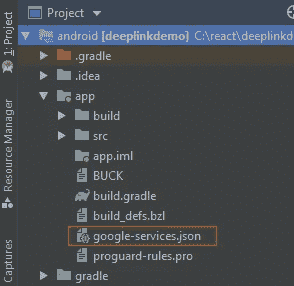

# 处理传入的动态链接

> 原文：<https://levelup.gitconnected.com/handling-incoming-dynamic-links-22dfc64c4ddd>


这是 React Native 深度链接简化系列的第 2 部分，在第 1 部分[中，我们学习了如何添加深度链接。](https://iamshadmirza.hashnode.dev/react-native-deep-linking-simplified-cjzj6qf8900003ss1zv178dm9)

在这篇文章中，我们的目标是学习如何像专家一样处理外来链接。
我们还将看到如何根据传入链接将用户路由到特定屏幕。

> *术语***用于* `*https*` *方案，* ***动态链接*** *用于* `*app*` *方案。我们可以用这两个词来导航我们的用户，所以不要混淆这两个词。**

*让我们开始吧。*

*本文分为两个主要部分。我们将按如下方式讨论这些问题:*

1.  *项目设置*
2.  *测试设备上的动态链接*

*我们将使用`react-native-firebase`模块在 React 本地项目中配置动态链接。它包括 4 个简单的步骤:*

# *涉及的步骤:-*

1.  *创建一个 React 本地项目*
2.  *在 firebase 控制台上创建应用程序*
3.  *添加 react-native-firebase*
4.  *添加 Firebase 动态链接模块*

# *第一步。创建一个 React 本地项目*

*按照本系列[第 1 部分](https://iamshadmirza.hashnode.dev/react-native-deep-linking-simplified-cjzj6qf8900003ss1zv178dm9)中的步骤，按照描述添加深度链接。我们将通过之前创建的相同动态/深度链接添加`firebase-invites`支持。*

# *第二步。在 firebase 控制台上创建应用程序*

*让我们在 firebase 控制台上创建一个应用程序来使用 Firebase SDK。沿着这个[链接](https://console.firebase.google.com/)创建一个应用程序。*

*   *点击**添加项目**创建一个项目。*
*   *按照步骤添加 Android/iOS 应用。确保**注册应用**部分中的项目名称与您的 react-native 项目匹配(在我们的例子中是`com.deeplinkdemo`)。*

**

*   *下载`google-services.json`粘贴到`/deeplinkdemo/android/app/`里面。确保位置正确。*

**

*   *按照说明添加库并同步项目。它看起来会像这样:*
*   *项目级 build.gradle*

```
*dependencies {
classpath("com.android.tools.build:gradle:3.4.1")
classpath 'com.google.gms:google-services:4.3.0' //Add this line
}*
```

*   *应用级 build.gradle*

```
*dependendies {
//...
implementation 'com.google.firebase:firebase-core:17.0.1' // Add this line
}
//Add to the bottom of the file
apply plugin: 'com.google.gms.google-services'*
```

> *请使用最新的 firebase 依赖项。您也可以从 Android Studio 添加它，方法是转到:
> 文件- >项目结构- >依赖项*

# *第三步。添加 react-native-firebase*

*转到您的项目根目录并运行以下命令:*

```
*npm install react-native-firebase --save*
```

*(可选)如果您的 react-native 版本低于 0.60，请链接该模块。*

```
*react-native link react-native-firebase*
```

> **React 原生版本(> 0.60)支持* [*自动链接*](https://facebook.github.io/react-native/blog/2019/07/03/version-60#native-modules-are-now-autolinked)*

*如果你对链接`react-native-firebase`有任何问题，或者你正在使用 React Native 的早期版本，请遵循手动链接指南。*

*查看官方[文件](https://rnfirebase.io/docs/v5.x.x/installation/android)了解更新的方法。*

# *机器人*

*   *将`react-native-firebase`添加到应用级`build.gradle`*

```
*dependencies {
//...
implementation project(':react-native-firebase') //Add this line
}*
```

*   *编辑`settings.gradle`*

```
*//Add these lines
include ':react-native-firebase'
project(':react-native-firebase').projectDir = new File(rootProject.projectDir, '../node_modules/react-native-firebase/android')*
```

*   *编辑`MainApplication.java`*

```
*...
import io.invertase.firebase.RNFirebasePackage; // import this

@Override
protected List<ReactPackage> getPackages() {
return Arrays.<ReactPackage>asList(
new MainReactPackage(),
new RNFirebasePackage(), // Add this line
);
}*
```

*   *同步项目，我们准备好了。*

# *第四步。添加 Firebase 动态链接:*

*我们必须包括其他模块，因为我们之前导入的`RNFirebasePackage`只提供核心功能。
如果你去 [Firebase 邀请文档](https://firebase.google.com/docs/invites)，你会看到一个警告。*

> *不推荐使用 Firebase 邀请。您可以使用 Firebase 动态链接创建跨平台的邀请链接，这些链接在应用程序安装后仍然有效。有关更多详细信息，请参见迁移指南。*

*这意味着我们最终将在我们的项目中使用 [Firebase 动态链接](https://firebase.google.com/docs/dynamic-links/)模块。*

*   *将依赖关系添加到`android/app/build.gradle`文件:*

```
*dependencies {
 // ...
 implementation "com.google.firebase:firebase-dynamic-links:19.0.0"
}*
```

*   *编辑`MainApplication.java`:*

```
*import ...
//import this package
import io.invertase.firebase.links.RNFirebaseLinksPackage;
@Override
protected List<ReactPackage> getPackages() {
 return Arrays.<ReactPackage>asList(
 new MainReactPackage(),
 new RNFirebasePackage(),
 new RNFirebaseLinksPackage() // Add this line
 );
}*
```

*   *同步项目，我们就完成了。让我们转到第二部分。*

*如果你遇到一些依赖问题，那么`Migrate to AndroidX`。查看本文末尾的**如何解决依赖问题**。*

> **更新方法见* [*公文*](https://rnfirebase.io/docs/v5.x.x/links/android#Configure-Android-Project) *。**

# *测试设备上的动态链接*

*这一部分包括两个步骤*

1.  *创建一个动态链接。*
2.  *处理传入链接。*

*让我们在 Firebase 控制台上生成一个链接，并更新我们的意图过滤器。这个链接必须是唯一的，由 *firebase* 自己提供。遵循以下简单步骤:*

*   *在 Firebase 控制台上选择您的应用，然后点击**开始***

**

*   *添加一个**域**。可能需要几次尝试才能找到一个独特的域名。当你找到一个的时候把它记下来。*(例如:* `*https://deeplinkblogdemo.page.link*` *(在我的例子中)**

**

*   *编辑`AndroidManifest.xml`并用您刚刚创建的*域*更新`intent-filter`中的`<data>`标签:*

```
*<data android:scheme="https"
android:host="deeplinkblogdemo.page.link" />*
```

*   *点击**新动态链接**并按照步骤操作。在*设置您的动态链接*部分提供*深度链接 URL* 和*动态链接名称*。*

**

*现在我们已经创建了我们的动态链接，我们可以继续下一步。*

*项目的根文件`App.js`是添加处理逻辑的最佳位置。所以让我们开始编辑根文件。遵循以下三个简单的步骤*

1.  *导入 firebase 模块。*

```
*async componentDidMount() {
  let url = await firebase.links().getInitialLink();
  console.log('incoming url', url);
}*
```

*2.用任意浏览器打开创建的*动态链接*并查看日志。如果你能看到进来的网址，欢呼吧。*

*我们可以在这里添加条件来检查 url 中的某个匹配。在此基础上，我们可以根据需要编写函数。例如:*

```
*async componentDidMount() { 
  let url = await firebase.links().getInitialLink(); if(url === 'some_condition_here'){ } 
}*
```

*添加导航路径或任何你需要的东西，你就可以开始了。我们将在 React 本地应用中使用这一逻辑构建一个推荐系统，因为这将是展示动态链接的完美用例。所以不要错过这个系列的第三部分也是最后一部分。*

# *如何解决依赖问题*

*由于最近发生在`AndroidX`库上的变化，你可能会遇到一些依赖问题(因为我就是这么做的),下面是我解决这些问题的方法:*

1.  *用 Android Studio 打开你的*项目*，选择`app`文件夹。*
2.  *转到*折射器- >迁移到 AndroidX - >做折射器*。*
3.  *同步项目。如果问题仍然存在，请执行步骤 4 和 5。*
4.  *您可能会在下面的*构建输出*中看到一个*构建问题列表*。仔细检查每一个，找到冲突的变量。*
5.  *按`ALT + ENTER`键，导入依赖关系。去掉已经存在的旧的，我们就完成了。*

*我希望你能够解决这些问题，并成功地实现 firebase 的动态链接。如果你觉得这篇文章有帮助，请分享。
下篇见。河鲱*