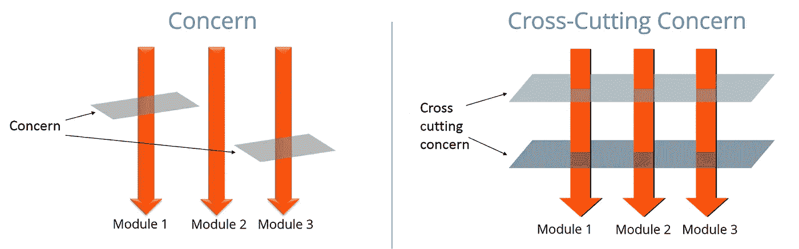

# 正确处理角度应用中的负载指示器

> 原文：<https://levelup.gitconnected.com/handling-loading-indicators-in-angular-applications-the-right-way-11ff8b8896ba>

## 一个优雅的，没有麻烦的方式来摆脱无意义的技术管道在您的业务角组件。


图片由来自 [Pixabay](https://pixabay.com/?utm_source=link-attribution&utm_medium=referral&utm_campaign=image&utm_content=4494907) 的[迈克尔·考尔](https://pixabay.com/users/emkanicepic-7638451/?utm_source=link-attribution&utm_medium=referral&utm_campaign=image&utm_content=4494907)拍摄

今天的 web 应用程序通常解决业务问题，这些问题有时非常复杂，很难编写可读的代码。很多时候，会出现这样的情况:一段纯技术性的代码交织成一个代码库，实现某种业务需求。在许多情况下，这样的*噪音*会不必要地混淆组件的*业务本质*。

装载指示器是这种必要的*技术管道*的典型例子。在我见过的大多数大角度代码库中，似乎没有人关心这样的代码会污染业务代码。

在本文中，我将向您展示我提出并在我的一个项目中成功实现的一种方法，该方法重写了一个用于管理大量政府文档的大型遗留解决方案。

# 🪒·奥卡姆剃刀及其问题

解决此类问题的典型方法相当简单，在控制器中使用布尔标志，并有条件地显示和隐藏加载微调器，通常如下所示:

```
export class MyComponent implements OnInit {
  ...
  isLoading = false; ngOnInit(): void {
    this.**isLoading = true**;

    this.itemService.getItems.subscribe(items => {
      ...
      this.**isLoading = false**;
    });
  }
} ...
<app-loading ***ngIf="isLoading"**></app-loading>
<div *ngIf="!isLoading">
  ...
</div>
```

这种解决问题的方法会有一些问题，这些问题在较大的代码库中会变得最明显:

*   *不必要的代码重复*——在模板、控制器和样式表中——在每种情况下，当实现加载指示器时，会有重复出现的布尔标志、带有加载指示器的 HTML 和带有这些指示器的定位调整的 CSS。
*   *风格不一致*——每个开发人员以稍微不同的方式编写这样的逻辑——当然，通过将这一点放入代码评审指南中可以实现某种代码一致性，但是这样的方法将导致毫无目的的浪费生产时间。
*   *烦人的编码*——重复实现这种循环行为很快就变成了烦人的杂务。
*   *使用异步管道时很难实现*——给转换 RxJS 流的 tap 操作符带来副作用被认为是一种不好的做法。

# 📜为什么

当我开始我目前的项目时，除了代码重复和糟糕的表单系统设计之外，最大的问题之一是，90 %的组件缺少加载指示器，而这些都是非常需要的。每个指示器的实现都有点不同，这给阅读代码的人增加了不必要的认知负担。

当我在圆桌会议上提出这个问题后，得到了项目涉众的批准，我立即知道使用一个简单的解决方案(如上一节中介绍的)是行不通的。因此，我创建了一个新解决方案应该为项目带来的目标列表:

*   处理装载状态应该是一个*横切关注点*——它不应该*通过*低级技术* *管道*污染*业务代码，
*   应该*防止*组件中代码*的*出现，**
*   它应该减少代码评审中潜在的代码一致性问题，
*   它应该*与集中式 HTTP/错误处理器*合作——通过隐藏所有活动的加载指示器。



贯穿各领域的问题。来源:[edureka.co](https://www.edureka.co/community/30681/concern-and-cross-cutting-concern-in-spring-aop)

…还有我的队友提出的一些额外的功能需求:

*   它必须支持*在单个组件中绑定到不同可观察对象*的多个加载指示器。
*   如有必要，它必须支持在当前组件中设置外来组件的加载指示器状态。

# 💡我的解决方案

我为角度应用中的*无样板负载指示器提供的解决方案包括两个主要部分:*

*   *loading directive*–一个指令，基于一个布尔输入值，通过一个带有动画加载指示器的半透明覆盖来覆盖其主机元素。角度组件形式的动画加载指示器本身是从遗留代码中重用的，并使用组件工厂动态地放置到覆盖图中。


LoadingDirective 写成[appIsLoading]="true "

*   *loading service*–放置在 *SharedModule* 中的全局共享服务。如果你对 Angular 中的模块化结构感兴趣，即核心模块和共享模块之间微妙但重要的细微差别，请查看下面的文章。

[](/where-shall-i-put-that-core-vs-shared-module-in-angular-5fdad16fcecc) [## “我该把它放在哪里？”-核心模块与角度共享模块

### 核心模块与共享模块的角度，专业的提示和技巧，加上一个经验法则，以确定哪个模块放置您的…

levelup.gitconnected.com](/where-shall-i-put-that-core-vs-shared-module-in-angular-5fdad16fcecc) 

## 模板中的用法

好了，让我们直接进入使用示例。只需将 LoadingService 注入到组件中，并将其与 LoadingDirective 结合使用:

```
*export class* MyComponent {
  ...

  *constructor*(
    *public* loadingService: LoadingService,
  ) {}

  ...
} ...
<div [appIsLoading]="loadingService.isLoading(this)">
  ...
</div>
```

顺便说一下，有一个实际应用程序的现场 [StackBlitz 片段](https://stackblitz.com/edit/angular-loading-indicators-the-right-way)演示了该解决方案。它也可以在本文的底部以嵌入的形式获得。或者，你可以在我的 [Github](https://github.com/radekbusa/angular-loading-indicators-the-right-way) 找到源代码。

## 自动控制:可观察的创建操作符

*doLoading* 是一种加载服务的方法，它的行为就像一个可观察的创建操作符。它消除了手动设置和取消设置装载标志的麻烦。自己看:

```
**Instead of this:**this.**isLoading = true**;this.itemService.getItems().pipe(
  untilDestroyed(this),
).subscribe(items => {
  this.**isLoading = false**;
  this.items = items;
});**Write this:**this.**loadingService.doLoading**(
  this.itemService.getItems(),
  this
).pipe(
  untilDestroyed(this),
).subscribe(items => {
  this.items = items;
});
```

它同样适用于在类体初始化器中声明的异步管道。

*untilDestroyed* 是一个定制的 easy RxJS 操作器，用于自动取消在控制器中订阅的 observables。如果您想了解更多关于*自动取消订阅*角度组件中的可观测量的方法，请查看这篇文章:

[](/auto-unsubscribing-in-angular-components-like-a-pro-742220b01d0c) [## 像专业人士一样自动退订角度组件

### 快速处理 unsubscribe()调用的 5 个技巧

levelup.gitconnected.com](/auto-unsubscribing-in-angular-components-like-a-pro-742220b01d0c) 

## 多重装载指示器

可能会出现这样的情况:一个组件应该包含多个绑定到不同数据加载观察值的加载指示器。这是通过使用 LoaderId 区分加载指示器来实现的。因为它的类型是 string|number，所以对于这项工作来说，枚举值和字符串联合都可以用来标识组件中不同的加载指示器。

```
***enum* LoadingIndicator** {
  *DOGS*,
  *CATS*,
}

...

*export class* MyComponent {
  ...

  LoadingIndicator = LoadingIndicator;

  *constructor*(
    *public* loadingService: LoadingService,    
    *protected* dogsService: DogsService,
    *protected* catsService: CatsService,
  ) {}

  ...
  this.**loadingService.doLoading**(
    this.dogService.getDogs(),
    this,
    **LoadingIndicator.DOGS**
  ).pipe(
    untilDestroyed(this),
  ).subscribe(dogs => {
    this.dogs = dogs;
  });
  ...
  // similar code for CATS with catsService
}...
<div [appIsLoading]="loadingService.isLoading(this, **LoadingIndicator.DOGS**)">
  ...
</div>
<div [appIsLoading]="loadingService.isLoading(this, **LoadingIndicator.CATS**)">
  ...
</div>
```

甚至可以表达加载指标之间的*部分-整体依赖关系——即当且仅当其每个下属指标消失时，指标才消失。片段中的[实现并演示了这样一个用例。](https://stackblitz.com/edit/angular-loading-indicators-the-right-way)*

## 高级:设置外来组件的加载状态

有时，可能需要在父组件中显示加载指示器，同时在子组件中启动数据加载，反之亦然。不过要小心，这会导致组件之间的额外*耦合*。

父场景:像这样使用依赖注入 *(@Optional 用于减少耦合)*:

```
export class MyComponent {
  ...constructor(
    public loadingService: LoadingService,
    @Optional() protected **parentComponent: ParentComponent**,
    ...
  ) {} ...
  this.loadingService.doLoading(
    this.itemService.getItems(),
    **this.parentComponent** ?? this
  ).pipe(
    untilDestroyed(this),
  ).subscribe(items => {
    this.items = items;
  });
  ...
}
```

子场景:像这样使用 ViewChild decorator:

```
export class MyComponent implements OnInit {
  **@ViewChild(ChildComponent)**
  protected childComponent: ChildComponent;
  ...constructor(
    public loadingService: LoadingService,
    ...
  ) {} ...
  this.loadingService.doLoading(
    this.itemService.getItems(),
    **this.childComponent** ?? this // meaningful failsafe default
  ).pipe(
    untilDestroyed(this),
  ).subscribe(items => {
    this.items = items;
  });
  ...
}
```

## 人工控制

第一节中描述的可靠的旧布尔标志赋值的替代方法，主要是出于开发灵活性的原因:

```
this.**loadingService.startLoading(this);**this.itemService.getItems().pipe(
  untilDestroyed(this),
).subscribe(items => {
  this.**loadingService.endLoading(this);**
  this.items = items;
});
```

## 集中式错误处理

即使应用程序可能有关于加载指示器的漂亮的铃铛和哨子，各种错误条件可能会使它处于不一致的状态，这可能会导致用户体验不足。幸运的是，LoadingService 有一个 *clearLoadings* 方法，如果您希望以用户友好的方式处理错误，可以从 HTTP 拦截器、错误处理程序或您选择的其他中间件调用该方法。

# 👍优势

在实施了上述解决方案后，它的优点很快就显现出来，即:

*   *代码风格一致性* —大家都知道应该使用 LoadingService 和 LoadingDirective 来处理关于加载指标的任务。
*   *更快乐的开发人员*——实现加载指标不再是一项重复烦人的任务。
*   更加健壮的新 else 分支。
*   *数据流模式不可知*——只要应用程序逻辑层适当分离，就可以与*数据服务*以及*状态管理*库一起使用。

# 👀限制

关于该解决方案，有几个重要的注释可能很重要:

*   包含 LoadingDirective *的组件理论上必须使用默认的变化检测策略*，因为数据加载基于异步任务的完成来取消设置加载状态。但是因为 Angular 广为人知的*智能-非智能组件模式*表明智能组件应该具有默认的变更检测策略，而非智能组件应该具有推式变更检测策略，这似乎是一个相当小的技术问题，尽管值得在这里说明。
*   开发人员在数据服务中使用 LoadingService 时必须小心(而不是直接在组件中使用),因为它可能会在应用程序视图(加载指示器)和业务/数据层(rxjs 数据转换/http 数据加载)之间引入不必要的耦合。

# 📦结论

您刚刚看到了我如何使用一个简单而强大的解决方案来解决一个常见的日常问题。它极大地简化了我们应用程序的代码，让我的队友在实现他们常用的东西时更加开心。

如果你喜欢这个解决方案，在你自己的项目中采用了它，对它做了一些有趣的改进，或者不喜欢它的一些技术方面，请在评论中告诉我！

# 👓值得一看的文章

[](/this-angular-technique-will-significantly-lower-code-duplication-in-big-projects-28fd62c3eadd) [## 这种角度技术将显著降低大型项目中的代码重复

### 告别大型项目中 ng 模板的代码重复和性能问题

levelup.gitconnected.com](/this-angular-technique-will-significantly-lower-code-duplication-in-big-projects-28fd62c3eadd) 

# 🔥实例+下载

该解决方案的 StackBlitz 演示可作为下面的嵌入。如果你看起来有问题，这里有链接: [StackBlitz](https://stackblitz.com/edit/angular-loading-indicators-the-right-way) 。或者，你可能想直接查看 [GitHub](https://github.com/radekbusa/angular-loading-indicators-the-right-way) 上的代码。