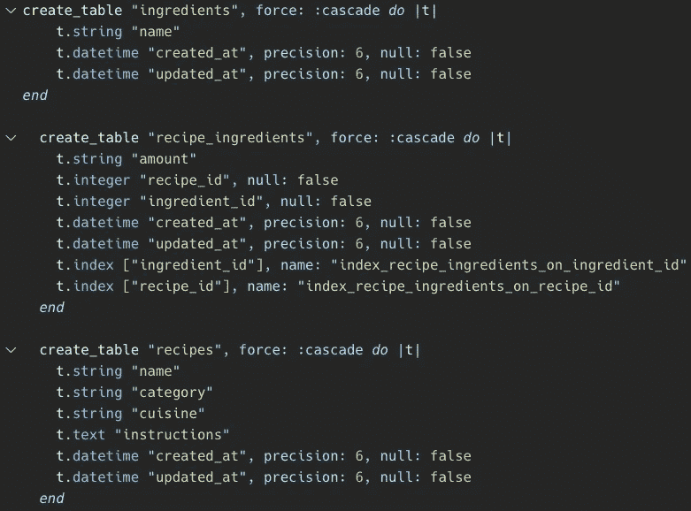
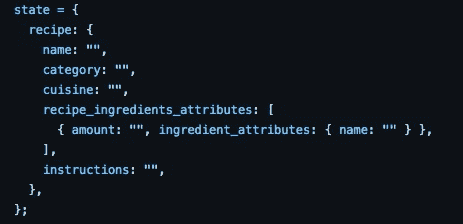
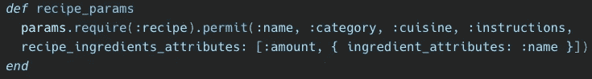
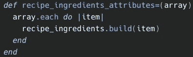
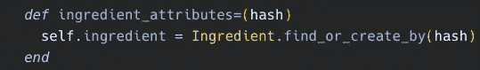

# 通过与 Rails API 的关联，可以处理嵌套属性

> 原文：<https://levelup.gitconnected.com/handling-nested-attributes-with-a-has-many-through-association-with-rails-api-f91729547ea5>

照片由 [Didssph](https://unsplash.com/@didsss?utm_source=unsplash&utm_medium=referral&utm_content=creditCopyText) 在 [Unsplash](/s/photos/russian-dolls?utm_source=unsplash&utm_medium=referral&utm_content=creditCopyText) 上拍摄

虽然在探索嵌套很深的对象时很容易迷路，但有时它们是最佳路线。基于我自己的(经常令人沮丧的)与他们相处的经历，我绘制了一张地图，让你走上正确的道路。本指南将引导您使用 React/Redux 前端来处理 Rails API 后端。

# 设置

照片由[安德鲁·尼尔](https://unsplash.com/@andrewtneel?utm_source=unsplash&utm_medium=referral&utm_content=creditCopyText)在 [Unsplash](/@andrewtneel?utm_source=unsplash&utm_medium=referral&utm_content=creditCopyText) 上拍摄

首先，确保用正确的关联设置数据库。下面是您的模式可能的样子。在这个例子中，配料模型`has_many`食谱`through`接收配料。

schema.rb 示例

接下来，我们将设置我们的 RecipeForm 组件。在我们的例子中，我们想要创建一个新的菜谱及其相关的 RecipeIngredients 和配料。您的状态应该包含一个顶级属性，该属性对应于包含其属性的模型名称(在本例中为`recipe`)。以下是我的模型的状态示例。

表单组件中的状态示例

> 非常重要— *在每个关联模型后追加* `*_attributes*` *(如*`*recipe_ingredients_attributes*`*`*ingredient_attributes*`*)。这一步将确保您的数据库正确处理信息。**

# *好东西*

**

*照片由[香椿果](https://unsplash.com/@toomastartes?utm_source=unsplash&utm_medium=referral&utm_content=creditCopyText)在 [Unsplash](/s/photos/hiking?utm_source=unsplash&utm_medium=referral&utm_content=creditCopyText) 上拍摄*

*不要忘记设置一个[受控形式](https://itnext.io/building-a-dynamic-controlled-form-in-react-together-794a44ee552c)以及一个[重复动作和减速器](https://redux.js.org/tutorials/fundamentals/part-3-state-actions-reducers)。由于在这些方面有许多很好的资源可以帮助，我们将坚持处理我们任务特有的事情。*

*让我们从 RecipesController 开始。我们需要更新我们的[强参数](https://api.rubyonrails.org/v6.1.3/classes/ActionController/StrongParameters.html)来接受 RecipeIngredients 和 Ingredients 的嵌套属性。*

**

*recipes controller # recipe _ params*

*现在我们将定制我们的[属性编写器](https://www.rubyguides.com/2018/11/attr_accessor/)方法来控制如何插入我们的配料数据。在 Recipe 模型中，我们可以添加下面的代码，为我们传入的每个`recipe_ingredients_attributes`构建一个新的关联 RecipeIngredient。*

**

*配方#配方 _ 配料 _ 属性=*

*现在我们需要处理我们的原料。在 RecipeIngredient 模型(即链接食谱和配料的`through`关联)中，我们应该定制属性 writer 方法，如下所示。对于这个应用程序，我们希望避免用相同的名称创建多个成分，所以我们将使用`find_or_create_by`方法将 RecipeIngredient 与正确的成分关联起来。*

**

*recipieng redient # ingredient _ attributes =*

# *目的地*

**

*照片由 [Gaurav K](https://unsplash.com/@gkukreti?utm_source=unsplash&utm_medium=referral&utm_content=creditCopyText) 在 [Unsplash](/s/photos/hiking-summit?utm_source=unsplash&utm_medium=referral&utm_content=creditCopyText) 上拍摄*

*就是这样！我们现在可以创建一个新的配方，自动创建新的 recipient，并且通过这些我们可以连接到以前的 Ingredient 实例或者创建一个新的实例——所有这一切一气呵成！这在前端需要更多的设置和关注，但是使用这种方法可以帮助您创建一个快速、直观的应用程序。如果你想看这段代码的运行，请随意查看我在 Github 上的应用程序[油炸计划](https://github.com/rebeccahickson/frying-plan-frontend)。编码快乐！*