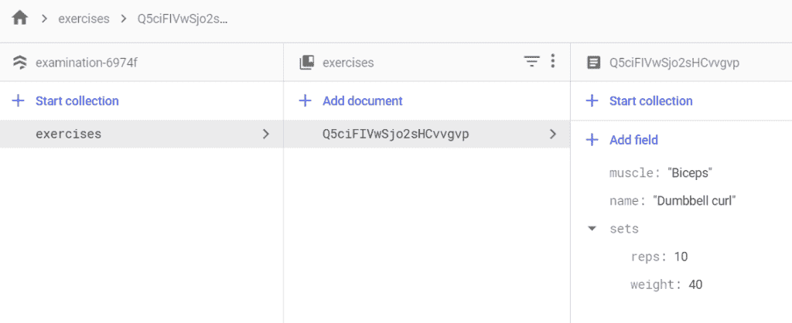
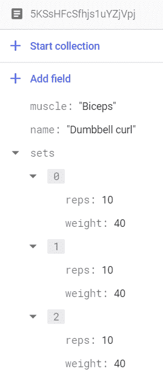
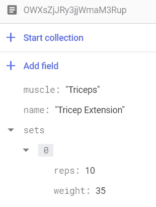
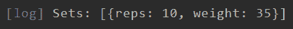
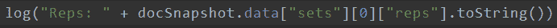
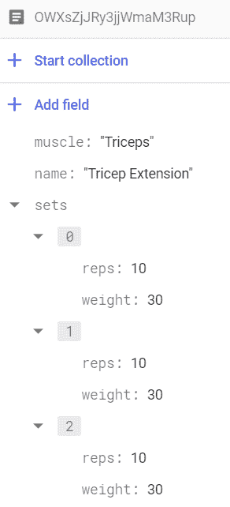

# 用 Flutter 处理 Firestore 中的嵌套对象

> 原文：<https://levelup.gitconnected.com/handling-nested-objects-in-firestore-with-flutter-18fc1072143f>

谷歌的云 Firestore 是一个应该在每个移动应用开发者的工具带中的工具。它提供的灵活和可伸缩的数据库不同于任何一个编码员可以单独创建的东西，如果你的应用程序是为全球观众设计的，没有多少解决方案像它一样。另外，有一个 Flutter 包( [cloud_firestore](https://pub.dev/packages/cloud_firestore) )旨在让 Flutter 和 Flame 很好地配合。

不幸的是，有一个缺点。该工具不能免费使用，你的应用程序对 Firestore 数据库进行的每一次读/写交易都将计入你的[每日配额](https://firebase.google.com/docs/firestore/quotas)(免费层计划为每日 50，000 次读取和 20，000 次写入)。因此，你在设计数据库时必须考虑到这些使用限制……否则，你创建一个有利可图的移动应用的梦想就会像火焰一样被扑灭。

在本文中，我将讨论如何在 Firestore 数据库中使用嵌套对象来减少事务处理量。您不必从一个文档和两个不同的子集合中检索数据，而是能够查询单个文档并在客户端处理嵌套的数据。#资金动向。

# 写入嵌套数据

# 地图—手动

将嵌套数据保存到 Firestore 文档的最简单方法是使用地图。在你的 Flutter 应用程序中设置 Firestore 并创建数据库后，你可以像这样保存嵌套的地图数据:

```
void SaveNestedData() { Firestore.instance.collection("exercises").add(
{ "name": "Dumbbell curl",
  "muscle": "Biceps", 
  "sets": { 
     "reps": 10, 
     "weight": 40} 
}); 
}
```

输出将如下所示:



在许多情况下，这种方法可能是完全令人满意的…在其他情况下，就不那么令人满意了。在我的例子中，一个“练习”应该有多个“集合”，每个集合都有一个权重和重复值。理想情况下，我会将一组地图存储在一个名为 sets 的字段中。

# 一系列地图—手动

完成此任务的代码只比保存单个地图的代码稍微复杂一点。您所要做的就是添加括号来表明该值是一个列表:

```
void SaveNestedData() { Firestore.instance.collection("exercises").add(
{ "name": "Dumbbell curl", 
  "muscle": "Biceps", 
  "sets": [ {"reps": 10, "weight": 40}, 
            {"reps": 10, "weight": 40}, 
            {"reps": 10, "weight": 40}] 
}); 
}
```

此函数的结果如下所示:



尽管如此，手动写出想要保存的数据是低效的，并且容易出现不一致。为了解决这个问题，您可以创建一个类来保存您想要保存的每个对象的值。

# 地图-使用对象

将对象保存到 Firestore 的第一步是创建对象[类](https://api.flutter.dev/flutter/dart-core/Object-class.html)。这个类将保存定义对象的属性和方法。

```
class Exercise { 
final String name; 
final String muscle; 
List<dynamic> sets = [ 
{"reps": 10, "weight": 40}, 
{"reps": 10, "weight": 40}, 
{"reps": 10, "weight": 40} ]; 
Exercise(this.name, this.muscle); 
}
```

现在，您可以创建新类的一个实例，并使用点符号赋值，而不是在映射中声明每个值。

```
Exercise exercise = Exercise("Dumbbell Curl", "Biceps");
```

在非 Flutter 语言中，将这个对象保存到 Firestore 很简单，但遗憾的是，没有与 document()等价的东西。在颤动中设置(数据)。相反，我们拥有的是文档()。setData()，它接受一个映射<字符串、动态>参数和一个对象参数*而不是*。更糟糕的是，Dart(Flutter 语言)没有[将对象转换成地图的方法。](https://stackoverflow.com/questions/54949087/how-to-convert-class-object-to-data-structure-map-or-a-list-of-maps-in-dart)

这给我们留下了一个选择:自己创建对象到映射函数。这听起来比实际情况更吓人。实际上，这意味着我们需要在我们的类中创建一个函数，将对象的值赋给一个映射并返回该映射。我的健身课应该是这样的:

```
class Exercise { 
final String name; 
final String muscle; 
List<dynamic> sets = [ 
{"reps": 10, "weight": 40}, 
{"reps": 10, "weight": 40}, 
{"reps": 10, "weight": 40} ]; Exercise(this.name, this.muscle); Map<String,dynamic> toMap() => { 
"name": this.name, 
"muscle": this.muscle, 
"sets": this.sets }; 
}
```

将数据保存到 Firestore 数据库就像这样简单:

```
void SaveNestedData() { 
Exercise exercise = Exercise("Tricep Extension", "Triceps"); Firestore.instance.collection("exercises") .document().setData(exercise.toMap()); }
```

# 对象数组

## 创建嵌套对象

在最后一个例子中，我仍然清楚地将“集合”列表写成一系列{maps}。我真正想做的是把每个“集合”也变成一个对象。这将使我对每组数据有更多的控制，并允许我在任何时候向练习中添加新的组。同样，第一步是创建类。这一次，我们还将添加 toMap()函数，这样它就准备好保存到 Firestore 了。

```
class Set { 
final int reps; 
final int weight; Set(this.reps, this.weight); Map<String,dynamic> toMap() => { "reps": this.reps, "weight": this.weight 
}; 
}
```

现在，当我第一次保存练习对象时，我将用一个空白的 Set 对象数组保存它。

```
class Exercise { 
final String name; 
final String muscle; 
List<dynamic> sets = []; Exercise(this.name, this.muscle); Map<String,dynamic> toMap() => { 
"name": this.name, 
"muscle": this.muscle, 
"sets": this.sets }; }void SaveNestedData() { 
Exercise exercise = Exercise("Tricep Extension", "Triceps"); Firestore.instance.collection("exercises").document("OWXsZjJRy3jjWmaM3Rup").setData(exercise.toMap());
}
```

## 向阵列中添加对象

当您想要将对象添加到空数组时，请执行以下操作:

```
void AddObjectToArray() { 
Set set = Set(10,35); Firestore.instance.collection("exercises") .document("OWXsZjJRy3jjWmaM3Rup").updateData({ 
"sets": FieldValue.arrayUnion([set.toMap()]) }); 
}
```

关于这个函数有几件重要的事情:

*   我使用 updateData()方法来更新文档中的单个字段。这要求您知道文档 ID。
*   为了给数组添加一个值，我使用了 FieldValue.arrayUnion()方法，该方法接受一个 List <dynamic>参数。</dynamic>
*   我正在为我的 Set 对象调用 toMap()函数，这样它就变成了 Map <string>格式。</string>

如果你再次触发这个函数，你会注意到一些奇怪的事情。数据库中的数组不会更新，在“集合”字段中仍然只有一个条目。



这是因为 arrayUnion(method) only [向一个不存在的数组添加一个值](https://firebase.google.com/docs/firestore/manage-data/add-data#update_elements_in_an_array)。对于我的用例来说，这是行不通的。一项运动可以有多个组，这些组由相同的重复次数和重量定义。那现在怎么办？


## 向数组中添加多个对象

这就是事情变得有点棘手的地方。在 Firestore 中向数组添加重复值的唯一方法是读取文档，用您的重复值更新数组，然后将其重写到数据库中。我们一会儿再来讨论这个问题。

# 读取嵌套数据

当您试图从数据库中的文档读取数据时，您将首先获得一个 DocumentSnapshot。这个对象包含一个数据属性，它将文档的内容保存在一个巨大的 Map <string>对象中。因此，如果我们想从以前创建的文档中获取“name”值，我们应该这样做:</string>

```
void ReadNestedData() { 
Firestore.instance.collection("exercises") .document("OWXsZjJRy3jjWmaM3Rup") 
.get().then((docSnapshot) => { 
log(docSnapshot.data["name"]) }); 
}
```

在这种情况下，我们只是从地图中抓取其中一个键。这是现成的，因为“name”字段包含一个字符串值。但是如果我们想从“集合”字段中读取数据呢？混乱。开玩笑…除非混乱意味着可读性差，数据不可访问。

```
void ReadNestedData() { 
Firestore.instance.collection("exercises") .document("OWXsZjJRy3jjWmaM3Rup") .get().then((docSnapshot) => { log("Sets: " + docSnapshot.data["sets"].toString()) }); 
}
```



事实上，如果我想手动检索第一组练习的重复次数，我必须做这样的事情:



有一个更简单的方法。

# 从 Firestore 文档创建对象

就像我们写数据一样，我们可以在类中创建一个从地图创建对象的函数。

```
class Set { 
final int reps; 
final int weight; 
Set(this.reps, this.weight); Map<String, dynamic> toMap() => { 
"reps": this.reps, 
"weight": this.weight }; Set.fromMap(Map<dynamic, dynamic> map) : 
reps = map["reps"].toInt(), 
weight = map["weight"].toInt(); }
```

然后，我们可以使用我们的新函数从 DocumentSnapshot 中的数据创建一个 Set 对象:

```
void ReadNestedData() { Set set; 
Firestore.instance.collection("exercises") .document("OWXsZjJRy3jjWmaM3Rup") .get().then((docSnapshot) => { 
set = Set.fromMap(docSnapshot.data["sets"][0]), 
log("Data :" + docSnapshot.data.toString()), 
log("Reps: " + set.reps.toString()) }); 
}
```

尽管如此，这仍然不够完美，因为我们必须从要检索的数组中手动选择项目(参见上面的 docSnapshot.data["sets"][0]部分)。

# 从 Firestore 文档创建嵌套对象

理想情况下，我们想要做的是完整地阅读文档，并一次解析出所有的内容(当然，要注意文档的大小)。为此，您需要在 fromMap()方法中手动创建嵌套对象列表。例如，要在我们的练习对象中创建一个集合对象列表，我们可以这样做:

```
class Exercise { 
final String name; 
final String muscle; 
List<dynamic> sets = []; 
Exercise(this.name, this.muscle); Map<String, dynamic> toMap() => { 
"name": this.name, 
"muscle": this.muscle, 
"sets": this.sets }; Exercise.fromMap(Map<dynamic, dynamic> map) : 
name = map['name'], 
muscle = map['muscle'], 
sets = map['sets'].map((set) { 
return Set.fromMap(set); }).toList(); 
}
```

现在，您可以检索文档快照，将其转换为一个带有 Set 对象嵌套数组的练习对象，然后按照您喜欢的方式操纵这些集合。

```
void ReadNestedData() { 
Exercise exercise; Firestore.instance.collection("exercises").document("OWXsZjJRy3jjWmaM3Rup").get().then((docSnapshot) => { exercise = Exercise.fromMap(docSnapshot.data), exercise.sets.forEach((set) { 
Set setInst = set as Set; 
log("Reps :" + setInst.reps.toString()); }) }); 
}
```

# 向数组中添加多个对象

回到上面的问题，我们如何在 Firestore 中将重复的对象保存到一个数组中？

1.  首先，阅读您想要更新的文档，并从中创建一个对象。
2.  然后，创建一个新对象，并将其添加到已经存在的对象列表中
3.  最后，将文档重写到 Firestore

```
void AddObjectToArray() { 
Exercise exercise; 
Set newSet; Firestore.instance .collection("exercises") .document("OWXsZjJRy3jjWmaM3Rup") .get() .then((docSnapshot) => { newSet = Set(10, 30), 
exercise = Exercise.fromMap(docSnapshot.data), exercise.sets.add(newSet), Firestore.instance.collection("exercises") .document("OWXsZjJRy3jjWmaM3Rup") .setData(exercise.toMap())}); 
}
```

有用吗？没有。如果您照原样运行这个函数，您可能会得到如下错误:

> *【错误:flutter/lib/ui/ui _ dart _ state . cc(157)】未处理的异常:无效参数:【Set】的实例*

这是因为我们当前的 Exercise.toMap()函数没有为 Firestore 准备嵌套的 Set 对象。我们需要更新我们的练习类，如下所示:

```
class Exercise { 
final String name; 
final String muscle; 
List<dynamic> sets = []; 
Exercise(this.name, this.muscle); 
Map<String, dynamic> toMap() => {
"name": this.name, 
"muscle": this.muscle, 
"sets": firestoreSets()}; List<Map<String,dynamic>> firestoreSets() {
    List<Map<String,dynamic>> convertedSets = [];
    this.sets.forEach((set) { 
    Set thisSet = set as Set; 
    convertedSets.add(thisSet.toMap()); 
    }); 
return convertedSets; } Exercise.fromMap(Map<dynamic, dynamic> map) : 
name = map['name'], 
muscle = map['muscle'], 
sets = map['sets'].map((set) { 
return Set.fromMap(set); }).toList(); 
}
```

我添加了一个名为 firestoreSets 的新函数，它遍历“Sets”变量中的所有 Set 对象，并将它们转换为地图。如果您再次运行代码，它应该可以工作，甚至更好——您可以向数组中添加任意多个相同的 Set 对象。



# 最后

这是一篇很长的文章，但是一旦你有了 Firestore 的基础知识，你可以用云数据库做什么就没有什么限制了(除了使用配额)。随着我了解更多，我会更新这篇文章，所以请定期查看。继续编码！

# 我的设置

我是一名自学成才的开发人员，我相信适销对路的软件解决方案可以由专注的独狼(或非常小的团队)来创建。我写博客是为了介绍像 Flutter、Google Firestore 和 RevenueCat 这样的开发工具，因为我相信在不久的将来，这些工具将会成为每一个成功的移动应用初创企业的必备工具。有了这些，你可以在极短的时间内完成 4 到 5 个人的工作。我也写关于计算机知识和效率的博客，因为这两件事都有指数回报。

# 五金器具

*   [惠普方尖碑台式电脑的预兆](https://amzn.to/3ms7tHA)
*   [采用英特尔酷睿 i9 的 MacBook Pro](https://amzn.to/2EdH0wc)
*   [LG 27UL500 显示器](https://amzn.to/3mzyfxY)
*   [两台惠普 27 英寸 LED 显示器](https://amzn.to/33DGQqp)
*   [海盗船弯刀游戏鼠标](https://amzn.to/2FHrxVw)

*原载于 2020 年 7 月 5 日 http://lonercoder.wordpress.com*[](https://lonercoder.wordpress.com/2020/07/05/handling-nested-objects-in-firestore-with-flutter/)**。**