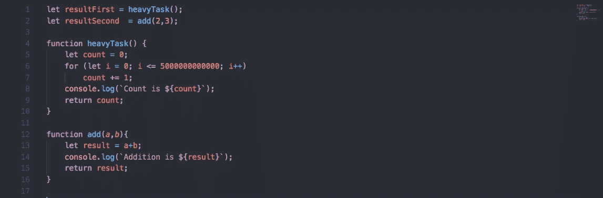
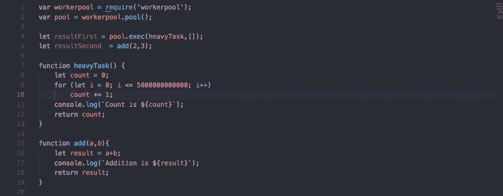

# 处理节点的 CPU 密集型任务

> 原文：<https://levelup.gitconnected.com/handling-nodejs-c-p-u-extensive-task-aa559452eca8>

NodeJS 通常被称为单线程。这是真的——但是有一个问题。

Node 有一个“ **main** ”线程来处理来自脚本的所有同步代码执行，对于 Node API，还有所有客户端请求。当阻塞请求进来时，它实际上将 I/O 任务委托给线程池中的一个工作线程。所以我们可以得出结论，节点是**而不是**完全端到端的单线程。

> **注意**:工作线程不是主线程。

好吧，没关系。但是如果我们这样说 NodeJS:

> 在 Node.js 中，除了代码之外，所有东西都是并行运行的。这意味着您在 Node.js 中编写的所有 I/O 代码都是非阻塞的，而(相反)您在 Node.js 中编写的所有非 I/O 代码都是阻塞的。

如果上面的陈述是真的(确实如此)，那么如果一个非常非常重的 CPU 任务作为一个客户端请求出现，会发生什么呢？你可能会认为你什么都不会，但会想你是否可以使用另一种语言。

但是不，我亲爱的朋友，我们甚至可以将这个 CPU 密集型任务委派给一个线程。

我们如何做到这一点？

我将在这里用一个适当的例子来解释这一点

如你所见，我创建了一个名为 heavyTask 的函数，它运行 for 循环 5000000000000 次。主线程将长时间处于忙碌状态，并且它将拒绝为任何其他客户端请求提供服务。

我们如何将这个 CPU 任务委派给线程池中的一个工作线程。

**workerpool** 提供了一种简单的方法来创建一个工人池，用于动态卸载计算以及管理一个专用工人池。它基本上实现了一个线程池模式。有一群工作人员来执行任务。新任务被放入队列中。一个工作者一次执行一个任务，一旦完成，就从队列中挑选一个新任务。

> 在上面的例子中，有一个函数`heavyTask`，它被动态地卸载到一个 worker 上，为一组给定的参数执行。

这就是通过将工作卸载到工作线程来处理 CPU 密集型任务的方式。

Github 链接参考:[https://github.com/yogain123/Workers-Pool](https://github.com/yogain123/Workers-Pool)

感谢阅读

快乐学习:)

 [## 学习 Node.js -最佳 Node.js 教程(2019) | gitconnected

### 排名前 45 的 Node.js 教程-免费学习 Node.js。课程由开发人员提交和投票，使您能够…

gitconnected.com](https://gitconnected.com/learn/node-js)