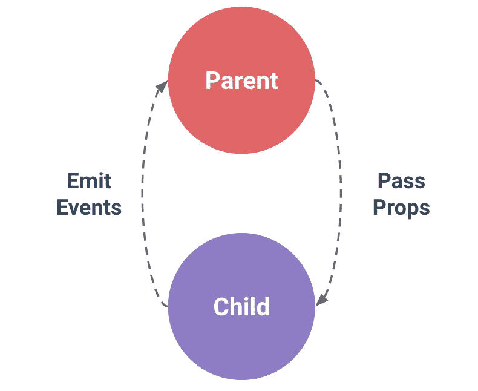

# 在 Vue 3 合成 API 中处理道具

> 原文：<https://levelup.gitconnected.com/handling-props-in-vue-3-composition-api-8242ee07d089>

## Vuejs 3 中的 props 与 Composition API 简介


照片由 [Z S](https://unsplash.com/@kovacsz1?utm_source=medium&utm_medium=referral) 在 [Unsplash](https://unsplash.com?utm_source=medium&utm_medium=referral) 拍摄

**vue . js 中有哪些道具？**

Props，意思是属性，用于将信息从一个组件传递到另一个组件，通常是以单向方式从父组件传递到子组件。

这意味着道具不能从子组件传递到父组件。在需要将数据从子组件传递到父组件的情况下，需要向父组件发出某个事件。(下图中的插图)

下面是道具从父组件到子组件的一般流程。



图片作者:凯文·胡

从 Vuejs 2 选项 API 开始，我们处理和使用道具的方式有了一点改变。

**为什么要使用道具**

我们主要使用 props 将数据从父组件传递到子组件。您可以将尽可能多的道具传递给子组件，只需注意不要落入组件中的道具钻孔中。

**道具类型**

可以使用 JavaScript 中可用的各种数据类型来声明属性类型。
这些属性类型中的一些可以采用整数、字符串、布尔、函数、对象、日期甚至符号的类型。

**道具名称外壳**

在声明属性时，建议在将属性传递给子组件时使用 camelCase 和 kebab-case。请参见下面的示例代码。

将道具传递给子组件

```
//here we pass user-name prop in kebab-case<ChildComponent user-name="John Doe" />
```

申报道具

```
withDefaults(
 defineProps<{//here we use camelCasing to declare props
userName: string; }>(),
 {},
);
```

**道具申报**

Vuejs 中的组件必须声明 props，以允许 Vuejs 知道传入的 props 以及如何在应用程序中处理它们。在 composition API 中，我们使用`defineProps`宏来声明 props。

用 object 语法声明 props 采用**【key:value】**对的形式，key 是 prop 名称，value 是 prop 名称的类型。

```
const props = withDefaults(
 defineProps<{
  userName: string;
  avatar: string;
 }>(),
 {},
);
```

我们也可以将 props 声明为字符串数组，如下所示

```
defineProps(['userName','avatar'])
```

**静态与动态道具**

很多时候，我们需要传递带有动态/变化值的道具。在上面的例子中，我们一直在处理静态属性值。

当处理动态道具值时，我们需要使用`v-bind`指令或简写`:`来绑定道具。我们可以分配如下所示的动态道具值。也不是说你总是可以传递尽可能多的道具，而是注意不要传递太多的道具。

```
 <UserProfile :user-name="profile.username" />
```

**验证道具并设置默认值**

默认情况下，属性被认为是可选的，除非在组件中指定为必需的。在验证 props 时，我们需要告诉 vue js prop 值所需的类型。我们还可以设置缺省值，以防缺少道具。

请记住，当您使用默认属性值时，当属性名称为`undefined`或属性值不存在时，将使用默认值。

请参见下面的示例。

```
const props = withDefaults(
 defineProps<{
  userName: string;
  selectedProducts?: Product[];
 }>(),
 {
  selectedProducts: () => {
   return [];
  },
 },
);
```

类似地，我们可以用另一种方式编写上面显示的验证。见下文。

```
defineProps({
  userName: {
    type: String,
    required: true
  },
  selectedProducts: {
    type: Product[],
    default() {
      return [];
    }
  }
})
```

**结论**

感谢您花时间阅读到目前为止。

偶尔，我会发一封独家邮件，里面有我发现的有用的和与技术写作相关的技巧、文章、应用程序、书籍和想法👇。

[***加入像你一样想提高写作技巧的人。***](https://artisanal-thinker-2556.ck.page/6e2ba71172)

**更读**

[](/vuejs-3-migrating-from-options-to-composition-api-e8a765e57b8d) [## Vuejs 3:从选项迁移到组合 API

### 轻松切换到组合 API

levelup.gitconnected.com](/vuejs-3-migrating-from-options-to-composition-api-e8a765e57b8d) [](/how-to-handle-routing-with-vue-router-in-vue-3-59095af9c07a) [## 在 Vue 3 中如何用 Vue 路由器处理路由

### 使用 Vue Router 4 进行路由:完整指南

levelup.gitconnected.com](/how-to-handle-routing-with-vue-router-in-vue-3-59095af9c07a) 

# 分级编码

感谢您成为我们社区的一员！在你离开之前:

*   👏为故事鼓掌，跟着作者走👉
*   📰查看[升级编码出版物](https://levelup.gitconnected.com/?utm_source=pub&utm_medium=post)中的更多内容
*   🔔关注我们:[Twitter](https://twitter.com/gitconnected)|[LinkedIn](https://www.linkedin.com/company/gitconnected)|[时事通讯](https://newsletter.levelup.dev)

🚀👉 [**加入升级人才集体，找到一份神奇的工作**](https://jobs.levelup.dev/talent/welcome?referral=true)