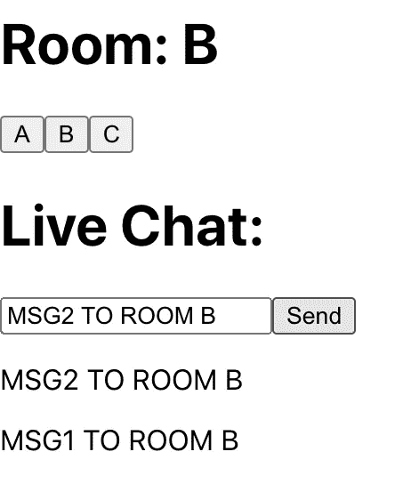

# 用 React 吊钩处理插座室

> 原文：<https://levelup.gitconnected.com/handling-socketio-rooms-with-react-hooks-4723dd44692e>

## **使用效果挂钩处理 SocketIO 交互**

本文假设您了解 React 挂钩和套接字的基础知识。IO 并跟进这些文章，以熟悉这些主题:

[](https://medium.com/@chathuranga94/introduction-to-socket-io-600025322cd2) [## 套接字介绍。超正析象管(Image Orthicon)

### 实时|双向|客户端-服务器| HTML5

medium.com](https://medium.com/@chathuranga94/introduction-to-socket-io-600025322cd2) [](https://medium.com/@chathuranga94/introduction-to-react-hooks-4694fe2d0fc0) [## React 挂钩简介

### 赋予功能组件超能力

medium.com](https://medium.com/@chathuranga94/introduction-to-react-hooks-4694fe2d0fc0) 

这构建了一个演示聊天应用程序，涉及使用 React 钩子集成的 socket.io 房间。客户端可以在聊天室之间连接和切换，其中的更新将由 socket.io 事件复制。根据所选择的房间，它将向使用该房间的 socket 客户端广播聊天消息。

(一旦运行，我们可以旋转多个浏览器标签，并查看聊天消息是否通过套接字更新。)

# 使用 Nodejs 设置 SocketIO 服务器

让我们用简单的 socket.io 设置创建一个节点服务器

```
var http = require('http').createServer().listen(3000);
var io = require('socket.io').listen(http);**io.on('connection'**, (socket) => {
   console.log(`Connected: ${socket.id}`); **socket.on('disconnect'**, () =>
      console.log(`Disconnected: ${socket.id}`)); **socket.on('join'**, (room) => {
      console.log(`Socket ${socket.id} joining ${room}`);
      **socket.join(room)**;
   }); **socket.on('chat'**, (data) => {
      const { message, room } = data;
      console.log(`msg: ${message}, room: ${room}`);
      **io.to(room).emit('chat', message)**;
   });
});
```

这里需要安装 npm 包`socket.io`，并且在与 http 服务器相同的端口`3000`中创建套接字服务器。

*   `io.on('connection')`是指初始化任何客户端套接字连接，然后，`(socket) =>`是指具有唯一 id 的特定套接字。
*   每个插座可以通过向`join`事件发送房间名称来加入所需的 socket.io 房间，服务器会监听`join`事件并将该插座连接到给定的房间。
*   当 socket 向`chat`事件发出聊天消息时，它将被广播到该特定房间中的所有客户端 socket，使这些聊天室。

# 使用 Reactjs 挂钩设置前端客户端

让我们安装`socket.io-client`包并创建 socket 相关函数来处理 socket 服务器，这些函数将与 React 挂钩一起使用。

```
import io from 'socket.io-client';
let socket;export const **initiateSocket** = (room) => {
  **socket = io('**[**http://localhost:3000'**](http://localhost:3000')**)**;
  console.log(`Connecting socket...`);
  if (socket && room) **socket.emit('join', room)**;
}export const **disconnectSocket** = () => {
  console.log('Disconnecting socket...');
  if(socket) **socket.disconnect();**
}export const **subscribeToChat** = (cb) => {
  if (!socket) return(true); **socket.on('chat'**, msg => {
    console.log('Websocket event received!');
    return cb(null, msg);
  });
}export const **sendMessage** = (room, message) => {
  if (socket) **socket.emit('chat', { message, room });**
}
```

*   这里的`socket`被声明为一个变量，并没有在开始时初始化，因为它会在文件加载时建立套接字连接。但是这里它是在函数中启动的，这样客户机就可以控制何时进行套接字连接。
*   一旦与`io(URL...)`连接，它将发出加入特定房间的事件。注意，房间概念只在后端维护，前端的客户端套接字不知道房间。
*   Subscribe 事件使用回调函数与其目的进行交互，其中回调函数将使用`data`针对给定事件上的任何消息进行调用。

这些套接字函数可以很容易地用钩子在 React 应用程序中使用。通过`useState`钩子，它将为`room`(选中)、`message`(当前消息)和`chat`(所有消息)维护它们的变量。

```
import React, { useEffect, useState } from 'react';
import { initiateSocket, disconnectSocket,
    subscribeToChat, sendMessage } from './Socket';function App() {
  const rooms = ['A', 'B', 'C'];
  const [room, setRoom] = useState(rooms[0]);
  const [message, setMessage] = useState('');
  const [chat, setChat] = useState([]); **useEffect(() => {
    if (room) initiateSocket(room);** **subscribeToChat((err, data) => {
      if(err) return;** **setChat(oldChats =>[data, ...oldChats])
    });** **return () => {
      disconnectSocket();
    }
  }, [room]);**return (
    <div>
      <h1>Room: {room}</h1>
      { rooms.map((r, i) =>
        <button onClick={() => setRoom(r)} key={i}>{r}</button>)} <h1>Live Chat:</h1>
      <input type="text" name="name" value={message}
        onChange={e => setMessage(e.target.value)} />
      <button onClick={()=> sendMessage(room,message)}>Send</button>
      { chat.map((m,i) => <p key={i}>{m}</p>) }
    </div>
  );
}export default App;
```

用于套接字交互(或任何其他外部调用)的最重要的钩子是这里使用的`useEffect`。

*   它有一个`[room]`的依赖数组，简单地说，每次`room`变量改变时，内部函数将被重新执行。
*   在内部函数中，它将为给定的`room`启动套接字连接。如前所述，它将调用`initiateSocket`，并加入给定的房间。
*   接下来，我们为所需的事件注册一个订阅，回调函数将在每次服务器发出事件时执行。这将在从套接字更改时在`subscribeToChat`的回调内`setChat`。
*   最后，`useEffect` hook 能够返回一些函数来清理这些套接字交互。在这里的`disconnectSocket`中，它将断开套接字连接，这样服务器就不会因空闲套接字而饥饿。

这种简单的方法创建了功能性聊天室，多个使用浏览器标签的客户可以在他们的聊天室内进行交互。但是，在处理高级场景时，很少需要考虑。

# 需要考虑的问题很少！

## 避免在每条聊天消息中发送聊天室:

每次发送聊天消息时，即使客户端 socket 早些时候加入了特定的房间，也需要发送哪个`room`消息。这是因为 socket 可以有多个房间(每个房间都有自己的 id ),并且可以存储在`socket.rooms`的服务器中。每次都通过房间，以确保它将被广播到正确的插座组。

```
socket.rooms → { **a8Kpvr_5JqG80SqtAAAB**:'a8Kpvr_5JqG80SqtAAAB', **A**:'A'}
socket.io    → **a8Kpvr_5JqG80SqtAAAB**joinedRooms other that default room with socket id → 
   **Object.values(socket.rooms).filter(room => room !== socket.id)**
```

在服务器中，socket 可以在单个套接字范围内保存相关信息，也可以在绑定了唯一 id 的全局范围内保存相关信息。这也可以存储单一的东西，如用户名，附加聊天室等。请注意，这需要在连接、断开或更新时进行维护，并且需要额外的参与。

在本地套接字范围内:

```
io.on("connection", (socket) => {
  **let socketRoom;** socket.on('join', (room) => {
    socket.join(room);
    **socketRoom = room;**
  }); socket.on('chat', (data) => {
    **io.to(socketRoom).emit('chat'**, data.message);
  });
});
```

在全局套接字范围内:

```
**const socketMap = {};**io.on("connection", (socket) => {socket.on('join', (data) => {
    socket.join(data.room);
    **socketMap[socket.id] = data.username;**
  });socket.on('chat', (data) => {
    io.to(data.room).emit('chat',
      { message: data.message, **user: socketMap[socket.id]** });
  });
});
```

## 更换房间时避免重新连接:

一个重要的缺点是，当在房间之间切换时，它会断开前一个房间的插座，并在新的房间上建立新的连接。这将在切换房间时增加不必要的开销，而是可以使用现有的连接插座在房间之间切换。

```
Socket **Q9_wYGZtDJVjf7MWAAAI** joining A
Disconnected: **Q9_wYGZtDJVjf7MWAAAI**
Connected: **eWn2OGaXaml-0eS6AAAJ**
Socket **eWn2OGaXaml-0eS6AAAJ** joining B
```

使用`useRef` & `useEffect`挂钩改变`App.js`在房间之间切换:

```
// **Let's keep track of previous room** 
const prevRoomRef = useRef();
useEffect(() => {
  prevRoomRef.current = room;
});
const prevRoom = prevRoomRef.current; // **Initiate or Switch Rooms depending on previous and current values**
useEffect(() => {
    if (prevRoom && room) switchRooms(prevRoom, room);
    else if (room) initiateSocket(room);
    setChat([]);

    // **Reset chat messages upon change in room**
    // **Avoid subscribeToChat as it will duplicate subscriptions.**
    // **Avoid disconnectSocket as cleanup as socket is reused.**
  }, [room]); // **Subscribe only once to event as socket is reused**
useEffect(() => {
    subscribeToChat((err, data) => {
      if(err) return;
      setChat(oldChats =>[data, ...oldChats])
    });
}, []);
```

在相关房间的`Socket.js`上发出`switch`事件:

```
export const switchRooms = (prevRoom, nextRoom) => {
  if (socket) **socket.emit('switch', { prevRoom, nextRoom })**;
}
```

在服务器上消费`switch`事件并进行必要的房间变更:

```
socket.on('switch', (data) => {
  const { prevRoom, nextRoom } = data;
  if (prevRoom) **socket.leave(prevRoom)**;
  if (nextRoom) **socket.join(nextRoom);**
  socketRoom = nextRoom;
});
```

## 向房间广播时避免发送者:

在某些情况下，实时应用程序可能会在等待套接字更新之前在本地附加聊天消息。对于这种方法，最好不要通过套接字订阅将该消息发送给发送者，这就要求不要将该消息广播给该房间中的发送者。

```
*// In server replace io.to with socket.broadcast to avoid sender:*-   io.to(socketRoom).emit('chat', data.message)
+   **socket.broadcast.to(socketRoom).emit('chat', data.message);** // In client, upon Send append to local chat state:onClick={() => {
  **setChat(oldChats => [message, ...oldChats]);
  sendMessage(room, message);**
}}
```

## 加入房间时加载初始数据:

后端需要在全局范围内存储其聊天历史，并在加入该 socketio room 时返回与该房间相关的现有聊天消息。

```
**const socketHistory = {};**io.on("connection", (socket) => {
  let socketRoom; socket.on('join', (room) => {
    socket.join(room);
    socketRoom = room;
    **socket.emit('joinResponse', socketHistory[room]);**
  }); socket.on('chat', (data) => {
    socket.broadcast.to(socketRoom).emit('chat', data.message);
    **socketHistory[socketRoom] = socketHistory[socketRoom] ?
      [data.message, ...socketHistory[socketRoom]] : [data.message]**
  });
```

在前端订阅一次`joinResponse`事件，这样它将加载初始数据

```
// Socket.jsexport const loadInitialChat = (cb) => {
    if (!socket) return(true)

    **socket.on('joinResponse', msg => cb(null, msg));**
}// App.jsuseEffect(() => {
  **loadInitialChat**((err, data) => {
    if(err) return;
    **setChat(data);**
  });
}, []);
```

这是一个演示教程，介绍如何使用 reactjs 挂钩轻松集成 socketio 房间。

