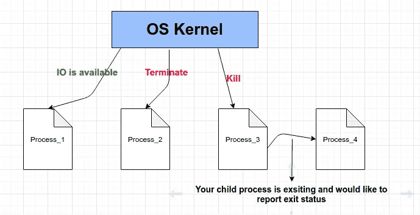

# 在 Golang 中处理 Unix 信号

> 原文：<https://levelup.gitconnected.com/handling-unix-signals-in-golang-c8f75ca3da8>

## **Unix 信号**是发送给程序的软件中断，用来指示某个重要事件已经发生。这些事件可能从用户请求到非法内存访问错误不等。有些信号，如中断信号，表明用户要求程序做一些事情，而不是在通常的控制流中。


Arif Riyanto 在 [Unsplash](https://unsplash.com/collections/4510513/coding?utm_source=unsplash&utm_medium=referral&utm_content=creditCopyText) 上拍摄的照片

对于应用程序中的各种用例来说，处理操作系统信号是很重要的。例如，我们可能希望服务器在收到 SIGTERM 时正常关闭，或者希望命令行工具在收到 SIGINT 时停止处理输入。以下是如何在 Go with channels 中处理信号。



作者图片:操作系统信号

在本文中，我们将介绍如何使用 Golang 的`os/signal`包处理 Unix 信号。

## 操作系统/信号包

Golang 的`os/signal`这个包允许你在收到特定类型的 UNIX 信号时配置 Golang 程序的行为。大多数基于 Linux/Unix 的程序在收到终止信号时会很高兴地终止，但是如果你想让你的程序在终止前先拦截信号，执行一些备份，将数据刷新到磁盘等等，那么你应该使用`os/signal`包。

## 信号类型

我们将集中讨论异步信号。它们不是由程序错误触发的，而是由内核或其他程序发出的。

*   `SIGHUP`当程序失去控制终端时发出信号
*   `SIGINT`当用户在控制终端按下中断字符时，信号发出，默认为 **^C (Control-C)**
*   `SIGQUIT`当用户在控制终端按下退出字符时发出信号，默认为 **^\(控制反斜杠)**
*   `SIGTERM`该信号是用于导致程序终止的通用信号

下面是一个简单的 Golang 示例，演示如何拦截最常见的 UNIX kill/terminate 信号。

**注意:**为了更好的理解，请阅读代码注释。

代码清单 1.1

将上述程序复制到本地机器上运行。我用名称**信号控制器运行我的程序。走吧。下面是我在我的 Ubuntu 机器上执行这个程序的步骤和我的观察。**

*   终端 1 — `go build signal-controller.go`
*   1 号航站楼— `./signal-controller`

在我的机器上，运行二进制文件的 PID 是 451575。

*   2 号航站楼— `kill -SIGINT 451575`

```
Terminal 1 - Output - **"Signal interrupt triggered."**
```

*   2 号航站楼— `kill -SIGHUP 451575`

```
Terminal 1 - Output - **"Signal hang up triggered."**
```

*   2 号航站楼— `kill -SIGTERM 451575`

```
Terminal 1 - Output - **"Signal terminte triggered."**
```

*   端子 2 — `kill -SIGQUIT 451575`

```
Terminal 1 - Output - **"Signal quit triggered."**
```

## 结论

使用`os/signal`包可以在 Golang 中轻松处理 Unix 信号。我们需要使用类型为`os.Signal`的通道来读取信号。您可以实现代码来处理程序接收的每种类型的 Unix 信号。

这就是现在的全部…快乐学习😃