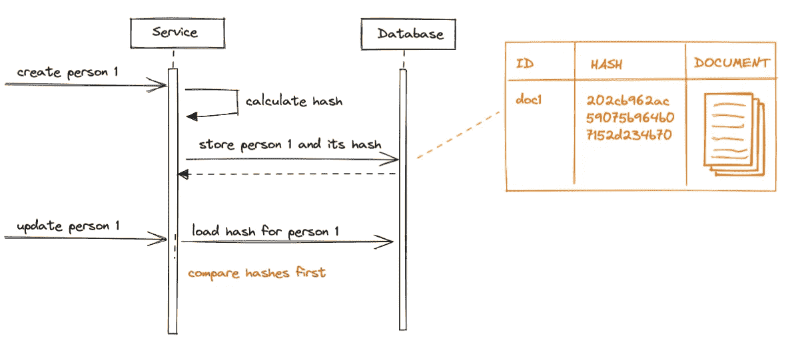

# 在 REST API 中处理未修改的请求

> 原文：<https://levelup.gitconnected.com/handling-unmodified-requests-in-rest-api-b15a035c6e70>

客户端-服务器通信中的各种响应状态代码就像你正在学习的语言中的单词一样——最初，你只是使用非常有限的子集来理解，然后你通过增加这个范围来提高自己，后来你试图使用最适合当前上下文的语言。

谈判

你的回答越具体，你被问到的额外问题就越少。

在客户端-服务器通信中也是如此:

*   通过创建一个新的资源，响应代码`200`变得不如`201`信息丰富，因为在这种状态下，客户端还期望找到带有该资源链接的`Location` 报头
*   当处理批处理请求时，`207` status 胜过了`200`,因为它告诉用户一个响应可以包含关于每个发布的实体的单独统计信息，而不是一个总的汇总信息
*   `429` status 比`500`更适合表示服务器超出了它的容量，不得不暂时拒绝新的请求，因此智能重试(使用指数补偿策略)在这里是有效的
*   身份验证状态代码(`401`和`403`)的误用也会混淆客户及其对此类响应的反应。使用 401 状态，您通知客户端会话不再有效，因此任何进一步的操作都将被拒绝。对于 403 状态的期望是不同的——只有这个特定的请求被禁止，但是其他 API 可能对您可用。

正确使用状态代码可以让您的客户端更明智地控制数据通信过程，并且不会因为在某些信息不足的故障情况下重试操作而对您的系统造成严重损害。

## 但是一些更奇特的身份代码呢？

浏览器获取 API 性能优化策略通常包括本地缓存要求，以最大限度地减少不必要的往返。一个例子是支持`304`状态码，该状态码指示服务器不包含该页面的升级版本，因此先前请求的页面仍然有效。

在单页应用程序中，此状态代码尽可能地优化 web 资源，以便请求的页面在不同的部署之间只加载一次。

加载静态源

这不是纯粹的离线模式，因为无论如何都会发送请求，但不会下载内容，因此总的请求处理时间要短得多。

完整时间表

此状态代码主要用于优化浏览器中的 GET 请求，因为它使用关于缓存文件的浏览器信息来正确配置请求头`If-Modified-Since`和`If-None-Match`，以提供该文件在本地缓存中的最后更改日期。

但它的使用并不禁止任何其他类型。在常规数据管道中使用它来优化修改 API 怎么样？

## 告诉我更多关于我的数据的信息

我们想要支持的用例之一是从父系统定期重新加载源数据。这包括已经加载并且在下次运行时没有有效更改的数据。

与整个数据流相比，新数据和已更改数据的百分比非常小，因此减少存储压力的一个好策略是避免覆盖未修改的数据。

同步数据

此外，通知客户端系统认为输入数据与已经存储的快照相比没有变化，因此操作将被跳过，这是件好事。

这为在 PUT/PATCH API 中使用额外的状态代码提供了更多的自由，以更具体地说明对此数据的预期操作:

*   `200` —输入数据将被存储，其版本将被增加
*   `304` —与已经存储的数据相比，输入数据没有有效的更改，因此修改请求将被跳过，记录版本不会被更改

## 检测数据更改的挑战

传统的更新操作可以用序列图来表示:

经典更新操作

每次我们想要更新一个实体时，我们都需要从源系统加载一个新的副本，将输入负载合并到其中，并将其持久化。

为什么我们需要加载和合并？可能在极少数情况下，这些步骤是可以避免的。可以避免的通常情况— DTO 和实体具有相同的表示。换句话说，从存储的角度来看，发布的数据是完整的，可以替换现有的记录，而无需额外的补充。

通常，输入数据方案比数据库记录更受限制，并且不包括系统私有标识符、元信息、安全内容等，因此需要进行合并，以通过利用用户输入来准备最终的数据库记录视图。有了这个，我们就不能忽略加载阶段，不考虑输入和存储的实体有多相似。

另一个挑战是如何检测发布的数据与已存储的数据相比是否有变化。毫无疑问，按需比较实体是一项 CPU 密集型操作，因此我们应该避免。

## 一些更先进的技术？

算法解决了检测文档重复的问题，方法是只比较它的散列，而不是完全的深度比较。我们可以重用这种方法，并使用哈希计算和哈希比较步骤来扩展资源修改流程:

*   当创建一个新实体时，它的散列被计算并存储为它的附加元信息
*   更新现有实体时，首先将其存储的哈希与输入有效负载的哈希进行比较

与活动对象比较相比，这使得检测更改的过程非常高效，因此我们可以轻松地跳过所有没有更改的请求，而不会影响数据库性能。

使用哈希比较

每次处理一个修改请求时——首先将输入的有效负载与存储文档的散列进行比较，只有在不同的情况下才处理这个请求，否则通过发送回`304`状态代码，用户立即被告知请求完成。

这种技术允许以足够高的性能处理大量没有有效更改的写请求，而不会用不必要的更新语句阻塞数据库。