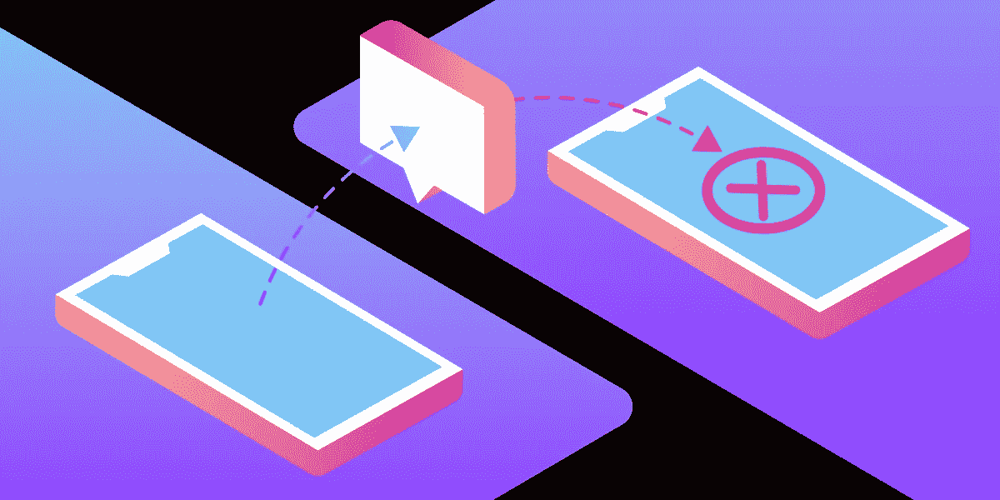
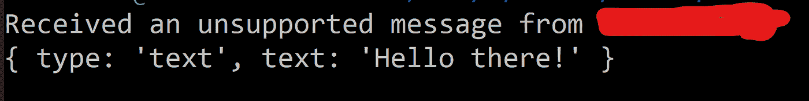

# 使用消息 API 处理不支持的入站消息

> 原文：<https://levelup.gitconnected.com/handling-unsupported-inbound-messages-with-the-messages-api-7818fb8bb0d5>

[Messages API](https://developer.nexmo.com/messages/overview) 使你能够通过许多社交消息渠道与你的客户联系，比如 WhatsApp、Facebook Messenger 和 Viber。

连接是双向的；你可以发送和接收信息。但在快速发展的社交信息渠道世界中，有一个独特的问题。如果客户设法向您的企业发送尚不支持的消息类型，会发生什么情况？

举个例子，当你的客户通过 WhatsApp 发给你一张贴纸时会发生什么？这个问题对于集成 Messages API 的人来说很普遍。

答案就在入站消息的请求体中。入站消息的 JSON 在消息的内容对象中包含一个`type`字段。

如果类型不支持，`type`字段为`unsupported`；WhatsApp、Viber、Facebook Messenger、MMS 都是如此。具有不支持的负载的入站消息的消息正文将如下所示:

请注意它是如何向您提供客户的 WhatsApp 号码的。有了这些信息，你就可以决定你的应用程序将如何处理它。你可能想记下你的客户回复了你，你可能想回复他们，表明他们发送了一个你无法理解的信息。

# 在代码中检测不支持的消息

我通常喜欢用代码示例来说明这样的概念，所以让我们看一个使用 Node JS 的示例。创建一个新目录，并在其运行中`npm install express body-parser`

现在创建一个名为`server.js`的新文件。在这里，我们将添加以下代码。

通过运行`node server.js`启动我们的服务器。随着我们的服务器运行，我们需要做的最后一件事是将 WhatsApp 消息连接到它。

我推荐使用 [ngrok](https://developer.nexmo.com/tools/ngrok) 从 Vonage Messages API 本地接收入站 WhatsApp 消息。您可以通过运行`ngrok http 5000`来启动它，这会为您生成一个基本 URL。您的应用程序将在`BASE_URL/webhooks/inbound-messages`接收消息，因此在设置[消息 API 沙箱](https://developer.nexmo.com/messages/concepts/messages-api-sandbox#configure-webhooks)时使用该 URL。

连接好这些设备后，你现在可以给自己发信息了。所以，如果我进入 WhatsApp，给沙盒里的信息发送一张咖啡贴纸:

我的应用程序会收到它并打印出消息:`Received an unsupported message from WHATSAPP_NUMBER`。

否则，它将打印消息的内容。

# 资源

*   如果你想学习如何发送 WhatsApp 信息 Garann Means 有一个很棒的[解说者](https://www.nexmo.com/blog/2020/04/15/send-a-whatsapp-message-with-node-dr)
*   如果你对使用 Messages API 感兴趣，我们的 [docs 网站](https://developer.nexmo.com/messages/overview)有大量关于如何启动和运行的内容和解释。
*   你可以在 [GitHub](https://github.com/nexmo-community/handling-unsupported-inbound-messages) 中找到这篇博文的代码

*最初发布于*[*https://www . NEX mo . com/blog/2020/09/24/handling-unsupported-inbound-messages-with-the-messages-API-dr*](https://www.nexmo.com/blog/2020/09/24/handling-unsupported-inbound-messages-with-the-messages-api-dr)