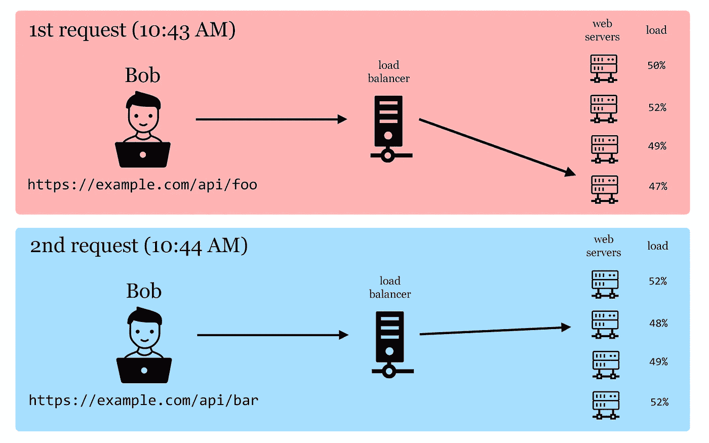
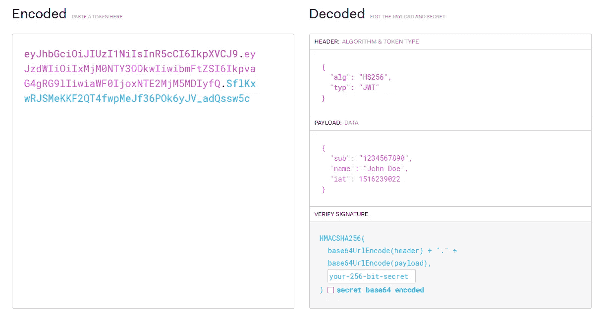
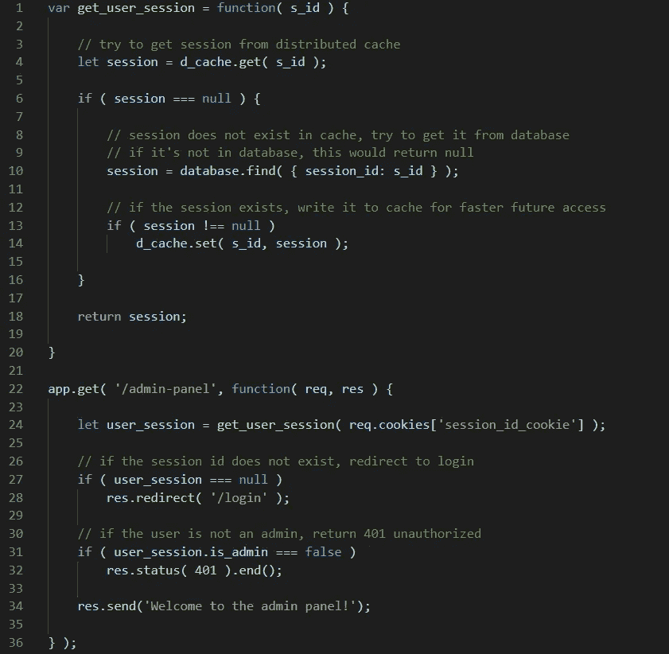

# 在对您的 web 应用程序进行负载平衡后，处理用户身份验证和授权

> 原文：<https://levelup.gitconnected.com/handling-user-authentication-and-authorization-after-load-balancing-your-web-app-c87ccba35a75>

L 负载平衡您的 web 应用程序是在预期或经历大量流量时要走的路，但是当涉及到设计认证和授权流时，它在后端会变得更加复杂。

# 为什么要负载平衡？

在高流量情况下，例如托管社交网站、热门博客、API 或互联网上几乎任何有大量有效传入请求的应用程序，物理服务器处理所有这些请求并产生所需的响应可能会不堪重负。

接下来，我将讨论将由您的 web 服务器处理的身份验证和授权流( ***auth*** 从现在开始)扩展到一个不能保证来自同一客户端的后续请求将由同一服务器处理的系统的明显和更深层的含义。

# 在我们开始之前…

如果你正在读这篇文章，你可能已经知道了什么是负载平衡，但是为了这篇文章，我觉得有必要确保我们都在同一页上。

## **什么是负载均衡？**

简而言之，负载平衡是使用特定的负载平衡算法在多个不同的服务器实例之间分配流量的过程。想象一下，一个警察站在收费广场前，指引你去排队最少的收费站。

收费广场，由 tribuneindia.com 提供([https://CMS images . tribune India . com/gallary _ content/2020/4/2020 _ 4＄large img _ 1893155391 . jpg](https://cmsimages.tribuneindia.com/gallary_content/2020/4/2020_4$largeimg_1893155391.jpg))

让我们假设，在等待响应的体验变得令人沮丧之前，您的托管平台提供的原始服务器每秒最多可以处理 1，000 个请求。你正在蓬勃发展，用户开始越来越多地使用你的应用程序，因此流量增加。你不希望他们变得沮丧，是吗？

那你是做什么的？您实现了一个负载平衡器。您要么为 AWS 提供的实例或您使用的任何服务付费，要么花时间配置您自己的实例。但是负载平衡器不会像变魔术一样自己工作。您需要多个服务器，以便平衡器知道将您的请求重定向到哪里，以便处理它，当涉及到 auth flow 时，这成为您的新问题。为什么？看一看:

负载平衡 API

正如您所看到的，即使 Bob 在很短的时间间隔内向同一个 API 发送了两个请求，他的响应仍然由不同的服务器实例处理。这个例子表明，您绝对无法预测哪个实例将最终处理客户的请求。即使你能做到，我也怀疑你能否用一个能正常工作的负载均衡器可靠地做到这一点。

# 认证和授权

## 当然是 JWT

在这个人人都可以建网站的时代，以易于实现而闻名的 JWT 被广泛用于认证。

嘿，它工作正常吗？嗯，是的，它的工作，它的速度很快，有点可靠。点击这里阅读更多关于 JWT 如何工作的信息。

[jwt.io](https://jwt.io)

乍一看，您可能会认为这是解决我们所有问题的显而易见的方法，无论负载平衡与否。我看到了。我的意思是，JWT 不需要太多的后端工作来验证和授权，用户信息直接嵌入在令牌中，减少了数据库访问的需要，所有数据都存储在客户端，节省了您非常需要的服务器内存。很聪明，对吧？有，但是没有。

当你开始设计你的用户认证功能时，问题已经开始变得明显，因为你建立了你的“*重置密码*”功能。到目前为止，JWT 的优点是在认证或授权时不必通过数据库检查信息的有效性。现在吗？没有那么多。当您的应用程序的用户因为忘记密码或其他原因而决定重置密码时，您需要一种方法来注销用户已经登录的所有其他设备。

如何让用户的 jwt 过期，而不用等待它们自己退出？一个快速的方法是改变你的加密密钥。但是等等，那会让你所有用户的令牌都过期…哇哦。好吧，好吧，我有个主意。也许集成一个保存所有过期密钥的数据库，并对照它进行检查？或者所有有效的密钥？我的意思是这很简单，首先检查 JWT 本身是否有效，然后对照数据库检查它是否不在黑名单中。但是等等，这不是让 JWT 的*更快了吗，不需要数据库检查，快速验证*指出了窗口？有点像，不是吗？您可能会说，集成缓存以减少数据库访问。好的，这是可行的，但是请记住，缓存也必须在多个 web 服务器实例之间共享，并且您的实现必须是容错的，特别是对于用户安全特性，例如*重置密码*示例。

如果故事到此结束，你是幸运的。如果一切顺利，这不会是你最后一次升级你的应用程序。您的下一步将是添加另一个负载平衡器和另一个 web 服务器集群，甚至可能是地理路由，以将请求发送到最近的负载平衡器，从而减少延迟。您准备好保证多个分布式缓存之间的一致性了吗？这是最令人头疼的问题。

如果你准备好并且愿意，你比我更像一个男人。

## 粘性会话

当设计你的网站使用 sessions 时，你已经超越了 JWTs 可能让你兴奋的“没有后端工作”的梦想。

当使用会话时，服务器给客户机一个唯一的标识符(让我们称之为*键*)，用户在后续请求中传递这个键，这样服务器就知道它在和谁说话。密钥最好存储在仅支持 HTTP 的安全 cookies 中。服务器将有关用户的信息存储在生成的键下的查找表中，当发送请求时，它只使用该键来检索与期望响应的客户机相关联的数据。您可能会在这里看到问题。您有多台 web 服务器。**你如何保证所有负载均衡服务器之间的会话是相同的？**

粘滞会话试图通过强制负载平衡器将所有以下请求发送到同一个 web 服务器来解决这个问题。这在某种程度上可能行得通，但除了明显懒惰(在正常情况下)之外，它还有几个缺点:

*   你的服务器上的负载**将**不均衡。有些用户会比其他人在你的网站上花更多的时间。
*   负载平衡器不会读取和处理请求，那不是它的工作。因此，它可以识别请求来自哪里的唯一方法是通过 IP，我不认为我需要告诉你有多少人使用他们的移动电话数据，然后在咖啡馆里切换到 wi-fi。这将导致会话失败。简单来说:**不一致**。

## 分布式会话

这场竞赛中另一个有价值的竞争者是分布式缓存+会话状态=分布式会话。在当前上下文中，竞争实际上是在 **JWT** 和**分布式会话状态**之间，因为分布式缓存必须在负载平衡环境中为两者实现。

或者至少应该在负载平衡的环境中为这两者实现分布式缓存，因为任何其他解决方案效率较低，实现起来也比较麻烦。我不认为您会希望在每台服务器上保存相同缓存数据的副本，并在发生变化时更新几个服务器实例。

在我告诉你为什么在大规模应用中这可能比 JWT 实现得更好更有效之前，让我们先来看看它是如何工作的。

我想你已经明白了，但是什么是分布式缓存呢？分布式缓存只是可由多方访问的缓存。它在您的所有服务器之间提供了一致的数据层。它的使用方式相当简单:服务器寻找一些信息，如果它被缓存，它就使用它，故事结束。如果不是，那么它从一个永久的数据源(数据库)获得它，缓存它以便将来可以更快地访问它，然后使用它。特别是在存储会话状态时，缓存的数据有一个滑动的过期时间，这样当它不被使用时就不会停留在那里。如果它在 20 分钟内没有被访问，就会被删除。

使用会话状态和分布式缓存实现快速数据检索的简单示例

这如何与会话配对？很简单，您将用户的会话保存在分布式缓存中，而不是本地缓存中。他们发出请求，他们的会话被创建并存储在缓存服务器中。对于任何后续请求，如果它们被重定向到另一个实例，web 服务器可以通过从分布式缓存中获取它们的会话状态来访问客户端的会话。当用户执行任何对其数据有影响的操作时，会记录更改，并更新数据库和缓存。如果像这样的数据库更改是异步完成的，那么最终用户在页面加载时间上不会受到任何影响。

好吧，但是 JWT 黑名单缓存方法提供了同样的好处:更少的数据库查询和缓存数据使得响应非常快。**是什么让分布式会话独占鳌头？**几个原因:

最简单的说法是，jwt 并不是为这样使用而构建的。它们应该是可移植的、快速的和易于验证的。通过使用数据存储(黑名单或白名单)添加另一层验证就像实现分布式会话状态一样，但不是将用户的信息很好地打包并隐藏在数据存储中，而是将其暴露在客户端 cookie 中，并在数据存储中保留一份 JWT 的副本。即使数据不被认为是*的秘密*，当你已经将用户信息打包远离公众访问时，为什么还要将它们留在客户端？

除此之外，实现服务器端会话状态为进一步实现更多功能提供了更多空间。您可以开始处理关于客户端会话的更微妙的数据，以加强更严格的会话劫持安全性(如最后授权 IP、位置等。).如果你有一个便利贴应用程序，在会话状态下存储笔记内容是一种比数据库查询更快的检索方法。

# 结论

对需要认证和授权的庞大服务进行负载平衡？缓存为王。不仅仅是为了 auth。

说真的，尽可能把所有东西都藏起来。

这个进入**分布式会话状态**。