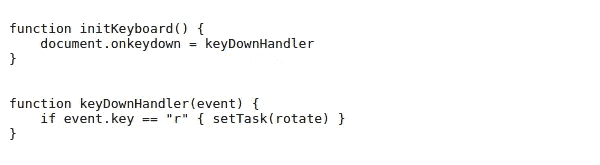

# 在富浏览器应用中处理用户输入

> 原文：<https://levelup.gitconnected.com/handling-user-input-in-rich-browser-apps-a73a951d03f0>

## 处理鼠标和键盘事件的正确架构

混乱的事件处理

# 简单应用

浏览器(JavaScript)对于处理用户输入非常有帮助。例如:

> var done button = document . getelementbyid(" done ")
> done button . onclick = function(){ sendDataToServer()}

这是一个简单明了的代码，非常适合下面的上下文。

1.  用户花一分钟时间用他的数据填写表单。
2.  用户点击“完成”按钮。
3.  用户等待页面更新两秒钟，他认为这是可以接受的。

简单的程序

让我们假设客户端不检查数据；客户机**只需向服务器**发送任何东西(甚至是空白表格)。因此，您只需要编写客户端代码来处理一个事件:单击按钮。

当然，每次用户输入一个字母，在字段中写下他的名字也是一个事件。但是您不必编写代码来处理这个事件，因为浏览器会自动处理。

现在，用户可以做什么来破坏客户端？

1.  关闭页面？
2.  在输入他的名字时点击“完成”按钮？
3.  发空白表格？
4.  在应该只有数字的地方写信？

他们中没有一个会让客户崩溃，甚至他们的组合也不会。并且用户将知道他应该为任何失败负责。客户很好。该应用程序似乎是可靠的！

# 复杂应用

让我们考虑一个基于浏览器的绘图/绘画工具作为我们的复杂应用程序。这与简单的线性应用程序有着重要的区别。

首先，绘画工具必须绝对**灵敏**。用户在画布上拖动鼠标的同时，画布必须显示结果。代码必须真正**高效**。

第二，应用程序必须绝对**可靠**。它永远不会崩溃或让用户丢失他的工作，即使当他受到责备(关闭浏览器标签)。在表单上填写管理数据只需两分钟，不需要任何灵感。但是失去那件独一无二的珍贵艺术品是一个戏剧性的事件！哪个艺人是**不是**容易发生**再发生**(拜拜 app)。

第三，基本上所有的事情都发生在 canvas 元素上，你必须处理每一个最小的输入。浏览器不会像创建文本框那样有用。

对于本文的目的来说，这 3 个关键区别就足够了。

## 指导原则

考虑到上面的文字，我们得出了一条黄金法则，它将指导我们为复杂的应用程序编写代码:

> 在接收下一个 输入之前，应用程序必须 ***完全处理任何输入。***

否则应用程序将无法响应。严重超载时根本不可靠。

## 小型会议

本文中的 ***画布*** 指的是 HTMLCanvasElement。而 ***层*** 是指在画布上绘制的虚拟绘画面。它们的大小可以完全不同。并且该层可以位于画布的任何部分。

## 像素信息

丰富的绘图/绘画工具的一个基本特性是在鼠标下给出层像素的反馈。用户只需将鼠标光标放在任何像素上，就可以检查其颜色和位置。

伪代码

上面代码中的一些备注说明了处理函数的成本。“智能”意味着这个函数有一个昂贵的部分，如果需要的话就运行，否则处理起来就很便宜。

到目前为止，一切顺利！我们有一个干净简单的代码。而且它看起来很有效率。

## 这并不容易

上面的代码有重要的问题。抱歉。

1.  假设用户想要将层旋转 90 度。他只是在键盘上输入“R”。而鼠标下的图层像素变成了另一个(坐标不同，颜色可能偶然相同)。但是，由于没有引发鼠标移动事件，因此不会调用函数***updatePixelInfo***！我们的应用程序显示了关于鼠标下像素的错误值。不靠谱！
2.  假设用户在画布上快速移动鼠标。比方说，鼠标在 30 毫秒内超过 600 个像素。这意味着您有不到 0.05 毫秒的(*)时间来完全处理每个输入(不要忘记**黄金法则**)。我们不能阻止用户进行此操作。我们的代码在这方面不够高效。因此，应用程序将累积要处理的事件，变得没有响应(至少没有完全响应，因为它必须如此)。幸运的是，硬件、操作系统和/或浏览器跳过了许多这样的输入。所以我们将收到少于 600 个鼠标移动事件来处理。尽管如此，这个应用程序可能会打破**黄金法则**。

> (*)我们总是从理论上计算一个程序有多少时间。在的实践中，可用时间是理论时间的一半，通常是三分之一，因为操作系统和浏览器还有其他任务要运行。

3.假设用户重复“2”中描述的快速鼠标移动，但这次他不只是移动鼠标。他正在拖动鼠标，希望画一条(连续的)线。现在，除了给出关于鼠标下像素的反馈，我们用一个更加密集/昂贵的任务来强调应用程序，绘制图层:

*   改变图层像素(昂贵)
*   为撤销/重做记忆层(非常昂贵)
*   用改变的图层更新画布(非常昂贵)

这是不可能的。记得那部分“幸运的是，硬件…跳过这么多输入。”？当用户想要画线时，跳过鼠标移动(拖动)输入将会产生一条有巨大间隙的线。

注意:由于浏览器画布中没有鼠标拖动事件，我们必须重构鼠标移动事件处理程序(如果鼠标按钮被按下，那么…)。

## 一个注定要崩溃的建筑

请注意我们的应用程序在执行 3 个非常**基本**动作中的**个动作时是如何失败的:**

*   通过键盘输入改变图层后给出像素反馈
*   快速移动鼠标时提供像素反馈
*   快速画线(不需要很快)

想象一个更复杂的应用，比如画一个椭圆，它需要处理一个不可见的覆盖层，在标准层上画之前调整它的形状和大小…

## 事件处理程序的权力过大

您无法控制该应用程序

每次一个事件被引发，他的处理程序**就会不假思索地启动函数**(有些非常昂贵)**！**

> 不是用户、浏览器和/或操作系统引发了要处理的“过多”事件。是我们的事件处理程序设计得不好。

我们需要找到一种方法来对事件进行分类:

*   哪些事件我们应该完全忽略
*   哪些事件我们应该完全处理
*   我们将部分处理哪些事件

考虑在非常快速和长时间鼠标移动期间给出像素反馈的情况。我们只需要(并且应该)显示鼠标下当前像素的信息。为此，每一个旧的、未处理的鼠标事件都被定义为过时！我们必须忽略它们；没有完全处理它们。

考虑通过(非常)快速地移动鼠标来画线情况。我们需要创建一个表示鼠标路径的点列表。然后使用插值来填充路径中的间隙。当然，我们不打算在 20 毫秒内进行 600 次非常昂贵的全过程绘画，或者类似的事情。

## 函数的链接

你无法控制代码

还记得那个好看的函数***updatePixelInfo***吗？当我们阅读代码时，这看起来很好，但当运行应用程序时，这是一个悲剧。它的一个问题是，如果鼠标下的层像素在不移动鼠标(通过使用键盘旋转层)的情况下发生变化，它将不起作用。

> 一个**线性**架构，带有链式函数(A 调用 B，B 调用 C，C 调用 D…)注定**在这个环境中**会失败:一个事件机器。

线性架构(在这个环境中)使得代码**不可维护**。

# **万恶之源**

(在复杂的应用程序中)

> 所有**邪恶**的根源是**调用**一个函数的事件处理程序。

我所说的“功能”是指代码的其他重要部分。我说的不是像事件处理程序的子例程那样工作的小函数(帮助组织代码的片段)。

> 在一个复杂的应用程序中，一个事件处理器应该**只向其他函数发送信号**，**不调用**。

# 解决方案:事件驱动架构

事件驱动架构是解决所有**效率**问题，让代码变得极具**维护性**的**关键**！

> 我们用松耦合的**函数代替了**链式**函数！**

同样，我指的是广义上的“功能”；具有特定角色的软件组件。

一个函数不调用另一个函数。一个函数 ***甚至不知道其他函数*** 的存在！它只是向系统提供它的产品，如此而已。

这是总的思路。当然，一定存在一些例外。

## 实施概念

首先，我们如下所述定义模块。我所说的“模块”指的是用相关函数(一些是公共的，一些是私有的)编写的任何文件，这些函数执行一个 ***独占/独立的角色*** 。

*   “main.js”是所有其他模块的**管理器**
*   “mouse.js”处理所有鼠标事件
*   “keyboard.js”处理**所有键盘事件**
*   几十个有特定任务的模块；比如创建界面、更新界面、绘制、撤销/重做、保存/加载、旋转等..

> 模块“main.js”是 ***枢纽，命令所有其他模块*** 。基本上，这是唯一允许调用其他模块中函数的模块。
> 
> 所有其他模块 ***只允许读取任何其他模块中的全局变量*** 。

也许我们现在需要的是一点伪代码。就这样吧！

警告:这个伪代码**非常简单。**它遗漏了很多本质特征，它的唯一目的是 ***阐明*** 的概念。

## **模块 main.js**

模块 main.js

这是我们应用程序的大脑。在这里做出决定。 ***setTask*** 是功能模块“mouse.js”和“keyboard.js”处理输入事件后的调用。

并且 ***setTask*** 可以接受或者拒绝任务。但是即使它接受任务， ***setTask*** **也从不**运行任务！！！它只是记忆任务，在下一次执行 ***runMainLoop 时运行。***

无论晴雨，这里都是(已处理的)输入事件的终点。

用户/浏览器/系统可能每秒引发数千个输入事件。没问题。我们的应用程序每个循环只运行一个任务(16.666 毫秒)。当然我们需要一个聪明的代码来避免，例如，一条画出来的线有任何空隙。

## 模块 mouse.js

模块 mouse.js

模块“mouse.js”的第一个职责是将鼠标位置的信息发布给任何想要的人(通过更新它的公共全局变量)。

该模块将 ***画布*** *坐标*处理成有用的 ***图层*** *坐标，*是其他模块要消耗的坐标。

它的第二个职责是，在适当的时候，调用“main.js”模块中的 ***setTask*** :

> “嘿，用户希望执行这个任务(绘图)。现在就看你的了。祝你好运。我到此为止！”。

注意:我认为处理输入事件不是一项职责。这是内在机制。它是模块如何履行其对“社区”的职责。

## 模块 keyboard.js

模块 keyboard.js

这是一个简单的模块。我们可以清楚地看到它作为接口的作用。在它调用 ***setTask*** 之后，程序不知道那个键被按下或者是否有任何事件被引发。它只知道要执行的任务(如果接受的话)。

没有要处理/释放以供以后使用的数据。

像“mouse.js”一样，它在调用 ***setTask*** 之前不检查 task 是否为空，因为这个决定不是由它决定的。决策不是它的**角色**！

## 模块接口. js

模块接口. js

还记得当层被键盘事件旋转时我们不得不更新像素信息的问题吗(因为***updatePixelInfo***被绑定到鼠标事件)？解决了！

我们可以随时调用***updateMousePositionLabel***。不需要告知鼠标的坐标。模块“mouse.js”使它们始终可用。

## 生命的火花

有 3 个“火花”来源使我们的应用程序活跃(运行)。

鼠标事件，键盘事件，以及定时器(***requestAnimationFrame****)*。

我们的代码被设计来使用和协调这些火花。如果你写了一个像样的代码，你可以放心，一切都会运行良好。这些火花不是我们代码的发明。它们是由浏览器创建的。我们正在处理它们。

## 最后

希望对您有所帮助！