# 如何用 Apache2 托管 Django 的实践

> 原文：<https://levelup.gitconnected.com/hands-on-how-to-host-django-with-apache2-d9cd0670d51b>

## 使用 WSGI 模块的实例


照片由 [JJ 英](https://unsplash.com/@jjying?utm_source=medium&utm_medium=referral)在 [Unsplash](https://unsplash.com?utm_source=medium&utm_medium=referral)

本文假设您习惯使用 Django。这不是一篇 Django 教程文章。Django 有自己的默认网络服务器。可以使用`runserver`命令来使用。

它将在本地主机的端口 8000 上运行您的 Django 项目。但是在官方文档中，关于 runserver 的命令，他们说

> 不要在生产环境中使用此服务器。它没有通过安全审计或性能测试。(这就是它将如何停留。我们从事的是制作 Web 框架的业务，而不是 Web 服务器，所以改进这个服务器以便能够处理生产环境超出了 Django 的范围。)

这就是为什么您应该将 Django 项目部署在另一个 web 服务器上。流行的选择是 Nginx、Apache 和 Gunicorn。**最简单直接的方法是使用 Gunicorn** 。你不需要设置任何东西，只要做

它将在本地主机的端口 8000 上运行。但是**大多数时候，你的服务器或机器已经托管了一些使用 Apache 或 Nginx** 的 web 应用程序，你也希望你的项目附带一个漂亮的网址，而不是像

```
yourwebproject.com:8000
```

为了解决这个问题，**您必须在 Apache 或 Nginx** 中部署您的 Django 项目，这取决于您的服务器使用的 webserver。但是，Apache 不理解 python 脚本。这就是需要 WSGI 发挥作用的地方。WSGI 将 web 服务器收到的来自用户的请求转发给 python 脚本，然后 python 脚本的输出再次转发给 WSGI，然后转发给 web 服务器，最后转发给用户。

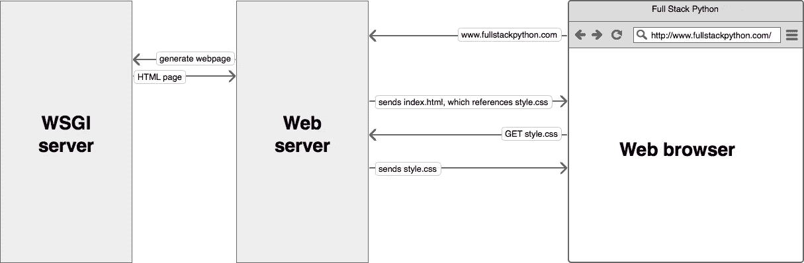

访问 python web 应用程序时会发生什么的图示。

在本文中，我们将假设您的服务器使用 Apache。当前的 Apache 版本是 Apache2。

因此，这是本教程的先决条件(以及如何安装):

*   Apache 版本 2 (sudo apt 安装 apache2 apache2-dev)
*   python3 (sudo 安装 python3)，因为 python2 不再受支持
*   当然是姜戈！(pip3 安装 Django)
*   apache2 模块 wsgi for python 3(编译[https://github.com/GrahamDumpleton/mod_wsgi.git](https://github.com/GrahamDumpleton/mod_wsgi.git)以让您能够使用‘with-python’选项选择想要用于 wsgi 的 python 版本)

对于 WSGI 模块，下面是编译它的步骤:

如果您的 python 是从源代码编译的，请确保在编译时启用了“启用-共享”选项。

“make altinstall”有助于确保编译后的 python 不会替换现有的旧 python。

为了确保 WSGI 模块使用的是正确的 python 版本，可以用 ldd 命令检查它

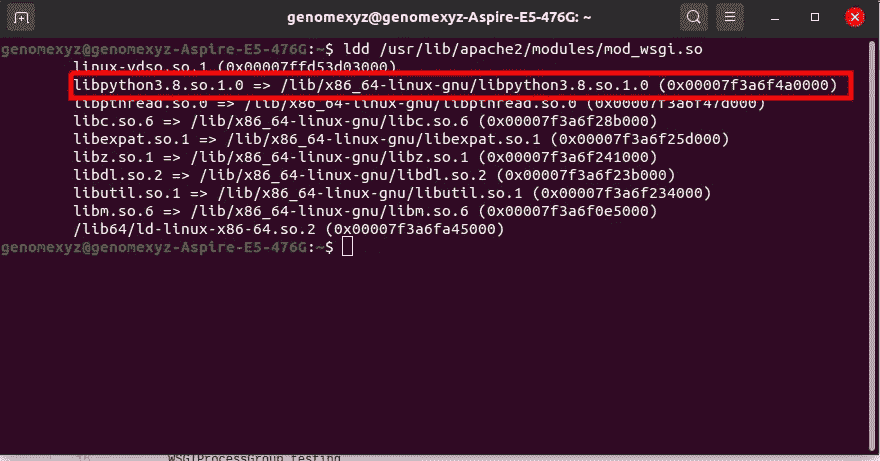

在这里，我将 python3.8 用于我的 WSGI 模块。**我的 WSGI 模块将使用我的 python3.8** 中安装的所有 python 模块。所以如果你需要在这个 Django 项目中安装一个 python 模块，**你需要通过 pip3.8** 来安装(假设你用的是 pip)。

好了，准备完毕。我们来练习一下！

## 1.)创建一个 Django 项目

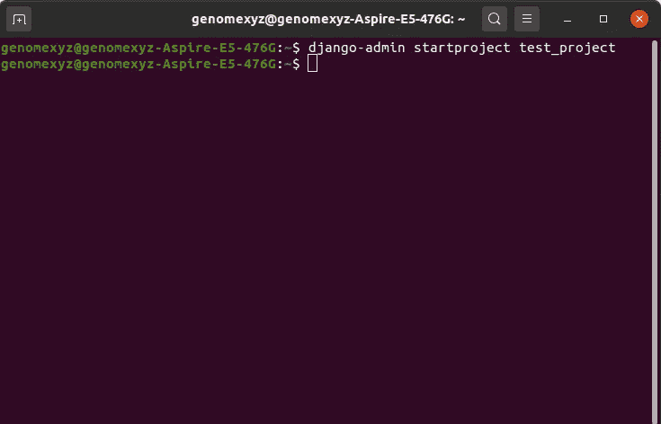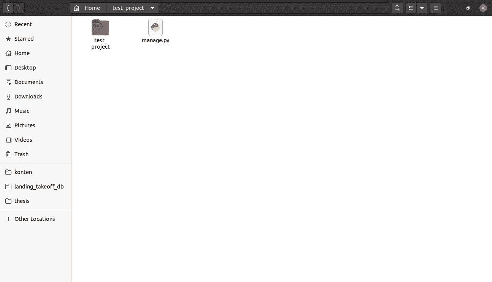

## 2.)创建虚拟静态文件

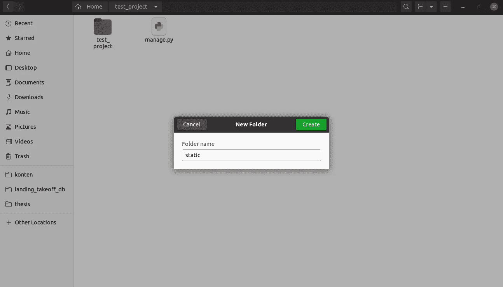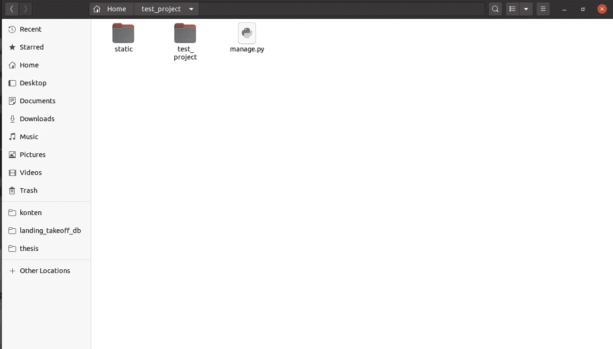

让我们制作一个虚拟 javascript 文件和一个虚拟 css 文件。

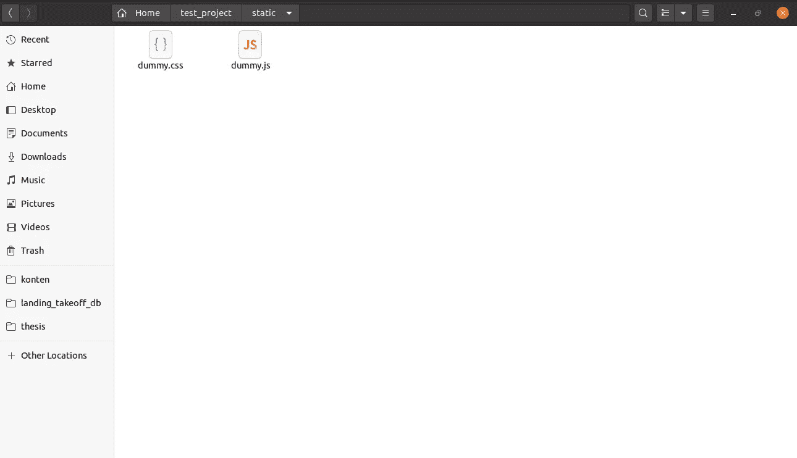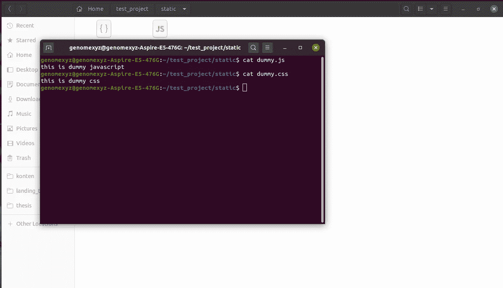

## 3.)编辑项目目录中 test_project 目录下的 settings.py

这里我们将设置静态文件(css、jss 等)的地址。将变量 STATIC_URL 设置为

## 4.)编辑项目目录中 test_project 目录下的 wsgi.py(如果您有 Django 项目的多个站点)

从原始版本到这个

## 5.)Edit/etc/Apache 2/sites-available/000-default . conf

奔跑

在<virtualhost>标签内，添加</virtualhost>

这是非常重要的一部分。第 2 行意味着我们**加载 wsgi 模块**。没有它，Apache2 将无法理解我们从第 15 行到第 17 行的其余配置参数。内联 4，我们将**/home/genome XYZ/test _ project/static**目录(静态文件目录)定义为 **/static_test_project** (与步骤 3 中的值相同)以使该目录中的所有文件都可以通过**localhost/static _ test _ project**地址在线访问。为此，Apache2 需要访问**/home/genome XYZ/test _ project/static**的权限，这就是第 5 到 7 行的目的。“要求授予所有权限”意味着我们将所有权限授予 Apache2。我们还授予 Apache2 访问**/home/genome XYZ/test _ project/test _ project**目录中的 wsgi.py 的权限以及任何其他需求。这就是第 9 行到第 13 行的目的。

在第 15 行，我们定义了 WSGI 守护进程的名称。在这种情况下，它是测试。我们也将第 16 行中的进程组定义为 testing。在 WSGI 关于 WSGIDaemonProcess 的文档中，他们说

> `WSGIDaemonProcess`指令可以用来指定应该创建不同的守护进程，WSGI 应用程序的运行可以委托给这些进程。当 Apache 作为`root`用户启动时，守护进程可以作为不同于 Apache 子进程通常运行的用户运行。

这是为了创建一个 WSGI 的进程。对于 WSGIProcessGroup，他们说

> WSGIProcessGroup 指令可用于指定一个或一组 WSGI 应用程序将在哪个进程组中执行。同一进程组中的所有 WSGI 应用程序都将在同一组守护进程的上下文中执行。

而是创建一组流程。所以在我们的例子中，**我们有一个过程叫做组内测试**。

最后，在第 17 行我们将**/home/genome XYZ/test _ project/test _ project/wsgi . py**定义为 **/test_project** 以使我们的 Django 项目在 localhost/test_project 地址在线。因为这属于测试组流程，我们**添加一个可选参数“process-group = testing”**。

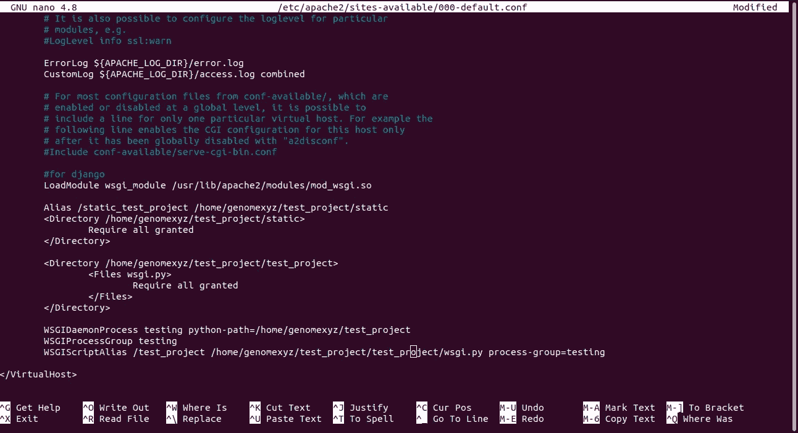

如果您使用 apt install 命令安装 WSGI 模块，您可以在没有第 2 行的情况下启用该模块。您可以使用 a2enmod 命令

a2enmod 真正做的是在**/etc/Apache 2/MODS-enabled**中创建一个符号链接，指向**/etc/Apache 2/MODS-available**中的模块。

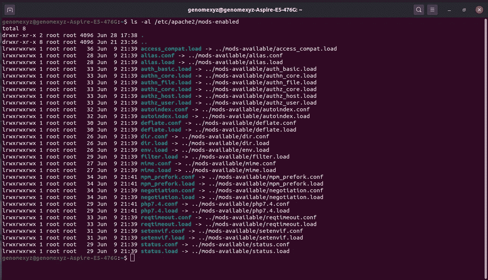

## 6.)重启 Apache2

做

7.)打开虚拟 Django 项目

打开 localhost/test_project，您会看到类似这样的内容

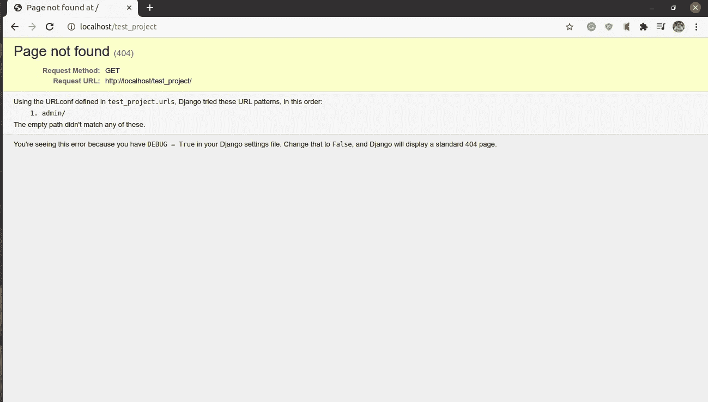

成功

“找不到页面”是因为我们没有在这个项目中添加任何应用程序，所以这是一个正常的反应。现在让我们访问我们的 dummy.js 和 dummy.css，它们的地址是 localhost/static _ test _ project/dummy . js 和 localhost/static _ test _ project/dummy . js。

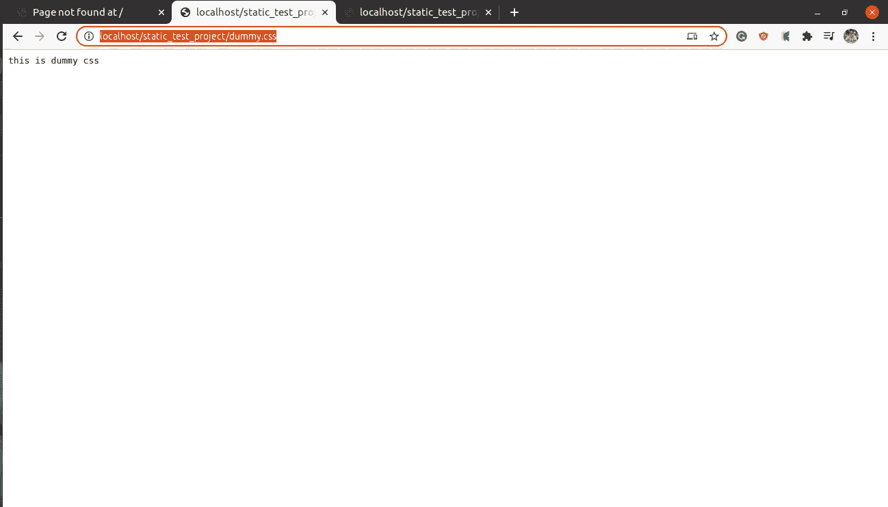

成功

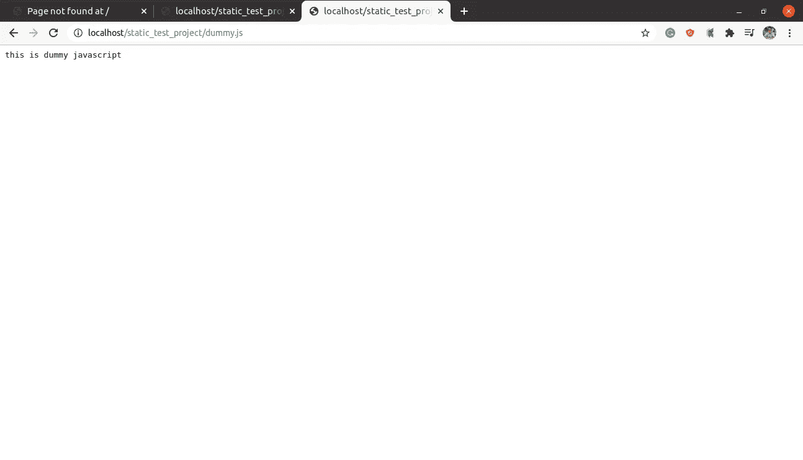

成功

一切顺利，我们成功部署了 Django 项目。这就是如何将 Django 项目部署到 Apache2 服务器的方法。另一篇文章再见。

参考:

[https://docs . django project . com/en/2.2/ref/django-admin/# runserver](https://docs.djangoproject.com/en/2.2/ref/django-admin/#runserver)2020 年 6 月 22 日访问

[https://docs . django project . com/id/3.0/how to/deployment/wsgi/guni corn/](https://docs.djangoproject.com/id/3.0/howto/deployment/wsgi/gunicorn/)2020 年 6 月 28 日访问

[https://askubuntu . com/questions/341684/how-to-load-the-modules-for-Apache 2](https://askubuntu.com/questions/341684/how-to-load-the-modules-for-apache2)2020 年 6 月 28 日访问

[https://modwsgi . readthedocs . io/en/develop/configuration-directives/wsgidaemonprocess . html](https://modwsgi.readthedocs.io/en/develop/configuration-directives/WSGIDaemonProcess.html)2020 年 6 月 28 日访问

https://modwsgi . readthedocs . io/en/develop/configuration-directives/wsgiprocessgroup . html2020 年 6 月 28 日访问

https://www.fullstackpython.com/wsgi-servers.html 于 2020 年 6 月 28 日进入