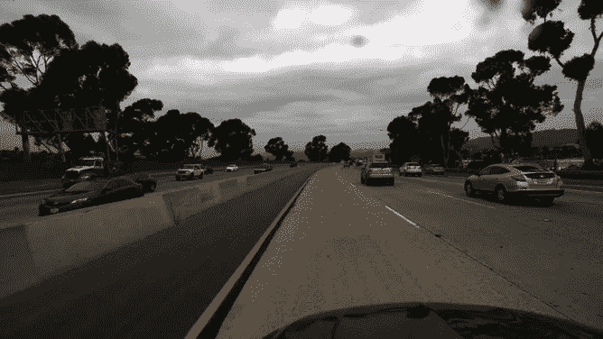

# 使用 Tensorflow 进行时间分布图层的实践练习

> 原文：<https://levelup.gitconnected.com/hands-on-practice-with-time-distributed-layers-using-tensorflow-c776a5d78e7e>

在本文中，我将指导您使用 Tensorflow 解决一个涉及一系列图像作为输入的问题，这是我在 Elysium IIIT 德里举办的最后一轮数据解放-机器学习竞赛中遇到的问题。

# 问题陈述

> 你是洛杉矶警察局的技术人员。最近非法赛车的激增给市民带来了很多麻烦。所以现在警方已经处于戒备状态。昨天他们因为同样的原因带来了一个人。我们访问了他的仪表板摄像头，但我们不能确定他是否超速，因为硬盘损坏了。尽管如此，你还是设法得到了一些视频片段，但从这些片段来看，他的速度并不是光看就能得出结论的。作为一个积极性很高的人，你决定从另一辆车的仪表盘摄像头中取出视频片段，并记下速度。现在，您的任务是训练一个模型，该模型使用一系列 dash-cam 图像(即 8 帧)来确定汽车的速度。摄录机以 20 帧/秒的速度录制片段。

[比赛环节](https://www.kaggle.com/c/final-showdown/overview)

**训练数据的例子:**



有序图像序列

> **输出**:X、Y 方向车速:[-1.2287469463，-0.0101401592]
> 
> 速度值被缩放。

# 理解问题陈述

这里的问题是训练一个模型，它可以仅使用 dash 相机拍摄的一系列图像来确定汽车的速度。我们必须**输入** **8 张图片**到模型，它输出汽车速度的 X 和 Y 分量。简单来说，我们必须用仪表盘摄像头拍摄的 8 幅图像来预测汽车的速度。

# 了解时间分布图层

通常，在计算机视觉中，我们在建立一个可以对图像进行分类的模型(例如狗或猫)。您将输入一个单一的图像到模型，它给出 0 或 1 的输出(0 是猫，1 是狗)。


犬猫分类器

# 但是在我们的例子中，每个样本有 8 个图像。


解决这个问题的一种方法是将所有图像合并成一个图像，并将合并后的图像输入到模型中，但是在这里我们将丢失可以帮助模型进行预测的关键信息。在我们的问题陈述中，**图像中物体位置的微小差异可以帮助模型确定汽车的速度**，但是通过合并图像，我们将丢失这些信息。

因此，我们必须找到一种不丢失信息的方法，同时将 8 幅图像传递给模型并获得一个输出。我们的救世主来了来自 Tensorflow **的**时间分布层**。**

这个专门的层将同一个层应用于几个输入，并获得每个输入的输出，这样我们可以将它们组合起来，并将其传递给另一个层来进行预测。

这样，我们仅使用一个层，该层在 8 个单独的图像上执行其操作并给出输出。


重要提示:**所有卷积层共享相同的权重。所以技术上来说是同一层。为了便于理解，您可以将它们视为层的克隆。**

时间分布层将该层的相同实例应用于 8 个图像中的每一个。所以这一层没有 8 组不同的权重。同一组权重应用于所有图像。

因此，通过使用这一层，我们不会增加模型的复杂性(参数的数量),但让模型能够从 8 个不同的图像中学习，只需一层。

直观上，这些图像是在不同的时间戳拍摄的，没有任何重大差异，因此一层足以关键特征。就像在手机上用连拍模式拍照一样。因此，相同的图层可以应用于 8 幅图像，并从每幅图像中识别关键特征。

*了解有关时间分布图层的详细信息:* [**如何在神经网络中处理时间分布数据**](https://medium.com/smileinnovation/how-to-work-with-time-distributed-data-in-a-neural-network-b8b39aa4ce00)

我感谢这篇文章的作者 Patrice Ferlet。它是黄金，在解决这个问题上帮助了我很多。

# 了解了解决这个问题所需的基础知识后，让我们深入研究一下代码

**提供的数据结构**:


**导入必要的库:**

```
**import** **cv2
import** **numpy** **as** **np
import** **matplotlib.pyplot** **as** **plt**
%matplotlib inline
**import** **pandas** **as** **pd**
**import** **keras
import** **json**
**import** **tensorflow** **as tf** 
**from** **keras.layers** **import** Input
**from** **keras** **import** Sequential
**from** **keras.layers** **import** Dense, LSTM,Flatten, TimeDistributed, Conv2D, Dropout
**from** **keras.applications.inception_v3** **import** InceptionV3
**from** **keras.applications.vgg16** **import** VGG16
```

**安装 Google drive 并提取数据:**

```
**from** **google.colab** **import** drive
drive.mount('/content/gdrive/')**import** **zipfile**final_showdown_zip = '/content/gdrive/My Drive/final-showdown.zip'zip_ref = zipfile.ZipFile(final_showdown_zip, 'r')
zip_ref.extractall('/content/gdrive/My Drive/final_showdown')
zip_ref.close()
```

我们问题中图像的维数是(720，1280，3)。为了更快地处理和训练数据，我们必须降低图像的维度。为了在降低维数的同时保持该比率，我们将维数除以 4。(720/4,1280/4) =(180,320,3)

**将图像大小从(720，1280，3)调整到(180，320，3)的功能，以加快计算速度，同时保持图像的纵横比:**

```
**def** get_img(img_path, printer=**True**):
  original_img = cv2.imread(img_path, cv2.IMREAD_COLOR)
  **if** printer: print ("original dim:",original_img.shape)resized_img = cv2.resize(original_img, (320,180), interpolation=cv2.INTER_CUBIC)
  **if** printer: print ("resized dim:", resized_img.shape)**return** resized_img
```

**测试我们的功能:**

```
img_path = "/content/gdrive/My Drive/final_showdown/Train/Train/422/imgs/001.jpg"
resized_img = get_img(img_path)
plt.imshow(resized_img)
```


下一步是在我们的时间分布层的样本中连接 8 个图像。

> 我们的时间分布层的输入形状=(每个样本的图像数量、图像高度、图像宽度、通道数量)

```
prefix = "/content/gdrive/My Drive/final_showdown/Train/Train/400/imgs/00"
 *## Testing the Concatenation method*X_sample = []
**for** idx **in** range (1, 9):
  img_path = prefix + str(idx) + ".jpg"
  resized_img = get_img(img_path, printer=**False**)
  X_sample.append(resized_img)print (np.array(X_sample).shape)
```


**将训练数据转换成所需的格式，以将数据输入模型。**

```
main_prefix="/content/gdrive/My Drive/final_showdown/Train/Train/"
X_train_check=[]
**for** i **in** range(1,457):
  path=main_prefix+str(i)+"/imgs/00"
  X_sample = []
  **for** idx **in** range(1, 9):
    img_path = path + str(idx) + ".jpg"
    resized_img = get_img(img_path, printer=**False**)
    X_sample.append(resized_img)
  X_train_check.append(np.array(X_sample))
np.array(X_train_check).shape
```


*我们的 Numpy 数组****X _ train _ check****具有上述形状，这与我们的想法相对应(456 个训练示例，每个示例中有 8 个图像，图像的尺寸)*

从注释文件中提取 X 和 Y 方向的速度，并创建一个包含 2 列的 NumPy 数组(X 和 Y 方向的速度)。

```
main_prefix="/content/gdrive/My Drive/final_showdown/Train/Train/"
y_train_check=[]
**for** i **in** range (1,457):
  path=main_prefix+str(i)+"/annotation.json"
  f = open(path,)  
  data = json.load(f) 
  f.close()
  y_train_check.append(np.array((data[0]["velocity"])))
np.array(y_train_check).shape
```


```
print(np.array(y_train_check)[:5])
```


# 模型结构

我们将使用时间分布卷积层和 LSTM 来捕获顺序数据，然后使用密集层来获得最终输出。由于我们用于训练的数据量有限，我们使用**预训练模型** InceptionResNetV2 作为时间分布层来从图像中捕捉细节。

LSTMs 是一种特殊的 RNN，能够学习长期依赖性。我们使用 LSTM 来捕获从上面的时间分布层获得的按时间顺序排列的信息，并从中获得有意义的信息。


模型的可视化解释。[图像来源](https://medium.com/smileinnovation/how-to-work-with-time-distributed-data-in-a-neural-network-b8b39aa4ce00)

# 什么是预训练模型？

预先训练的模型先前已经在数据集上训练过，并且包含表示对其进行训练的任何数据集的特征的权重和偏差。学习到的特征通常可以转移到不同的数据中。

Inception-ResNet-v2 是一个卷积神经网络，它在 ImageNet 数据库中的超过一百万张图像上进行训练。该网络有 164 层，可以将图像分为 1000 个对象类别，如键盘、鼠标、铅笔和许多动物。因此，该网络已经学习了各种图像的丰富特征表示。

在我们的 LSTM 上使用这个预训练模型的重量将增加我们的准确性。我们使用 Inception-ResNetv2 模型，但我们只训练它的最后 4 层。再次完全训练庞大的模型将耗费大量的计算能力，并且无视预训练的使用。

```
*#Best Model to this problem was InceptionResNet V2*inceptionresnet=tf.keras.applications.InceptionResNetV2(                                       
    include_top=**False**,
    weights="imagenet",
    input_tensor=**None**,
    input_shape=(180,320,3)
)

**for** layer **in** inceptionresnet.layers[:-4]:                                                       
    layer.trainable = **False***#We train only the last 4 layers this Model while Freezing the other #Layers.*
```

**建立模型:**

```
model = Sequential()*#add Inception model for 8 input images (keeping the right shape)*model.add(TimeDistributed(inceptionresnet, input_shape=(8, 180, 320, 3)))     

*#Using TimeDistributed Layer to Feed the Image Sequence**# now, flatten  each output to send 8 outputs with one dimension to #LSTM*model.add( TimeDistributed( Flatten() ))*##Added LSTM to Capture the Sequencial Information*model.add(LSTM (256, activation='relu', return_sequences=**False**))*# Dense Layer*model.add(Dense (64, activation='relu'))*#Final Dense Layer*model.add(Dropout(.5))model.add(Dense(2))  

*# Final Layer is of 2 Neurons [Velocity in X Direction and Y Direction]*model.compile(optimizer='adam', loss='mean_squared_error', metrics=tensorflow.keras.metrics.RootMeanSquaredError())model.summary()
```


模型概述描述了模型中使用的层和参数数量。

**相似模型结构:**


模型结构。[图像来源](https://medium.com/smileinnovation/how-to-work-with-time-distributed-data-in-a-neural-network-b8b39aa4ce00)

```
#Fitting the model to our training data r=model.fit(np.array(X_train_check),np.array(y_train_check),validation_split=0.2,batch_size=38,epochs=10)
```


韵律学

发现为 **10 个时期**训练模型有效地避免了**过度拟合**问题。

损失随着每个时期而减少。训练误差和验证损失在每个时期都显著下降，表明该模型表现良好。

用这个模型对测试数据进行预测，给了我 1.76 的均方根误差，并帮助我在比赛中获得了第二名**。**

[GitHub 链接访问笔记本](https://github.com/Sooryak12/Data-Unchained-By-IIIT-Delhi)。