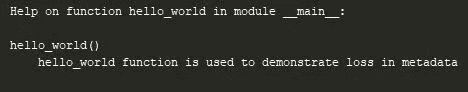
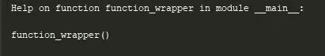
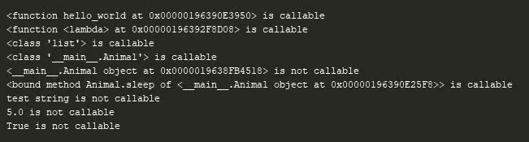
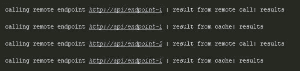
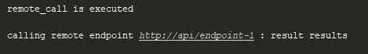
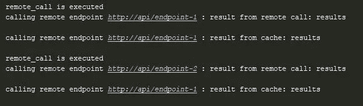

# Python 中的 Decorators、Callables 和函数元数据——方便的 Python 特性(第 2 部分)

> 原文：<https://levelup.gitconnected.com/handy-python-features-part-02-aac256da98a9>

## __ 探索 _ 更多 _ 装饰者 _ _。巴拉圭

本系列的第 1 部分让你更好地理解了装饰者如何工作以及在哪里使用它们。在这次讨论中，我们准备使用元数据和可调用性来探索更多关于 decorators 的内容。

# 函数元数据

在函数中维护元数据有几个目的。例如，当定义一个函数时，我们可以为文档做笔记。这些注释作为元数据存储在 ide 将使用的`__doc__`字段中。我们可以用内置函数`help(*args, **kwargs)` 来测试这个。

元数据:为文档添加的注释

这将使用`__doc__` 和`__name__`元数据来呈现结果，如下所示。

元数据:__doc__ 和 __name__ 元数据正在使用中

## 装饰者对元数据的影响

一旦函数被修饰，这些元数据就会丢失。

元数据:修饰函数

结果不如预期。实际函数的元数据在此时丢失，如下所示。

元数据:不是预期的结果

## 携带元数据

为了解决这个问题，我们需要将原始元数据传递给装饰者。一种方法是用原始属性重置装饰器属性。这是可能的，因为我们可以通过函数引用访问这些字段。

元数据:在装饰器中重置元数据

这将重置元数据，函数`help(hello_world)`将像以前一样显示正确的注释。然而，有一种更好的方法。Python 提供了一个名为`functools`的模块，它有一个名为`@wrap(function)`的装饰器，它将原始函数作为一个属性，并像我们上面所做的那样完成其余的工作。

元数据:使用@functools.wrap(函数)

到目前为止，我们已经看到了函数是如何被修饰的。这种装饰技巧不仅适用于函数，也适用于许多其他“可调用”的对象。在进一步探索之前，我们需要理解什么是可调用的。

# 可召回商品

python 中的可调用是任何可以被调用的东西。例如，函数是可调用的。类是可调用的。我们可以调用一个类来创建它的实例。还有什么是可调用的？

## 如何检查

Python 中有一个名为`callable(object)`的内置函数，可以检查给定对象是否可调用。

检查可调用:内置函数 callable(object)

我们将使用这种方法，并进一步探索哪些对象是可调用的，如下例所示:

检查可调用项:进一步探索

检查可调用内容:控制台输出

结果表明函数`hello_world()`是可调用的。除此之外，lamdas、类、类方法都是可调用的。然而，类、字符串、浮点数、布尔值的实例是不可调用的。

## 使类实例可调用

在 Python 中，类的实例可以被调用。一个类应该定义一个名为`__call__(self, *args, **kwargs)` 的特殊方法，以使它的实例可调用。

可调用实例:引入 __call__(self)方法

引入方法`__call__(self, *args, **kwargs)`后，`class Animal`的实例变得可调用。

# 可调用的装饰者

装饰者可以将任何可调用对象作为参数，并返回一个可调用对象。现在我们知道类和类实例是可调用的。这使我们能够在装饰者中使用它们。

## 作为装饰者的类

我们将使用一个类作为装饰器来制作内存缓存。

装饰者:作为装饰者的类

在这个例子中，`class Cache`被用作函数`remote_call(url)`的装饰器。假设这个方法执行一个远程调用来获取一些结果。我们需要缓存这些结果，以防止进一步的远程调用，这可能很耗时。保存在`class Cache`中的字典`url_result_dict`用于存储结果。

正如我们在上面发现的，类对象是可调用的。但是装饰者应该接受一个可调用的输入。它接受输入的唯一方式是通过构造函数，方法`__init__(self, function)`。很明显，现在将要创建一个类缓存的实例。为了使实例可调用，我们需要像前面讨论的**一样实现方法`__call__(self, *args, **kwargs)`。其余的事情都清楚了。缓存工作正常。**

缓存:远程调用的结果

`endpoint-1`的结果第一次来自函数`remote_call(url)`。缓存用于第二次响应。`endpoint-2`的结果再次来自函数。最终结果来自缓存，因为`endpoint-1`已提前取出。

## 作为装饰者的实例

我们也可以使用一个类的实例作为装饰器。在上面的例子中，构造函数用于获取可调用的参数。但是这次用的是方法`__call__(self, function)`。

装饰者:作为装饰者的实例

这里，对象`logger`是可调用的，并充当装饰器。它返回能够基于布尔值`enabled`进行日志记录的内部函数。结果如下。

记录器:记录器实例已执行。

## 链接装饰者

装饰器可以多次用于同一个可调用对象。在下面的例子中，我们将使用上述两种装饰器。

装饰者:链接装饰者

装饰者`logger` 返回一个可调用函数，并将其传递给装饰者`Cache`。这种链接对于任何数量的装饰者都是可能的。结果如下。

装饰者:来自两个装饰者的结果

# 一份申请

下面的例子展示了如何使用 decorators 实现单例模式。

装饰者:使用装饰者的单一模式

`class Singleton` 保存着调用方法`instance()`时创建的装饰类`SingletonLogger` 的实例。使用方法`__call__(self)`阻止使用构造函数创建实例。

您可以在以下位置找到 Git 存储库。

 [## vishwaefor/handy-python-特性

### 便捷的 Python 特性。通过在 GitHub 上创建帐户，为 vishwaefor/handy-python-features 开发做出贡献。

github.com](https://github.com/vishwaefor/handy-python-features) 

# 延伸阅读…

装修工得心应手。我们需要确定在哪里使用它们，而不需要编写复杂的代码。我建议你多读一些关于这个话题的书。

Python 中有更多方便的特性。发电机就是其中之一。跟随本系列的[第 3 部分](https://vzztalks.com/articles/python/handy-python-features-part-03/)获得更多乐趣。