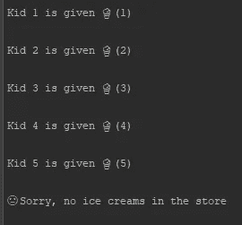
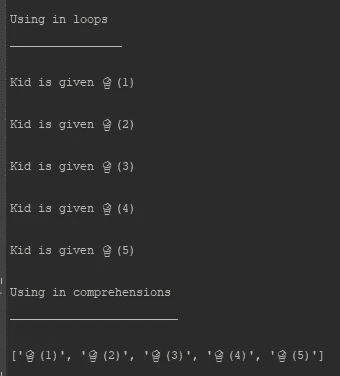
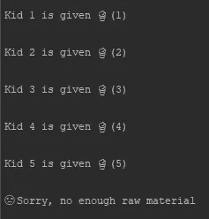

# Python 中的生成器和迭代器——方便的 Python 特性(第 3 部分)

> 原文：<https://levelup.gitconnected.com/handy-python-features-part-03-1c89003d0f4c>

## __ 我们如何使用发电机 _ _。巴拉圭

上次我们看了一下装饰者是如何在 Python 中工作的。您可以从以下链接中找到之前的讨论:

[便捷的 Python 特性—第 1 部分](https://vzztalks.com/articles/python/handy-python-features-part-01/)

[便捷的 Python 特性—第二部分](https://vzztalks.com/articles/python/handy-python-features-part-02/)

在本文中，我们将探索 Python 中另一个方便的特性，并讨论什么是生成器以及它们是如何工作的。

生成器最初是用 Python 增强提案 255 ( [PEP 255](https://www.python.org/dev/peps/pep-0255/) )向语言提出的。功能有点类似于 Python 迭代器，它是通过[PEP 234](https://www.python.org/dev/peps/pep-0234/) 提出的。

我们将首先理解迭代器是如何工作的。

# 迭代器

假设有一个售货员，他的冰箱里装满了冰淇淋，还有一些孩子在等着他们。销售人员根据需求负责配送任务。在这里，销售人员就像一个迭代器，负责从容器中取出冰淇淋并分发给客户。

有了这些知识，我们将把迭代器定义为按需从容器中产生值的看护者。

现在销售员觉得没意思，给冰箱加了一个可以按需发放冰淇淋的机器，代替他充当迭代器。因为冰箱被修改为具有产生发布者(或迭代器)**、**的新能力，所以它可以被称为可迭代的。

## 迭代器的功能

在 Python 中，iterable 应该通过方法`__iter__(self)`返回迭代器。类似的**，**迭代器应该通过方法`__next__(self)`返回下一个值。根据定义迭代器也应该是可迭代的。在大多数情况下，为了实现这一点，迭代器通过方法`__iter__(self)`返回`self`。

以下示例显示了用 Python 实现的上述解释:

迭代器:冰箱和发行机

方法`iter(refrigerator)`返回迭代器，对象`issuer_machine`、**、**和方法`next(issuer_machine)`返回存储的冰淇淋。那些方法分别调用方法`__iter__(self)`和`__next__(self)`。以下是由此产生的冰淇淋分布。

迭代器:发放冰淇淋

请注意，一旦商店清空，就会引发错误`StopIteration()`****。****

## ****正在使用迭代器****

****迭代器也可以用在循环和理解中。我们将在下一篇文章中更多地讨论理解，尽管下面的例子完整地展示了两者:****

****迭代器:用于循环和理解****

****输出如下。****

********

****迭代器:循环和理解的输出****

## ****迭代器修改****

****假设储存冰淇淋成本很高。它需要更多的空间。我们可以通过在客户需要时制作一个来节省空间。销售人员现在决定用冰淇淋制造机替换整个冰箱和发行机。****

****我们可以通过使用迭代器来实现这一点，如下例所示:****

****迭代器:一台机器而不是两台****

****对象`ice_cream_making_machine`正在制作冰淇淋，直到它发现原料是空的。结果如下。****

********

****迭代器:按需制作冰淇淋****

****现在我们准备探索生成器，因为我们已经有了迭代器如何工作的基本概念。****

# ****发电机****

****生成器执行的任务和我们在前面的例子中看到的一样。区别仅仅在于生成器可以仅使用一个函数来实现。这些函数不使用`return`语句。有一个特殊的关键字叫做`yield`用来代替。****

## ****生成器实现****

****我们将把上面的例子转换成如下的生成器:****

****发电机:冰淇淋制作****

****当请求一个冰淇淋时，生成器`make_ice_creams(raw_material)` 返回一个新的冰淇淋。当原材料为空时，就像在迭代器中一样，会出现一个错误`StopIteration()`。****

## ****使用中的发电机****

****正如迭代器部分所讨论的，生成器也可以用在循环和理解中。以下示例显示了这两种用法:****

****生成器:用于循环和理解****

****输出如下。****

********

****生成器:循环和理解的输出****

****正如我们在上面的迭代器讨论中所看到的，输出没有什么不同。****

## ****生成器表达式****

****还有另一种方式来编写生成器，甚至不使用带有关键字`yield`的函数。这可以通过类似于理解的生成器表达式来完成(我们将在下一篇文章中更多地探讨理解)。****

****首先，我们将列出五个冰淇淋对象，列表理解如下:****

****列出理解:列出五种冰淇淋****

****当孩子们一个接一个地要求冰淇淋时，我们可以用这份冰淇淋清单来为他们服务。空间问题又出现了。我们能把这个列表转换成生成器吗？****

****是的，就像我们在理解列表中所做的那样，一个简单的语句就可以完成这项工作。我们要做的唯一改变是用圆括号代替方括号。****

****生成器:像语法一样的理解****

****您可以在以下位置找到 Git 存储库。****

**** [## vishwaefor/handy-python-特性

### 便捷的 Python 特性。通过在 GitHub 上创建帐户，为 vishwaefor/handy-python-features 开发做出贡献。

github.com](https://github.com/vishwaefor/handy-python-features) 

# 进一步阅读

发电机可以提高性能。我建议你多读一些这方面的内容。我们将在接下来的文章中讨论性能。****